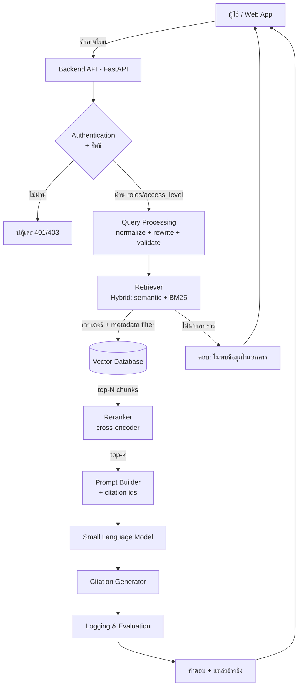
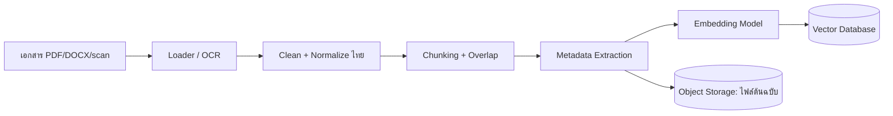

# 13 — สถาปัตยกรรมระบบที่แนะนำ (Recommended System Architecture)

> วันที่ตรวจสอบข้อมูล: 21 กรกฎาคม 2026
> ไฟล์นี้เป็น **ข้อเสนอแนะเชิงออกแบบ** อ้างอิงจากไฟล์ 02–12 — ปรับตามบริบทองค์กร

## 1. องค์ประกอบและการไหลของข้อมูล

```text
Web Application (ผู้ใช้พิมพ์คำถามไทย)
 → Backend API (FastAPI)
 → Authentication (ตรวจตัวตน + สิทธิ์ผู้ใช้)
 → Query Processing (normalize ไทย, query rewriting, ตรวจ input)
 → Retriever (hybrid: semantic + BM25) ── query ──> Vector Database (+ metadata filter ตามสิทธิ์)
 → Reranker (cross-encoder จัดอันดับ top-N → top-k)
 → Prompt Builder (คำถาม + context + คำสั่ง + citation ids)
 → Small Language Model (สร้างคำตอบ, temp ต่ำ)
 → Citation Generator (ผูกคำตอบกับไฟล์/หน้า, ตรวจความตรง)
 → Logging & Evaluation (log trace, วัด faithfulness/latency, feedback)
 → ตอบกลับผู้ใช้ (คำตอบ + แหล่งอ้างอิง)
```

**ข้อมูลที่ไหลผ่านแต่ละองค์ประกอบ:**
- **Web App → API:** คำถาม (text), session/token
- **Auth:** user id, roles, `access_level` ที่อนุญาต
- **Query Processing:** คำถามที่ normalize/rewrite แล้ว + flag ความปลอดภัย
- **Retriever ↔ Vector DB:** เวกเตอร์คำถาม + filter (department/access/date) → คืน chunk + metadata
- **Reranker:** (คำถาม, chunk) → คะแนน → top-k
- **Prompt Builder:** prompt สมบูรณ์ + หมายเลขอ้างอิงแต่ละ chunk
- **SLM:** prompt → คำตอบดิบ
- **Citation Generator:** คำตอบ + mapping ไป [ไฟล์, หน้า, หัวข้อ]
- **Logging/Eval:** trace ทั้งหมด (mask PII) + metric

## 2. Mermaid Diagram (Query Flow)



## 3. Ingestion Flow (offline)



## 4. Technology Stack — 2 ทางเลือก

### 4.1 ทางเลือก A: ง่ายและต้นทุนต่ำ (Prototype / ทีมเล็ก)
| ชั้น | เทคโนโลยี | เหตุผล |
|------|-----------|--------|
| Frontend | Streamlit / HTML+JS ง่าย ๆ | เร็ว, ไม่ต้องทีม frontend |
| API | FastAPI | เบา, async, มาตรฐาน Python |
| Embedding | BGE-M3 หรือ multilingual-e5-base (self-host) | ไทยดี, ฟรี |
| Vector DB | Chroma (local) | ติดตั้งง่ายสุด |
| Reranker | (ข้ามก่อน หรือ BGE-reranker เมื่อจำเป็น) | ลดความซับซ้อนช่วงแรก |
| LLM | SLM 3–7B ผ่าน Ollama (GGUF) | รัน CPU/GPU เล็กได้ |
| Storage | ไฟล์ระบบ + SQLite | พอเพียง |

### 4.2 ทางเลือก B: พร้อมขยายเป็น Production
| ชั้น | เทคโนโลยี | เหตุผล |
|------|-----------|--------|
| Frontend | React/Next.js | UX ครบ, scale ได้ |
| API | FastAPI (หลาย replica หลัง load balancer) | stateless scale |
| Embedding | BGE-M3 (self-host, batch) | คุณภาพ + hybrid |
| Vector DB | Qdrant (หรือ Milvus ถ้าใหญ่มาก) | filter + hybrid + scale |
| Reranker | BGE-reranker-v2-m3 (service แยก) | เพิ่ม precision |
| LLM Serving | vLLM/TGI (GPU, autoscale) — โมเดลไทย license ชัด | throughput/latency |
| Metadata/User | PostgreSQL (+ pgvector ถ้าเลือกรวม) | ACID, query ครบ |
| Storage | S3/MinIO (encrypted) | ไฟล์ต้นฉบับ + backup |
| Auth | Keycloak/OIDC + RBAC | มาตรฐานองค์กร |
| Observability | Prometheus/Grafana + LLM tracing (เช่น LangSmith/OpenTelemetry) | เฝ้าระวัง |
| Deploy | Docker → Kubernetes, CI/CD, Vault | scale + ปลอดภัย |

## 5. หลักการออกแบบสำคัญ (เชื่อมกับไฟล์อื่น)
- **Filter สิทธิ์ตอน retrieval** ไม่ใช่แค่ตอนแสดงผล (ดู `11_...`)
- **บังคับ citation + ตอบ "ไม่พบ"** เมื่อไม่มีหลักฐาน (ดู `04_,10_`)
- **แยก stateless/stateful** เพื่อ scale + backup (ดู `09_...`)
- **ห่อ framework ไว้หลัง interface ของเรา** เผื่อเปลี่ยน (ดู `08_...`)
- **วัดผลตั้งแต่แรก** (ดู `10_...`)

> อ่านต่อ: `14_Implementation_Roadmap.md`
