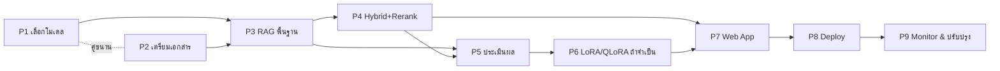

# 14 — แผนพัฒนาโครงการ (Implementation Roadmap)

> วันที่ตรวจสอบข้อมูล: 21 กรกฎาคม 2026
> แต่ละ Phase ระบุ: เป้าหมาย, งาน, Input, Output, เครื่องมือ, ความเสี่ยง, เกณฑ์สำเร็จ, งานคู่ขนาน, งานที่ต้องรอ

## Phase 1 — ศึกษาและเลือกโมเดล
- **เป้าหมาย:** เลือก SLM + embedding + vector DB ที่เหมาะกับข้อมูล/ฮาร์ดแวร์/license
- **งาน:** ทดสอบโมเดลไทย 2–3 ตัว (Typhoon/Qwen2.5/OpenThaiGPT/SEA-LION) กับคำถามตัวอย่าง, ตรวจ license, วัด token ไทย
- **Input:** ตัวอย่างเอกสาร + คำถามจริง ~20 ข้อ, สเปกฮาร์ดแวร์
- **Output:** เอกสารเลือกเทคโนโลยี + เหตุผล
- **เครื่องมือ:** Ollama/transformers, PyThaiNLP, ตาราง `02_,05_`
- **ความเสี่ยง:** เลือกตามความนิยมแทนหลักฐาน → บังคับมี benchmark ย่อย
- **เกณฑ์สำเร็จ:** มีผลเปรียบเทียบ + license เคลียร์
- **คู่ขนานได้:** เริ่มเตรียมเอกสาร (Phase 2) พร้อมกัน
- **ต้องรอ:** ไม่มี (เริ่มได้เลย)

## Phase 2 — เตรียมเอกสาร
- **เป้าหมาย:** ได้คลังเอกสารสะอาดพร้อม ingest
- **งาน:** รวบรวมไฟล์, OCR เอกสารสแกน, clean/normalize, กำหนด metadata schema, จำแนกชั้นความลับ
- **Input:** เอกสารดิบขององค์กร
- **Output:** เอกสารสะอาด + metadata + data classification
- **เครื่องมือ:** Typhoon OCR/Tesseract, PyThaiNLP, `06_,11_`
- **ความเสี่ยง:** OCR ไทยพลาด, PII ปนมา → วัด OCR + PII scan
- **เกณฑ์สำเร็จ:** ตัวอย่าง 20 หน้าผ่านคุณภาพ + schema นิ่ง
- **คู่ขนานได้:** Phase 1
- **ต้องรอ:** ไม่มี

## Phase 3 — สร้างระบบ RAG พื้นฐาน (Naive)
- **เป้าหมาย:** pipeline embed→search→prompt→ตอบ+citation ที่รันได้
- **งาน:** chunk, embed, เก็บ vector DB, retriever, prompt, ต่อ LLM, แสดง citation, กรณีค้นไม่พบ
- **Input:** เอกสารสะอาด (P2) + โมเดลที่เลือก (P1)
- **Output:** prototype ตอบคำถามไทยได้ + อ้างอิงแหล่ง
- **เครื่องมือ:** FastAPI, Chroma/FAISS, sentence-transformers, `examples/`
- **ความเสี่ยง:** ตอบมั่ว/ไม่มี citation → prompt เข้ม + วัด faithfulness
- **เกณฑ์สำเร็จ:** ตอบคำถามกลุ่ม A/C ถูก + citation ตรง
- **ต้องรอ:** Phase 1, 2

## Phase 4 — เพิ่ม Hybrid Search + Reranking
- **เป้าหมาย:** ยกความแม่นการค้น
- **งาน:** เพิ่ม BM25 (ตัดคำ newmm), รวม hybrid, ใส่ reranker, metadata filter
- **Input:** RAG พื้นฐาน (P3)
- **Output:** retrieval แม่นขึ้น (วัดได้)
- **เครื่องมือ:** BM25, BGE-reranker, Qdrant filter
- **ความเสี่ยง:** ซับซ้อนเกินโดยไม่ช่วย → วัด Recall@K ก่อน/หลัง
- **เกณฑ์สำเร็จ:** Recall@5/MRR ดีขึ้นอย่างมีนัย
- **คู่ขนานได้:** เริ่มออกแบบ eval (P5) ควบคู่
- **ต้องรอ:** Phase 3

## Phase 5 — ประเมินผล
- **เป้าหมาย:** มีตัวเลขชี้คุณภาพ + baseline
- **งาน:** สร้าง eval set (≥20 ข้อ), รัน RAGAS + retrieval metrics + latency/cost, human review
- **Input:** ระบบ P3/P4
- **Output:** รายงานผล + จุดอ่อน
- **เครื่องมือ:** RAGAS, `10_`, `examples/evaluation_example.py`
- **ความเสี่ยง:** LLM-judge bias → calibrate ด้วยคน
- **เกณฑ์สำเร็จ:** ได้ baseline ทุก metric + รายการปรับปรุง
- **ต้องรอ:** Phase 3 (P4 ทำให้ดีขึ้น)

## Phase 6 — ทดลอง LoRA/QLoRA (ถ้าจำเป็น)
- **เป้าหมาย:** ปรับสไตล์/พฤติกรรมที่ RAG อย่างเดียวไม่พอ
- **งาน:** เตรียม instruction dataset (ตรวจ license), QLoRA เทรน, วัดเทียบ baseline, ระวัง overfit/forgetting
- **Input:** ผลประเมิน (P5) ที่ชี้ว่าจำเป็น
- **Output:** adapter + ผลเปรียบเทียบ
- **เครื่องมือ:** peft, bitsandbytes, trl, `07_`, `examples/lora_training_example.py`
- **ความเสี่ยง:** เสียเวลา/ไม่ช่วย → ทำเฉพาะเมื่อ P5 ชี้ชัด
- **เกณฑ์สำเร็จ:** metric เป้าหมายดีขึ้นโดยไม่ทำ metric อื่นแย่ลง
- **ต้องรอ:** Phase 5 (ตัดสินใจจากข้อมูล)

## Phase 7 — สร้าง Web Application
- **เป้าหมาย:** ให้ผู้ใช้จริงใช้งาน
- **งาน:** UI ถาม-ตอบ + แสดง citation + feedback, ต่อ auth
- **Input:** ระบบ RAG (P4/P6)
- **Output:** เว็บใช้งานได้ + auth
- **เครื่องมือ:** Streamlit/React + FastAPI + Keycloak
- **ความเสี่ยง:** UX ไม่โชว์แหล่งอ้างอิงชัด → ออกแบบให้เห็น citation ทุกคำตอบ
- **เกณฑ์สำเร็จ:** ผู้ใช้ทดลองใช้ได้ + เห็นแหล่งอ้างอิง
- **คู่ขนานได้:** เตรียม infra/security (P8) ควบคู่
- **ต้องรอ:** Phase 3+ (แกน RAG พร้อม)

## Phase 8 — Deployment
- **เป้าหมาย:** ขึ้นระบบอย่างปลอดภัย
- **งาน:** containerize, CI/CD, secret manager, encryption, RBAC, backup, monitoring
- **Input:** เว็บแอป (P7)
- **Output:** ระบบ deploy ตาม architecture `09_,13_`
- **เครื่องมือ:** Docker/K8s, Vault, Prometheus/Grafana
- **ความเสี่ยง:** ข้อมูลรั่ว/สิทธิ์พลาด → รัน security checklist `11_`
- **เกณฑ์สำเร็จ:** ผ่าน security checklist + monitoring ทำงาน
- **ต้องรอ:** Phase 7

## Phase 9 — Monitoring และปรับปรุง
- **เป้าหมาย:** ระบบดีขึ้นต่อเนื่อง
- **งาน:** เก็บ feedback/คำถามตอบไม่ได้, reindex เอกสารใหม่, จับ drift, ปรับ prompt/model
- **Input:** ระบบ production (P8)
- **Output:** รอบปรับปรุง (improvement loop)
- **เครื่องมือ:** dashboard, eval regression, log analysis
- **ความเสี่ยง:** ข้อมูลล้าสมัย → ตั้งรอบ reindex + review
- **เกณฑ์สำเร็จ:** metric คงที่/ดีขึ้น + เอกสารทันสมัย
- **ต้องรอ:** Phase 8

## สรุปการทำงานคู่ขนาน / ลำดับพึ่งพา

> อ่านต่อ: `15_Prototype_Guide.md`
