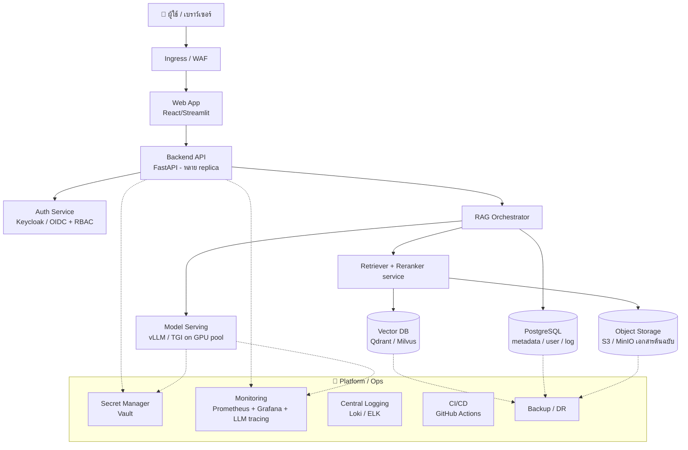
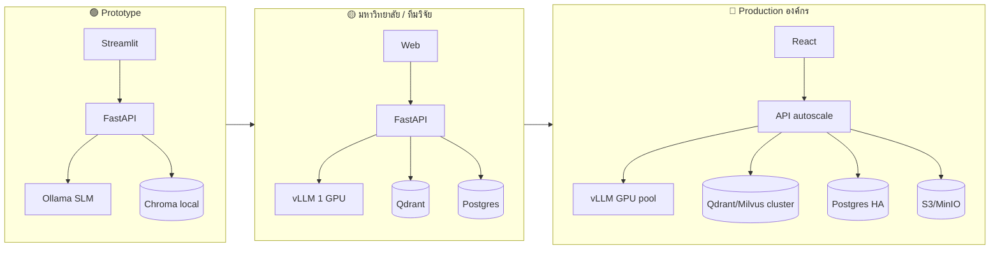

# แผนภาพ Deployment (ผู้ใช้ → โมเดล → ฐานข้อมูล)

> วันที่ตรวจสอบ: 21 กรกฎาคม 2026 · Mermaid syntax

## 1. Deployment ระดับ Production (คุมข้อมูลในองค์กร)

## 2. เปรียบเทียบระดับ Deployment (Prototype → Production)

> อ้างอิงแนวคิด: `09_AI_Ready_Infrastructure.md`, `13_Recommended_System_Architecture.md`
