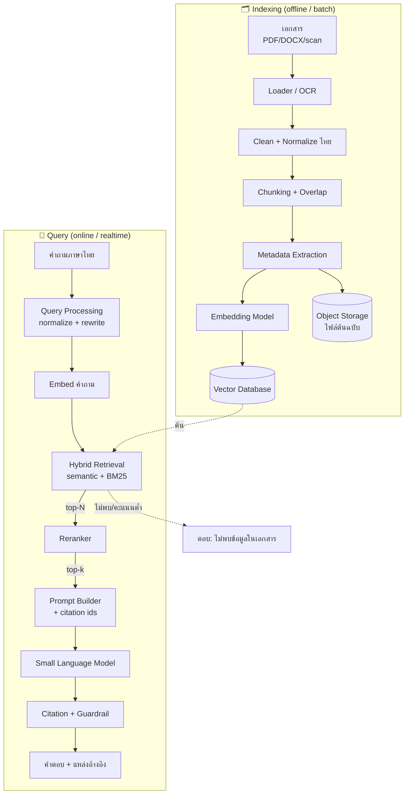
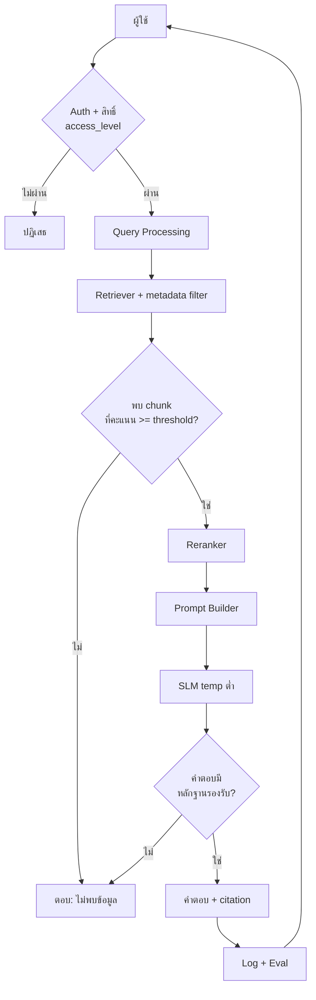

# แผนภาพสถาปัตยกรรม RAG (RAG Architecture)

> วันที่ตรวจสอบ: 21 กรกฎาคม 2026 · Mermaid syntax (render ได้บน GitHub/mkdocs/mermaid.live)

## 1. ภาพรวม 2 เฟส: Indexing (offline) + Query (online)

## 2. รายละเอียดฝั่ง Query (พร้อมการตัดสินใจ)

> อ้างอิงแนวคิด: `03_RAG_Fundamentals.md`, `04_RAG_Pipeline_Design.md`, `13_Recommended_System_Architecture.md`
