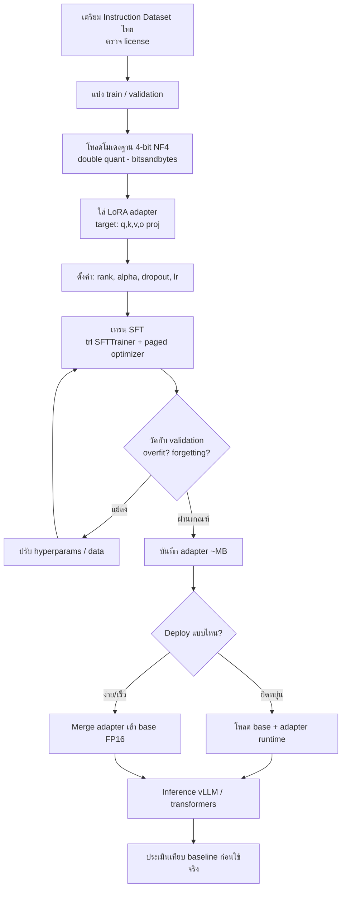
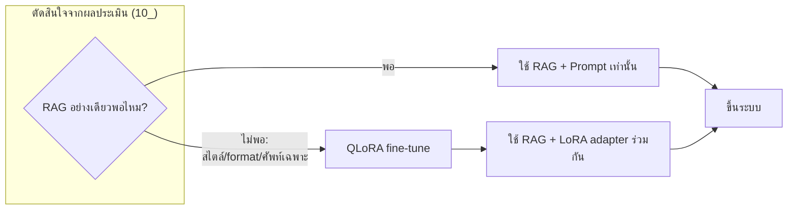

# แผนภาพกระบวนการ LoRA / QLoRA (Training Workflow)

> วันที่ตรวจสอบ: 21 กรกฎาคม 2026 · Mermaid syntax

## 1. ขั้นตอน QLoRA ตั้งแต่ข้อมูลจนถึง inference

## 2. ตำแหน่งของ Fine-tuning ในภาพรวมระบบ

> อ้างอิงแนวคิด: `07_LoRA_and_QLoRA.md`, `14_Implementation_Roadmap.md`
