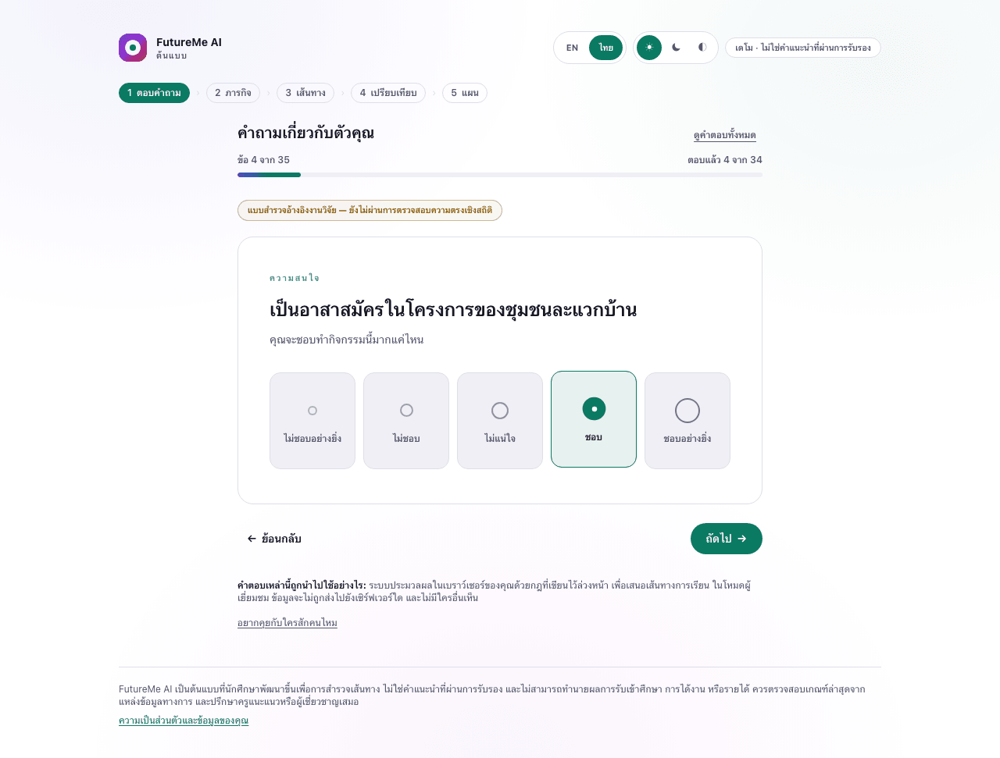
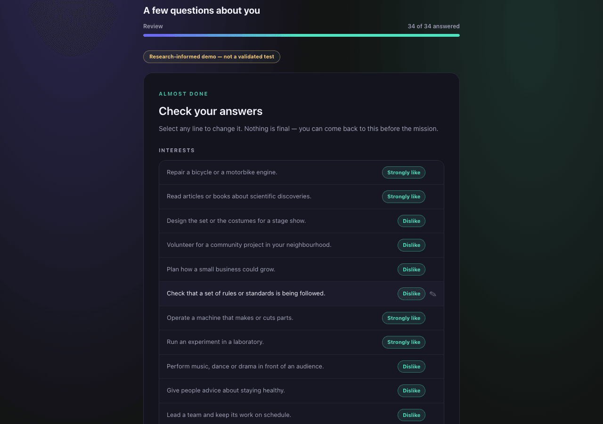
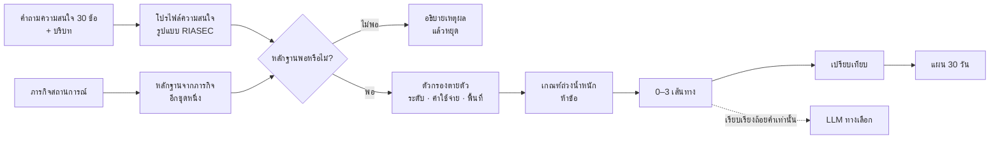

<a id="top"></a>

<p align="center">
  
</p>

# FutureMe AI

<p align="center">
  <strong>ตัวช่วยสำรวจเส้นทางเรียนและอาชีพสำหรับนักเรียนไทย</strong><br>
  ทบทวนความสนใจ ลองทำภารกิจ เปรียบเทียบหลายเส้นทาง แล้ววางก้าวถัดไปที่เปลี่ยนใจได้
</p>

<p align="center">
  <a href="https://github.com/winxtxrgit/futureme-ai/actions/workflows/ci.yml"></a>
  
  <a href="LICENSE"></a>
</p>

<p align="center">
  <a href="#what">คืออะไร</a>
  &nbsp;·&nbsp;
  <a href="#why">ทำไม</a>
  &nbsp;·&nbsp;
  <a href="#journey">เส้นทางผู้ใช้</a>
  &nbsp;·&nbsp;
  <a href="#implemented">สถานะปัจจุบัน</a>
  &nbsp;·&nbsp;
  <a href="#decision">ระบบตัดสินใจ + AI</a>
  &nbsp;·&nbsp;
  <a href="#difference">จุดต่าง</a>
  &nbsp;·&nbsp;
  <a href="#privacy">ความเป็นส่วนตัว</a>
  &nbsp;·&nbsp;
  <a href="#integrity">ความน่าเชื่อถือของงานวิจัย</a>
  &nbsp;·&nbsp;
  <a href="#roadmap">Roadmap</a>
  &nbsp;·&nbsp;
  <strong><a href="#run">รันต้นแบบ</a></strong>
  &nbsp;·&nbsp;
  <a href="READMEEN.md">English</a>
</p>

<p align="center">
  <sub>ต้นแบบ guest ที่ใช้งานได้ · อินเทอร์เฟซไทย/อังกฤษครบทั้ง flow · ธีมสว่าง มืด และตามระบบ · ไม่ต้องใช้ API key</sub>
</p>

---

<a id="what"></a>

## FutureMe คืออะไร

FutureMe ช่วยเปลี่ยนความรู้สึกว่า **“ไม่รู้จะเลือกอะไร”** ให้เป็น
**“รู้ว่าควรลองสำรวจอะไรต่อ”**

ผลิตภัณฑ์ออกแบบสำหรับนักเรียนไทยระดับมัธยมต้น มัธยมปลาย และอาชีวศึกษา
ที่กำลังพิจารณาสายการเรียน การศึกษาต่อ หรือเส้นทางที่เชื่อมกับการทำงาน
ระบบไม่ได้ทายอาชีพที่ “ใช่ที่สุด” แต่รวมการทบทวนตัวเองเข้ากับการลองทำสิ่งเล็ก ๆ
จากนั้นเปิดให้เห็นหลายทางเลือก หลักฐาน ข้อแลกเปลี่ยน และความไม่แน่นอน

| | |
|---|---|
| **ปัญหา** | นักเรียนมักต้องตัดสินใจเรื่องสำคัญก่อนมีโอกาสรู้ว่าเส้นทางนั้นเป็นอย่างไรเมื่อลงมือจริง |
| **คำตอบของผลิตภัณฑ์** | ทบทวน → ลองภารกิจ → สำรวจ 0–3 เส้นทาง → เปรียบเทียบ → ทดลอง 30 วัน |
| **หลักคิด** | ให้หลักฐานมาก่อนความมั่นใจ และให้ทางเลือกมาก่อนการฟันธงผู้ชนะ |
| **ขอบเขต** | เครื่องมือช่วยคิด ไม่ใช่ระบบทำนายการสอบติด การวินิจฉัยทางจิตวิทยา หรือสิ่งทดแทนครูแนะแนว |

> FutureMe ไม่ได้ถามว่า **“เธอควรเป็นอะไร?”**<br>
> แต่ถามว่า **“เธอควรลองสำรวจอะไรต่อ และต้องมีหลักฐานอะไรเพิ่ม?”**

---

<a id="why"></a>

## ทำไมปัญหานี้จึงสำคัญ

เส้นทางการเรียนและการทำงานเปลี่ยนแปลงตลอด เกณฑ์ของหลักสูตรมีอายุ
นักเรียนไม่ได้เข้าถึงการแนะแนวแบบต่อเนื่องเท่ากัน และรายชื่ออาชีพจำนวนมากก็ไม่ได้บอกว่า
นักเรียนคนหนึ่งควรทดลองทางเลือกเหล่านั้นอย่างไร

เอกสารวิจัยของโครงการสนับสนุนข้อสรุปอย่างระมัดระวังสามข้อ:

- **ปัญหาการเรียนกับงานไม่สอดคล้องกันมีขนาดใหญ่ แต่ตัวเลขต้องอ่านพร้อมบริบท** TDRI
  รายงานว่า 56% ของแรงงานกลุ่มที่บทความเรียกอย่างกว้างว่า “ผู้มีการศึกษาสูง”
  ทำงานนอกสาขา และราว 27% ทำงานต่ำกว่าระดับทักษะหรือวุฒิ
  แต่หน้าบทความสาธารณะไม่ได้เปิดเผยฐานคำนวณหรือวิธีเก็บข้อมูล
  โครงการจึงใช้ตัวเลขนี้เป็นบริบทของปัญหา ไม่ใช่หลักฐานว่า FutureMe มีประสิทธิผล
  [TDRI, 2025](https://tdri.or.th/2025/09/thailand-human-capital-development/)
- **ทักษะที่ตลาดต้องการยังเปลี่ยนต่อเนื่อง** World Economic Forum รายงานว่า 39%
  ของทักษะแกนหลักคาดว่าจะเปลี่ยนภายในปี 2030 และ 63% ของนายจ้างมองว่า skill gap
  เป็นอุปสรรค [Future of Jobs 2025](https://www.weforum.org/publications/the-future-of-jobs-report-2025/in-full/3-skills-outlook/)
- **ทำงานนอกสาขาไม่ได้แปลว่าล้มเหลวเสมอไป** OECD พบว่าผลเสียด้านรายได้ชัดที่สุด
  เมื่อ field mismatch เกิดพร้อม qualification mismatch
  FutureMe จึงสนับสนุนการสำรวจและทักษะที่ถ่ายโอนได้
  ไม่ได้สัญญาว่าจะหาคู่ที่ “ถูกต้องตลอดไป”
  [OECD, 2015](https://www.oecd.org/en/publications/the-causes-and-consequences-of-field-of-study-mismatch_5jrxm4dhv9r2-en.html)

โครงการยังไม่เคยทำ primary interview หรือ usability study กับนักเรียนไทย
หลักฐานข้างต้นช่วยยืนยันว่าปัญหาน่าศึกษา แต่ยังไม่พิสูจน์ว่า FutureMe แก้ปัญหาได้

---

<a id="journey"></a>

## เส้นทางผู้ใช้

| ขั้น | ประสบการณ์ของนักเรียน | หลักฐานที่ได้ |
|---|---|---|
| **1 · ทบทวน** | ตอบคำถามความสนใจ 30 ข้อและคำถามบริบท 5 ข้อ ทีละข้อ แล้วทบทวนคำตอบทั้งหมด | โปรไฟล์ความสนใจรูปแบบ RIASEC ชั่วคราวและข้อจำกัดที่มีผลจริง |
| **2 · ลอง** | ทำหนึ่งในสามภารกิจสถานการณ์ จะใช้ภารกิจที่ระบบเสนอหรือเปลี่ยนเองก็ได้ | เวกเตอร์จากภารกิจซึ่งอาจสนับสนุนหรือขัดกับ self-report |
| **3 · สำรวจ** | ดู 0–3 สมมติฐานเส้นทาง พร้อมเหตุผล สิ่งที่ยังไม่รู้ แหล่งที่มา และอายุข้อมูล | หลักฐานของแต่ละเส้นทางที่ตรวจสอบและเทียบกันได้ |
| **4 · เทียบ** | เปรียบเทียบทุกเส้นทางด้วยเกณฑ์ห้าข้อชุดเดียวกัน โดยไม่สร้างผู้ชนะปลอม | ข้อแลกเปลี่ยนและข้อมูลที่ยังขาด |
| **5 · ลงมือ** | เปลี่ยนหนึ่งเส้นทางเป็นแผน 30 วันที่ประกอบด้วยงานเล็ก ๆ และเปลี่ยนใจได้ | หลักฐานใหม่จากการลงมือ |

<p align="center">
  <a href="assets/screenshots/app/routes-desktop.png"></a>
</p>

<p align="center">
  <sub>หน้าจอจากแอปที่ทำงานอยู่จริง ไม่ใช่ concept mock-up</sub>
</p>

<table>
<tr>
<td width="50%" valign="top">
<a href="assets/screenshots/app/interview-th-light-desktop.png"></a><br>
<strong>ตอบคำถาม</strong><br><sub>คำถามความสนใจ 30 ข้อ แสดงทีละข้อ บนสเกลชอบ–ไม่ชอบ 5 ระดับ</sub>
</td>
<td width="50%" valign="top">
<a href="assets/screenshots/app/interview-desktop.png"></a><br>
<strong>หน้าเดียวกัน อังกฤษ ธีมมืด</strong><br><sub>ทั้งภาษาและธีมถูกจำไว้ กลับมาใหม่ก็ยังเป็นค่าเดิม</sub>
</td>
</tr>
<tr>
<td width="50%" valign="top">
<a href="assets/screenshots/app/mission-desktop.png"></a><br>
<strong>ลอง</strong><br><sub>ภารกิจสถานการณ์สั้น ๆ ที่เลือกด้วยกฎซึ่งอธิบายได้</sub>
</td>
<td width="50%" valign="top">
<a href="assets/screenshots/app/compare-desktop.png"></a><br>
<strong>เทียบ</strong><br><sub>ใช้เกณฑ์ ข้อจำกัด และหลักฐานชุดเดียวกันกับทุกเส้นทาง</sub>
</td>
</tr>
<tr>
<td width="50%" valign="top">
<a href="assets/screenshots/app/interview-review-desktop.png"></a><br>
<strong>ทบทวน</strong><br><sub>ทุกคำตอบยังแก้ได้ก่อนส่ง โดยแตะที่บรรทัดเพื่อย้อนกลับไปแก้</sub>
</td>
<td width="50%" valign="top">
<a href="assets/screenshots/app/plan-desktop.png"></a><br>
<strong>ลงมือ</strong><br><sub>ทดลองเส้นทาง 30 วัน โดยเก็บความคืบหน้าไว้ในเบราว์เซอร์</sub>
</td>
</tr>
</table>

---

<a id="implemented"></a>

## สิ่งที่สร้างแล้ว

| ส่วน | ต้นแบบปัจจุบัน |
|---|---|
| **อินเทอร์เฟซ** | ไทยและอังกฤษครบทั้ง flow, ธีมสว่าง/มืด/ตามระบบ และ layout สำหรับ desktop/mobile |
| **Session** | ใช้งานแบบ guest, กลับมาทำต่อหลัง refresh, ตรวจค่าที่อ่านกลับ และลบข้อมูลในเครื่องได้ทันที |
| **แบบสำรวจ** | คำถามกิจกรรมความสนใจ 30 ข้อ สลับหกมิติ RIASEC มิติละ 5 ข้อ ใช้สเกลชอบ/ไม่ชอบ 5 ระดับ |
| **บริบท** | คำถามบังคับ 4 ข้อเรื่องระดับการศึกษา ค่าใช้จ่าย การเดินทาง และช่วงเวลาที่อยากเริ่มมีรายได้ พร้อม free text ทางเลือก 1 ข้อ |
| **ภารกิจ** | ภารกิจสถานการณ์ 3 ชิ้น ชิ้นละ 4 ขั้น ให้คะแนนและเลือกด้วยกฎที่ตรวจสอบได้ และผู้เรียนเปลี่ยนเองได้ |
| **แคตตาล็อก** | เส้นทางเรียน/งานตัวอย่าง 6 ทาง พร้อมคำเตือนระดับฟิลด์และวันที่ของข้อมูล |
| **คำแนะนำ** | แสดง 0–3 เส้นทาง มี refusal gate, hard constraint, tie, contradiction, provenance และสิ่งที่ยังไม่รู้ |
| **เปรียบเทียบและแผน** | เทียบทุกทางด้วยเกณฑ์เดียวกัน และสร้างแผน 30 วันพร้อมงานเพิ่มเติมตามช่องว่างของหลักฐาน |
| **AI ทางเลือก** | แชตที่อ้างอิงข้อมูลใน repository และการเรียบเรียงคำอธิบาย ทั้งคู่มี offline fallback และไม่มีสิทธิ์เลือกหรือจัดลำดับเส้นทาง |
| **เครื่องมือ pilot** | เก็บ response process, ส่งออกข้อมูลรายคนแบบไม่ระบุตัวตน, จำลองข้อมูล และสร้างรายงานวิเคราะห์ |

แอปทำงานครบเส้นทางโดยไม่ต้องมีบัญชี ฐานข้อมูล environment variable
หรือผู้ให้บริการโมเดล

---

<a id="decision"></a>

## ระบบตัดสินใจและขอบเขตของ AI



ทุกอย่างที่มีผลต่อ eligibility คะแนน ลำดับเส้นทาง tie และ refusal
เป็น TypeScript แบบ deterministic ที่ทำงานในเบราว์เซอร์

| เกณฑ์ | น้ำหนัก | สัญญาณ |
|---|---:|---|
| ความสนใจ | 30% | ความคล้ายของรูปทรงโปรไฟล์ RIASEC ระหว่างผู้เรียนกับเส้นทาง |
| ความเป็นไปได้จริง | 25% | บริบทเรื่องค่าใช้จ่าย พื้นที่ และเวลา |
| จุดแข็ง | 20% | หลักฐานจากภารกิจที่ทำเสร็จ |
| รูปแบบการเรียนรู้ | 15% | ความสอดคล้องระหว่างโปรไฟล์กับสภาพแวดล้อมของเส้นทาง |
| ความยืดหยุ่น | 10% | ค่าความยืดหยุ่นตัวอย่างของเส้นทาง |

น้ำหนักเหล่านี้เป็น **วิจารณญาณของทีมออกแบบ** ไม่ใช่ค่าที่ fit จากผลลัพธ์ของนักเรียน

<details>
<summary><strong>เอนจินปฏิเสธหรือไม่จัดอันดับเมื่อใด</strong></summary>

<br>

- ต้องตอบคำถามความสนใจอย่างน้อย **23 จาก 30 ข้อ**
- โปรไฟล์ที่มี spread ต่ำกว่า **0.15** ถือว่าราบเกินกว่าจะสนับสนุนเส้นทาง
- ตัวกรองระดับการศึกษา ค่าใช้จ่ายสูง และการต้องย้ายพื้นที่ทำงานก่อนการให้คะแนน
- หากทุกเส้นทางที่ผ่านตัวกรองยังมีหลักฐานไม่พอ ระบบจะไม่เสนอเส้นทาง
- คะแนนรวมที่ห่างกันไม่เกิน **4 คะแนน** จะแสดงว่าสูสี แทนการจัดอันดับปลอม

ตัวเลขเหล่านี้เป็นกฎผลิตภัณฑ์และการปรับ calibration ไม่ใช่ผลการวัดเชิงจิตมิติ

</details>

### AI เพิ่มคุณค่าตรงไหน

endpoint `/api/explain` ซึ่งเป็นทางเลือกสามารถเรียบเรียงคำอธิบายให้อ่านเป็นธรรมชาติมากขึ้น
หลังจาก deterministic result ถูกสร้างแล้ว เบราว์เซอร์ส่งเพียง route id และรหัสเหตุผลตายตัว
server ตรวจทั้งสองค่าและใช้ข้อความของตัวเองก่อนติดต่อผู้ให้บริการโมเดล

สำหรับ `/api/explain` โมเดลไม่เห็นคำตอบของผู้เรียน free text คะแนน หรือรายการเส้นทาง
จึงเพิ่ม ลบ เลือก หรือสลับลำดับเส้นทางไม่ได้
หากผู้ให้บริการมีปัญหา แอปยังใช้คำอธิบาย deterministic เดิมได้

หน้า `/chat` เป็นผู้ช่วยแยกจากแบบสำรวจ ใช้ข้อมูลจากคลังขนาดเล็กที่คัดจาก repository
บทสนทนาอยู่ในหน่วยความจำของ tab ปัจจุบัน และจะส่งไปยัง app server เมื่อผู้เรียนกด Send เท่านั้น
หากตั้งค่า Anthropic ข้อความแบบจำกัดขนาดและบริบทที่ค้นได้อาจถูกส่งต่อไปยังผู้ให้บริการ
หากไม่ตั้งค่าหรือผู้ให้บริการมีปัญหา ระบบจะตอบแบบ offline พร้อมแหล่งข้อมูล
แชตไม่เห็น guest session และไม่สามารถเรียกตัวให้คะแนนหรือเอนจินเลือกเส้นทางได้

---

<a id="difference"></a>

## จุดต่างของ FutureMe

| แบบทดสอบอาชีพครั้งเดียว | วงจรหลักฐานของ FutureMe |
|---|---|
| ใช้ self-report เป็นสัญญาณหลัก | self-report และภารกิจสถานการณ์แยกจากกัน จึงเห็นได้เมื่อทั้งสองชุดไม่ตรงกัน |
| มักจบด้วยประเภทบุคลิกหรือรายชื่ออาชีพ | พาต่อไปสู่การเปรียบเทียบและการทดลองที่ย้อนกลับได้ |
| ความมั่นใจของผลลัพธ์อาจไม่ชัด | แสดงเหตุผล ระดับหลักฐาน สิ่งที่ยังไม่รู้ และอายุแหล่งข้อมูล |
| ผลลัพธ์อาจให้ความรู้สึกเหมือนคำตอบสุดท้าย | เส้นทางเป็นสมมติฐาน ผู้เรียนแก้คำตอบ เปลี่ยนภารกิจ หรือหยุดได้ |

เป้าหมายไม่ใช่การทำนายให้มากขึ้น แต่คือกระบวนการสำรวจที่ดีกว่า

---

<a id="privacy"></a>

## ความเป็นส่วนตัวและ Responsible AI

**ค่าเริ่มต้นของต้นแบบ**

- คำตอบเก็บไว้ใน `localStorage` ของเบราว์เซอร์นี้ภายใต้ key `futureme.guest.v1`
- เอนจินคำแนะนำทำงานฝั่ง client โดยไม่เรียก network
- ไม่มีระบบบัญชี analytics library, advertising tracker, sharing flow หรือที่เก็บคำตอบฝั่ง server
- หน้าความเป็นส่วนตัวลบ guest session ทั้งหมดได้ทันที
- ประวัติแชตอยู่ในหน่วยความจำของ tab ปัจจุบันและหายเมื่อ refresh หรือกด Clear chat
  แต่เมื่อกด Send ข้อความจะถูกส่งไปยัง app server และส่งต่อไป Anthropic เฉพาะเมื่อตั้งค่าไว้
- การร่วมวิจัยถูกแยกออกมาและเป็นทางเลือก หน้า `/research` บันทึกไฟล์ลงอุปกรณ์
  โดยไม่มีการส่งอัตโนมัติ

ก่อน deployment ต้องตรวจเงื่อนไขการประมวลผลและ retention ปัจจุบันของ host และผู้ให้บริการ
ต้นแบบนี้ยังไม่ผ่านการตรวจความสอดคล้องกับ PDPA

การ hosting เว็บยังอาจทำให้ผู้ให้บริการประมวลผล request metadata เช่น IP address
คำว่า “คำตอบอยู่ในเบราว์เซอร์” ไม่ได้หมายความว่าเว็บไซต์ทำงานโดยไม่มีเครือข่าย

**ข้อจำกัดด้าน safeguarding**

safety pause เป็นกฎจับคำภาษาไทย/อังกฤษขนาดเล็กที่ทำงานในเครื่อง
ไม่ใช่การประเมินทางคลินิกหรือการประเมินความเสี่ยง อาจพลาดหรือเตือนผิดได้ และไม่มีการแจ้งบุคคลใด

[อ่าน data flow แบบละเอียด →](docs/08-privacy-and-data.md)

---

<a id="integrity"></a>

## ความน่าเชื่อถือของงานวิจัย

> **เครื่องมือปัจจุบันยังไม่เคยถูกใช้กับผู้เข้าร่วมจริง**<br>
> ยังไม่มีค่าความเที่ยง norm ผลตรวจ construct validity, predictive validity
> หรือผลลัพธ์ด้านประสิทธิผล

สิ่งที่มีหลักฐานรองรับ:

- Holland RIASEC เป็นกรอบความสนใจด้านอาชีพที่มีงานวิจัยรองรับ
- 17 จาก 30 ข้อดัดแปลงจาก 18REST ที่เปิดให้ใช้ภายใต้สัญญาอนุญาต และอีก 13 ข้อเขียนขึ้นสำหรับโครงการ
- คลังข้อคำถาม ทิศทางการให้คะแนน attribution และคณิตศาสตร์ของ analysis pipeline มี automated checks
- pipeline คำนวณสถิติรายข้อ α, ω พร้อม bootstrap confidence interval,
  careless-response indicators และ randomisation test ของ circular order ได้

สิ่งที่ยังไม่มีหลักฐานรองรับ:

- ชุดคำถาม 30 ข้อนี้ไม่ใช่ O*NET Interest Profiler และไม่ใช่แบบทดสอบ RIASEC ที่ผ่าน validation
- ค่าความเที่ยงที่ตีพิมพ์ของ 18REST ไม่ได้ส่งต่อมายังข้อที่ดัดแปลงหรือคำแปลไทยโดยอัตโนมัติ
- คำแปลไทยเป็นฉบับร่างแรก ยังไม่ผ่าน cross-cultural adaptation อย่างครบถ้วน
- rubric ของภารกิจ น้ำหนักตายตัว และเกณฑ์คำแนะนำยังไม่ผ่าน validation
- แคตตาล็อกหกเส้นทางเป็นข้อมูลตัวอย่าง ค่าใช้จ่าย การย้ายพื้นที่ ระยะเวลาก่อนมีรายได้
  ความยืดหยุ่น จุดแข็ง และข้อจำกัดยังมีค่าประมาณของทีมที่ไม่มีแหล่งอ้างอิง
- ยังไม่มี ethics approval, pilot กับนักเรียนจริง, bias audit หรือ outcome evaluation

การที่ pipeline กู้คืนคำตอบที่ทราบอยู่แล้วจากผู้ตอบจำลองได้
เป็นการตรวจสอบ **pipeline** ไม่ใช่การตรวจสอบตัวแบบสำรวจ

[ระเบียบวิธีแบบสำรวจ →](docs/questionnaire-methodology.md) ·
[คลังข้อคำถาม →](docs/question-bank.md) ·
[แผนการตรวจสอบ →](docs/validation-plan.md) ·
[โปรโตคอล pilot →](docs/pilot-protocol.md)

---

<a id="roadmap"></a>

## Roadmap

1. **ปรับคำแปลและทำ cognitive debriefing** — แปลไทยโดยอิสระ ทบทวนโดยผู้เชี่ยวชาญ
   ตรวจ experiential equivalence และสัมภาษณ์ความเข้าใจของผู้เรียน
2. **ผ่าน ethics gate** — ขอการรับรองจริยธรรม ความยินยอมของผู้ปกครอง
   assent ของนักเรียน การประเมิน PDPA กฎ retention และขั้นตอนถอนข้อมูล
3. **pilot แล้วแก้ไข** — ตรวจ item quality, α, ω, รูปแบบการตอบ “ไม่แน่ใจ”
   โครงสร้างวงกลม และคุณภาพภารกิจ จากนั้นแก้และทดลองซ้ำ
4. **ทำข้อมูลเส้นทางให้ตรวจสอบได้** — ใช้ข้อมูลหลักสูตรและตลาดแรงงานที่มีสิทธิ์ใช้
   เป็นปัจจุบัน มีวันที่ และมี provenance ระดับฟิลด์
5. **ประเมินผลิตภัณฑ์** — relevance, counsellor agreement, diversity, comprehension,
   completion, accessibility, safety และ bias
6. **ค่อยขยายระบบ** — school pilot แบบมี consent, บัญชีผู้ใช้, มุมมองครูแนะแนว,
   retrieval และ production infrastructure

โครงการจะไม่ระบุว่าโรงเรียน แพลตฟอร์ม หรือผู้ให้บริการ cloud เป็น partner ที่ยืนยันแล้ว
จนกว่าจะมีข้อตกลงจริง

---

<a id="run"></a>

## รันต้นแบบ

ต้องใช้ Node.js 20 ขึ้นไป

```bash
git clone https://github.com/winxtxrgit/futureme-ai.git
cd futureme-ai/03_WebApp/Pre_Present
npm ci
npm run dev
```

เปิด [http://localhost:3000](http://localhost:3000) แล้วกด **Start as guest**

```bash
npm run verify       # typecheck + lint + unit/integration tests + production build
npm run test:e2e     # ตรวจเส้นทางผู้ใช้จริงบน production build

# ทางเลือก: self-test ของ research pipeline
npm run simulate -- /tmp/futureme-sim --n 300 --seed 7
npm run analyse -- /tmp/futureme-sim
```

ชั้นเรียบเรียงคำอธิบายและแชตแบบใช้ provider ตั้งค่าผ่าน [`.env.example`](.env.example)
ไม่ควรเปิด funded provider key บน public deployment ก่อนเพิ่ม authentication, rate limit
และตรวจเงื่อนไข retention ของ host และผู้ให้บริการ

---

## เอกสาร

| หัวข้อ | เอกสาร |
|---|---|
| **ผลิตภัณฑ์และ UX** | [Project overview](docs/01-project-overview.md) · [User experience](docs/03-user-experience.md) |
| **ระบบตัดสินใจ** | [AI and decision logic](docs/04-ai-system.md) · [System architecture](docs/05-system-architecture.md) |
| **เครื่องมือวัด** | [ระเบียบวิธี](docs/questionnaire-methodology.md) · [คลังข้อคำถาม](docs/question-bank.md) · [สรุปงานวิจัย](docs/research-summary.md) |
| **การตรวจสอบ** | [Validation plan](docs/validation-plan.md) · [Pilot protocol](docs/pilot-protocol.md) |
| **ความน่าเชื่อถือและหลักฐาน** | [Privacy and data flow](docs/08-privacy-and-data.md) · [Research and evidence](docs/02-research-and-evidence.md) · [Source review](docs/09-source-review.md) |
| **การพัฒนา** | [Development plan](docs/06-development-plan.md) · [Roadmap](docs/07-roadmap.md) · [Contributing](CONTRIBUTING.md) |

พบปัญหาในผลิตภัณฑ์ โค้ด หรือหลักฐาน?
[เปิด issue →](https://github.com/winxtxrgit/futureme-ai/issues)

---

<p align="center">
  <strong>FutureMe ช่วยให้นักเรียนเลือกการทดลองครั้งถัดไป ไม่ได้ฟันธงตัวตนสุดท้าย</strong>
  <br><br>
  สร้างสำหรับ <a href="https://www.jumpthailand.com/">JUMP THAILAND Hackathon 2026</a> ·
  AI for the Future of Thai Education · MIT licensed
  <br><br>
  <a href="#top">กลับขึ้นด้านบน</a>
  &nbsp;·&nbsp;
  <a href="READMEEN.md">Read in English</a>
</p>
