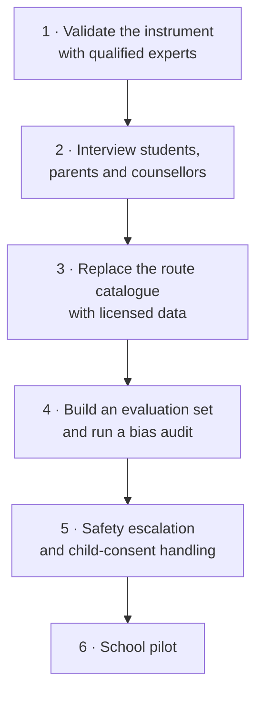

# 06 · Development Plan

[← Architecture](05-system-architecture.md) · [Back to README](../READMEEN.md) · [Next: Roadmap →](07-roadmap.md)

---

> **Status as of 26 July 2026.** Statuses below describe *this repository*, not the team's private
> workspace. Where something exists only as a design, it says so.

## Status vocabulary

Used consistently across this repository, including in the README and the roadmap.

| Label | Meaning |
|---|---|
| 🟢 **Implemented** | Runs in this repository. Backed by a file you can open and a test you can run |
| 🟡 **Prototype implementation** | Runs, but in a reduced form that is not what the product needs |
| 📐 **Planned** | Designed, documented, not built |
| 🔴 **Blocked** | Cannot proceed until something outside the code changes |
| ⛔ **Not started** | Neither designed in detail nor built |

---

## Component status

| Component | Status | What exists | What remains |
|---|:--:|---|---|
| Runnable guest journey — interview → mission → routes → compare → plan | 🟢 | Complete end to end, no account, no API key | — |
| Deterministic decision engine | 🟢 | Five weighted criteria, hard filters, 0–3 routes, tie handling | Weights are unfitted to outcomes |
| Refusal gates | 🟢 | Three gates that return nothing rather than guess | — |
| Mission selection | 🟢 | Rule over the interview profile, explained on screen, learner-overridable | Three missions is a thin catalogue |
| Mission draft autosave | 🟢 | Debounced write; a refresh mid-mission loses nothing | — |
| Guest session validation | 🟢 | Field-by-field rebuild against the seed data, with v1 migration | — |
| Route data provenance and freshness | 🟢 | Per-route source, status and last-checked date; catalogue age on screen | The catalogue itself is still illustrative |
| Optional LLM explanation layer | 🟢 | Connected, labelled, cannot affect ranking, degrades to deterministic text | Not evaluated for quality |
| Safeguarding pause | 🟡 | Keyword rule, Thai and English, stops recommendations and offers support | Not a risk assessment. Nobody is alerted |
| Interest instrument | 🟡 | 30 interleaved items, bilingual Thai/English, plus context | Fixed rather than adaptive; Thai is a first draft; instrument is not validated |
| Route catalogue | 🟡 | Six routes with declared provenance | Cost, location, timing and flexibility carry no source |
| 30-day plan | 🟡 | 30-day/four-week template plus gap-specific tasks, progress persists | Linear, not the planned DAG |
| Continuous integration | 🟢 | Typecheck, lint, unit, integration, build and end-to-end on every PR | — |
| Accounts, sharing, server persistence | 📐 | Designed | Guest mode only today |
| RAG pipeline — Qdrant + BGE-M3 | 📐 | Designed | Prototype reads a seeded JSON catalogue |
| Adaptive Thai Socratic interview | 📐 | Designed | Fixed bilingual questionnaire today |
| STAR extraction from free text | 📐 | Designed | Keyword spotting today |
| Interactive DAG roadmap | 📐 | Algorithm designed | Linear plan today |
| Counsellor and parent views | 📐 | Designed | Not implemented |
| AIS Open API integration | 📐 | Specified against CAMARA | Needs developer credentials |
| QLoRA fine-tuning | 🔴 | — | Dataset unusable — see below |
| Instrument validation | ⛔ | — | Needs qualified assessment professionals |
| Bias audit | ⛔ | — | Needs an evaluation set and a defined protocol |
| School pilot | ⛔ | — | Needs everything above |

Percentage estimates were removed from this table. They implied a precision the team does not
have, and a five-level status is more honest than a number nobody measured.

---

## Verification

Every claim of 🟢 above corresponds to something executable.

| Check | Command | Result |
|---|---|---|
| Types | `npm run typecheck` | 0 errors, strict mode |
| Lint | `npm run lint` | 0 warnings |
| Unit and integration | `npm test` | 136 passing |
| End-to-end | `npm run test:e2e` | 20 passing, against the production build |
| Production build | `npm run build` | 9 routes |
| All of the above | `npm run verify` | Also runs on every pull request |

---

## Known blockers

**1 · The QLoRA dataset is not usable.**
The train and test files are byte-identical and contain ten examples each. Evaluating a fine-tune
on data it trained on measures nothing. The sets must be separated, materially expanded and
independently reviewed before any evaluation figure is reported. Until then no fine-tuning metric
exists and none may be claimed.

**2 · No validated instruments.**
The interest items and the mission rubrics were written from published frameworks but have not
been reviewed by qualified assessment professionals. They are defensible as a prototype and not
defensible as an assessment.

**3 · No pilot data.**
Every effectiveness statement in this project is a design intention. Nothing has been measured
with real students, so the decision-matrix weights remain design judgement rather than fitted
parameters.

**4 · The route catalogue has no authoritative source.**
Cost, location, timing and flexibility drive the eligibility filters and none of them carries a
citation. Replacing them with licensed data — per programme, per year — is the single change that
would most improve the product's honesty.

**5 · External platform access.**
AIS Open API credentials, and any NDLP or DEEP integration, need agreements that do not exist. The
July 2026 source audit could not verify the technical claims previously made about either
Ministry platform.

---

## What changed since the last plan

The four milestones this document previously listed as complete described the team's private
workspace, and two of their acceptance criteria did not survive re-checking:

| Previously claimed | Now |
|---|---|
| "All 12 ปวช. 2567 vocational subject areas correctly represented" | Withdrawn. The source registry forbids hard-coding subject-area counts, which change per curriculum revision. A test fails if one reappears |
| "TPAT1–5 mappings match the official MyTCAS blueprint" | Withdrawn. Not modelled in this repository and not re-verifiable from a citable source |
| "No unverified 52% / 65% / 85% / WEF 44% claims remain" | Partly wrong. WEF 44% is a real 2023-report figure for 2023–2027, not a misquote of 39%. See [09 · Source Review](09-source-review.md) |
| "Verification script passes all programmatic checks" | That script is not in this repository. The equivalent checks are now unit tests that run in CI |

---

## Immediate next steps

1. **Validate the interest instrument and mission rubrics** with qualified professionals. Until
   this happens, everything downstream inherits an unmeasured instrument.
2. **Interview ม.3 and ม.5 students, parents and counsellors** across different Thai school
   contexts — urban and rural, large and small. These years sit immediately before consequential
   education decisions.
3. **Replace the demo catalogue** with per-programme, per-year data carrying a source and a
   validity window.
4. **Build an independent evaluation set and run a bias audit** across gender, region, school size
   and income before any student sees the output.
5. **Establish safety escalation and PDPA child-consent handling**, including a route to appeal a
   recommendation.
6. **Run a school pilot** and use the results to calibrate the matrix weights.

---

## Team

Student hackathon work. Roles are functional rather than formal, and the same people cover several.

| Function | Responsibility |
|---|---|
| Research and data | Research base, claim auditing, source verification |
| Product and UX | Concept exploration, design system, user journey, accessibility |
| AI and backend | Decision engine, planned RAG pipeline, schemas |
| Infrastructure | Cloud architecture, deployment, PDPA and security design |
| Verification | Tests, CI, and auditing claims against the code |

Contributions are welcome — see [CONTRIBUTING.md](../CONTRIBUTING.md).

---

## Priorities under time pressure

If the deadline compresses, the design rules are already agreed:

> **Simplify the visual design before reducing recommendation transparency, consent, safety, or
> accessibility.**

Concretely: cut animation, cut screens, cut features. Do not cut the "why this was suggested"
panel, the "what we still don't know" field, the consent gate, or the disclaimer. The visual
polish is what makes the product attractive; those four are what make it defensible.

---

[← Architecture](05-system-architecture.md) · [Back to README](../READMEEN.md) · [Next: Roadmap →](07-roadmap.md)
