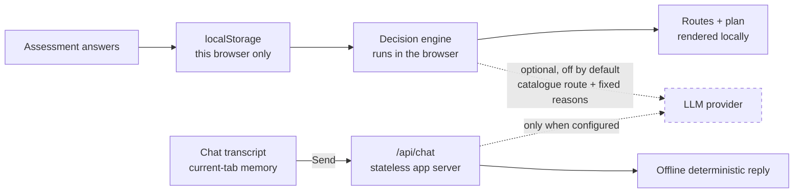

# 08 · Privacy and Data Flow

[← Roadmap](07-roadmap.md) · [Back to README](../READMEEN.md) · [Next: Source Review →](09-source-review.md)

---

This document describes what the **implemented prototype** does, then separately what the
**planned production design** intends. Where an earlier version of this project's documentation
overstated a privacy property, the correction is recorded here.

---

## Correction to an earlier claim

Earlier documentation stated:

> ~~"Chat transcripts never leave the student."~~

That sentence was imprecise, and it sat next to an architecture diagram showing a FastAPI backend
and a PostgreSQL database. Two different claims were being blurred:

| Claim | What it means | Where it is true |
|---|---|---|
| **"Not shared with parents or counsellors"** | A *permission* rule. It constrains who may read data. It says nothing about where the data physically travels. | This is the production design intent. Nothing enforces it yet, because the sharing features do not exist. |
| **"Assessment answers stay on the device"** | A narrower physical claim about interview and mission input. | True of the implemented recommendation path. An enabled explanation request sends a catalogue route id and fixed reason codes, but not the underlying answers. |
| **"The chat transcript is not persisted by the app"** | A retention claim, not a no-transmission claim. | The transcript exists only in current-tab React state, but pressing Send transmits the bounded messages to the application server and, when configured, Anthropic. |

These claims do not imply one another. A system can faithfully hide a transcript from a parent
while still transmitting it to a server, logging it, and retaining it indefinitely. The corrected
implemented data flow appears in the README and below.

---

## What the prototype actually does

**Assessment answers and progress stay in the browser.** The recommendation engine
(`lib/decision-engine/`) is plain TypeScript that executes on the client. There is no network
request in the recommendation path. Loading a hosted web app still creates ordinary requests to
its host, and the optional explanation and chat endpoints are separate network paths described
below.

| Data | Collected? | Where it goes | Retention |
|---|---|---|---|
| Interview Likert answers | Yes | `localStorage` in this browser | Until the user deletes it |
| Interview free text ("something you were proud of") | Yes, optional | `localStorage` only | Until the user deletes it |
| Mission answers, including free text | Yes | `localStorage` only | Until the user deletes it |
| Generated routes and scores | Yes | Recomputed on demand; not stored separately | n/a |
| Selected route and plan check-ins | Yes | `localStorage` only | Until the user deletes it |
| Guest session id | Yes | `localStorage` only — random, not derived from anything about the user | Until the user deletes it |
| Chat draft and visible transcript before Send | Yes | React state in the current tab; not `localStorage`, `sessionStorage` or the guest session | Until Clear, refresh, navigation that unmounts the page, or tab close |
| Chat messages after Send | Yes | Next.js application server; also Anthropic only when the operator configures `ANTHROPIC_API_KEY` | FutureMe application code does not persist them; deployment-host and provider handling must be verified separately |
| Name, email, phone, school | **No** | — | — |
| Analytics, advertising cookies or trackers added by the app | **No** | — | — |
| Normal request metadata such as IP address | Not collected by FutureMe application code | A deployment host may process or log it when serving pages, `/api/explain` or `/api/chat` | Governed by the host's configuration |
| Application database, cookies or logs containing assessment/chat bodies | **No** | The implemented routes do not persist or log request/response bodies | A deployment host or provider may have separate logging or retention |

Storage key: `futureme.guest.v1`. It is inspectable in browser developer tools, which is
deliberate — a privacy claim a user can verify themselves is worth more than one they must trust.

**Writes happen as you type.** Mission answers are autosaved on a short debounce so a refresh does
not discard unfinished writing. This is a usability decision with a privacy consequence worth
stating: a half-written answer is on disk in this browser from the moment it is typed, not only
once it is submitted. It is covered by the same delete control.

**Reads are treated as untrusted.** localStorage is writable by the user, by extensions, and by
anything that has run on this origin. The session is therefore not parsed and used — it is rebuilt
field by field against the seed data on every read. Question ids, Likert values, context options,
mission steps, option values and route ids are all checked against what the app actually offers;
anything unrecognised is dropped rather than passed to the scorer, collections are capped, and a
container that cannot be trusted at all resets to a clean session. The learner is told once when
something was discarded.

This is a correctness property before it is a security one: an out-of-range Likert value silently
reaching the scorer would produce a recommendation nobody could explain.

**Deletion.** `/privacy` has a *Delete my data* control that removes the FutureMe session key
immediately. The app creates no server-side copy of that session. Browser extensions, screenshots,
device backups and deployment-host request logs are outside that control.

`/chat` has a separate **Clear chat** control, and refresh also resets the current-tab transcript.
That removes the UI's in-memory copy. It cannot recall a request already processed by the host or
Anthropic, so host/provider retention and deletion terms must be checked before deployment.

**Identity and consent.** Guest mode does not ask for a name, email, phone number or school.
Learners can still type identifying information into optional free-text fields or chat, so
anonymity cannot be guaranteed. Account and counsellor-sharing flows are not built; any future
pilot needs an appropriate consent and legal review rather than relying on guest mode alone.

---

## Optional network paths

There are two server routes that are outside the client-side recommendation path.

### Explanation rewording

The optional explanation layer is at `app/api/explain/route.ts`.

- It is **disabled unless the operator sets `ANTHROPIC_API_KEY`**.
- When disabled it returns `{ source: "fallback" }` and the app uses deterministic template text. Behaviour is identical apart from wording.
- If enabled, the browser request contains a **catalogue route id and fixed reason codes**. The
  server validates both, resolves their server-owned wording, and sends no learner answers or free
  text to the provider.
- It cannot change which routes were selected. The engine has already decided by the time this is called.
- Provider retention and training treatment depend on the operator's current provider agreement.
  A deployment owner must verify and disclose those terms before enabling the feature.
- The endpoint constrains content but has no production authentication or rate limit. A public
  deployment needs abuse controls and provider spend limits before enabling a funded API key.

### Repo-grounded chat

The companion at `/chat` calls `app/api/chat/route.ts` only when the learner presses Send.

- The browser sends `{ language, messages }`; it does not attach the guest assessment session,
  scores, selected route, research export or `localStorage` contents.
- A request contains at most 11 messages, 2,000 characters per message and 8,000 characters total;
  the server also rejects a raw body above 64,000 bytes before JSON parsing. Only alternating
  `user` and `assistant` roles are accepted, beginning and ending with the user.
- The route is stateless. FutureMe application code uses no database, cookie, session store or
  request-body logging for chat.
- Missing key, timeout, provider error or malformed provider output returns an offline,
  deterministic answer with repo-derived sources. A query with no matching repository source is
  not sent to the provider. Raw messages still reached the application server even when the
  offline path is used.
- When `ANTHROPIC_API_KEY` is configured, the bounded transcript and selected repository context
  are sent to Anthropic. The operator must verify and disclose the deployment host's and
  Anthropic's current retention, training, residency and deletion terms before deployment.
- The companion cannot call the scorer or route engine and cannot add, remove, select or reorder a
  route.

---

## Safeguarding

A keyword rule (`lib/safety/`) scans free-text answers and chat input. If it matches, the app stops
generating career output from that answer and shows a support screen with the Thai Department of
Mental Health [hotline 1323](https://dmh.go.th/). On `/chat`, the client does not append or send the
triggering text, and the server checks every submitted turn again before any provider call.

**Its limits, stated plainly:**

- It is a regular-expression list, not a risk assessment. It will miss real distress and will fire on harmless phrasing.
- A client-side chat match is not transmitted. If the client misses it, the server-side check means
  the text reached the app server, but it is not sent to Anthropic. **Nobody is alerted** in either
  case; there is no monitoring behind this.
- The assessment session records only which rule index fired, never the triggering text. Chat does
  not append the triggering message to its transcript.
- This is a prototype-level mechanism. It must not be described as a validated safeguarding system.

---

## Not implemented

The following production controls or reviews are not complete:

| Feature | Status |
|---|---|
| Accounts, login, permanent saving | Planned |
| Parent view and counsellor view | Planned |
| Consent grant and revocation flow | Planned |
| Server-side storage (PostgreSQL) | Planned |
| Retention enforcement and audit logging | Planned |
| Deployment-host and AI-provider processing/retention review | Not started |
| Field-level encryption of sensitive attributes | Planned |
| Data-subject request process | Planned |
| PDPA compliance review | Not started |

The production design for these is in [05 · System Architecture](05-system-architecture.md), clearly
marked as planned.

---

## PDPA position

The users are minors, so this matters more than usual. The honest position:

- The prototype minimises data by avoiding accounts, keeping assessment answers in browser
  storage, and not persisting chat in application storage. Submitted chat is still processed by
  the app server and optionally Anthropic. These are privacy-by-design choices, not a compliance
  conclusion.
- **No PDPA compliance review has been carried out.** A qualified review is required before a
  real-student pilot or public deployment that processes learner data.
- In-country data residency and ISO certification from a cloud provider would cover *where* data lives. Consent management, access control, minimisation, retention and processor governance are application-layer duties that remain with this project. Conflating the two is the most common way a project like this gets compliance wrong.

---

[← Roadmap](07-roadmap.md) · [Back to README](../READMEEN.md) · [Next: Source Review →](09-source-review.md)
