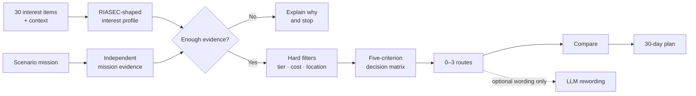

<a id="top"></a>

<p align="center">
  
</p>

# FutureMe AI

<p align="center">
  <strong>Career and study exploration for Thai students.</strong><br>
  <strong>ตัวช่วยสำรวจเส้นทางเรียนและอาชีพสำหรับนักเรียนไทย</strong>
</p>

<p align="center">
  Reflect on interests. Try a small mission. Compare several routes. Plan one reversible next step.<br>
  ทบทวนความสนใจ ลองทำภารกิจ เปรียบเทียบหลายเส้นทาง แล้ววางก้าวถัดไปที่เปลี่ยนใจได้
</p>

<p align="center">
  <a href="https://github.com/winxtxrgit/futureme-ai/actions/workflows/ci.yml"></a>
  
  <a href="LICENSE"></a>
</p>

<p align="center">
  <strong><a href="#run-locally--รันในเครื่อง">Run the prototype · ทดลองใช้ต้นแบบ</a></strong>
  &nbsp;·&nbsp;
  <a href="#product-journey--เส้นทางผู้ใช้">How it works · วิธีทำงาน</a>
  &nbsp;·&nbsp;
  <a href="#current-status--สถานะปัจจุบัน">Current status · สถานะ</a>
  &nbsp;·&nbsp;
  <a href="READMEEN.md">English</a>
  &nbsp;·&nbsp;
  <a href="READMETH.md">ภาษาไทย</a>
</p>

<p align="center">
  <sub>Runnable guest prototype · Thai and English · light, dark, and system themes · no API key required</sub>
</p>

---

## FutureMe in one minute · FutureMe ในหนึ่งนาที

FutureMe does not try to decide **“the perfect career.”** It helps a student ask a more useful
question: **“What should I explore next, and what evidence would help me decide?”**

FutureMe ไม่ได้ฟันธง **“อาชีพที่ใช่ที่สุด”** แต่ช่วยให้นักเรียนตอบคำถามที่นำไปใช้ได้จริงกว่า:
**“ควรลองสำรวจอะไรต่อ และต้องมีหลักฐานอะไรเพิ่มก่อนตัดสินใจ?”**

| | |
|---|---|
| **Users · ผู้ใช้** | Thai lower-secondary, upper-secondary, and vocational students · นักเรียนมัธยมต้น มัธยมปลาย และอาชีวศึกษา |
| **Problem · ปัญหา** | Important study choices often arrive before students can test what a route feels like · ต้องเลือกเส้นทางสำคัญก่อนมีโอกาสลองสัมผัสงานหรือการเรียนจริง |
| **Approach · วิธี** | Structured reflection + one scenario mission + comparable routes + a 30-day experiment |
| **Position · ขอบเขต** | Decision support—not a career verdict, admission predictor, or replacement for a counsellor · เครื่องมือช่วยคิด ไม่ใช่ผู้ตัดสินอนาคต |

<p align="center">
  <a href="assets/screenshots/app/routes-desktop.png"></a>
</p>

<p align="center">
  <sub>Captured from the current application · ภาพจากแอปที่ทำงานอยู่จริง</sub>
</p>

---

<a id="product-journey--เส้นทางผู้ใช้"></a>

## Product journey · เส้นทางผู้ใช้

| Step | What happens |
|---|---|
| **1 · Reflect · ทบทวน** | Answer 30 interest items and 5 context prompts in Thai or English, one at a time, then review every answer. |
| **2 · Try · ลอง** | Complete one of 3 short scenario missions; the suggested mission can be changed. |
| **3 · Explore · สำรวจ** | Receive 0–3 route hypotheses with reasons, unknowns, provenance, and data-age warnings. |
| **4 · Compare · เทียบ** | Compare routes using the same five criteria instead of treating the first result as a winner. |
| **5 · Act · ลงมือ** | Turn one route into a reversible 30-day exploration plan with progress saved locally. |

```text
Reflect → Try → Explore → Compare → Act
  คิด      ลอง      สำรวจ       เทียบ      ลงมือ
```

<table width="100%">
<tr>
<td width="50%" valign="top">
<a href="assets/screenshots/app/interview-desktop.png"></a>
<p align="center"><sub><strong>Step 1 · one question at a time</strong><br>English · dark · ทีละคำถาม</sub></p>
</td>
<td width="50%" valign="top">
<a href="assets/screenshots/app/interview-th-light-desktop.png"></a>
<p align="center"><sub><strong>Same screen · Thai · light</strong><br>หน้าเดียวกัน ภาษาไทย ธีมสว่าง</sub></p>
</td>
</tr>
</table>

<p align="center">
  <a href="assets/screenshots/app/interview-review-desktop.png"></a>
</p>

<p align="center">
  <sub>
  Answering advances automatically; the review step keeps every answer changeable before you continue.<br>
  ตอบแล้วเลื่อนให้เอง และหน้าทบทวนทำให้ยังแก้ทุกคำตอบได้ก่อนไปต่อ
  </sub>
</p>

---

<a id="current-status--สถานะปัจจุบัน"></a>

## Current status · สถานะปัจจุบัน

| Area | Implemented today |
|---|---|
| **Experience** | Complete guest journey, responsive layouts, Thai/English, and persistent light/dark/system preferences |
| **Assessment** | 30 interleaved RIASEC-shaped interest items + 4 required context questions + 1 optional free-text prompt |
| **Missions** | 3 scenario missions chosen by a transparent rule; the learner may override the choice |
| **Routes** | 6 illustrative routes; the engine may show 0–3 and can refuse to guess |
| **Decision system** | Deterministic client-side TypeScript with hard filters, fixed weights, ties, contradictions, and evidence-strength labels |
| **AI** | Optional LLM wording layer only; it cannot add, remove, select, or reorder routes |
| **Privacy** | Guest answers stay in browser storage by default and can be deleted immediately |
| **Research tooling** | Optional anonymous export at `/research`, plus a reproducible pilot-analysis pipeline |

<details>
<summary><strong>What is not complete yet · สิ่งที่ยังไม่เสร็จ</strong></summary>

<br>

- The instrument has never been administered to real participants. No reliability, norms, or
  validity results exist.
- The Thai translation is a first draft, not a completed cross-cultural adaptation.
- Mission rubrics and fixed decision weights are team design judgement, not fitted parameters.
- The route catalogue is illustrative; cost, relocation, time-to-earning, and flexibility contain
  unsourced estimates.
- No real-student pilot, ethics approval, bias audit, or effectiveness study has run.
- The safety pause is a bilingual keyword rule, not a risk assessment, and it alerts nobody.
- Retrieval, accounts, counsellor tools, school integrations, and cloud infrastructure are planned
  directions—not current capabilities or confirmed partnerships.

แบบประเมินยังไม่เคยใช้กับกลุ่มตัวอย่างจริง จึงยังไม่มีค่าความเที่ยง norm
หรือผลตรวจสอบความตรง คำแปลไทยยังเป็นฉบับร่าง และยังไม่มี pilot กับนักเรียนจริง
การรับรองจริยธรรม หรือผลลัพธ์ที่ใช้กล่าวอ้างประสิทธิผลได้

</details>

---

## How the decision system works · ระบบตัดสินใจทำงานอย่างไร



**Rules decide; AI may explain.** The same answers produce the same routes. Route eligibility,
weights, refusal gates, and ties run locally in deterministic TypeScript. If an operator enables
the optional provider, the model receives only a validated route id and fixed reason codes after
the route decision has already been made.

The five design-judgement weights are:

`Interests 30% · Feasibility 25% · Mission-derived strengths 20% · Learning style 15% · Flexibility 10%`

The engine requires at least 23 of 30 interest answers, refuses a nearly flat profile, can return
no route when all remaining evidence is insufficient, and marks totals within 4 points as tied.
These thresholds are product rules—not psychometric findings.

---

## Why this approach · เหตุผลของการออกแบบ

- **More than self-report.** A mission can support or contradict what the student initially said.
- **Alternatives over a winner.** Routes are hypotheses to explore, not an identity assigned by a score.
- **Evidence before confidence.** Reasons, unknowns, sources, and stale data remain visible.
- **Action after reflection.** A 30-day experiment turns a recommendation into something testable.
- **Private by default.** The working prototype needs no account and does not store learner answers on a server.

FutureMe draws on Holland's RIASEC interest structure, but the project-specific instrument does
**not** inherit the reliability or validity of another test. See
[Questionnaire methodology](docs/questionnaire-methodology.md) and
[Validation plan](docs/validation-plan.md).

---

<a id="run-locally--รันในเครื่อง"></a>

## Run locally · รันในเครื่อง

Requires Node.js 20 or newer.

```bash
git clone https://github.com/winxtxrgit/futureme-ai.git
cd futureme-ai
npm ci
npm run dev
```

Open [http://localhost:3000](http://localhost:3000) and choose **Start as guest**.
The complete journey works without an account, database, or API key.

```bash
npm run verify       # typecheck + lint + unit/integration tests + production build
npm run test:e2e     # full browser journeys against the production build

# Optional: self-test the research pipeline with simulated data
npm run simulate -- /tmp/futureme-sim --n 300 --seed 7
npm run analyse -- /tmp/futureme-sim
```

The optional explanation layer is documented in [`.env.example`](.env.example). It never enters
the route-selection path.

---

## Documentation · เอกสาร

| Topic | Documents |
|---|---|
| **Product and UX** | [Project overview](docs/01-project-overview.md) · [User experience](docs/03-user-experience.md) |
| **Decision system** | [AI and decision logic](docs/04-ai-system.md) · [System architecture](docs/05-system-architecture.md) |
| **Instrument** | [Methodology](docs/questionnaire-methodology.md) · [Question bank](docs/question-bank.md) · [Research summary](docs/research-summary.md) |
| **Validation** | [Validation plan](docs/validation-plan.md) · [Pilot protocol](docs/pilot-protocol.md) |
| **Trust and evidence** | [Privacy and data flow](docs/08-privacy-and-data.md) · [Research evidence](docs/02-research-and-evidence.md) · [Source review](docs/09-source-review.md) |
| **Delivery** | [Development plan](docs/06-development-plan.md) · [Roadmap](docs/07-roadmap.md) · [Contributing](CONTRIBUTING.md) |

---

## Next milestone · เป้าหมายถัดไป

The next milestone is **validation, not more AI**:

1. Complete Thai translation adaptation and cognitive debriefing.
2. Obtain ethics approval, parental consent, and student assent before collecting data.
3. Pilot the instrument and missions; report reliability, item quality, and structure honestly.
4. Replace illustrative route constraints with licensed, current, source-traceable data.
5. Run accessibility, safety, and bias reviews before any school pilot.

---

<table width="100%">
<tr>
<td align="center" width="50%">
<h3><a href="READMEEN.md">Read the full English README →</a></h3>
<sub>Product · architecture · research integrity · setup</sub>
</td>
<td align="center" width="50%">
<h3><a href="READMETH.md">อ่าน README ภาษาไทย →</a></h3>
<sub>ผลิตภัณฑ์ · สถาปัตยกรรม · ความน่าเชื่อถือ · วิธีรัน</sub>
</td>
</tr>
</table>

<p align="center">
  <sub>
  Built for <a href="https://www.jumpthailand.com/">JUMP THAILAND Hackathon 2026</a> ·
  AI for the Future of Thai Education · MIT licensed
  </sub>
  <br><br>
  <a href="#top">Back to top · กลับขึ้นด้านบน</a>
</p>
