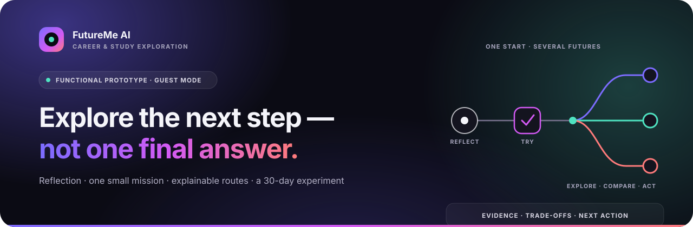
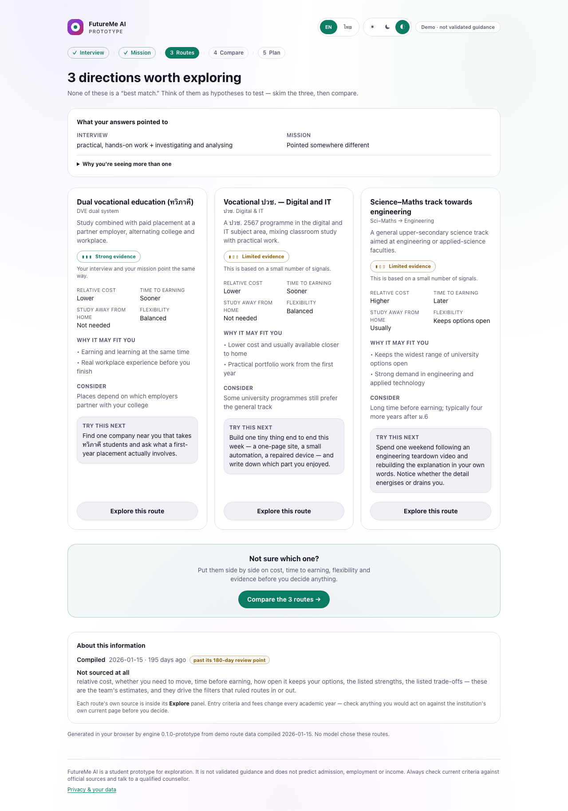

<p align="center">
  
</p>

<h1 align="center">FutureMe AI</h1>

<p align="center">
  <b>Career and study guidance for Thai students — built on a questionnaire, a real task, and reasoning you can inspect.</b>
  <br>
  <b>ระบบแนะแนวการเรียนและอาชีพสำหรับนักเรียนไทย — สร้างจากแบบสอบถาม ภารกิจที่ได้ลงมือทำจริง และเหตุผลที่ตรวจสอบได้</b>
</p>

<p align="center">
  <a href="https://github.com/winxtxrgit/futureme-ai/actions/workflows/ci.yml"></a>
  
  
  
  
</p>

---

<h2 align="center">Read the documentation</h2>

<table align="center" width="100%">
<tr>
<td align="center" width="50%">
<h3><a href="READMEEN.md">Read in English&nbsp;→</a></h3>
<sub>Overview · demo · current prototype · how it works<br>features · architecture · privacy · research · roadmap </sub>
</td>
<td align="center" width="50%">
<h3><a href="READMETH.md">อ่านภาษาไทย&nbsp;→</a></h3>
<sub>ภาพรวม · ทดลองใช้ · ต้นแบบปัจจุบัน · ระบบทำงานอย่างไร<br>ฟีเจอร์ · สถาปัตยกรรม · ความเป็นส่วนตัว · งานวิจัย ·แผนการพัฒนา</sub>
</td>
</tr>
</table>

---

<h2 align="center">Run it</h2>

```bash
git clone https://github.com/winxtxrgit/futureme-ai.git
cd futureme-ai
npm install
npm run dev     # http://localhost:3000 — no API key required
```

<p align="center">
<sub>Start as guest → interview → mission → routes → compare → 30-day plan<br>
เริ่มแบบ guest → สัมภาษณ์ → ภารกิจ → เส้นทาง → เปรียบเทียบ → แผน 30 วัน</sub>
</p>

<p align="center">
  <a href="READMEEN.md#current-prototype"></a>
</p>

<p align="center">
<sub>
The routes screen from the <b>running application</b> — equal visual weight, no winner, evidence and unknowns on every card.<br>
หน้าเส้นทางจาก<b>แอปที่รันจริง</b> — น้ำหนักภาพเท่ากัน ไม่มีผู้ชนะ ทุกการ์ดแสดงหลักฐานและสิ่งที่ยังไม่รู้
</sub>
</p>

---

<h2 align="center">Status</h2>

<p align="center">
<b>Runnable prototype.</b> The whole guest journey works end to end with no account and no API key.<br>
<sub>The recommendation output is for exploration and has not been clinically, educationally, or statistically validated.<br>
Route data is illustrative. No pilot with real students has run.</sub>
<br><br>
<b>ต้นแบบที่รันได้จริง</b> เส้นทางผู้ใช้แบบ guest ทำงานครบวงจร ไม่ต้องสมัครบัญชีและไม่ต้องใช้ API key<br>
<sub>ผลลัพธ์คำแนะนำมีไว้เพื่อสำรวจทางเลือก และยังไม่ผ่านการตรวจสอบทางคลินิก การศึกษา หรือสถิติ<br>
ข้อมูลเส้นทางเป็นข้อมูลตัวอย่าง และยังไม่เคยทดลองใช้กับนักเรียนจริง</sub>
</p>

<table align="center" width="100%">
<tr>
<td align="center" width="25%"><a href="READMEEN.md#current-prototype"><b>What works today</b></a><br><sub>Backed by code and tests<br>สิ่งที่ทำได้แล้ววันนี้</sub></td>
<td align="center" width="25%"><a href="docs/06-development-plan.md#component-status"><b>Implemented vs planned</b></a><br><sub>Every capability, classified<br>สร้างแล้วเทียบกับอยู่ในแผน</sub></td>
<td align="center" width="25%"><a href="docs/09-source-review.md"><b>Source review</b></a><br><sub>What the audit corrected<br>ผลการตรวจแหล่งอ้างอิง</sub></td>
<td align="center" width="25%"><a href="CONTRIBUTING.md"><b>Contributing</b></a><br><sub>Corrections welcome<br>ยินดีรับข้อแก้ไข</sub></td>
</tr>
</table>

---

<p align="center">
<sub>
Student project for <b>JUMP Thailand Hackathon 2026</b> (AIS Academy × NIA) · <i>AI for the Future of Thai Education</i><br>
โปรเจกต์นักเรียนสำหรับ <b>JUMP Thailand Hackathon 2026</b> (AIS Academy × NIA) · <i>AI เพื่ออนาคตการศึกษาไทย</i>
</sub>
</p>

<p align="center">
<sub>
FutureMe AI is decision-support, not prediction. It does not guarantee admission, employment or income.<br>
FutureMe AI เป็นเครื่องมือสนับสนุนการตัดสินใจ ไม่ใช่การพยากรณ์ ไม่รับประกันการสอบติด การได้งาน หรือรายได้
</sub>
</p>

<p align="center"><sub><b>MIT licensed</b> · <a href="READMEEN.md">English</a> · <a href="READMETH.md">ภาษาไทย</a></sub></p>
