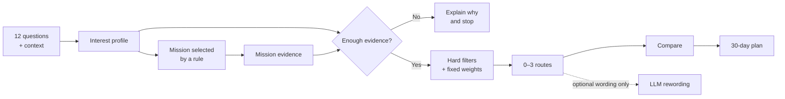

<a id="top"></a>

<p align="center">
  
</p>

# FutureMe AI

<p align="center">
  <strong>Career and study exploration for Thai students, built around reflection, a short scenario mission, and several routes they can question and compare.</strong>
</p>

<p align="center">
  <a href="https://github.com/winxtxrgit/futureme-ai/actions/workflows/ci.yml"></a>
</p>

<p align="center">
  <strong><a href="#try-the-prototype">Try the prototype →</a></strong>
  &nbsp;·&nbsp;
  <a href="#how-futureme-works">See how it works</a>
  &nbsp;·&nbsp;
  <a href="#documentation-and-local-setup">Read the docs</a>
  &nbsp;·&nbsp;
  <a href="READMETH.md">ภาษาไทย</a>
</p>

<p align="center">
  <sub>Functional prototype · English interface · guest mode · no API key required</sub>
</p>

<p align="center">
  <a href="#what-is-futureme-ai">What</a> ·
  <a href="#why-it-exists">Why</a> ·
  <a href="#try-the-prototype">Try it</a> ·
  <a href="#how-futureme-works">How</a> ·
  <a href="#why-futureme-is-different">Difference</a> ·
  <a href="#inside-the-prototype">Prototype</a> ·
  <a href="#trust-privacy-and-responsible-ai">Trust</a> ·
  <a href="#evidence-behind-the-idea">Evidence</a> ·
  <a href="#what-comes-next">Next</a> ·
  <a href="#documentation-and-local-setup">Docs</a>
</p>

---

## What is FutureMe AI?

FutureMe AI helps a student turn **“I do not know what to choose”** into **“Here is one useful
thing I can explore next.”**

It does not try to predict a perfect career. The student answers a short set of questions, attempts
one short scenario mission, then examines up to three study routes with the evidence,
trade-offs, and unanswered questions kept visible.

It is designed for:

- **Lower-secondary students** exploring the next study track
- **Upper-secondary students** comparing further-study directions
- **Vocational students** weighing continued study and work-linked routes

FutureMe is decision support, not a replacement for a qualified counsellor.

<sub><a href="#top">↑ Back to top</a></sub>

---

## Why it exists

Students are often asked to choose a direction before they have had a realistic way to test it.
A one-shot quiz can describe an interest, but it cannot show whether the student enjoyed acting on
that interest, what constraints matter, or what would make them change their mind.

FutureMe reframes the question:

> Not **“What should I become?”**<br>
> But **“What should I explore next, and what evidence would help?”**

That makes uncertainty useful. A route can appear with limited evidence, two routes can remain
tied, and the engine can return no route at all when the answers do not justify one.

<sub><a href="#top">↑ Back to top</a></sub>

---

## Try the prototype

The complete guest journey runs locally with Node.js 20+:

```bash
git clone https://github.com/winxtxrgit/futureme-ai.git
cd futureme-ai
npm ci
npm run dev
```

Open [http://localhost:3000](http://localhost:3000), choose **Start as guest**, then follow:

**Interview → Mission → Routes → Compare → 30-day plan**

No hosted deployment is currently published, so this repository does not invent a “Live Demo”
link. The local prototype is the submission evidence and requires no account or API key.

<p align="center">
  <a href="assets/screenshots/app/routes-desktop.png"></a>
</p>

<p align="center">
  <sub>Current application screen — several directions, equal visual weight, with deeper evidence opened only when requested.</sub>
</p>

<sub><a href="#top">↑ Back to top</a></sub>

---

## How FutureMe works

1. **Reflect** — capture initial interests, practical constraints, and questions through a fixed interview.
2. **Try** — complete one short mission chosen by a transparent rule; the student may choose a different mission.
3. **Explore** — surface zero to three possible directions instead of manufacturing one winner.
4. **Compare** — examine the same criteria, source quality, uncertainty, and trade-offs across routes.
5. **Act** — turn one direction into a small, reversible 30-day exploration plan.

### Current prototype architecture



The recommendation path is deterministic TypeScript in the browser. For optional rewording, the
browser sends a catalogue route id and fixed reason codes only after selection. The server validates
both, resolves their fixed wording, and never receives learner answers; the model cannot add,
remove, or reorder routes.

<details>
<summary><strong>How does the engine choose routes?</strong></summary>

<br>

The interview forms an exploratory RIASEC-shaped interest profile. Mission choices create a second
evidence vector. The engine first checks whether there is enough signal, applies hard constraints
for study tier, cost, and location, then scores eligible routes on interests, feasibility,
mission-derived strengths, learning style, and flexibility.

Near-equal totals are marked as tied. Fewer than eight interest answers, an almost-flat profile, or
insufficient evidence across every surviving route produces no recommendation.

The weights and thresholds are design judgement, not parameters fitted to student outcomes.
[Read the full decision logic →](docs/04-ai-system.md)

</details>

<sub><a href="#top">↑ Back to top</a></sub>

---

## Why FutureMe is different

FutureMe is a complement to counselling and existing interest tools. Its contribution is the
step between reflection and a consequential decision: **try something small, then inspect what
that action adds to the evidence.**

| A one-shot self-report flow | FutureMe prototype |
|---|---|
| Uses one self-report signal | Adds a short scenario mission as a second signal |
| Can produce one result to inspect | Produces alternatives to question and compare |
| Explanation depends on the tool | Always shows reasons, unknowns, provenance, and data age |
| Can stop at a result | Continues into a reversible 30-day experiment |

**Less prediction. More exploration.**<br>
**Less ranking. More alternatives.**<br>
**Less passive advice. More evidence from doing.**

<sub><a href="#top">↑ Back to top</a></sub>

---

## Inside the prototype

### What you can try today

- Start as a guest and recover progress after a refresh
- Complete the fixed English interview and choose or override a suggested mission
- See the engine refuse to guess when evidence is too thin
- Explore zero to three routes with reasons, unknowns, source status, and freshness
- Compare routes consistently and build a four-week exploration plan
- Delete the complete guest session from the browser

### What is intentionally next

- A validated interest instrument and mission rubric
- A Thai-native, adaptive interview
- Licensed, current programme and labour-market data
- More missions and an independent evaluation set
- Bias and accessibility audits before a student pilot
- Accounts and consented counsellor tools only after privacy review

<table>
<tr>
<td width="33%" valign="top">
<a href="assets/screenshots/app/mission-desktop.png"></a><br>
<strong>Try</strong><br><sub>A short task selected by an explainable rule.</sub>
</td>
<td width="33%" valign="top">
<a href="assets/screenshots/app/compare-desktop.png"></a><br>
<strong>Compare</strong><br><sub>The same criteria and caveats across every route.</sub>
</td>
<td width="33%" valign="top">
<a href="assets/screenshots/app/plan-desktop.png"></a><br>
<strong>Act</strong><br><sub>A four-week plan of small, reversible steps.</sub>
</td>
</tr>
</table>

All images above are captured from the current application. Concept work is kept separate and
clearly labelled in [User Experience](docs/03-user-experience.md).

<sub><a href="#top">↑ Back to top</a></sub>

---

## Trust, privacy, and responsible AI

**What the prototype does by default**

- Interview and mission answers are stored in this browser under `futureme.guest.v1`.
- The recommendation engine runs client-side; learner answers are not sent through the recommendation path.
- No account, analytics library, advertising tracker, sharing flow, or server-side answer store is implemented.
- The privacy screen can remove the complete guest session immediately.
- Route cards disclose source status, the catalogue date, and the fields that remain unsourced.

**The optional explanation layer**

The app checks whether `/api/explain` is configured. If the learner explicitly requests a
rewording and an operator has supplied an API key, the browser sends a catalogue route id and fixed
reason codes to the application server. The server validates them, then sends the catalogue route
name and server-owned reason wording to the model provider. Interview answers, mission answers,
free text, scores, and the guest id are not included.

Normal web hosting still processes ordinary request metadata such as an IP address; the privacy
claim is about learner answers, not about the internet ceasing to exist.

<details>
<summary><strong>Important limits of the current prototype</strong></summary>

<br>

- The twelve interest items are shaped around RIASEC but are **not** the O*NET Interest Profiler and have not been psychometrically validated.
- The three mission rubrics and fixed decision weights are team design judgement.
- The six-route catalogue is illustrative. Cost, relocation, time-to-earning, and flexibility are unsourced estimates even though they affect filtering and comparison.
- The interface is English, no real-student pilot or bias audit has run, and no effectiveness claim is supported.
- The safety pause is a small Thai/English keyword rule. It is not a risk assessment, can miss cases, and alerts nobody.
- The optional provider endpoint has no production rate limit or user authentication; do not expose it with a funded API key until deployment controls are added.

[Read the precise data flow →](docs/08-privacy-and-data.md)

</details>

<sub><a href="#top">↑ Back to top</a></sub>

---

## Evidence behind the idea

The README keeps only three findings because evidence should clarify the product, not bury it.

- **Study-to-work mismatch is substantial, but the public figure needs context.** TDRI reports that 56% of Thai workers it describes as highly educated work outside their field and around 27% work below their qualification level. The public article does not expose the denominator or method, so this repository treats the figures as context—not product-performance evidence. [TDRI, 2025](https://tdri.or.th/2025/09/thailand-human-capital-development/)
- **RIASEC is an established interest structure.** The official O*NET Interest Profiler is based on Holland's six RIASEC dimensions and has its own reliability and validity evidence. FutureMe borrows the structure, not that validation. [O*NET Interest Profiler Manual](https://www.onetcenter.org/reports/IP_Manual.html)
- **Working outside a field is not automatically failure.** OECD analysis finds that the strongest earnings concern appears when field mismatch is combined with qualification mismatch. That supports exploration and transferable skills, not a promise to find one permanent “correct match.” [OECD, 2015](https://www.oecd.org/en/publications/the-causes-and-consequences-of-field-of-study-mismatch_5jrxm4dhv9r2-en.html)

The complete source registry, withdrawn claims, dates, and interpretation notes live in
[Research and Evidence](docs/02-research-and-evidence.md) and
[Source Review](docs/09-source-review.md).

<sub><a href="#top">↑ Back to top</a></sub>

---

## What comes next

The next milestone is not “more AI.” It is earning the right to test the product with students:

1. Review the instrument and mission rubrics with qualified assessment professionals.
2. Interview Thai students, families, and counsellors across different school contexts.
3. Replace the illustrative route catalogue with licensed, time-bounded data.
4. Build an independent evaluation set, then run bias, safety, and accessibility audits.
5. Add Thai-native interaction and only then prepare a consented school pilot.

Planned retrieval, accounts, counsellor views, and cloud infrastructure remain design work until
the evidence and privacy foundations are ready. [See the full roadmap →](docs/07-roadmap.md)

<sub><a href="#top">↑ Back to top</a></sub>

---

## Documentation and local setup

### Explore deeper

- **Product:** [Project overview](docs/01-project-overview.md) · [User experience](docs/03-user-experience.md)
- **Decision system:** [AI and decision logic](docs/04-ai-system.md) · [System architecture](docs/05-system-architecture.md)
- **Trust:** [Privacy and data flow](docs/08-privacy-and-data.md) · [Research and evidence](docs/02-research-and-evidence.md) · [Source review](docs/09-source-review.md)
- **Delivery:** [Development plan](docs/06-development-plan.md) · [Roadmap](docs/07-roadmap.md) · [Contributing](CONTRIBUTING.md)

Found a product, code, or source problem? [Open an issue →](https://github.com/winxtxrgit/futureme-ai/issues)

### Run and verify

```bash
npm ci
npm run dev          # http://localhost:3000
npm run typecheck
npm run lint
npm test
npm run build
npm run test:e2e
```

The prototype works without environment variables. An optional explanation rewording can be
enabled with the variables documented in [`.env.example`](.env.example); it never enters the route
selection path.

Built for [JUMP THAILAND Hackathon 2026](https://www.jumpthailand.com/) under the theme
*AI for the Future of Thai Education*. MIT licensed.

---

<p align="center">
  <strong>FutureMe helps a student choose the next experiment—not a final identity.</strong>
  <br><br>
  <a href="#top">Back to top</a>
  &nbsp;·&nbsp;
  <a href="READMETH.md">อ่านภาษาไทย</a>
</p>
