<a id="top"></a>

<p align="center">
  
</p>

<p align="center">
  <b>Career and study guidance for Thai students — built on a conversation, a real task, and reasoning you can inspect.</b>
</p>

<p align="center">
  
  
  
  
  
</p>

<p align="center">
  <b>English</b>
  &nbsp;·&nbsp;
  <a href="READMETH.md">ภาษาไทย</a>
</p>

---

> ### Current status
>
> **Functional prototype with a runnable end-to-end demo flow.** The recommendation output is
> intended for exploration and has **not** been clinically, educationally, or statistically
> validated. The assessment is shortened and is not a validated RIASEC instrument. Route data is
> illustrative demo data, not verified against current official sources. No pilot with real
> students has been run.

```bash
git clone https://github.com/winxtxrgit/futureme-ai.git
cd futureme-ai
npm install
npm run dev            # http://localhost:3000 — no API key needed
```

Then: **Start as guest → interview → mission → routes → compare → 30-day plan.**

---

## What you can verify today

Every item below is backed by code in this repository, not by a mockup.

| You can | Where |
|---|---|
| Start a guest session with no account, and recover it after a refresh | `lib/session/` |
| Complete the shortened interview with progress, validation and editable answers | `app/interview/` |
| Submit one behavioural mission and edit it afterwards | `app/mission/` |
| Receive **one to three** explainable routes — or none, when evidence is thin | `lib/decision-engine/` |
| Read why each route appeared, its evidence, limitations and open questions | `app/routes/` |
| Compare every route on consistent criteria | `app/compare/` |
| Generate a 30-day plan with check-ins that survive a refresh | `lib/plan/`, `app/plan/` |
| See the engine refuse to answer rather than guess | `npm test` → *evidence gates* |
| Confirm the app works with **no LLM API key** | `app/api/explain/` |
| Delete all your data and verify it is gone | `app/privacy/` |
| Run 64 unit/integration tests and 9 browser tests | `npm test`, `npm run test:e2e` |

<sub><a href="#top">↑ Back to top</a></sub>

---

<table>
<tr>
<td align="center" width="33%"><a href="#what-you-can-verify-today"><b>Verify</b></a><br><sub>What actually works,<br>backed by code</sub></td>
<td align="center" width="33%"><a href="#research-foundation"><b>Research</b></a><br><sub>Seven categories, sources,<br>and the claims we cut</sub></td>
<td align="center" width="33%"><a href="#key-features"><b>Product</b></a><br><sub>Six capabilities<br>and their real status</sub></td>
</tr>
<tr>
<td align="center"><a href="#interface-preview"><b>Experience</b></a><br><sub>Aurora mockups<br>and the user journey</sub></td>
<td align="center"><a href="#the-ai-system"><b>AI System</b></a><br><sub>Rules decide,<br>the model explains</sub></td>
<td align="center"><a href="#system-architecture"><b>Architecture</b></a><br><sub>End-to-end flow,<br>stack, and privacy</sub></td>
</tr>
<tr>
<td align="center"><a href="#local-development"><b>Development</b></a><br><sub>Run it, test it,<br>read the engine</sub></td>
<td align="center"><a href="#documentation"><b>Documentation</b></a><br><sub>Seven detailed<br>project documents</sub></td>
<td align="center"><a href="#current-limitations"><b>Limitations</b></a><br><sub>What is not validated,<br>stated plainly</sub></td>
</tr>
</table>

---

## Overview

Thai students choose a study track years before anyone helps them understand what that track
leads to. The bill arrives after graduation: **56% of Thai higher-education graduates work
outside their field of study, and 27% work below their qualification level** (TDRI, 2025).

The tools meant to prevent this are static multiple-choice interest tests — including the one
inside the Ministry of Education's own NDLP platform. They ask a fifteen-year-old to *state* a
preference they have never had a chance to *test*.

FutureMe AI does something different. It runs a short Socratic conversation, gives the student a
real task to attempt, and returns **three routes instead of one answer** — each showing the
evidence behind it and what the system still doesn't know.

<table>
<tr>
<td width="25%" valign="top"><h4>Talk, don't tick</h4><sub>An adaptive interview using Socratic questioning, Motivational Interviewing, Laddering and STAR — so answers come from what a student has actually done, not what sounds acceptable.</sub></td>
<td width="25%" valign="top"><h4>Try, don't guess</h4><sub>A short scenario mission produces independent behavioural evidence. Saying you like design and solving a design problem are not the same claim.</sub></td>
<td width="25%" valign="top"><h4>Three routes, not one</h4><sub>Balanced, Interest Growth and Practical Access — compared side by side. A single ranked answer would imply confidence the system doesn't have.</sub></td>
<td width="25%" valign="top"><h4>Show the reasoning</h4><sub>Every route carries its evidence, what would change it, and an explicit list of unknowns. Deterministic scoring means the same input always gives the same result.</sub></td>
</tr>
</table>

**Who it serves**

| Tier | Grades | The decision it helps with |
|---|---|---|
| Primary | ป.4 – ป.6 | Early exposure to what jobs exist at all |
| Lower secondary | ม.1 – ม.3 | The ม.4 fork — general track, vocational, or dual education |
| Upper secondary | ม.4 – ม.6 | Faculty choice, TCAS strategy, TPAT prep, portfolio |
| Vocational | ปวช. – ปวส. | Continuing to ปวส./bachelor's, or entering work directly |

Parents and counsellors read derived summaries — **only with the student's consent, and never the
chat transcript**.

<sub><a href="#top">↑ Back to top</a></sub>

---

## How it works

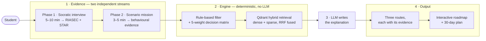

Two independent evidence streams feed one deterministic engine. The model never picks the
recommendation — it conducts the conversation and writes the explanation.

<details>
<summary><b>Why split it that way</b></summary>

<br>

A recommendation that changes between runs cannot be defended to a student, a parent, or a
counsellor. So scoring, filtering and route selection are ordinary code with fixed weights —
the same evidence always produces the same three routes, and every number traces to a line in
`app/decision_engine/`.

The LLM handles what it is genuinely better at: running an adaptive Thai-language interview,
pulling STAR structure out of free text, and writing an explanation a fifteen-year-old will read.

This split also cuts cost. A small Thai-capable model plus retrieval plus a LoRA adapter is
cheaper and faster than a large general model — and the domain knowledge lives in the retrieval
corpus, not in the weights.

</details>

<sub><a href="#top">↑ Back to top</a></sub>

---

## Key features

| Feature | What it does | Why it matters | Status |
|---|---|---|:--|
| **Socratic interview** | Adaptive dialogue that adjusts tone and vocabulary per education tier, extracting STAR-structured evidence and a RIASEC profile | Multiple-choice tests measure what a student thinks is an acceptable answer. Conversation reaches what's actually true. | 🟢 Engine done |
| **Scenario missions** | A short hands-on task in the direction the interview pointed | Independent behavioural evidence. When it contradicts the interview, the student is *shown* the conflict rather than having it hidden. | 🟡 In progress |
| **Three-route engine** | Balanced / Interest Growth / Practical Access, each with evidence, unknowns, and a reversible first step | Guidance that names one winner is overconfident. Three comparable options keep the decision with the student. | 🟢 Engine done |
| **Interactive roadmap** | A DAG of milestones from today to career entry, topologically sorted, with per-node check-ins | Prerequisites are genuinely partial — you can build a portfolio *while* preparing for TPAT. A checklist would force a false sequence. | 🟠 Planned |
| **Vocational parity** | All 12 ปวช. 2567 subject areas and the DVE dual-education track, modelled as first-class options | Vocational routes are usually treated as the fallback. Here they compete on equal terms. | 🟢 Modelled |
| **Consent-gated sharing** | Per-recipient, revocable consent; parents and counsellors see summaries, never transcripts | The users are minors. Privacy is an architectural constraint, not a policy page. | 🟠 Designed |

<sub>🟢 Working · 🟡 In progress · 🟠 Designed, not built — full breakdown in <a href="docs/06-development-plan.md">Development Plan</a></sub>

<sub><a href="#top">↑ Back to top</a></sub>

---

## Interface preview

### Implemented prototype screens

Captured from the running app with Playwright — these are not mockups.

<table>
<tr>
<td width="50%"><a href="assets/screenshots/app/landing-desktop.png">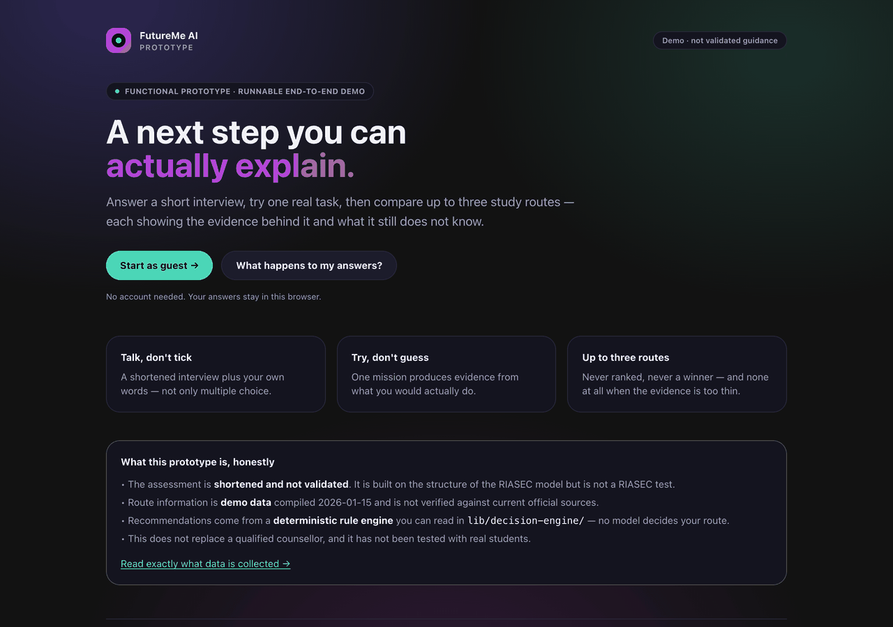</a><br><b>Landing</b> · <sub>implemented</sub><br><sub>Guest-first. No account required to complete the whole flow.</sub></td>
<td width="50%"><a href="assets/screenshots/app/interview-desktop.png">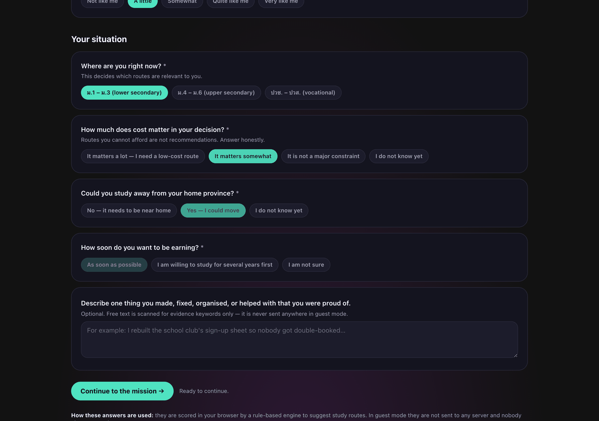</a><br><b>Interview</b> · <sub>implemented</sub><br><sub>Progress indicator, editable answers, validation, and a visible “shortened demo assessment” label.</sub></td>
</tr>
<tr>
<td width="50%"><a href="assets/screenshots/app/routes-desktop.png"></a><br><b>Three routes</b> · <sub>implemented</sub><br><sub>Equal visual weight, identical actions, no winner. Evidence strength shown by shape and word, not colour alone. Here the engine has detected that the interview and mission disagree.</sub></td>
<td width="50%"><a href="assets/screenshots/app/compare-desktop.png">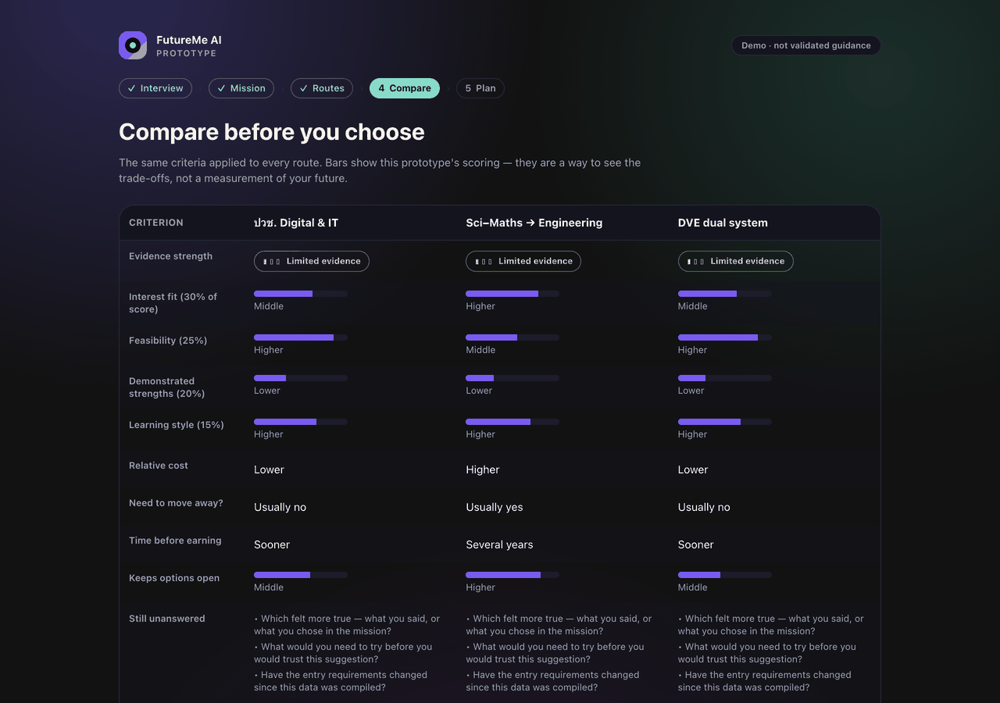</a><br><b>Comparison</b> · <sub>implemented</sub><br><sub>Consistent criteria across routes. Scores are shown as coarse bands — precise percentages would imply accuracy the engine does not have.</sub></td>
</tr>
<tr>
<td width="50%"><a href="assets/screenshots/app/plan-desktop.png">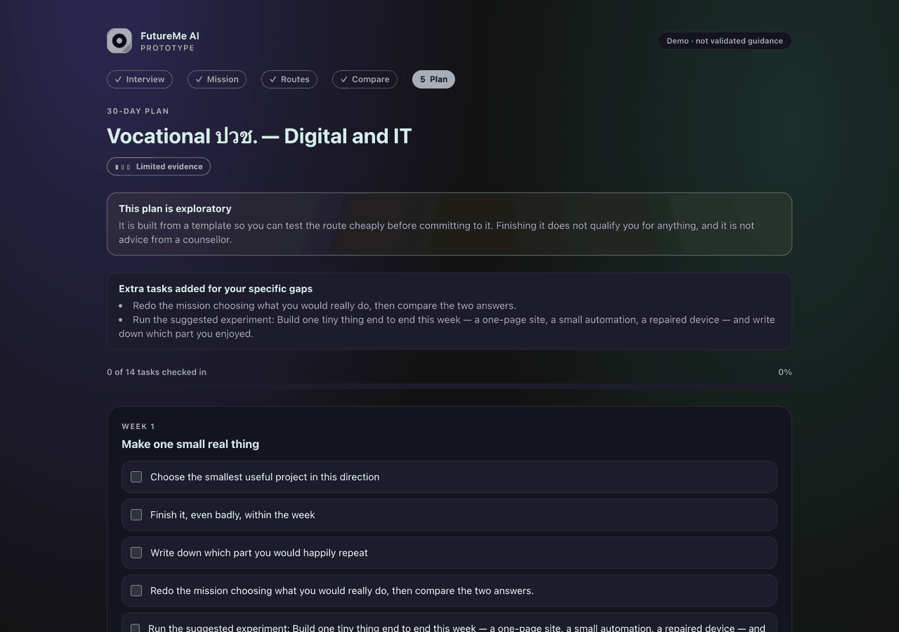</a><br><b>30-day plan</b> · <sub>implemented</sub><br><sub>Weekly objectives, check-ins that persist, and extra tasks injected for the specific gaps the engine found.</sub></td>
<td width="50%"><a href="assets/screenshots/app/insufficient-desktop.png">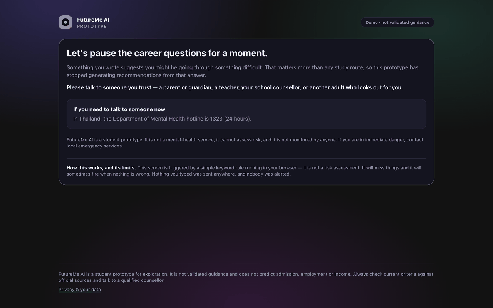</a><br><b>No-route state</b> · <sub>implemented</sub><br><sub>When evidence is too thin the engine returns nothing and says so, rather than padding the list to three.</sub></td>
</tr>
</table>

<details>
<summary><b>Mobile, safety and privacy screens</b></summary>

<br>

<table>
<tr>
<td width="33%"><a href="assets/screenshots/app/interview-mobile.png">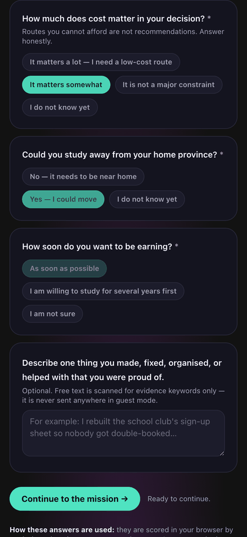</a><br><sub><b>Interview</b> · mobile</sub></td>
<td width="33%"><a href="assets/screenshots/app/routes-mobile.png">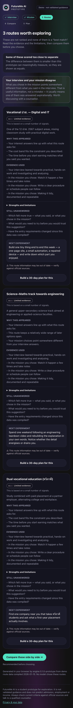</a><br><sub><b>Routes</b> · mobile, cards stack</sub></td>
<td width="33%"><a href="assets/screenshots/app/plan-mobile.png">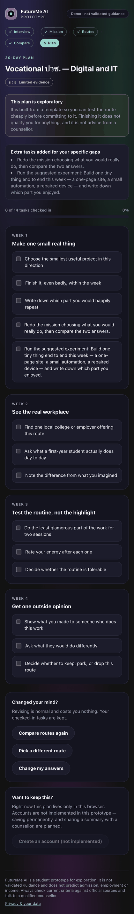</a><br><sub><b>30-day plan</b> · mobile</sub></td>
</tr>
<tr>
<td><a href="assets/screenshots/app/safety-desktop.png">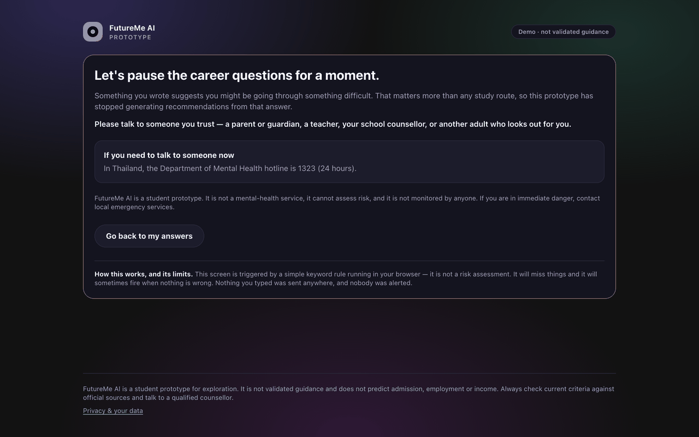</a><br><sub><b>Safeguarding pause</b> — recommendations stop; support offered</sub></td>
<td><a href="assets/screenshots/app/privacy-mobile.png">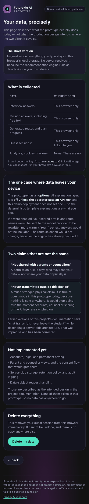</a><br><sub><b>Privacy</b> — what is collected, plus delete</sub></td>
<td><a href="assets/screenshots/app/compare-mobile.png">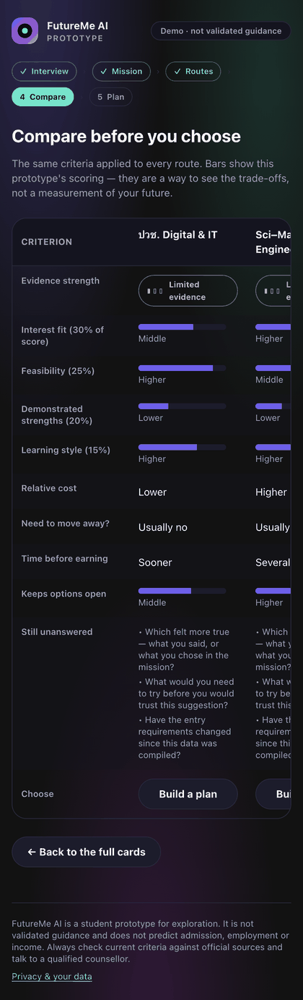</a><br><sub><b>Comparison</b> · mobile, scrolls horizontally</sub></td>
</tr>
</table>

</details>

<details>
<summary><b>Concept designs — not implemented</b></summary>

<br>

The **Aurora** design direction, chosen from eleven concepts. These are high-fidelity mockups of the
intended full product, in Thai. They include screens that do not exist in code.

<table>
<tr>
<td width="50%"><a href="assets/screenshots/01-landing-desktop.png">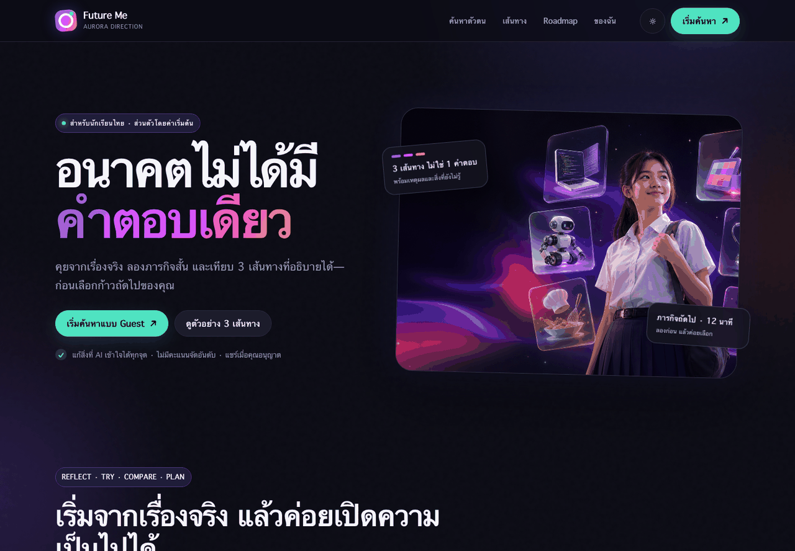</a><br><b>Landing</b> · <sub>concept design</sub></td>
<td width="50%"><a href="assets/screenshots/02-socratic-interview.png">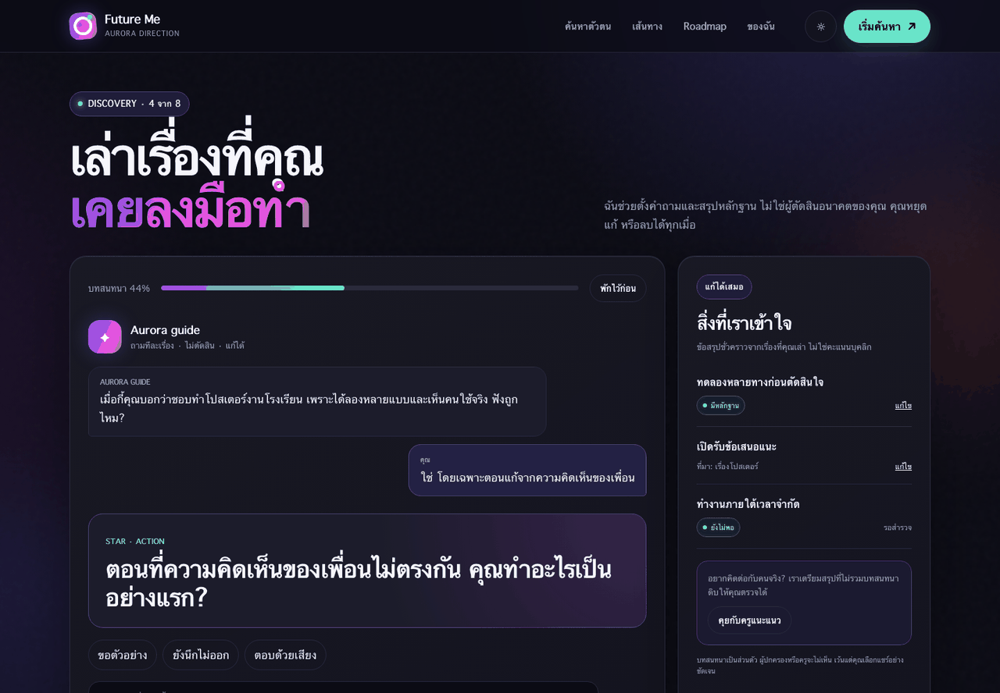</a><br><b>Socratic interview</b> · <sub>concept design</sub></td>
</tr>
<tr>
<td width="50%"><a href="assets/screenshots/03-three-routes.png">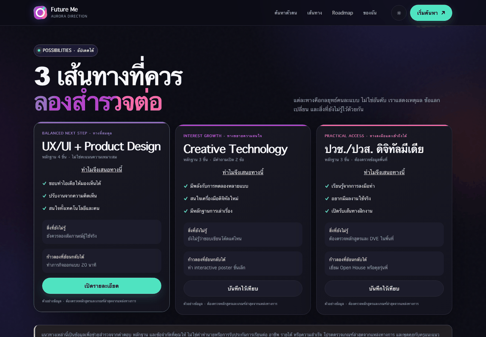</a><br><b>Three routes</b> · <sub>concept design</sub><br><sub>Note this mockup gives one card a filled button, implying a winner. The implemented screen fixes that.</sub></td>
<td width="50%"><a href="assets/screenshots/04-student-dashboard.png">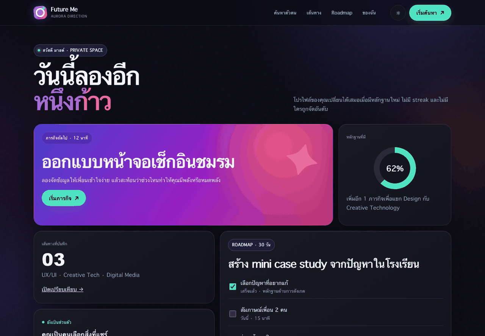</a><br><b>Student private dashboard</b> · <sub>concept design</sub><br><sub>The student's own space — <b>not</b> a counsellor view, which is neither designed nor built.</sub></td>
</tr>
</table>

→ Full design system in [03 · User Experience](docs/03-user-experience.md)

</details>

<sub><a href="#top">↑ Back to top</a></sub>

---

## The AI system

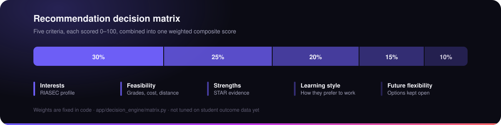

Five criteria, each scored 0–100, combined into one weighted composite. **Feasibility sits second
at 25%** — a recommendation a student cannot afford, reach, or academically qualify for is not a
recommendation.

<details>
<summary><b>The full pipeline</b></summary>

<br>

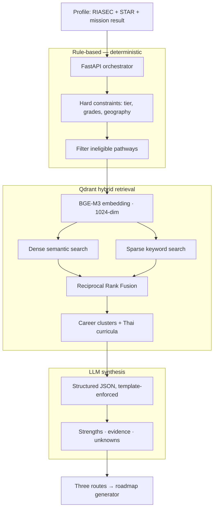

**Why hybrid retrieval.** Thai guidance queries mix semantic intent with exact terms — faculty
names, TPAT codes, TPQI qualification IDs. Pure vector search retrieves those poorly, so dense
and sparse results are fused with Reciprocal Rank Fusion.

**Why the LLM must state unknowns.** Every generated route carries a required "what we're still
unsure about" field. A recommendation engine that never expresses uncertainty is either lying or
overfitted — and for a decision this consequential, it needs to say what it doesn't know.

</details>

<details>
<summary><b>What isn't working yet — read this before believing a demo</b></summary>

<br>

| Gap | Consequence |
|---|---|
| **QLoRA dataset is unusable** — train and test files are byte-identical, ten examples each | No fine-tune has been evaluated. No evaluation metric exists and none should be claimed. |
| **No independent evaluation set** | Recommendation quality cannot be measured, so "accuracy" cannot be stated in any form. |
| **RIASEC instrument unvalidated** | 30 items written from the Holland framework, never psychometrically reviewed by qualified experts. |
| **Mission rubrics unvalidated** | Same standard. |
| **Embedding fallback active** where BGE-M3 weights are absent | A deterministic hash stands in for real embeddings. Development convenience only; results under it are not meaningful. |
| **No bias audit** across gender, region, school size, socioeconomic status | Unknown whether the engine systematically steers particular students. |
| **No student pilot** | Every effectiveness statement in this repository is a design goal, not a measured result. |

Each is tracked in [07 · Roadmap](docs/07-roadmap.md).

</details>

→ Full detail in [04 · AI System](docs/04-ai-system.md)

<sub><a href="#top">↑ Back to top</a></sub>

---

## System architecture

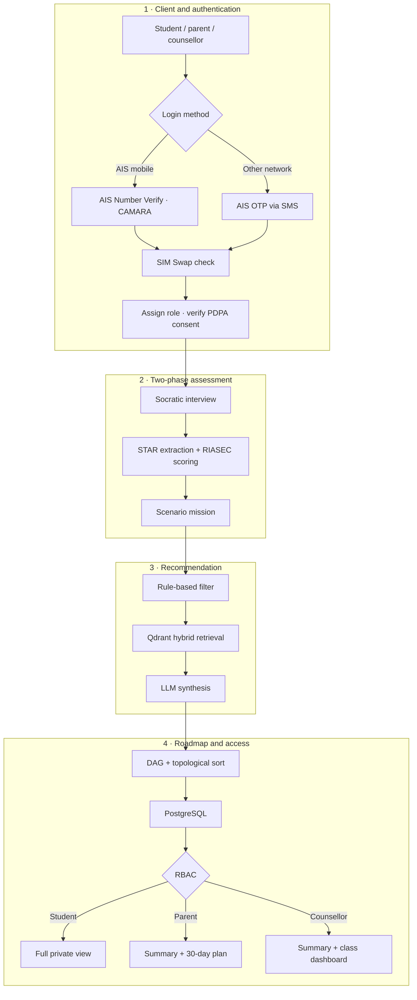

<details>
<summary><b>Privacy architecture — what the cloud does and doesn't give you</b></summary>

<br>

The users are minors, so privacy is an architectural constraint rather than a policy page.

- **Chat transcripts are never shared with parents or counsellors.** They see derived summaries only, with no override. Note this is a *permission* guarantee about who may read the data — it is **not** the stronger claim that the data never leaves the device. In the implemented prototype's guest mode the stronger claim also holds, because nothing is transmitted at all. See [08 · Privacy](docs/08-privacy-and-data.md).
- **Consent is per-recipient**, visible in the interface, and revocable.
- **Parent access requires a verified relationship**; counsellor access requires the student on that counsellor's roster.
- **Guest mode** allows a complete session with no account and no persistent identity.
- Data minimisation, retention limits, and an audit trail on every access to a student record.

**The distinction that matters.** AIS Cloud provides in-country data residency and ISO 27001 /
27018 certification — that covers where data lives and how the facility is run. It does **not**
deliver PDPA compliance by itself. Consent management, access control, minimisation, retention
and processor governance are application-layer responsibilities. Conflating the two is the most
common way a project like this gets compliance wrong.

</details>

<details>
<summary><b>Deployment target and Ministry integration</b></summary>

<br>

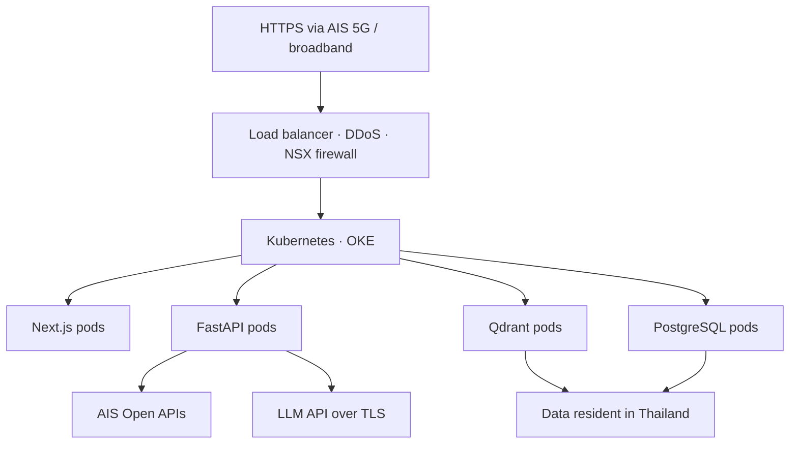

Load is bursty and predictable — a counsellor runs a session with a whole class at once — which
suits container auto-scaling better than fixed provisioning.

> **Status.** Designed from published AIS Cloud specifications. **Nothing is deployed there yet**,
> and no capacity or latency figures have been measured.

**Ministry ecosystem.** NDLP's guidance component is a static RIASEC test — precisely the gap this
product fills — and DEEP provides national SSO. That makes the fit compelling. It does **not**
make it agreed: integration depends on official API documentation, technical access, and a formal
partnership, none of which exist. It is a roadmap item and nothing more.

</details>

→ Full detail in [05 · System Architecture](docs/05-system-architecture.md)

<sub><a href="#top">↑ Back to top</a></sub>

---

## Technology stack

| Layer | Choice | Reason |
|---|---|---|
| Frontend | Next.js | SSR for first-load speed on mobile networks |
| Backend | FastAPI · Python | Pydantic validation end to end; same language as the ML tooling |
| Vector DB | Qdrant | Native hybrid dense + sparse search in one query |
| Relational DB | PostgreSQL | Profiles, roadmaps, consent records, audit trail |
| Embeddings | BAAI/BGE-M3 · 1024-dim | Multilingual, strong on Thai |
| LLM | Thai-capable API (Claude / Typhoon class) | Conversation and explanation only — never selection |
| Fine-tuning | QLoRA adapter | Low-cost Thai tone adaptation *(dataset not yet usable)* |
| Orchestration | Docker → Kubernetes (OKE) | Auto-scaling for classroom bursts |
| Cloud | AIS Cloud powered by OCI | Thai data residency *(target, not deployed)* |
| Identity | AIS Open APIs — Number Verify, OTP, SIM Swap | Passwordless, age-appropriate, takeover-resistant |

<sub><a href="#top">↑ Back to top</a></sub>

---

## Research foundation

Seven research categories were assembled before any design work began.

<table>
<tr>
<td width="50%" valign="top">

**01 · Mismatch statistics**
<sub>TDRI 2025: 56% work outside their field, 27% below qualification <i>(reported, not re-traced to a citable page)</i>. OECD: field mismatch alone carries little or no wage penalty — the ~25% penalty attaches to mismatch <b>combined with</b> overqualification. WEF 2025: 39% of skill sets change by 2030.</sub>

**02 · Thai curricula**
<sub>5 ม.4 learning tracks · 12 ปวช. 2567 vocational areas · TCAS structure. The gap isn't a shortage of options — it's that nobody explains which leads where.</sub>

**03 · Career and skill mapping**
<sub>Five clusters mapped from study track → faculty → the hard and soft skills employers actually ask for. Sources: TPQI, O*NET, ESCO.</sub>

**04 · Interview methodology**
<sub>Socratic questioning, Motivational Interviewing, RIASEC, Laddering, STAR — five techniques combined to get past socially acceptable answers.</sub>

</td>
<td width="50%" valign="top">

**05 · Ministry platforms**
<sub>NDLP and DEEP mapped. NDLP's guidance layer is a static RIASEC test with no dialogue or follow-through.</sub>

**06 · Cloud infrastructure**
<sub>AIS Cloud residency, OKE containers, CAMARA Open APIs — with the PDPA caveat stated explicitly.</sub>

**07 · System blueprints**
<sub>Master operations flowchart plus six sub-system flowcharts, from authentication through to deployment.</sub>

<br>

**What we removed**
<sub>Four unsupported figures were audited out and must not reappear: a “52% mismatch” claim, “65% of employers require experience” as a blanket statement, “85% work a second job”, and a misquoted WEF figure of 44% — the real number is 39%.</sub>

</td>
</tr>
</table>

→ Full evidence base and source index in [02 · Research and Evidence](docs/02-research-and-evidence.md)

<sub><a href="#top">↑ Back to top</a></sub>

---

## Project status

Four milestones are complete: the data and claim audit, the multi-tier decision engine, the
schemas and RAG pipeline, and the verification suite.

| Component | Status | Est. | Remaining |
|---|---|--:|---|
| Research base — 7 categories | 🟢 Completed | 100% | — |
| Decision engine — RIASEC, STAR, matrix, routing | 🟢 Completed | 100% | Calibration against real outcomes |
| Schemas and API contracts | 🟢 Completed | 100% | — |
| Design system and Aurora mockups | 🟢 Completed | 100% | Remaining screens |
| **Runnable vertical slice** — guest → interview → mission → routes → compare → plan | 🟢 Implemented | 100% | — |
| **Deterministic engine in TypeScript** with 0–3 route handling | 🟢 Implemented | 100% | Weights still unfitted to outcomes |
| **Guest session + refresh recovery** | 🟢 Implemented | 100% | — |
| **Test suite** — 64 unit/integration, 9 end-to-end | 🟢 Implemented | 100% | — |
| **Prototype safeguarding rule** | 🟢 Implemented | 100% | Keyword-level only; not validated |
| Accounts, sharing, server persistence | 🟠 Planned | 0% | Not started — guest mode only |
| RAG pipeline — Qdrant + BGE-M3 | 🟠 Planned | ~10% | Prototype uses a seeded JSON catalogue |
| Interactive DAG roadmap UI | 🟠 Planned | ~20% | Plan is a linear 4-week template today |
| AIS Open API integration | 🟠 Planned | ~15% | Needs developer credentials |
| Counsellor dashboard | 🟠 Planned | ~15% | Designed, not implemented |
| QLoRA fine-tuning | 🔴 Blocked | ~10% | Dataset unusable |
| Instrument validation | 🔴 Not started | 0% | Needs qualified assessment experts |
| School pilot | 🔴 Not started | 0% | Needs everything above |

> **Percentages are team estimates of scope completed, not measured coverage.** They indicate
> relative maturity and should be read as approximate.

<sub><a href="#top">↑ Back to top</a></sub>

---

## Roadmap

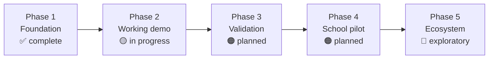

| Phase | Focus | Gate to the next phase |
|---|---|---|
| **1 · Foundation** | Research, decision engine, schemas, design system | ✅ Passed |
| **2 · Working demo** | One complete path: interview → mission → three routes → roadmap → consented summary | A student completes it without a developer touching anything |
| **3 · Validation** | Fix the QLoRA dataset · validate instruments · build an evaluation set · bias audit · safety escalation | Independent review of the instruments |
| **4 · School pilot** | Partner schools, consent process, counsellor training, outcome measurement | Evidence students made decisions they can still defend |
| **5 · Ecosystem** | DEEP SSO, NDLP content, production AIS APIs | Signed partnerships |

<details>
<summary><b>What would make us stop</b></summary>

<br>

Recorded deliberately. The project should not proceed to a pilot if:

- Instrument validation shows the RIASEC implementation doesn't measure what it claims to
- A bias audit finds the engine systematically steers students by gender, region or school size
- Counsellors report the output displaces rather than supports their judgement
- Consent and privacy handling can't satisfy PDPA requirements for minors

Building a guidance tool that quietly narrows a child's options would be worse than building nothing.

</details>

→ Full roadmap in [07 · Roadmap](docs/07-roadmap.md)

<sub><a href="#top">↑ Back to top</a></sub>

---

## Documentation

| Document | Covers |
|---|---|
| [01 · Project Overview](docs/01-project-overview.md) | Problem, approach, target users, honest scope |
| [02 · Research and Evidence](docs/02-research-and-evidence.md) | Seven research categories, sources, and the claims we removed |
| [03 · User Experience](docs/03-user-experience.md) | Concept comparison, Aurora design system, journey, roles, accessibility |
| [04 · AI System](docs/04-ai-system.md) | Two-phase assessment, decision matrix, retrieval, generation, known gaps |
| [05 · System Architecture](docs/05-system-architecture.md) | End-to-end flow, stack, DAG roadmap, privacy, deployment, API surface |
| [06 · Development Plan](docs/06-development-plan.md) | Milestones, component status, blockers, next steps, team |
| [07 · Roadmap](docs/07-roadmap.md) | Five phases, validation requirements, stop conditions |
| [08 · Privacy and Data Flow](docs/08-privacy-and-data.md) | What is collected, where it goes, what changed, and what is not built |

<sub><a href="#top">↑ Back to top</a></sub>

---

## Local development

Everything below has been run in this repository. The basic demo needs **no environment variables
and no API key**.

```bash
git clone https://github.com/winxtxrgit/futureme-ai.git
cd futureme-ai
npm install
npm run dev
```

Open <http://localhost:3000> and click **Start as guest**.

| Command | What it does | Verified result |
|---|---|---|
| `npm install` | Installs dependencies (npm, lockfile committed) | ✅ |
| `npm run dev` | Dev server on :3000 | ✅ |
| `npm run build` | Production build | ✅ 9 routes compiled |
| `npm run start` | Serves the production build | ✅ |
| `npm run typecheck` | `tsc --noEmit`, strict mode | ✅ 0 errors |
| `npm run lint` | ESLint via `next lint` | ✅ 0 warnings |
| `npm test` | Vitest unit + integration | ✅ 64 passed |
| `npm run test:e2e:install` | One-off: download the browser Playwright drives | — |
| `npm run test:e2e` | Playwright end-to-end against the production build | ✅ 9 passed |

If the Playwright browser download is blocked in your environment, drive a locally installed Chrome
instead — same tests:

```bash
PW_CHANNEL=chrome npm run test:e2e
```

<details>
<summary><b>Optional: the AI explanation layer</b></summary>

<br>

The app is fully functional without this. It only rewords explanations more warmly; it never
changes which routes were selected.

```bash
cp .env.example .env.local
# then set ANTHROPIC_API_KEY in .env.local
```

With no key, `/api/explain` returns `{ "source": "fallback" }` and the deterministic template text is
used. The same happens on a timeout, a provider error, or a malformed response — it always returns
HTTP 200 so the app cannot break. Both paths are covered by end-to-end tests.

</details>

<details>
<summary><b>How the recommendation engine works</b></summary>

<br>

Deterministic TypeScript in `lib/decision-engine/`, executed in the browser. The same answers always
produce the same routes, and every number traces to a line of code.

```text
lib/decision-engine/
├── types.ts          Dimensions, reason codes, result shapes
├── scoring.ts        Likert → RIASEC, mission evidence, the five WEIGHTS
├── eligibility.ts    Hard constraints: tier, cost, location, staleness
├── explanations.ts   Deterministic reason text and evidence labels
└── index.ts          recommend() — gates, scoring, tie marking
```

**The pipeline**

1. **Normalise** — Likert 1–5 → 0..1 per RIASEC dimension. Unanswered items are *excluded*, not scored as zero.
2. **Mission evidence** — option→dimension maps plus keyword spotting, normalised into a second, independent vector.
3. **Gate 1** — fewer than 8 interview items answered → return no routes.
4. **Gate 2** — profile too flat to distinguish anything → return no routes.
5. **Eligibility** — hard filters produce blocking reason codes. "I don't know" never blocks; it raises a notice.
6. **Score** — five weighted criteria: interests 30%, feasibility 25%, strengths 20%, learning style 15%, flexibility 10%.
7. **Evidence strength** — Strong / Moderate / Limited / More exploration needed, based on *how much is known*, not how high the score is. Never "strong" without a completed mission.
8. **Gate 3** — every surviving route has insufficient evidence → return no routes.
9. **Ties** — totals within 4 points are marked tied and presented as equals.

**Design decisions worth knowing**

- Returns **0 to 3** routes. Never padded to three.
- Feasibility is weighted second because a route you cannot afford or reach is not a recommendation.
- Interview/mission contradictions are surfaced to the learner, not averaged away.
- Weights are design judgement, **not** fitted to outcome data — no outcome data exists.

</details>

<details>
<summary><b>Repository structure</b></summary>

<br>

```text
futureme-ai/
├── README.md                        language selection page
├── READMEEN.md                      English — this document
├── READMETH.md                      ภาษาไทย
├── package.json · package-lock.json
├── .env.example                     all values optional
├── app/                             Next.js App Router
│   ├── page.tsx                     landing
│   ├── interview/ mission/ routes/ compare/ plan/ privacy/
│   └── api/explain/                 optional LLM layer
├── components/                      Shell, Button, Card, EvidenceBadge, SafetyPause
├── lib/
│   ├── decision-engine/             the recommendation rules
│   ├── plan/                        30-day plan builder
│   ├── safety/                      prototype safeguarding rule
│   └── session/                     guest session + validation
├── data/                            questions · missions · routes (seed data)
├── tests/                           unit + integration (vitest)
├── e2e/                             end-to-end (playwright)
├── assets/
│   ├── banner/ diagrams/
│   └── screenshots/
│       ├── app/                     captured from the running app
│       └── *.png                    Aurora concept mockups
├── docs/                            01–08
└── source-materials/
```

</details>

<sub><a href="#top">↑ Back to top</a></sub>

---

## Current limitations

Stated plainly, because a working demo can hide all of this.

| Limitation | Detail |
|---|---|
| **The assessment is not psychometrically validated** | 12 items built on the structure of Holland's RIASEC model. It is labelled "Demo assessment — shortened for prototype evaluation" in the app. It is not a RIASEC test. |
| **Route data is illustrative** | Six demo routes. Entry requirements, costs and institution names are **not** verified against current official sources. The app shows the compile date and warns when it goes stale. |
| **Route data goes out of date** | TCAS criteria and curricula change annually. There is no refresh process. |
| **The engine uses prototype rules** | The five weights are design judgement, not fitted to student outcomes. No outcome data exists. |
| **No pilot has run** | Every statement about effectiveness is a design goal, not a measured result. |
| **Not a replacement for a counsellor** | It is decision-support for exploration. It does not predict admission, employment or income. |
| **Safeguarding is minimal** | A keyword rule in the browser. Not a risk assessment. It will miss cases and produce false positives. Nobody is alerted. |
| **The LLM layer may be unavailable** | By design it is off unless a key is set, and every failure path falls back to deterministic text. |
| **No accounts, sharing, or server storage** | Guest mode only. Parent and counsellor views are designed, not built. |
| **Some research claims are not fully traced** | The Thai TDRI figures the pitch leans on lack recorded page numbers and URLs. See the [reference table](docs/02-research-and-evidence.md#reference-table). |
| **No bias audit** | Unknown whether the engine systematically steers students by gender, region or school size. |

<sub><a href="#top">↑ Back to top</a></sub>

---

## Team and contact

Student hackathon project for **JUMP Thailand Hackathon 2026** (AIS Academy × NIA), theme
*AI for the Future of Thai Education*. Roles are functional rather than formal — the same people
cover several.

| Function | Responsibility |
|---|---|
| Research and data | Seven-category research base, claim auditing, source verification |
| Product and UX | Concept exploration, Aurora design system, user journey, accessibility |
| AI and backend | Decision engine, RAG pipeline, FastAPI services, schemas |
| Infrastructure | Cloud architecture, container deployment, PDPA and security design |
| Verification | Programmatic audit of claims, contracts and content |

Questions, corrections and collaboration are welcome — please
[open an issue](https://github.com/winxtxrgit/futureme-ai/issues) or see
[CONTRIBUTING.md](CONTRIBUTING.md).

**Corrections to the research base are especially welcome.** Four unsupported statistics were
already removed from this project; if you find a fifth, we want to know.

---

<p align="center">
<sub>
FutureMe AI is decision-support, not prediction. It does not guarantee admission, employment or income.<br>
Always verify current criteria against official sources and talk to a qualified counsellor.
</sub>
</p>

<p align="center">
  <b>English</b>
  &nbsp;·&nbsp;
  <a href="READMETH.md">ภาษาไทย</a>
</p>

<p align="center"><sub><b>MIT licensed</b> · <a href="#top">↑ Back to top</a></sub></p>
