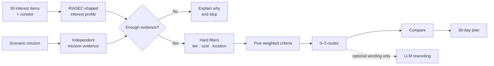

<a id="top"></a>

<p align="center">
  
</p>

# FutureMe AI

<p align="center">
  <strong>Career and study exploration for Thai students.</strong><br>
  Reflect on interests, test one small mission, compare several routes, and plan a reversible next step.
</p>

<p align="center">
  <a href="https://github.com/winxtxrgit/futureme-ai/actions/workflows/ci.yml"></a>
  
  <a href="LICENSE"></a>
</p>

<p align="center">
  <a href="#what">What</a>
  &nbsp;·&nbsp;
  <a href="#why">Why</a>
  &nbsp;·&nbsp;
  <a href="#product-journey">Product journey</a>
  &nbsp;·&nbsp;
  <a href="#what-is-implemented">Current status</a>
  &nbsp;·&nbsp;
  <a href="#decision">Decision + AI</a>
  &nbsp;·&nbsp;
  <a href="#difference">Difference</a>
  &nbsp;·&nbsp;
  <a href="#privacy">Privacy</a>
  &nbsp;·&nbsp;
  <a href="#research-integrity">Research integrity</a>
  &nbsp;·&nbsp;
  <a href="#roadmap">Roadmap</a>
  &nbsp;·&nbsp;
  <strong><a href="#run-the-prototype">Run</a></strong>
  &nbsp;·&nbsp;
  <a href="READMETH.md">ภาษาไทย</a>
</p>

<p align="center">
  <sub>Runnable guest prototype · complete Thai/English interface · light, dark, and system themes · no API key required</sub>
</p>

---

<a id="what"></a>

## What FutureMe is

FutureMe helps a student move from **“I do not know what to choose”** to
**“I know what I can explore next.”**

It is designed for Thai lower-secondary, upper-secondary, and vocational students who are
considering a study direction or a work-linked route. The product does not predict one perfect
career. It combines structured reflection with a small action, then keeps alternatives, evidence,
trade-offs, and uncertainty visible.

| | |
|---|---|
| **Problem** | Students often face consequential choices before they can experience what a route is actually like. |
| **Product response** | Reflect → try a mission → explore 0–3 routes → compare → run a 30-day experiment. |
| **Core principle** | Evidence before confidence; alternatives before a winner. |
| **Product boundary** | Decision support—not an admission predictor, psychological diagnosis, or replacement for a qualified counsellor. |

> FutureMe does not ask **“What should you become?”**<br>
> It asks **“What should you explore next, and what evidence would help?”**

---

<a id="why"></a>

## Why the problem matters

Education and work choices are moving targets. Programme requirements change, students may have
limited access to repeated counselling, and a broad career list does not explain how an individual
learner can test an option.

The research materials support three careful conclusions:

- **Study-to-work mismatch is substantial, but the public figures require context.** TDRI reports
  that 56% of workers it describes broadly as highly educated work outside their field and around
  27% work below their skill or qualification level. Its public page does not expose the
  denominator or method, so this project uses those figures as problem context—not product
  performance evidence. [TDRI, 2025](https://tdri.or.th/2025/09/thailand-human-capital-development/)
- **Skill needs keep changing.** The World Economic Forum reports that 39% of workers' core skills
  are expected to change by 2030 and that 63% of employers identify skill gaps as a barrier.
  [Future of Jobs 2025](https://www.weforum.org/publications/the-future-of-jobs-report-2025/in-full/3-skills-outlook/)
- **Mismatch is not automatically failure.** OECD analysis finds the clearest negative earnings
  effect when field mismatch occurs together with qualification mismatch. FutureMe therefore
  supports exploration and transferable options rather than promising a permanent “correct
  match.” [OECD, 2015](https://www.oecd.org/en/publications/the-causes-and-consequences-of-field-of-study-mismatch_5jrxm4dhv9r2-en.html)

No primary interviews or usability study with Thai students have been completed yet. The
statistical evidence above motivates the problem; it does not prove that FutureMe solves it.

---

<a id="product-journey"></a>

## Product journey

| Step | Learner experience | Evidence produced |
|---|---|---|
| **1 · Reflect** | Answer 30 interest items and 5 context prompts, one at a time, then review the responses. | A provisional RIASEC-shaped interest profile and practical constraints |
| **2 · Try** | Complete one of 3 scenario missions; keep or replace the suggested mission. | A separate mission vector that can support or contradict self-report |
| **3 · Explore** | Inspect 0–3 route hypotheses with reasons, unknowns, provenance, and freshness. | Comparable, inspectable route evidence |
| **4 · Compare** | Review routes against the same five criteria without a manufactured winner. | Trade-offs and missing information |
| **5 · Act** | Turn one route into a 30-day plan of small, reversible tasks. | New evidence from action |

<p align="center">
  <a href="assets/screenshots/app/routes-desktop.png"></a>
</p>

<p align="center">
  <sub>Current application screen—not a concept mock-up.</sub>
</p>

<table>
<tr>
<td width="33%" valign="top">
<a href="assets/screenshots/app/mission-desktop.png"></a><br>
<strong>Try</strong><br><sub>A short scenario mission chosen by an explainable rule.</sub>
</td>
<td width="33%" valign="top">
<a href="assets/screenshots/app/compare-desktop.png"></a><br>
<strong>Compare</strong><br><sub>The same criteria, limitations, and evidence across routes.</sub>
</td>
<td width="33%" valign="top">
<a href="assets/screenshots/app/plan-desktop.png"></a><br>
<strong>Act</strong><br><sub>A 30-day experiment whose progress stays in the browser.</sub>
</td>
</tr>
</table>

---

<a id="what-is-implemented"></a>

## What is implemented

| Area | Current prototype |
|---|---|
| **Interface** | Thai and English across the complete flow; light, dark, and system themes; responsive desktop/mobile layouts |
| **Session** | Guest-only journey, refresh recovery, input validation, and immediate local deletion |
| **Assessment** | 30 interleaved activity-interest items, 5 per RIASEC dimension, using a 5-point like/dislike scale |
| **Context** | 4 required prompts for education tier, cost, mobility, and time horizon, plus 1 optional free-text prompt |
| **Missions** | 3 four-step scenario missions; deterministic scoring and transparent selection; learner override |
| **Catalogue** | 6 illustrative study/work routes with field-level source warnings and a catalogue freshness date |
| **Recommendations** | 0–3 routes, refusal gates, hard constraints, ties, contradiction signals, provenance, and unknowns |
| **Comparison and plan** | Consistent route comparison and a deterministic 30-day plan with gap-specific tasks |
| **Optional AI** | Provider-backed explanation rewording only; disabled by default and outside route selection |
| **Pilot tooling** | Response-process capture, anonymous participant export, simulation, and analysis scripts |

The application can be used end to end without an account, database, environment variable, or
model provider.

---

<a id="decision"></a>

## Decision system and AI boundary



Everything that affects eligibility, scoring, route order, ties, and refusal is deterministic
TypeScript running in the browser.

| Criterion | Weight | Signal |
|---|---:|---|
| Interests | 30% | Shape similarity between the learner's RIASEC profile and route profile |
| Feasibility | 25% | Cost, location, and timing context |
| Strengths | 20% | Evidence from the completed mission |
| Learning style | 15% | Profile affinity with the route's learning environment |
| Flexibility | 10% | Illustrative route flexibility value |

These weights are **design judgement**, not values fitted to student outcomes.

<details>
<summary><strong>When does the engine refuse or avoid ranking?</strong></summary>

<br>

- It needs at least **23 of 30** interest answers.
- A profile with a spread below **0.15** is treated as too flat to support a route.
- Hard constraints for education tier, high cost, and required relocation run before scoring.
- If every surviving route still has insufficient evidence, it returns no route.
- Route totals within **4 points** are shown as tied rather than given a false rank.

These are product thresholds and calibration choices, not psychometric findings.

</details>

### Where AI adds value

The optional `/api/explain` endpoint can rewrite an explanation in warmer language after the
deterministic result exists. The browser sends only a route id and fixed reason codes. The server
validates both and resolves its own wording before contacting the provider.

The model never receives learner answers, free text, scores, or the route list. It cannot add,
remove, select, or reorder a route. If the provider fails, the deterministic explanation remains.

---

<a id="difference"></a>

## Why this is different

| One-shot career test | FutureMe evidence loop |
|---|---|
| Self-report is the main signal | Self-report and a separate scenario mission may agree or disagree |
| Often ends with a type or list | Continues into comparison and a reversible experiment |
| Confidence may be unclear | Reasons, evidence strength, unknowns, and source age remain visible |
| A result can feel final | Routes are hypotheses; the learner may revise answers, change the mission, or stop |

The goal is not more prediction. It is a better exploration process.

---

<a id="privacy"></a>

## Privacy and responsible AI

**Default behavior**

- Learner answers are stored under `futureme.guest.v1` in this browser's `localStorage`.
- The recommendation engine runs client-side and makes no network call.
- No account, analytics library, advertising tracker, sharing flow, or server-side answer store is implemented.
- The privacy screen can delete the complete guest session immediately.
- Research participation is separate and optional. `/research` saves a file to the participant's
  device; nothing is transmitted automatically.

Normal hosting can still process request metadata such as IP addresses. “Answers stay in the
browser” does not mean a website operates without a network.

**Safeguarding limit**

The safety pause is a small Thai/English keyword rule running locally. It is not a clinical or risk
assessment, can miss cases, can produce false positives, and alerts nobody.

[Read the precise data flow →](docs/08-privacy-and-data.md)

---

<a id="research-integrity"></a>

## Research integrity

> **The current instrument has never been administered to real participants.**<br>
> No reliability, norms, construct-validity result, predictive-validity result, or effectiveness
> result exists yet.

What is supported:

- Holland's RIASEC framework is an established model of vocational interests.
- 17 of the 30 items are adapted from the openly licensed 18REST scale; 13 were written for this project.
- The item bank, scoring direction, attribution, and analysis arithmetic are covered by automated checks.
- The pilot pipeline can calculate item statistics, α, ω with bootstrap confidence intervals,
  careless-response indicators, and a randomisation test of circular order.

What is not supported:

- The project-specific 30-item set is not the O*NET Interest Profiler and is not a validated RIASEC test.
- Published reliability from 18REST does not transfer to adapted English items or the Thai translation.
- The Thai translation is a first draft, not a completed cross-cultural adaptation.
- Mission rubrics, fixed weights, and recommendation thresholds have not been validated.
- The 6-route catalogue is illustrative. Cost, relocation, time-to-earning, flexibility, strengths,
  and limitations contain unsourced team estimates.
- No ethics approval, real-student pilot, bias audit, or outcome evaluation has run.

The analysis pipeline recovering a known answer from simulated respondents verifies the
**pipeline**, not the instrument.

[Questionnaire methodology →](docs/questionnaire-methodology.md) ·
[Question bank →](docs/question-bank.md) ·
[Validation plan →](docs/validation-plan.md) ·
[Pilot protocol →](docs/pilot-protocol.md)

---

<a id="roadmap"></a>

## Roadmap

1. **Adapt and debrief** — independent Thai translations, expert review, experiential-equivalence
   review, and cognitive debriefing.
2. **Clear the ethics gate** — institutional approval, parental consent, student assent, PDPA
   assessment, retention rules, and withdrawal process.
3. **Pilot and revise** — item quality, α and ω, “not sure” patterns, circular structure, mission
   quality, then revise and run again.
4. **Ground the routes** — licensed, current programme and labour-market data with source dates and
   field-level provenance.
5. **Evaluate the product** — relevance, counsellor agreement, diversity, comprehension,
   completion, accessibility, safety, and bias.
6. **Only then expand** — consented school pilots, accounts, counsellor views, retrieval, and
   production infrastructure.

No school, platform, or cloud partnership is presented as confirmed until an agreement exists.

---

<a id="run-the-prototype"></a>

## Run the prototype

Requires Node.js 20 or newer.

```bash
git clone https://github.com/winxtxrgit/futureme-ai.git
cd futureme-ai
npm ci
npm run dev
```

Open [http://localhost:3000](http://localhost:3000) and choose **Start as guest**.

```bash
npm run verify       # typecheck + lint + unit/integration tests + production build
npm run test:e2e     # complete browser journeys against the production build

# Optional research-pipeline self-test
npm run simulate -- /tmp/futureme-sim --n 300 --seed 7
npm run analyse -- /tmp/futureme-sim
```

The optional wording layer is configured through [`.env.example`](.env.example). Do not enable a
funded provider key on a public deployment without authentication or rate limits.

---

## Documentation

| Topic | Documents |
|---|---|
| **Product and UX** | [Project overview](docs/01-project-overview.md) · [User experience](docs/03-user-experience.md) |
| **Decision system** | [AI and decision logic](docs/04-ai-system.md) · [System architecture](docs/05-system-architecture.md) |
| **Instrument** | [Questionnaire methodology](docs/questionnaire-methodology.md) · [Question bank](docs/question-bank.md) · [Research summary](docs/research-summary.md) |
| **Validation** | [Validation plan](docs/validation-plan.md) · [Pilot protocol](docs/pilot-protocol.md) |
| **Trust and evidence** | [Privacy and data flow](docs/08-privacy-and-data.md) · [Research and evidence](docs/02-research-and-evidence.md) · [Source review](docs/09-source-review.md) |
| **Delivery** | [Development plan](docs/06-development-plan.md) · [Roadmap](docs/07-roadmap.md) · [Contributing](CONTRIBUTING.md) |

Found a problem in the product, code, or evidence?
[Open an issue →](https://github.com/winxtxrgit/futureme-ai/issues)

---

<p align="center">
  <strong>FutureMe helps a student choose the next experiment—not a final identity.</strong>
  <br><br>
  Built for <a href="https://www.jumpthailand.com/">JUMP THAILAND Hackathon 2026</a> ·
  AI for the Future of Thai Education · MIT licensed
  <br><br>
  <a href="#top">Back to top</a>
  &nbsp;·&nbsp;
  <a href="READMETH.md">อ่านภาษาไทย</a>
</p>
