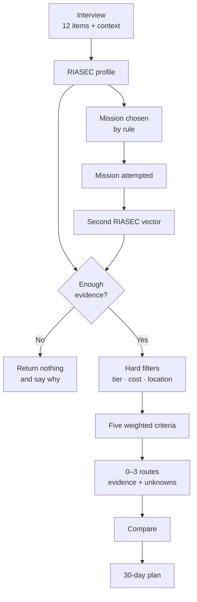
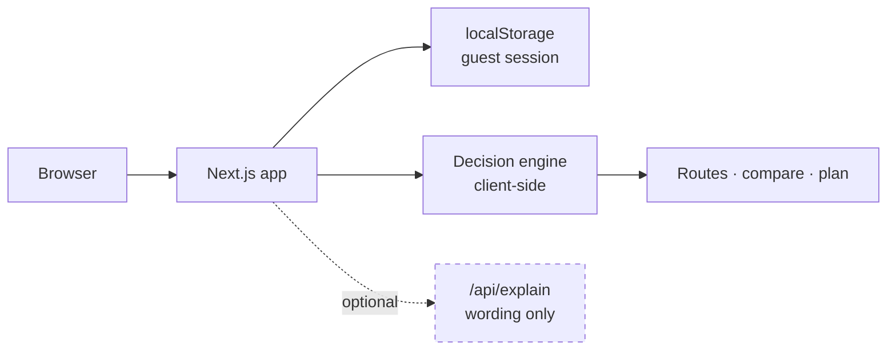
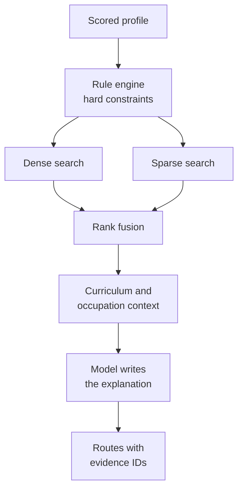
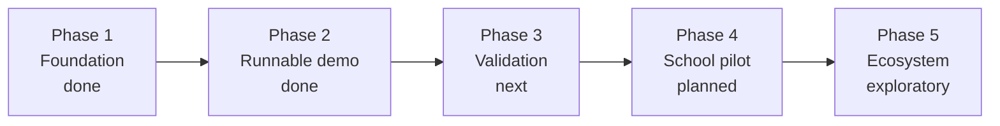

<a id="top"></a>

<p align="center">
  
</p>

# FutureMe AI

<p align="center">
  <b>Career and study guidance for Thai students — built on a questionnaire, a real task, and reasoning you can inspect.</b>
</p>

<p align="center">
  <a href="https://github.com/winxtxrgit/futureme-ai/actions/workflows/ci.yml"></a>
  
  
  
  
</p>

<p align="center">
  <b>English</b>
  &nbsp;·&nbsp;
  <a href="READMETH.md">ภาษาไทย</a>
</p>

<p align="center">
  <a href="#overview">Overview</a> ·
  <a href="#demo">Demo</a> ·
  <a href="#current-prototype">Current prototype</a> ·
  <a href="#how-it-works">How it works</a> ·
  <a href="#features">Features</a> ·
  <a href="#architecture">Architecture</a> ·
  <a href="#privacy-and-safety">Privacy &amp; safety</a> ·
  <a href="#research">Research</a> ·
  <a href="#roadmap">Roadmap</a> ·
  <a href="#run-locally">Run locally</a>
</p>

---

> **Status: runnable prototype.** The whole guest journey works end to end with no account and no
> API key. The recommendation output is for exploration and has **not** been clinically,
> educationally or statistically validated. The interest questionnaire is shortened and is not a
> validated RIASEC instrument. Route data is illustrative. No pilot with real students has run.
>
> What is implemented, what is a reduced prototype and what is only designed:
> [Current prototype](#current-prototype) · [Development plan](docs/06-development-plan.md#component-status)

---

## Overview

Thai students choose a study track years before anyone helps them understand what that track
leads to.

The bill arrives later, and it is not the one people expect. Thai graduate unemployment is
**2.0%**, against a national rate of 1.0% — graduates are not mostly out of work. But **56% of
Thai people educated above upper-secondary level work outside their field of study, and 27% work
below their qualification level** (TDRI, 2025). They are employed in the wrong place.

So this is not a product about employability. It is about *direction*, and about making the
reasoning behind a direction visible early enough to argue with.

### What it does differently

<table>
<tr>
<td width="25%" valign="top"><h4>Ask, then check</h4><sub>An interest questionnaire produces a hypothesis. A short scenario mission then produces independent behavioural evidence — because saying you like design and solving a design problem are not the same claim.</sub></td>
<td width="25%" valign="top"><h4>Show disagreement</h4><sub>When the mission contradicts the questionnaire, the learner is shown the contradiction instead of having it averaged away. That conflict is usually the most useful thing in the session.</sub></td>
<td width="25%" valign="top"><h4>Up to three routes</h4><sub>Never a winner, never padded to three, and sometimes none. Equal visual weight and identical actions on every card, so the interface cannot imply a ranking the evidence does not support.</sub></td>
<td width="25%" valign="top"><h4>Refuse to guess</h4><sub>Three gates make the engine return nothing rather than invent a preference. Deterministic scoring means the same answers always give the same result, and every number traces to a line of code.</sub></td>
</tr>
</table>

### Who it is for

| Tier | Grades | The decision it helps with |
|---|---|---|
| Lower secondary | ม.1 – ม.3 | The ม.4 fork — general track, vocational, or dual education |
| Upper secondary | ม.4 – ม.6 | Faculty choice, TCAS strategy, portfolio |
| Vocational | ปวช. – ปวส. | Continuing to ปวส./bachelor's, or entering work directly |

Parents and counsellors are designed to read derived summaries only — with the student's consent,
and never the free text. That part is **designed, not built**: this prototype has no accounts.

<sub><a href="#top">↑ Back to top</a></sub>

---

## Demo

Four commands, no configuration, no API key.

```bash
git clone https://github.com/winxtxrgit/futureme-ai.git
cd futureme-ai
npm install
npm run dev            # http://localhost:3000
```

Then click **Start as guest** and follow: **interview → mission → routes → compare → 30-day plan.**

### The three things worth trying

Most demos only show the happy path. These are the ones that show the engine's judgement.

| Try this | What should happen |
|---|---|
| Answer every interest item with the same value | No routes. The engine says the profile is too flat to choose from, rather than picking one |
| Say cost matters a lot, then open *routes filtered out* | High-cost routes are excluded by a hard filter, each with the reason stated |
| Start the mission, type half an answer, then refresh | Your unfinished writing is still there |

<p align="center">
  <a href="#current-prototype"></a>
</p>

<p align="center">
<sub>The routes screen from the running application. Equal visual weight, no winner, and evidence,<br>limitations and unknowns on every card. Here the engine has detected that the interview and the mission disagree.</sub>
</p>

<sub><a href="#top">↑ Back to top</a></sub>

---

## Current prototype

Everything in this section is backed by code in this repository and by a test you can run.

### What works today

| You can | Where |
|---|---|
| Start a guest session with no account, and recover it after a refresh | `lib/session/` |
| Complete the interview with progress, validation and editable answers | `app/interview/` |
| Be given a mission chosen from your answers by a stated rule — and overrule it | `lib/mission/` |
| Keep unfinished mission writing across a refresh | `app/mission/` |
| Receive **zero to three** explainable routes, never padded, never ranked | `lib/decision-engine/` |
| Read why each route appeared, its evidence, limitations and open questions | `app/routes/` |
| See where each route's information came from, and how old it is | `data/routes.json` |
| Compare every route on consistent criteria | `app/compare/` |
| Generate a 30-day plan with check-ins that survive a refresh | `lib/plan/`, `app/plan/` |
| Watch the engine refuse to answer rather than guess | `npm test` → *evidence gates* |
| Confirm the app works with **no LLM API key** | `app/api/explain/` |
| Delete all your data and verify it is gone | `app/privacy/` |
| Run 136 unit/integration tests and 16 browser tests | `npm test`, `npm run test:e2e` |

### What it does not do yet

Stated plainly, because a working demo hides all of it.

| Limitation | Detail |
|---|---|
| **The instrument is not validated** | 12 items built on the structure of Holland's RIASEC model, never psychometrically reviewed. Labelled *"Demo assessment"* in the app. It is not a RIASEC test |
| **The interview is not adaptive, and not Thai** | A static English questionnaire. The adaptive Thai conversation is [planned](#architecture), not built |
| **Route data is illustrative** | Six demo routes. Cost, location, timing and flexibility carry **no source** — and they drive the eligibility filters. The app shows the compile date and warns when it goes stale |
| **The weights are design judgement** | Not fitted to student outcomes, because no outcome data exists |
| **No pilot has run** | Every effectiveness statement here is a design goal, not a measured result |
| **Safeguarding is minimal** | A keyword rule in the browser. Not a risk assessment. It will miss cases and produce false positives, and nobody is alerted |
| **No accounts, sharing, or server storage** | Guest mode only. Parent and counsellor views are designed, not built |
| **No bias audit** | Unknown whether the engine steers students by gender, region, school size or income |
| **Not a replacement for a counsellor** | Decision support for exploration. It does not predict admission, employment or income |

<sub><a href="#top">↑ Back to top</a></sub>

---

## How it works

Two independent streams of evidence feed one deterministic engine. No model is involved in
choosing anything.

### The implemented flow



<details>
<summary><b>Why rules decide and the model only explains</b></summary>

<br>

A recommendation that changes between runs cannot be defended to a student, a parent or a
counsellor. So scoring, filtering and route selection are ordinary code with fixed weights — the
same evidence always produces the same routes, and every number traces to a line in
`lib/decision-engine/`.

The optional model layer sits strictly downstream:

```text
deterministic engine → structured result → optional rewording → wording on screen
```

It is handed a route name and a set of reason codes. It is never handed the list of routes, so it
cannot add, remove or reorder one. Reason codes are filtered against the engine's own vocabulary
before anything is forwarded, and the learner's free text is never sent at all.

</details>

<details>
<summary><b>How a mission is chosen</b></summary>

<br>

The rule walks your interest dimensions strongest-first and takes the first mission that lists
that dimension in its `bestFor`. Catalogue order breaks ties, so the same interview always gives
the same mission. It states its reason on screen, and it **declines to choose** — falling back to
a default and saying so — when the interview is too short or too flat to justify a choice. You
can always pick a different mission.

Every mission offers options spanning all six dimensions, not only the ones it is chosen for. That
is enforced by a test: a mission that could only produce evidence in the dimensions it was chosen
for could never contradict the interview, and the contradiction signal is the entire reason for
running a second phase.

</details>

→ Full detail in [04 · AI System](docs/04-ai-system.md)

<sub><a href="#top">↑ Back to top</a></sub>

---

## Features

Status is stated against *this repository*, not against the team's private workspace.

| Feature | What it does | Status |
|---|---|:--|
| **Interest questionnaire** | 12 items across six dimensions, plus cost, location and timing context | 🟡 Prototype — static, English, unvalidated |
| **Scenario missions** | Three missions, rule-selected from the profile, drafts autosaved, scored as independent evidence | 🟢 Implemented |
| **Decision engine** | Five weighted criteria, hard eligibility filters, ties marked rather than broken, 0–3 routes | 🟢 Implemented |
| **Refusal gates** | Returns nothing when answers are too few, too flat, or unsupported | 🟢 Implemented |
| **Data provenance** | Per-route source, status and last-checked date; catalogue age and unsourced fields shown | 🟢 Implemented |
| **Optional AI explanation** | Rewords an explanation the engine already produced; labelled; cannot affect ranking | 🟢 Implemented |
| **Safeguarding pause** | Thai and English keyword rule; stops recommendations and offers support lines | 🟡 Prototype — keyword only |
| **30-day plan** | Four-week template plus tasks targeting the specific gaps found; check-ins persist | 🟡 Prototype — linear |
| **Vocational parity** | ปวช. and ทวิภาคี scored by the same criteria as university routes, not offered as a fallback | 🟢 Implemented |
| **Adaptive Thai interview** | Socratic conversation with STAR extraction | 📐 Planned |
| **Retrieval over a real corpus** | Qdrant hybrid search over Thai curricula and occupations | 📐 Planned |
| **Interactive DAG roadmap** | Milestones with partial prerequisites, topologically sorted | 📐 Planned |
| **Accounts and consent-gated sharing** | Per-recipient, revocable; parents and counsellors see summaries, never free text | 📐 Planned |

<sub>🟢 Implemented · 🟡 Prototype implementation · 📐 Planned — full breakdown in <a href="docs/06-development-plan.md#component-status">Development Plan</a></sub>

### Interface

Captured from the running app with Playwright. These are not mockups.

<table>
<tr>
<td width="50%"><a href="assets/screenshots/app/landing-desktop.png"></a><br><b>Landing</b><br><sub>Guest-first. No account is required to complete the whole flow.</sub></td>
<td width="50%"><a href="assets/screenshots/app/interview-desktop.png"></a><br><b>Interview</b><br><sub>Progress, editable answers, validation, and a visible “shortened demo assessment” label.</sub></td>
</tr>
<tr>
<td width="50%"><a href="assets/screenshots/app/routes-desktop.png"></a><br><b>Routes</b><br><sub>Equal weight, identical actions, no winner. Evidence strength shown by shape and word, not colour alone.</sub></td>
<td width="50%"><a href="assets/screenshots/app/compare-desktop.png"></a><br><b>Comparison</b><br><sub>Consistent criteria. Coarse bands rather than precise percentages, which would imply accuracy the engine lacks.</sub></td>
</tr>
<tr>
<td width="50%"><a href="assets/screenshots/app/plan-desktop.png"></a><br><b>30-day plan</b><br><sub>Weekly objectives, check-ins that persist, and extra tasks injected for the gaps the engine found.</sub></td>
<td width="50%"><a href="assets/screenshots/app/insufficient-desktop.png"></a><br><b>No-route state</b><br><sub>When evidence is too thin the engine returns nothing and says so, rather than padding the list to three.</sub></td>
</tr>
</table>

<details>
<summary><b>Mobile, safety and privacy screens</b></summary>

<br>

<table>
<tr>
<td width="33%"><a href="assets/screenshots/app/interview-mobile.png"></a><br><sub><b>Interview</b> · mobile</sub></td>
<td width="33%"><a href="assets/screenshots/app/routes-mobile.png"></a><br><sub><b>Routes</b> · mobile, cards stack</sub></td>
<td width="33%"><a href="assets/screenshots/app/plan-mobile.png"></a><br><sub><b>30-day plan</b> · mobile</sub></td>
</tr>
<tr>
<td><a href="assets/screenshots/app/safety-desktop.png"></a><br><sub><b>Safeguarding pause</b> · recommendations stop, support offered</sub></td>
<td><a href="assets/screenshots/app/privacy-mobile.png"></a><br><sub><b>Privacy</b> · what is stored, plus delete</sub></td>
<td><a href="assets/screenshots/app/compare-mobile.png"></a><br><sub><b>Comparison</b> · mobile, scrolls horizontally</sub></td>
</tr>
</table>

</details>

<details>
<summary><b>Concept designs — not implemented</b></summary>

<br>

The **Aurora** direction, chosen from eleven concepts. High-fidelity mockups of the intended full
product, in Thai. They include screens that do not exist in code.

<table>
<tr>
<td width="50%"><a href="assets/screenshots/01-landing-desktop.png"></a><br><b>Landing</b> · <sub>concept</sub></td>
<td width="50%"><a href="assets/screenshots/02-socratic-interview.png"></a><br><b>Socratic interview</b> · <sub>concept</sub></td>
</tr>
<tr>
<td width="50%"><a href="assets/screenshots/03-three-routes.png"></a><br><b>Three routes</b> · <sub>concept</sub><br><sub>This mockup gives one card a filled button, implying a winner. The implemented screen fixes that.</sub></td>
<td width="50%"><a href="assets/screenshots/04-student-dashboard.png"></a><br><b>Student dashboard</b> · <sub>concept</sub><br><sub>The student's own space — <b>not</b> a counsellor view, which is neither designed nor built.</sub></td>
</tr>
</table>

→ Full design system in [03 · User Experience](docs/03-user-experience.md)

</details>

<sub><a href="#top">↑ Back to top</a></sub>

---

## Architecture

The prototype and the production design are different systems. Both are documented; only one runs.

### Current prototype

Everything happens in the browser. There is no server-side storage of any kind, which is what
makes the guest-mode privacy claim literally true rather than a policy promise.



| Layer | Prototype (implemented) | Production (planned) |
|---|---|---|
| Frontend | Next.js 15 · React 19 · TypeScript · Tailwind | Same |
| Recommendation | Deterministic TypeScript, client-side | Same rules, served by FastAPI |
| Persistence | `localStorage`, rebuilt field by field on read | PostgreSQL |
| Retrieval | None — a seeded JSON catalogue of six routes | Qdrant hybrid search + BGE-M3 |
| LLM | Optional, wording only, absent without a key | Same, plus a Thai-adapted model |
| Identity | None — guest only | AIS Open APIs — Number Verify, OTP, SIM Swap |
| Hosting | Any Node host | AIS Cloud on OCI, Kubernetes |

### Planned architecture

**None of this is running.** It is recorded because the reasoning is part of the submission.



Thai guidance queries mix semantic intent with exact terms — faculty names, TPAT codes, TPQI
qualification numbers — which pure vector search retrieves poorly. Hence dense and sparse results
fused rather than chosen between.

Even with retrieval and generation in place, **the rule engine still decides.** The model's job
grows; it never gains the decision.

<details>
<summary><b>Deployment target and Ministry integration</b></summary>

<br>

AIS Cloud's published specifications list Thai data centres, ISO 27001 / 27017 / 27018, CSA-STAR
and dSURE Cloud 3-star. Load is bursty and predictable — a counsellor runs a session with a whole
class at once — which suits container auto-scaling.

> **Status.** Designed from published specifications. **Nothing is deployed there**, and no
> capacity or latency figures have been measured.

**Ministry ecosystem.** The Ministry is expanding NDLP under its *Anywhere Anytime* programme, so
the direction is compatible. An earlier version of this repository went further and said NDLP's
guidance layer is a static RIASEC test, and used that as the product's justification. The July
2026 source audit could not verify it, so the claim is withdrawn — as is "DEEP provides national
SSO". The honest position is **aligned with national policy direction, not connected to it**.

</details>

→ Full detail in [05 · System Architecture](docs/05-system-architecture.md)

<sub><a href="#top">↑ Back to top</a></sub>

---

## Privacy and safety

The users are minors, so both of these are architectural constraints rather than policy pages.

### In the running prototype

| Guarantee | Why it holds |
|---|---|
| Nothing is transmitted | The engine runs in your browser. There is no recommendation endpoint to send anything to |
| Free text never leaves the device | Not even to the optional AI layer, which receives only a route name and reason codes |
| Deletion is real | One button clears the stored session; a test asserts the answers are gone afterwards |
| Corrupt state cannot poison the engine | Stored data is rebuilt field by field against the seed data; unrecognised values are dropped, not trusted |
| Distress pauses the product | A Thai/English keyword rule stops recommendations and shows support lines, including 1323 |

### What is designed but not built

Accounts, per-recipient revocable consent, parent and counsellor summary views, verified
relationships, retention limits and an access audit trail. **None of it exists in code.**

> **The distinction that matters.** AIS Cloud provides in-country residency and certification —
> where data lives and how the facility is run. It does **not** deliver PDPA compliance by itself.
> Consent management, access control, minimisation, retention and processor governance are
> application-layer responsibilities. Conflating the two is the most common way a project like
> this gets compliance wrong.

The safeguarding rule is a keyword match, not a risk assessment. It will miss cases and produce
false positives, and nobody is alerted. That is a stopgap, and it is listed as one.

→ Full detail in [08 · Privacy and Data Flow](docs/08-privacy-and-data.md)

<sub><a href="#top">↑ Back to top</a></sub>

---

## Research

The research base was re-audited on **24 July 2026**: every external URL opened and followed,
every figure compared against the page it came from.

### What the evidence supports

| Finding | Figure | Source |
|---|--:|---|
| Work outside their field (education above upper-secondary) | 56% | TDRI 2025 |
| Work below their qualification level | 27% | TDRI 2025 |
| STEM graduates working outside science, 2024 | 38.1% | NSO, *Social Indicators 2025*, p. 185 |
| Graduate unemployment vs national rate, 2024 | 2.0% vs 1.0% | NESDC Q2/2568 |
| OECD qualification mismatch | ~35% | PIAAC 2023 |
| Core skills changing by 2030 | 39% | WEF 2025 |
| Employers naming skills gaps as a barrier | 63% | WEF 2025 |

### What the audit took away

Ten figures were withdrawn for having no traceable source, including a "68.6% Thai mismatch" rate
and a "15–20% wage penalty". Several more were real but misstated and have been corrected — the
TDRI job-posting analysis covers 756,300 postings, not 304,378.

Three claims this repository *used as arguments* did not survive:

- **"NDLP's guidance layer is a static RIASEC test."** Unverifiable. It was the product's headline
  justification; the case now rests on the mismatch evidence instead.
- **"DEEP provides national SSO."** Unverifiable.
- **"All 12 ปวช. 2567 subject areas."** The catalogue publishes these per curriculum revision and
  the registry warns against embedding counts. A test now fails if one reappears.

One correction went the other way: "WEF 44%" was listed here as a misquote of 39%. It is not. Both
are real figures from different reports measuring different windows.

→ Full registry and audit trail in [02 · Research](docs/02-research-and-evidence.md#source-registry) and [09 · Source Review](docs/09-source-review.md)

<sub><a href="#top">↑ Back to top</a></sub>

---

## Roadmap



| Phase | Belongs to | Gate to the next phase |
|---|---|---|
| **1 · Foundation** | Current prototype | ✅ Passed |
| **2 · Runnable demo** | Current prototype | ✅ Passed — a reviewer completes the journey unaided |
| **3 · Validation** | Next submission improvement | Independent review of the instrument |
| **4 · School pilot** | Post-hackathon development | Evidence students made decisions they can still defend |
| **5 · Ecosystem** | Long-term product vision | Signed partnerships |

Phase 3 is where the honest work is: validating the instrument, replacing the illustrative
catalogue with licensed per-programme data, building an evaluation set, running a bias audit, and
making the whole thing work in Thai.

<details>
<summary><b>What would make us stop</b></summary>

<br>

Recorded deliberately. The project should not proceed to a pilot if:

- Instrument validation shows the interest items do not measure what they claim to
- A bias audit finds the engine systematically steers students by gender, region or school size
- Counsellors report the output displaces rather than supports their judgement
- Consent and privacy handling cannot satisfy PDPA requirements for minors

Building a guidance tool that quietly narrows a child's options would be worse than building
nothing.

</details>

→ Full roadmap in [07 · Roadmap](docs/07-roadmap.md)

<sub><a href="#top">↑ Back to top</a></sub>

---

## Run locally

Everything below has been run in this repository and runs again on every pull request. The demo
needs **no environment variables and no API key**.

```bash
npm install
npm run dev            # http://localhost:3000 — then "Start as guest"
```

| Command | What it does | Result |
|---|---|---|
| `npm run typecheck` | `tsc --noEmit`, strict mode | ✅ 0 errors |
| `npm run lint` | ESLint, flat config | ✅ 0 warnings |
| `npm test` | Vitest unit + integration | ✅ 136 passed |
| `npm run build` | Production build | ✅ 9 routes |
| `npm run test:e2e:install` | One-off: download the browser Playwright drives | — |
| `npm run test:e2e` | Playwright against the production build | ✅ 16 passed |
| `npm run verify` | Typecheck, lint, test and build in one go | ✅ |

If the Playwright browser download is blocked in your environment, drive a locally installed
Chrome instead — same tests:

```bash
PW_CHANNEL=chrome npm run test:e2e
```

<details>
<summary><b>Optional: the AI explanation layer</b></summary>

<br>

The app is fully functional without this. It rewords explanations more warmly; it never changes
which routes were selected, or their order.

```bash
cp .env.example .env.local
# then set ANTHROPIC_API_KEY in .env.local
```

With no key, the rewording control is not shown at all, and `/api/explain` reports
`{ "available": false }`. On a timeout, a provider error or a malformed response it returns the
deterministic text with HTTP 200, so the page cannot break. Both paths are covered by end-to-end
tests.

</details>

<details>
<summary><b>How the recommendation engine works</b></summary>

<br>

```text
lib/decision-engine/
├── types.ts          dimensions, reason codes, result shapes
├── scoring.ts        Likert → RIASEC, mission evidence, the five WEIGHTS
├── eligibility.ts    hard constraints, freshness, provenance
├── explanations.ts   deterministic reason text and evidence labels
└── index.ts          recommend() — gates, scoring, tie marking
```

1. **Normalise** — Likert 1–5 → 0..1 per dimension. Unanswered items are *excluded*, not scored as zero.
2. **Mission evidence** — option→dimension maps plus keyword spotting, as a second independent vector.
3. **Gate 1** — fewer than 8 of 12 interest items answered → no routes.
4. **Gate 2** — profile too flat to distinguish anything → no routes.
5. **Eligibility** — hard filters produce blocking reason codes. "I don't know" never blocks; it raises a notice.
6. **Score** — interests 30% · feasibility 25% · strengths 20% · learning style 15% · flexibility 10%.
7. **Evidence strength** — based on *how much is known*, not how high the score is. Never "strong" without a completed mission.
8. **Gate 3** — every surviving route has insufficient evidence → no routes.
9. **Ties** — totals within 4 points are marked tied and presented as equals.

**Feasibility is weighted second** because a route you cannot afford or reach is not a
recommendation. The weights are design judgement, **not** fitted to outcome data — none exists.

</details>

<details>
<summary><b>Repository structure</b></summary>

<br>

```text
futureme-ai/
├── README.md · READMEEN.md · READMETH.md
├── .github/workflows/ci.yml         typecheck · lint · test · build · e2e
├── app/                             Next.js App Router
│   ├── page.tsx                     landing
│   ├── interview/ mission/ routes/ compare/ plan/ privacy/
│   └── api/explain/                 optional wording layer
├── components/                      Shell, Button, Card, EvidenceBadge, SafetyPause
├── lib/
│   ├── decision-engine/             the recommendation rules
│   ├── mission/                     mission selection rule
│   ├── plan/                        30-day plan builder
│   ├── safety/                      prototype safeguarding rule
│   └── session/                     guest session + defensive parsing
├── data/                            questions · missions · routes (seed data)
├── tests/                           unit + integration (vitest)
├── e2e/                             end-to-end (playwright)
├── assets/                          banner · diagrams · screenshots
└── docs/                            01–09
```

</details>

<sub><a href="#top">↑ Back to top</a></sub>

---

## Documentation

| Document | Covers |
|---|---|
| [01 · Project Overview](docs/01-project-overview.md) | Problem, approach, target users, honest scope |
| [02 · Research and Evidence](docs/02-research-and-evidence.md) | Evidence base, source registry, withdrawn claims |
| [03 · User Experience](docs/03-user-experience.md) | Design system, journey, roles, accessibility |
| [04 · AI System](docs/04-ai-system.md) | Part A current prototype · Part B planned architecture |
| [05 · System Architecture](docs/05-system-architecture.md) | Prototype and production architecture, privacy, API surface |
| [06 · Development Plan](docs/06-development-plan.md) | Component status, verification, blockers, next steps |
| [07 · Roadmap](docs/07-roadmap.md) | Five phases, validation requirements, stop conditions |
| [08 · Privacy and Data Flow](docs/08-privacy-and-data.md) | What is collected, where it goes, what is not built |
| [09 · Source Review](docs/09-source-review.md) | The July 2026 audit: what changed, and what was wrong |

<sub><a href="#top">↑ Back to top</a></sub>

---

## Team and contact

Student hackathon project for **JUMP Thailand Hackathon 2026** (AIS Academy × NIA), theme *AI for
the Future of Thai Education*. Roles are functional rather than formal — the same people cover
several.

Questions, corrections and collaboration are welcome — please
[open an issue](https://github.com/winxtxrgit/futureme-ai/issues) or see
[CONTRIBUTING.md](CONTRIBUTING.md).

**Corrections to the research base are especially welcome.** Ten unsupported statistics have been
removed from this project already, and the last audit found three more that were being used as
arguments. If you find another, we want to know.

---

<p align="center">
<sub>
FutureMe AI is decision-support, not prediction. It does not guarantee admission, employment or income.<br>
Always verify current criteria against official sources and talk to a qualified counsellor.
</sub>
</p>

<p align="center">
  <b>English</b>
  &nbsp;·&nbsp;
  <a href="READMETH.md">ภาษาไทย</a>
</p>

<p align="center"><sub><b>MIT licensed</b> · <a href="#top">↑ Back to top</a></sub></p>
