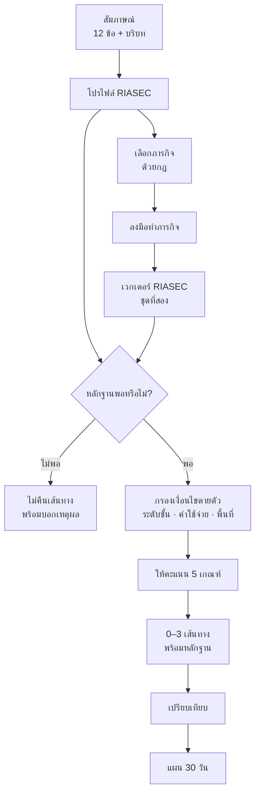
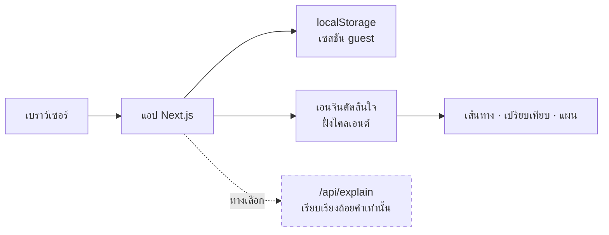
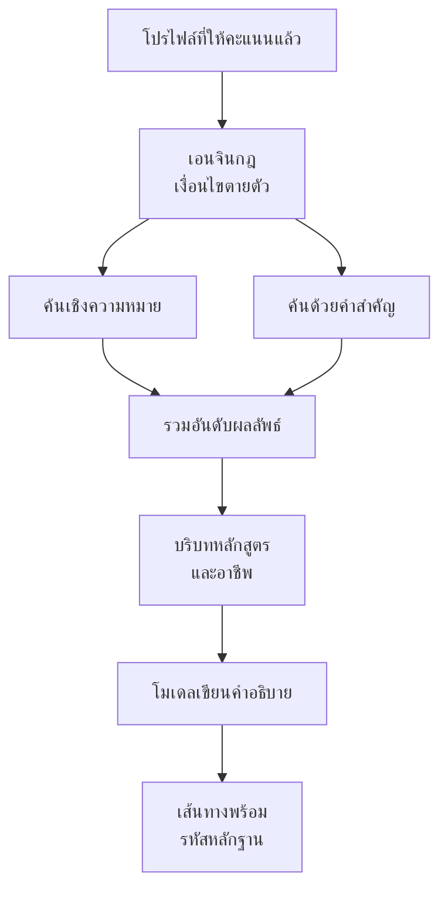
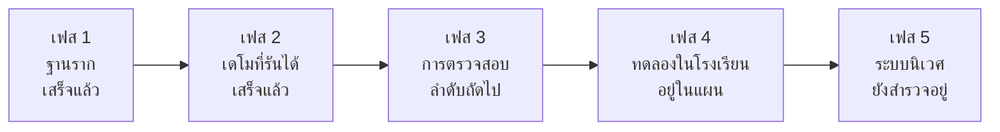

<a id="top"></a>

<p align="center">
  
</p>

# FutureMe AI

<p align="center">
  <b>นักเรียนตอบคำถามสั้น ๆ ลองทำภารกิจจริงหนึ่งอย่าง แล้วได้เส้นทางการเรียนไม่เกินสามทาง —<br>แต่ละทางแสดงหลักฐานที่ใช้ และสิ่งที่ระบบยังไม่รู้</b>
</p>

<p align="center">
  <a href="https://github.com/winxtxrgit/futureme-ai/actions/workflows/ci.yml"></a>
  
  
  
</p>

<p align="center">
  <a href="READMEEN.md">English</a>
  &nbsp;·&nbsp;
  <b>ภาษาไทย</b>
</p>

<p align="center">
  <a href="#futureme-ai-คืออะไร">คืออะไร</a> ·
  <a href="#ปัญหา">ปัญหา</a> ·
  <a href="#ทดลองใช้">ทดลองใช้</a> ·
  <a href="#สิ่งที่ทำได้แล้ววันนี้">ทำได้แล้ววันนี้</a> ·
  <a href="#ระบบทำงานอย่างไร">ระบบทำงานอย่างไร</a> ·
  <a href="#สถาปัตยกรรม">สถาปัตยกรรม</a> ·
  <a href="#ความเป็นส่วนตัวและความปลอดภัย">ความเป็นส่วนตัว</a> ·
  <a href="#ฐานงานวิจัย">ฐานงานวิจัย</a> ·
  <a href="#แผนการพัฒนา">แผนการพัฒนา</a> ·
  <a href="#การติดตั้งและรัน">การติดตั้งและรัน</a>
</p>

---

> **ต้นแบบที่รันได้จริง** เส้นทางผู้ใช้แบบ guest ทำงานครบวงจร ไม่ต้องสมัครบัญชี ไม่ต้องใช้ API key
> ผลลัพธ์มีไว้เพื่อ*สำรวจทางเลือก* และยังไม่ผ่านการตรวจสอบทางคลินิก การศึกษา หรือสถิติ
> [อะไรจริง เทียบกับ อะไรเป็นแค่แบบร่าง →](#สิ่งที่ทำได้แล้ววันนี้)

---

## FutureMe AI คืออะไร

FutureMe AI ช่วยให้นักเรียนไทยสำรวจว่าทางเลือกการเรียนแต่ละทางจะพาไปที่ไหน **ก่อน** ที่จะตัดสินใจลงไป
แทนที่จะเป็นแบบทดสอบที่พิมพ์คำตอบเดียวออกมา ระบบจะเก็บหลักฐานสองแบบ แล้ววางทางเลือกที่ตรงไปตรงมาไม่กี่ทาง
ให้นักเรียนได้โต้แย้งด้วย

มันคือเครื่องมือ*สนับสนุน*การตัดสินใจ ไม่ใช่การพยากรณ์ ไม่เคยชี้ผู้ชนะ และจะบอกตรง ๆ เมื่อรู้ไม่พอจะแนะนำอะไรเลย

### แนวคิดใน 5 ขั้นตอน

<table>
<tr>
<td align="center" width="20%"><b>1 · ถาม</b><br><sub>แบบสอบถามสั้น ๆ ตั้งสมมติฐานแรกเรื่องความสนใจ</sub></td>
<td align="center" width="20%"><b>2 · ลองทำ</b><br><sub>ภารกิจเล็ก ๆ หนึ่งอย่างให้หลักฐานจากสิ่งที่คุณ<i>ลงมือทำ</i></sub></td>
<td align="center" width="20%"><b>3 · เทียบ</b><br><sub>ไม่เกินสามเส้นทาง วางเทียบกัน ไม่จัดอันดับ</sub></td>
<td align="center" width="20%"><b>4 · สำรวจ</b><br><sub>แต่ละเส้นทางแสดงหลักฐาน ข้อจำกัด และสิ่งที่ยังไม่รู้</sub></td>
<td align="center" width="20%"><b>5 · ลงมือ</b><br><sub>แผน 30 วันของการทดลองเล็ก ๆ ที่ย้อนกลับได้</sub></td>
</tr>
</table>

หัวใจของขั้นที่ 2 คือความขัดแย้ง การบอกว่าชอบงานออกแบบ กับการ*ลงมือแก้*โจทย์ออกแบบ ไม่ใช่ข้ออ้างเดียวกัน
เมื่อสองอย่างขัดกัน ระบบจะแสดงความขัดแย้งให้เห็น ซึ่งมักเป็นช่วงเวลาที่มีประโยชน์ที่สุดของการประเมิน

### ใครคือผู้ใช้

| ระดับ | ชั้น | การตัดสินใจที่ช่วยได้ |
|---|---|---|
| มัธยมต้น | ม.1 – ม.3 | ทางแยก ม.4 — สายสามัญ อาชีวะ หรือทวิภาคี |
| มัธยมปลาย | ม.4 – ม.6 | เลือกคณะ วางแผน TCAS ทำแฟ้มสะสมผลงาน |
| อาชีวศึกษา | ปวช. – ปวส. | เรียนต่อ ปวส./ปริญญาตรี หรือเข้าสู่การทำงาน |

ผู้ปกครองและครูแนะแนวถูก*ออกแบบ*ให้เห็นเฉพาะบทสรุปตามความยินยอม ไม่เห็นข้อความที่เขียนเอง
ส่วนนี้ **ออกแบบไว้แล้วแต่ยังไม่ได้สร้าง** เพราะต้นแบบนี้ยังไม่มีระบบบัญชีผู้ใช้

<sub><a href="#top">↑ กลับขึ้นด้านบน</a></sub>

---

## ปัญหา

นักเรียนไทยเลือกสายการเรียนหลายปีก่อนที่จะมีใครช่วยให้เห็นว่าสายนั้นพาไปที่ไหน ผลลัพธ์มาปรากฏทีหลัง
และไม่ใช่การว่างงาน อัตราว่างงานของบัณฑิตต่ำ (**2.0%**) แต่ **56% ของคนไทยที่มีการศึกษาสูงกว่ามัธยมปลาย
ทำงานไม่ตรงสาขา และอีก 27% ทำงานต่ำกว่าระดับคุณวุฒิ** (TDRI, 2025) ปัญหาคือ*ทิศทาง* และเหตุผลเบื้องหลังทิศทาง
มักมองไม่เห็นจนสายเกินกว่าจะโต้แย้ง

FutureMe AI มีขึ้นเพื่อทำให้เหตุผลนั้นมองเห็นได้ตั้งแต่เนิ่น ๆ → [ฐานหลักฐานฉบับเต็ม](#ฐานงานวิจัย)

<sub><a href="#top">↑ กลับขึ้นด้านบน</a></sub>

---

## ทดลองใช้

สี่คำสั่ง ไม่ต้องตั้งค่าอะไร ไม่ต้องใช้ API key

```bash
git clone https://github.com/winxtxrgit/futureme-ai.git
cd futureme-ai
npm install
npm run dev            # http://localhost:3000
```

กด **Start as guest** แล้วเดินตามลำดับ: **สัมภาษณ์ → ภารกิจ → เส้นทาง → เปรียบเทียบ → แผน 30 วัน**

<p align="center">
  <a href="#สิ่งที่ทำได้แล้ววันนี้"></a>
</p>

<p align="center">
<sub>หน้าเส้นทางจากแอปที่รันจริง น้ำหนักภาพเท่ากัน ไม่มีผู้ชนะ ทุกการ์ดแสดงหลักฐานและสิ่งที่ยังไม่รู้<br>ในภาพนี้เอนจินตรวจพบว่าคำตอบจากการสัมภาษณ์กับผลจากภารกิจขัดแย้งกัน</sub>
</p>

### สามอย่างที่ควรลอง

การสาธิตส่วนใหญ่แสดงแต่เส้นทางที่ราบรื่น สามข้อนี้คือสิ่งที่แสดงวิจารณญาณของเอนจิน

| ลองทำแบบนี้ | สิ่งที่ควรเกิดขึ้น |
|---|---|
| ตอบทุกข้อด้วยคะแนนเท่ากันหมด | ไม่มีเส้นทางใดปรากฏ ระบบบอกว่าโปรไฟล์ราบเกินกว่าจะเลือกได้ แทนที่จะสุ่มเลือกให้ |
| ตอบว่าค่าใช้จ่ายสำคัญมาก แล้วเปิดดู *เส้นทางที่ถูกคัดออก* | เส้นทางค่าใช้จ่ายสูงถูกกรองออกด้วยเงื่อนไขตายตัว พร้อมเหตุผลรายข้อ |
| เริ่มทำภารกิจ พิมพ์คำตอบครึ่งเดียว แล้วรีเฟรชหน้า | ข้อความที่เขียนค้างไว้ยังอยู่ครบ |

<sub><a href="#top">↑ กลับขึ้นด้านบน</a></sub>

---

## สิ่งที่ทำได้แล้ววันนี้

ทุกอย่างในหัวข้อนี้มีโค้ดในคลังนี้รองรับ และมีเทสต์ที่รันตรวจได้ เส้นแบ่งระหว่าง *สร้างแล้ว* กับ *ออกแบบไว้*
ถูกรักษาให้คมชัดโดยตั้งใจ

### ใช้งานได้แล้วตอนนี้

- ✅ เริ่มแบบ guest ไม่ต้องสมัคร และกู้คืนเซสชันได้หลังรีเฟรช
- ✅ ทำแบบสอบถามพร้อมตัวบอกความคืบหน้า การตรวจความครบถ้วน และแก้คำตอบได้
- ✅ ได้ภารกิจที่เลือกจากคำตอบด้วยกฎที่ประกาศไว้ — และเปลี่ยนเองได้
- ✅ ได้รับเส้นทางที่อธิบายได้ **0 ถึง 3 เส้นทาง** ไม่เติมให้ครบ ไม่จัดอันดับ
- ✅ เห็นหลักฐาน ข้อจำกัด สิ่งที่ยังไม่รู้ และที่มาของข้อมูลของแต่ละเส้นทาง
- ✅ เปรียบเทียบด้วยเกณฑ์ชุดเดียวกัน แล้วได้แผน 30 วันที่การเช็กอินอยู่รอดจากการรีเฟรช
- ✅ เห็นเอนจินปฏิเสธที่จะตอบ แทนที่จะเดา
- ✅ รันได้โดย**ไม่มี** API key ของ LLM ลบข้อมูลทั้งหมดได้ และรันเทสต์ 136 + 18 รายการ

<details>
<summary><b>สิ่งที่ยังทำไม่ได้ — อ่านข้อนี้ เพราะเดโมที่ทำงานได้มักกลบมันไว้</b></summary>

<br>

| ข้อจำกัด | รายละเอียด |
|---|---|
| **เครื่องมือวัดยังไม่ผ่านการตรวจสอบ** | 12 ข้อ สร้างตามโครงสร้างของโมเดล RIASEC ของ Holland ไม่เคยผ่านการตรวจสอบเชิงจิตมิติ ในแอปติดป้ายว่า *“Demo assessment”* — ไม่ใช่แบบทดสอบ RIASEC |
| **การสัมภาษณ์ยังไม่ปรับตามผู้ตอบ และยังไม่เป็นภาษาไทย** | เป็นแบบสอบถามภาษาอังกฤษแบบคงที่ ส่วนบทสนทนาไทยแบบปรับตัวได้ยังเป็น[แผน](#สถาปัตยกรรม) ไม่ใช่ของที่สร้างแล้ว |
| **ข้อมูลเส้นทางเป็นข้อมูลตัวอย่าง** | 6 เส้นทางสำหรับสาธิต ค่าใช้จ่าย พื้นที่ ระยะเวลา และความยืดหยุ่น **ไม่มีแหล่งอ้างอิง** ทั้งที่ค่าเหล่านี้ควบคุมการกรองเส้นทาง แอปแสดงวันที่รวบรวมข้อมูลและเตือนเมื่อข้อมูลเก่าเกินกำหนด |
| **ค่าน้ำหนักเป็นการใช้วิจารณญาณออกแบบ** | ไม่ได้ปรับจากผลลัพธ์จริงของนักเรียน เพราะยังไม่มีข้อมูลผลลัพธ์ |
| **ยังไม่เคยทดลองใช้จริง** | ทุกข้อความเรื่องประสิทธิผลในคลังนี้เป็นเป้าหมายการออกแบบ ไม่ใช่ผลที่วัดได้ |
| **ระบบดูแลความปลอดภัยยังน้อยมาก** | เป็นกฎจับคำในเบราว์เซอร์ ไม่ใช่การประเมินความเสี่ยง ย่อมพลาดบางกรณีและแจ้งเตือนผิดพลาดได้ และไม่มีการแจ้งใคร |
| **ยังไม่มีบัญชีผู้ใช้ การแชร์ หรือการเก็บข้อมูลบนเซิร์ฟเวอร์** | มีเฉพาะโหมด guest มุมมองผู้ปกครองและครูแนะแนวออกแบบไว้แต่ยังไม่ได้สร้าง |
| **ยังไม่มีการตรวจสอบอคติ** | ยังไม่ทราบว่าเอนจินชี้นำนักเรียนตามเพศ ภูมิภาค ขนาดโรงเรียน หรือฐานะหรือไม่ |
| **ไม่ใช่สิ่งทดแทนครูแนะแนว** | เป็นเครื่องมือสนับสนุนการตัดสินใจเพื่อสำรวจทางเลือก ไม่พยากรณ์การสอบติด การได้งาน หรือรายได้ |

</details>

<details>
<summary><b>แต่ละความสามารถอยู่ที่ไหนในโค้ด</b></summary>

<br>

| ความสามารถ | สถานะ | อยู่ที่ |
|---|:--|---|
| เซสชัน guest + กู้คืนหลังรีเฟรช | 🟢 | `lib/session/` |
| แบบสอบถาม | 🟡 คงที่ อังกฤษ ยังไม่ตรวจสอบ | `app/interview/` |
| การเลือกภารกิจด้วยกฎ เปลี่ยนเองได้ | 🟢 | `lib/mission/` |
| บันทึกร่างภารกิจอัตโนมัติ | 🟢 | `app/mission/` |
| เอนจินตัดสินใจ — 0–3 เส้นทาง ทำเครื่องหมายคะแนนเสมอ | 🟢 | `lib/decision-engine/` |
| ประตูปฏิเสธการตอบ | 🟢 | `lib/decision-engine/` |
| ที่มาของข้อมูล + ความสด | 🟢 | `data/routes.json`, `app/routes/` |
| คำอธิบายด้วย AI (เรียบเรียงถ้อยคำเท่านั้น) | 🟢 | `app/api/explain/` |
| การหยุดเพื่อความปลอดภัย | 🟡 จับคำเท่านั้น | `lib/safety/` |
| แผน 30 วัน | 🟡 แม่แบบเส้นตรง | `lib/plan/`, `app/plan/` |
| สัมภาษณ์ไทยแบบปรับตัวได้ · การค้นคืน · roadmap แบบ DAG · บัญชีผู้ใช้ | 📐 อยู่ในแผน | — |

<sub>🟢 สร้างเสร็จ · 🟡 ต้นแบบแบบย่อ · 📐 อยู่ในแผน — รายละเอียดเต็มใน <a href="docs/06-development-plan.md#component-status">แผนการพัฒนา</a></sub>

</details>

<sub><a href="#top">↑ กลับขึ้นด้านบน</a></sub>

---

## ระบบทำงานอย่างไร

หลักฐานสองสายที่เป็นอิสระต่อกันป้อนเข้าเอนจินเดียวที่ให้ผลตายตัว **ไม่มีโมเดลใดมีส่วนในการเลือก**



<details>
<summary><b>ทำไมกฎเป็นผู้ตัดสิน และโมเดลทำได้แค่อธิบาย</b></summary>

<br>

คำแนะนำที่เปลี่ยนไปทุกครั้งที่รัน ไม่สามารถใช้อธิบายให้นักเรียน ผู้ปกครอง หรือครูแนะแนวฟังได้
การให้คะแนน การกรอง และการเลือกเส้นทางจึงเป็นโค้ดธรรมดาที่มีค่าน้ำหนักตายตัว หลักฐานชุดเดิมให้เส้นทางชุดเดิมเสมอ
และทุกตัวเลขย้อนกลับไปหาบรรทัดใน `lib/decision-engine/` ได้

ชั้นโมเดลที่เป็นทางเลือกอยู่ปลายน้ำอย่างเคร่งครัด:

```text
เอนจินตายตัว → ผลลัพธ์เชิงโครงสร้าง → เรียบเรียงถ้อยคำ (ถ้าเปิดใช้) → ข้อความบนหน้าจอ
```

ระบบส่งให้เพียงชื่อเส้นทางและรหัสเหตุผล ไม่เคยส่งรายการเส้นทางทั้งหมด โมเดลจึงเพิ่ม ลบ หรือสลับลำดับเส้นทางไม่ได้
รหัสเหตุผลถูกกรองเทียบกับชุดคำที่เอนจินใช้จริงก่อนส่งออก และข้อความที่ผู้เรียนเขียนเองไม่ถูกส่งออกไปเลย

</details>

<details>
<summary><b>ภารกิจถูกเลือกอย่างไร</b></summary>

<br>

กฎจะไล่มิติความสนใจของคุณจากแรงที่สุดลงไป แล้วเลือกภารกิจแรกที่ระบุมิตินั้นไว้ใน `bestFor`
ลำดับในแคตตาล็อกเป็นตัวตัดสินเมื่อเท่ากัน คำตอบชุดเดิมจึงได้ภารกิจเดิมเสมอ ระบบบอกเหตุผลบนหน้าจอ
และจะ **ไม่เลือก** — โดยถอยไปใช้ภารกิจตั้งต้นพร้อมบอกว่าทำไม — เมื่อคำตอบยังน้อยเกินไปหรือราบเกินไป
คุณเปลี่ยนไปทำภารกิจอื่นได้เสมอ

ทุกภารกิจมีตัวเลือกที่ครอบคลุมครบทั้งหกมิติ ไม่ใช่เฉพาะมิติที่ถูกเลือกมา ข้อนี้มีเทสต์บังคับไว้
เพราะภารกิจที่ให้หลักฐานได้เฉพาะมิติที่ถูกเลือกมา จะขัดแย้งกับผลสัมภาษณ์ไม่ได้เลย
และสัญญาณความขัดแย้งคือเหตุผลทั้งหมดของการมีเฟสที่สอง

</details>

→ รายละเอียดเต็มใน [04 · ระบบ AI](docs/04-ai-system.md)

<sub><a href="#top">↑ กลับขึ้นด้านบน</a></sub>

---

## หน้าจอ

จับภาพจากแอปที่รันจริงด้วย Playwright ไม่ใช่ภาพจำลอง

<table>
<tr>
<td width="50%"><a href="assets/screenshots/app/interview-desktop.png"></a><br><b>สัมภาษณ์</b><br><sub>แสดงความคืบหน้า แก้คำตอบได้ ตรวจความครบถ้วน และติดป้าย “แบบประเมินฉบับย่อ” ให้เห็นชัด</sub></td>
<td width="50%"><a href="assets/screenshots/app/routes-desktop.png"></a><br><b>เส้นทาง</b><br><sub>น้ำหนักเท่ากัน ปุ่มเหมือนกัน ไม่มีผู้ชนะ ระดับหลักฐานสื่อด้วยรูปทรงและคำ ไม่ใช่สีเพียงอย่างเดียว</sub></td>
</tr>
<tr>
<td width="50%"><a href="assets/screenshots/app/compare-desktop.png"></a><br><b>เปรียบเทียบ</b><br><sub>ใช้เกณฑ์ชุดเดียวกัน แสดงเป็นช่วงคะแนนหยาบ ไม่ใช่เปอร์เซ็นต์ละเอียดซึ่งจะสื่อความแม่นยำเกินจริง</sub></td>
<td width="50%"><a href="assets/screenshots/app/plan-desktop.png"></a><br><b>แผน 30 วัน</b><br><sub>เป้าหมายรายสัปดาห์ การเช็กอินที่บันทึกไว้ และงานเพิ่มเติมที่เจาะจงช่องว่างที่เอนจินพบ</sub></td>
</tr>
</table>

<details>
<summary><b>หน้าจอมือถือ ความปลอดภัย ความเป็นส่วนตัว และสถานะไม่มีเส้นทาง</b></summary>

<br>

<table>
<tr>
<td width="33%"><a href="assets/screenshots/app/interview-mobile.png"></a><br><sub><b>สัมภาษณ์</b> · มือถือ</sub></td>
<td width="33%"><a href="assets/screenshots/app/routes-mobile.png"></a><br><sub><b>เส้นทาง</b> · มือถือ การ์ดเรียงซ้อน</sub></td>
<td width="33%"><a href="assets/screenshots/app/insufficient-desktop.png"></a><br><sub><b>ไม่มีเส้นทาง</b> · ไม่ยอมเดา</sub></td>
</tr>
<tr>
<td><a href="assets/screenshots/app/safety-desktop.png"></a><br><sub><b>หยุดเพื่อความปลอดภัย</b> · หยุดการแนะนำ</sub></td>
<td><a href="assets/screenshots/app/privacy-mobile.png"></a><br><sub><b>ความเป็นส่วนตัว</b> · เก็บอะไรไว้บ้าง และปุ่มลบ</sub></td>
<td><a href="assets/screenshots/app/plan-mobile.png"></a><br><sub><b>แผน 30 วัน</b> · มือถือ</sub></td>
</tr>
</table>

</details>

<details>
<summary><b>งานออกแบบเชิงคอนเซปต์ — ยังไม่ได้สร้าง</b></summary>

<br>

แนวทาง **Aurora** ที่เลือกจาก 11 คอนเซปต์ เป็นภาพจำลองความละเอียดสูงของผลิตภัณฑ์เต็มรูปแบบเป็นภาษาไทย
และมีหน้าจอที่ยังไม่มีอยู่ในโค้ด

<table>
<tr>
<td width="50%"><a href="assets/screenshots/01-landing-desktop.png"></a><br><b>หน้าแรก</b> · <sub>คอนเซปต์</sub></td>
<td width="50%"><a href="assets/screenshots/02-socratic-interview.png"></a><br><b>สัมภาษณ์แบบ Socratic</b> · <sub>คอนเซปต์</sub></td>
</tr>
<tr>
<td width="50%"><a href="assets/screenshots/03-three-routes.png"></a><br><b>3 เส้นทาง</b> · <sub>คอนเซปต์</sub><br><sub>ภาพจำลองนี้ใส่ปุ่มทึบให้การ์ดหนึ่ง ซึ่งสื่อว่ามีผู้ชนะ หน้าจอที่สร้างจริงแก้จุดนี้แล้ว</sub></td>
<td width="50%"><a href="assets/screenshots/04-student-dashboard.png"></a><br><b>แดชบอร์ดนักเรียน</b> · <sub>คอนเซปต์</sub><br><sub>เป็นพื้นที่ของนักเรียนเอง <b>ไม่ใช่</b> มุมมองครูแนะแนว ซึ่งยังไม่ได้ออกแบบและยังไม่ได้สร้าง</sub></td>
</tr>
</table>

→ ระบบออกแบบฉบับเต็มใน [03 · ประสบการณ์ผู้ใช้](docs/03-user-experience.md)

</details>

<sub><a href="#top">↑ กลับขึ้นด้านบน</a></sub>

---

## สถาปัตยกรรม

ต้นแบบกับการออกแบบสำหรับใช้งานจริงเป็นคนละระบบกัน ทั้งคู่มีเอกสาร แต่มีเพียงระบบเดียวที่รันอยู่

### ต้นแบบปัจจุบัน

ทุกอย่างเกิดขึ้นในเบราว์เซอร์ ไม่มีการเก็บข้อมูลบนเซิร์ฟเวอร์ ซึ่งเป็นเหตุผลที่ทำให้ข้อความเรื่องความเป็นส่วนตัว
ในโหมด guest เป็นจริงตามตัวอักษร ไม่ใช่แค่คำสัญญาเชิงนโยบาย



| ชั้น | ต้นแบบ (สร้างแล้ว) | ระบบจริง (อยู่ในแผน) |
|---|---|---|
| ฝั่งหน้าเว็บ | Next.js 15 · React 19 · TypeScript · Tailwind | เหมือนกัน |
| การแนะนำ | TypeScript แบบตายตัว ทำงานฝั่งไคลเอนต์ | กฎชุดเดิม ให้บริการผ่าน FastAPI |
| การเก็บข้อมูล | `localStorage` ประกอบใหม่ทีละฟิลด์ตอนอ่าน | PostgreSQL |
| การค้นคืน | ไม่มี — ใช้แคตตาล็อก JSON 6 เส้นทาง | Qdrant hybrid search + BGE-M3 |
| LLM | ทางเลือก ใช้เรียบเรียงถ้อยคำ ไม่มีเมื่อไม่ตั้งค่า key | เหมือนกัน บวกโมเดลที่ปรับให้เข้ากับภาษาไทย |
| การยืนยันตัวตน | ไม่มี — guest เท่านั้น | AIS Open APIs — Number Verify, OTP, SIM Swap |

### สถาปัตยกรรมที่อยู่ในแผน

**ยังไม่มีส่วนใดทำงานอยู่** บันทึกไว้เพราะเหตุผลเชิงออกแบบเป็นส่วนหนึ่งของการนำเสนอ แม้จะมีการค้นคืนและการสร้าง
ข้อความแล้ว เอนจินกฎยังเป็นผู้ตัดสินอยู่ดี งานของโมเดลขยายขึ้น แต่ไม่เคยได้อำนาจตัดสินใจ



<details>
<summary><b>เป้าหมายการติดตั้งและการเชื่อมต่อกับระบบกระทรวง</b></summary>

<br>

เอกสารสเปกที่ AIS เผยแพร่ระบุ Data Center ในไทย, ISO 27001 / 27017 / 27018, CSA-STAR และ dSURE Cloud 3 ดาว
ภาระงานเป็นแบบพุ่งสูงเป็นช่วงและคาดเดาได้ — ครูแนะแนวใช้งานพร้อมกันทั้งห้อง — ซึ่งเหมาะกับการขยายขนาดคอนเทนเนอร์อัตโนมัติ

> **สถานะ** ออกแบบจากสเปกที่เผยแพร่ **ยังไม่มีการติดตั้งใช้งานจริง** และยังไม่มีการวัดความจุหรือค่าหน่วงใด ๆ

**ระบบนิเวศของกระทรวง** กระทรวงศึกษาธิการกำลังขยาย NDLP ภายใต้โครงการ *Anywhere Anytime* ทิศทางจึงสอดคล้องกัน
ก่อนหน้านี้คลังนี้เคยกล่าวไปไกลกว่านั้นว่าส่วนแนะแนวของ NDLP เป็นแบบทดสอบ RIASEC แบบคงที่ และใช้ข้อนั้นเป็นเหตุผลหลักของผลิตภัณฑ์
แต่การตรวจแหล่งอ้างอิงเมื่อกรกฎาคม 2569 ยืนยันข้อนั้นไม่ได้ จึงถอนออก เช่นเดียวกับข้อความว่า “DEEP มี SSO ระดับชาติ”
จุดยืนที่ตรงกับความจริงคือ **สอดคล้องกับทิศทางนโยบายของประเทศ ไม่ใช่เชื่อมต่อกับระบบรัฐแล้ว**

</details>

→ รายละเอียดเต็มใน [05 · สถาปัตยกรรมระบบ](docs/05-system-architecture.md)

<sub><a href="#top">↑ กลับขึ้นด้านบน</a></sub>

---

## ความเป็นส่วนตัวและความปลอดภัย

ผู้ใช้เป็นผู้เยาว์ ทั้งสองเรื่องนี้จึงเป็นข้อจำกัดเชิงสถาปัตยกรรม ไม่ใช่หน้านโยบาย

### ในต้นแบบที่รันอยู่

| สิ่งที่รับประกัน | ทำไมจึงเป็นจริง |
|---|---|
| ไม่มีการส่งข้อมูลออก | เอนจินทำงานในเบราว์เซอร์ ไม่มี endpoint สำหรับการแนะนำให้ส่งข้อมูลไปหา |
| ข้อความที่เขียนเองไม่ออกจากเครื่อง | แม้แต่ชั้น AI ที่เป็นทางเลือกก็ได้รับเพียงชื่อเส้นทางและรหัสเหตุผล |
| การลบเป็นการลบจริง | ปุ่มเดียวล้างเซสชันที่เก็บไว้ และมีเทสต์ยืนยันว่าคำตอบหายไปจริงหลังจากนั้น |
| ข้อมูลเสียหายทำให้เอนจินเพี้ยนไม่ได้ | ข้อมูลที่เก็บไว้ถูกประกอบใหม่ทีละฟิลด์เทียบกับข้อมูลตั้งต้น ค่าที่ไม่รู้จักถูกทิ้ง |
| สัญญาณความทุกข์ทำให้ระบบหยุด | กฎจับคำไทย–อังกฤษหยุดการแนะนำและแสดงสายด่วน รวมถึง 1323 |

### ออกแบบไว้แต่ยังไม่ได้สร้าง

บัญชีผู้ใช้ ความยินยอมรายผู้รับที่เพิกถอนได้ มุมมองบทสรุปสำหรับผู้ปกครองและครูแนะแนว การยืนยันความสัมพันธ์
การจำกัดระยะเวลาเก็บข้อมูล และร่องรอยการเข้าถึง **ยังไม่มีส่วนใดอยู่ในโค้ด**

> **ความแตกต่างที่สำคัญ** AIS Cloud ให้การจัดเก็บข้อมูลในประเทศและการรับรองมาตรฐาน — ซึ่งครอบคลุมว่าข้อมูลอยู่ที่ไหน
> และศูนย์ข้อมูลบริหารจัดการอย่างไร แต่**ไม่ได้**ทำให้ผ่าน PDPA โดยอัตโนมัติ การจัดการความยินยอม การควบคุมการเข้าถึง
> การเก็บข้อมูลเท่าที่จำเป็น ระยะเวลาเก็บ และการกำกับผู้ประมวลผล เป็นความรับผิดชอบในชั้นแอปพลิเคชัน
> การเหมารวมสองเรื่องนี้เป็นวิธีที่พบบ่อยที่สุดที่ทำให้โครงการแบบนี้ผิดข้อกำหนด กฎดูแลความปลอดภัยเป็นเพียงการจับคำ
> ไม่ใช่การประเมินความเสี่ยง — เป็นมาตรการชั่วคราว และถูกระบุไว้ว่าเป็นเช่นนั้น

→ รายละเอียดเต็มใน [08 · ความเป็นส่วนตัวและการไหลของข้อมูล](docs/08-privacy-and-data.md)

<sub><a href="#top">↑ กลับขึ้นด้านบน</a></sub>

---

## ฐานงานวิจัย

ฐานงานวิจัยถูกตรวจซ้ำเมื่อ **24 กรกฎาคม 2569** โดยเปิดและตามทุก URL ภายนอก และเทียบทุกตัวเลขกับหน้าต้นทางจริง

### สิ่งที่หลักฐานรองรับ

| ข้อค้นพบ | ตัวเลข | แหล่งอ้างอิง |
|---|--:|---|
| ทำงานไม่ตรงสาขา (ผู้มีการศึกษาสูงกว่ามัธยมปลาย) | 56% | TDRI 2025 |
| ทำงานต่ำกว่าระดับคุณวุฒิ | 27% | TDRI 2025 |
| ผู้จบ STEM ที่ทำงานนอกด้านวิทยาศาสตร์ ปี 2024 | 38.1% | สสช. *Social Indicators 2025* หน้า 185 |
| อัตราว่างงานผู้จบอุดมศึกษาเทียบทั้งประเทศ ปี 2024 | 2.0% ต่อ 1.0% | สศช. ไตรมาส 2/2568 |
| อัตรา qualification mismatch ของ OECD | ~35% | PIAAC 2023 |
| ทักษะหลักที่จะเปลี่ยนภายในปี 2030 | 39% | WEF 2025 |

### สิ่งที่การตรวจสอบทำให้ต้องถอนออก

ตัวเลข 10 รายการถูกถอนเพราะหาแหล่งอ้างอิงไม่ได้ รวมถึงอัตรา mismatch ไทย “68.6%” และ “wage penalty 15–20%”
สามข้อที่คลังนี้เคย*ใช้เป็นข้อโต้แย้ง*แต่ไม่ผ่านการตรวจสอบ ได้แก่ ข้อที่ว่าส่วนแนะแนวของ NDLP เป็นแบบทดสอบ RIASEC แบบคงที่
ข้อที่ว่า DEEP มี SSO ระดับชาติ และการระบุจำนวนตายตัวว่า “ปวช. 12 ประเภทวิชา” ตอนนี้มีเทสต์ที่จะไม่ผ่านหากตัวเลขที่ถอนไปกลับมาปรากฏบนผลิตภัณฑ์

→ ทะเบียนแหล่งอ้างอิงและบันทึกการตรวจสอบฉบับเต็มใน [02 · งานวิจัย](docs/02-research-and-evidence.md#source-registry) และ [09 · การตรวจแหล่งอ้างอิง](docs/09-source-review.md)

<sub><a href="#top">↑ กลับขึ้นด้านบน</a></sub>

---

## แผนการพัฒนา



| เฟส | จัดอยู่ในกลุ่ม | เงื่อนไขผ่านไปเฟสถัดไป |
|---|---|---|
| **1 · ฐานราก** | ต้นแบบปัจจุบัน | ✅ ผ่านแล้ว |
| **2 · เดโมที่รันได้** | ต้นแบบปัจจุบัน | ✅ ผ่านแล้ว — ผู้ตรวจทำครบทั้งกระบวนการได้เอง |
| **3 · การตรวจสอบ** | ลำดับถัดไป | มีผู้เชี่ยวชาญอิสระตรวจสอบเครื่องมือวัด |
| **4 · ทดลองในโรงเรียน** | หลังแฮกกาธอน | มีหลักฐานว่านักเรียนตัดสินใจได้และยังอธิบายเหตุผลได้ในภายหลัง |
| **5 · ระบบนิเวศ** | ระยะยาว | มีข้อตกลงความร่วมมือที่ลงนามแล้ว |

เฟส 3 คืองานที่ตรงไปตรงมาที่สุด: ตรวจสอบเครื่องมือวัด แทนที่แคตตาล็อกตัวอย่างด้วยข้อมูลรายหลักสูตรที่มีสิทธิ์ใช้งาน
สร้างชุดข้อมูลประเมินผล ตรวจสอบอคติ และทำให้ทั้งระบบใช้งานเป็นภาษาไทยได้

<details>
<summary><b>เงื่อนไขที่จะทำให้เราหยุดโครงการ</b></summary>

<br>

บันทึกไว้อย่างตั้งใจ โครงการนี้ไม่ควรเดินหน้าไปสู่การทดลองในโรงเรียนหาก:

- การตรวจสอบเครื่องมือวัดพบว่าข้อคำถามความสนใจไม่ได้วัดสิ่งที่อ้างว่าวัด
- การตรวจสอบอคติพบว่าเอนจินชี้นำนักเรียนอย่างเป็นระบบตามเพศ ภูมิภาค หรือขนาดโรงเรียน
- ครูแนะแนวรายงานว่าผลลัพธ์เข้าไปแทนที่วิจารณญาณของตน แทนที่จะสนับสนุน
- การจัดการความยินยอมและความเป็นส่วนตัวไม่ผ่านข้อกำหนด PDPA สำหรับผู้เยาว์

การสร้างเครื่องมือแนะแนวที่ค่อย ๆ ปิดทางเลือกของเด็กโดยไม่มีใครรู้ตัว แย่กว่าการไม่สร้างอะไรเลย

</details>

→ แผนฉบับเต็มใน [07 · แผนระยะยาว](docs/07-roadmap.md)

<sub><a href="#top">↑ กลับขึ้นด้านบน</a></sub>

---

## การติดตั้งและรัน

ทุกคำสั่งด้านล่างรันซ้ำทุกครั้งที่มี pull request การสาธิตพื้นฐาน **ไม่ต้องใช้ตัวแปรสภาพแวดล้อมและไม่ต้องใช้ API key**

```bash
npm install
npm run dev            # http://localhost:3000 — แล้วกด "Start as guest"
```

| คำสั่ง | ทำอะไร | ผลลัพธ์ |
|---|---|---|
| `npm run verify` | typecheck, lint, test และ build ในคำสั่งเดียว | ✅ |
| `npm test` | Vitest unit + integration | ✅ ผ่าน 136 รายการ |
| `npm run test:e2e` | Playwright ทดสอบกับบิลด์จริง | ✅ ผ่าน 18 รายการ |
| `npm run build` | บิลด์สำหรับใช้งานจริง | ✅ 9 เส้นทาง |

หากสภาพแวดล้อมของคุณบล็อกการดาวน์โหลดเบราว์เซอร์ของ Playwright ให้ใช้ Chrome ที่ติดตั้งในเครื่องแทน — เทสต์ชุดเดียวกัน: `PW_CHANNEL=chrome npm run test:e2e`

<details>
<summary><b>ทางเลือก: ชั้นคำอธิบายด้วย AI</b></summary>

<br>

แอปทำงานได้ครบถ้วนโดยไม่ต้องมีส่วนนี้ มันเพียงเรียบเรียงคำอธิบายให้อ่านง่ายขึ้น
และไม่เคยเปลี่ยนว่าเส้นทางใดถูกเลือกหรือเรียงลำดับอย่างไร

```bash
cp .env.example .env.local
# แล้วกำหนดค่า ANTHROPIC_API_KEY ใน .env.local
```

เมื่อไม่มี key ปุ่มเรียบเรียงถ้อยคำจะไม่ปรากฏเลย และ `/api/explain` จะรายงาน `{ "available": false }`
เมื่อหมดเวลารอ เกิดข้อผิดพลาดจากผู้ให้บริการ หรือได้รับผลลัพธ์ผิดรูปแบบ ระบบจะคืนข้อความแบบตายตัวพร้อมสถานะ HTTP 200
หน้าเว็บจึงพังไม่ได้ ทั้งสองเส้นทางมีเทสต์ end-to-end ครอบคลุม

</details>

<details>
<summary><b>เอนจินแนะนำเส้นทางทำงานอย่างไร</b></summary>

<br>

```text
lib/decision-engine/
├── types.ts          มิติ รหัสเหตุผล และรูปแบบผลลัพธ์
├── scoring.ts        Likert → RIASEC, หลักฐานจากภารกิจ, ค่าน้ำหนักทั้งห้า
├── eligibility.ts    เงื่อนไขตายตัว ความสดของข้อมูล และที่มาของข้อมูล
├── explanations.ts   ข้อความเหตุผลแบบตายตัวและป้ายกำกับหลักฐาน
└── index.ts          recommend() — ประตูตรวจ การให้คะแนน การทำเครื่องหมายคะแนนเสมอ
```

1. **ปรับมาตรฐาน** — Likert 1–5 → 0..1 ต่อมิติ ข้อที่ไม่ตอบถูก*ตัดออก* ไม่ใช่คิดเป็นศูนย์
2. **หลักฐานจากภารกิจ** — แผนที่ตัวเลือก→มิติ ร่วมกับการจับคำ เป็นเวกเตอร์อิสระชุดที่สอง
3. **ประตูที่ 1** — ตอบน้อยกว่า 8 จาก 12 ข้อ → ไม่คืนเส้นทาง
4. **ประตูที่ 2** — โปรไฟล์ราบเกินกว่าจะแยกความต่างได้ → ไม่คืนเส้นทาง
5. **คุณสมบัติ** — เงื่อนไขตายตัวสร้างรหัสเหตุผลที่กันออก คำตอบ “ยังไม่รู้” ไม่เคยกันออก แต่ทำให้เกิดหมายเหตุแทน
6. **ให้คะแนน** — ความสนใจ 30% · ความเป็นไปได้ 25% · จุดแข็ง 20% · สไตล์การเรียนรู้ 15% · ความยืดหยุ่น 10%
7. **ระดับหลักฐาน** — วัดจาก*ปริมาณสิ่งที่รู้* ไม่ใช่คะแนนที่สูง และจะไม่เป็น “แข็งแรง” หากยังไม่ทำภารกิจให้เสร็จ
8. **ประตูที่ 3** — ทุกเส้นทางที่เหลือมีหลักฐานไม่พอ → ไม่คืนเส้นทาง
9. **คะแนนเสมอ** — คะแนนรวมต่างกันไม่เกิน 4 ถือว่าเสมอ และแสดงอย่างเท่าเทียม

**ความเป็นไปได้ถูกให้น้ำหนักเป็นอันดับสอง** เพราะเส้นทางที่จ่ายไม่ไหวหรือไปไม่ถึงไม่ใช่คำแนะนำ
ค่าน้ำหนักเป็นการใช้วิจารณญาณออกแบบ **ไม่ได้**ปรับจากข้อมูลผลลัพธ์จริง เพราะยังไม่มีข้อมูลนั้น

</details>

<details>
<summary><b>โครงสร้างคลังโค้ด</b></summary>

<br>

```text
futureme-ai/
├── README.md · READMEEN.md · READMETH.md
├── .github/workflows/ci.yml         typecheck · lint · test · build · e2e
├── app/                             Next.js App Router
│   ├── page.tsx                     หน้าแรก
│   ├── interview/ mission/ routes/ compare/ plan/ privacy/
│   └── api/explain/                 ชั้นเรียบเรียงถ้อยคำ (ทางเลือก)
├── components/                      Shell, Button, Card, EvidenceBadge, SafetyPause
├── lib/
│   ├── decision-engine/             กฎการแนะนำเส้นทาง
│   ├── mission/                     กฎการเลือกภารกิจ
│   ├── plan/                        ตัวสร้างแผน 30 วัน
│   ├── safety/                      กฎดูแลความปลอดภัยฉบับต้นแบบ
│   └── session/                     เซสชัน guest และการตรวจข้อมูลเชิงป้องกัน
├── data/                            คำถาม · ภารกิจ · เส้นทาง (ข้อมูลตั้งต้น)
├── tests/ · e2e/                    vitest + playwright
├── assets/                          แบนเนอร์ · ไดอะแกรม · ภาพหน้าจอ
└── docs/                            01–09
```

</details>

<sub><a href="#top">↑ กลับขึ้นด้านบน</a></sub>

---

## เอกสารประกอบ

เอกสารเก้าฉบับ เรียงจากภาพรวมไปหารายละเอียดลึกสุด เริ่มจากคำถามที่คุณถือติดตัวมา

| เอกสาร | เนื้อหา |
|---|---|
| [01 · ภาพรวมโปรเจกต์](docs/01-project-overview.md) | ปัญหา แนวทาง กลุ่มผู้ใช้ และขอบเขตตามจริง |
| [02 · งานวิจัยและหลักฐาน](docs/02-research-and-evidence.md) | ฐานหลักฐาน ทะเบียนแหล่งอ้างอิง และข้ออ้างที่ถอนออก |
| [03 · ประสบการณ์ผู้ใช้](docs/03-user-experience.md) | ระบบออกแบบ เส้นทางผู้ใช้ บทบาท และการเข้าถึง |
| [04 · ระบบ AI](docs/04-ai-system.md) | ส่วน A ต้นแบบปัจจุบัน · ส่วน B สถาปัตยกรรมที่อยู่ในแผน |
| [05 · สถาปัตยกรรมระบบ](docs/05-system-architecture.md) | สถาปัตยกรรมต้นแบบและระบบจริง ความเป็นส่วนตัว และ API |
| [06 · แผนการพัฒนา](docs/06-development-plan.md) | สถานะรายองค์ประกอบ การตรวจสอบ อุปสรรค และก้าวถัดไป |
| [07 · แผนระยะยาว](docs/07-roadmap.md) | ห้าเฟส ข้อกำหนดการตรวจสอบ และเงื่อนไขหยุดโครงการ |
| [08 · ความเป็นส่วนตัวและการไหลของข้อมูล](docs/08-privacy-and-data.md) | เก็บอะไร ไปที่ไหน และอะไรที่ยังไม่ได้สร้าง |
| [09 · การตรวจแหล่งอ้างอิง](docs/09-source-review.md) | การตรวจเมื่อ ก.ค. 2569: อะไรเปลี่ยน และอะไรที่เคยผิด |

**นี่คือโปรเจกต์นักเรียน** สำหรับ JUMP Thailand Hackathon 2026 (AIS Academy × NIA)
ยินดีรับข้อแก้ไขต่อฐานงานวิจัยเป็นพิเศษ — สถิติที่ไม่มีแหล่งรองรับ 10 รายการถูกถอนออกไปแล้ว
[เปิด issue](https://github.com/winxtxrgit/futureme-ai/issues) หรือดู [CONTRIBUTING.md](CONTRIBUTING.md)

<sub><a href="#top">↑ กลับขึ้นด้านบน</a></sub>

---

<p align="center">
<sub>
FutureMe AI เป็นเครื่องมือสนับสนุนการตัดสินใจ ไม่ใช่การพยากรณ์ ไม่รับประกันการสอบติด การได้งาน หรือรายได้<br>
โปรดตรวจสอบเกณฑ์ปัจจุบันกับแหล่งข้อมูลทางการเสมอ และปรึกษาครูแนะแนวที่มีคุณวุฒิ
</sub>
</p>

<p align="center">
  <a href="READMEEN.md">English</a>
  &nbsp;·&nbsp;
  <b>ภาษาไทย</b>
</p>

<p align="center"><sub><b>สัญญาอนุญาต MIT</b> · <a href="#top">↑ กลับขึ้นด้านบน</a></sub></p>
