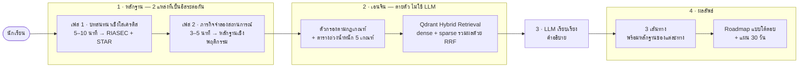
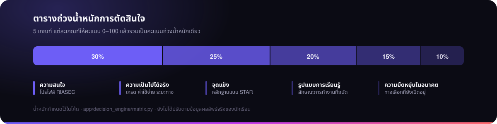
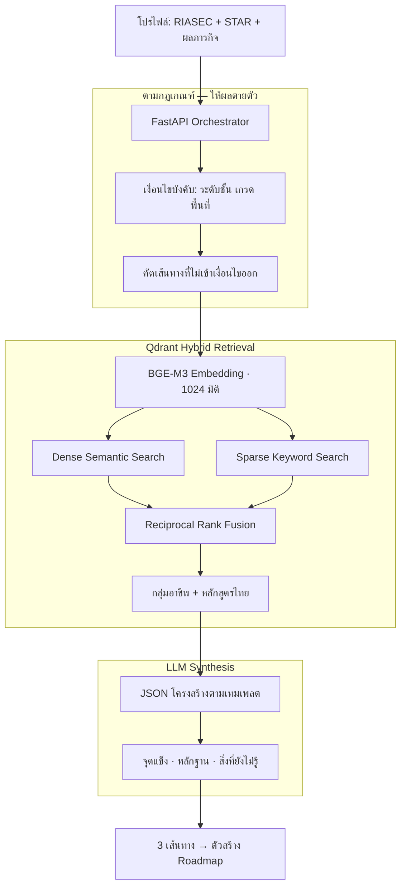
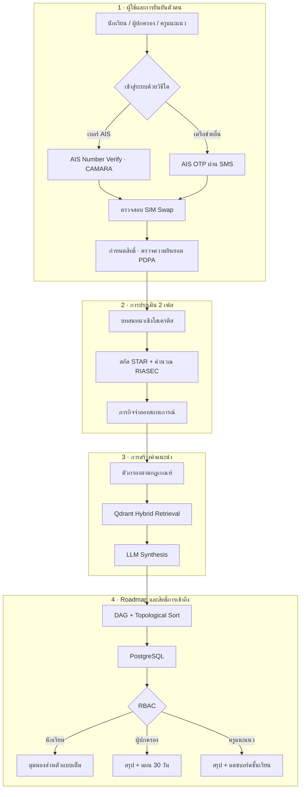
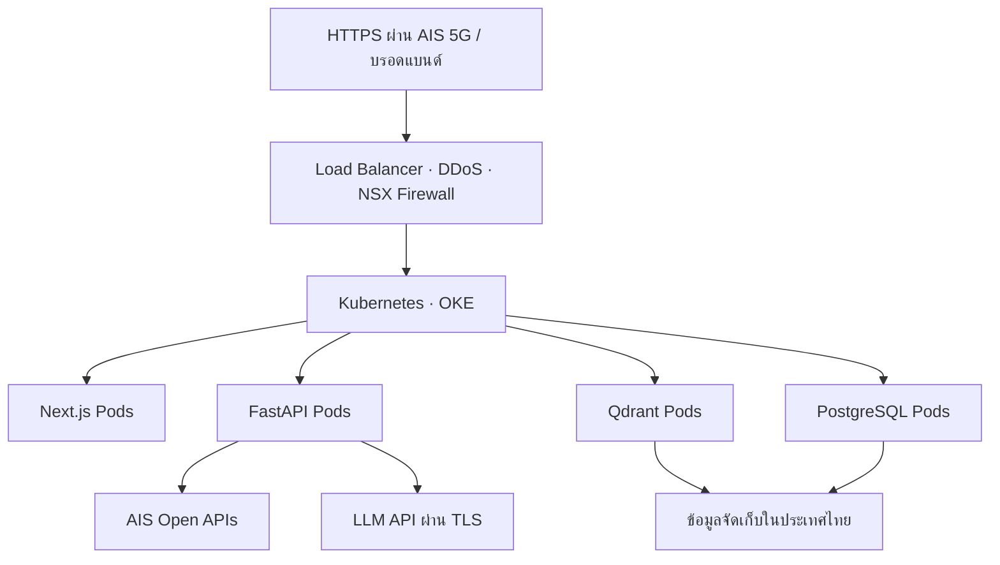
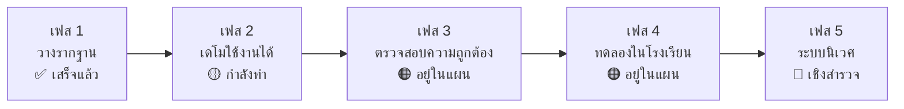

<a id="top"></a>

<p align="center">
  
</p>

<p align="center">
  <b>ระบบแนะแนวการเรียนและอาชีพสำหรับนักเรียนไทย — สร้างจากบทสนทนา ภารกิจที่ได้ลงมือทำจริง และเหตุผลที่ตรวจสอบได้</b>
</p>

<p align="center">
  
  
  
  
  
</p>

<p align="center">
  <a href="READMEEN.md">English</a>
  &nbsp;·&nbsp;
  <b>ภาษาไทย</b>
</p>

---

> ### สถานะปัจจุบัน
>
> **ต้นแบบที่ใช้งานได้จริง พร้อมเดโมที่เดินได้ครบวงจร** ผลลัพธ์คำแนะนำมีไว้เพื่อการสำรวจทางเลือกเท่านั้น
> และ**ยังไม่ผ่าน**การตรวจสอบความถูกต้องทางคลินิก ทางการศึกษา หรือทางสถิติ
> แบบประเมินเป็นฉบับย่อและไม่ใช่แบบทดสอบ RIASEC ที่ผ่านการตรวจสอบ
> ข้อมูลเส้นทางเป็นข้อมูลตัวอย่างสำหรับเดโม ยังไม่ได้ตรวจสอบกับแหล่งข้อมูลทางการล่าสุด
> และยังไม่เคยทดลองใช้กับนักเรียนจริง

```bash
git clone https://github.com/winxtxrgit/futureme-ai.git
cd futureme-ai
npm install
npm run dev            # http://localhost:3000 — ไม่ต้องใช้ API key
```

จากนั้น: **เริ่มแบบ Guest → บทสนทนา → ภารกิจ → เส้นทาง → เปรียบเทียบ → แผน 30 วัน**

---

<a id="what-you-can-verify-today"></a>

## สิ่งที่ตรวจสอบได้จริงวันนี้

ทุกข้อด้านล่างมีโค้ดในคลังนี้รองรับ ไม่ใช่เป็นเพียงภาพ Mockup

| คุณทำได้ | อยู่ที่ |
|---|---|
| เริ่มเซสชันแบบ Guest โดยไม่ต้องมีบัญชี และกู้คืนได้หลังรีเฟรช | `lib/session/` |
| ทำบทสนทนาฉบับย่อ พร้อมแถบความคืบหน้า การตรวจสอบข้อมูล และแก้คำตอบได้ | `app/interview/` |
| ส่งภารกิจเชิงพฤติกรรม 1 ภารกิจ และกลับมาแก้ไขได้ | `app/mission/` |
| ได้รับเส้นทางที่อธิบายได้ **1–3 เส้นทาง** หรือไม่ได้เลยเมื่อหลักฐานไม่พอ | `lib/decision-engine/` |
| อ่านเหตุผลที่แต่ละเส้นทางปรากฏ หลักฐาน ข้อจำกัด และคำถามที่ยังไม่มีคำตอบ | `app/routes/` |
| เปรียบเทียบทุกเส้นทางด้วยเกณฑ์เดียวกัน | `app/compare/` |
| สร้างแผน 30 วันพร้อมเช็กอินที่ไม่หายหลังรีเฟรช | `lib/plan/`, `app/plan/` |
| เห็นระบบปฏิเสธที่จะตอบ แทนที่จะเดา | `npm test` → *evidence gates* |
| ยืนยันว่าแอปทำงานได้โดย**ไม่มี** LLM API key | `app/api/explain/` |
| ลบข้อมูลทั้งหมดของคุณ และตรวจสอบว่าหายจริง | `app/privacy/` |
| รันเทสต์ 64 รายการ และเทสต์บนเบราว์เซอร์ 9 รายการ | `npm test`, `npm run test:e2e` |

<sub><a href="#top">↑ กลับขึ้นด้านบน</a></sub>

---

<table>
<tr>
<td align="center" width="33%"><a href="#what-you-can-verify-today"><b>ตรวจสอบได้</b></a><br><sub>สิ่งที่ทำงานได้จริง<br>มีโค้ดรองรับ</sub></td>
<td align="center" width="33%"><a href="#research-foundation"><b>งานวิจัย</b></a><br><sub>ฐานข้อมูล 7 หมวด แหล่งอ้างอิง<br>และข้อมูลที่เราตัดออก</sub></td>
<td align="center" width="33%"><a href="#key-features"><b>ผลิตภัณฑ์</b></a><br><sub>6 ความสามารถหลัก<br>พร้อมสถานะจริง</sub></td>
</tr>
<tr>
<td align="center"><a href="#interface-preview"><b>ประสบการณ์ใช้งาน</b></a><br><sub>ภาพหน้าจอ Aurora<br>และเส้นทางการใช้งาน</sub></td>
<td align="center"><a href="#the-ai-system"><b>ระบบ AI</b></a><br><sub>กฎเป็นผู้ตัดสิน<br>โมเดลเป็นผู้อธิบาย</sub></td>
<td align="center"><a href="#system-architecture"><b>สถาปัตยกรรม</b></a><br><sub>ภาพรวมการทำงาน เทคโนโลยี<br>และความเป็นส่วนตัว</sub></td>
</tr>
<tr>
<td align="center"><a href="#local-development"><b>การพัฒนา</b></a><br><sub>รัน ทดสอบ<br>และอ่านเอนจิน</sub></td>
<td align="center"><a href="#documentation"><b>เอกสารประกอบ</b></a><br><sub>เอกสารเชิงลึก<br>7 ฉบับ</sub></td>
<td align="center"><a href="#current-limitations"><b>ข้อจำกัด</b></a><br><sub>สิ่งที่ยังไม่ผ่านการตรวจสอบ<br>ระบุอย่างตรงไปตรงมา</sub></td>
</tr>
</table>

---

<a id="overview"></a>

## ภาพรวมโปรเจกต์

นักเรียนไทยต้องเลือกสายการเรียนล่วงหน้าหลายปี ก่อนที่จะมีใครช่วยอธิบายว่าสายนั้นจะพาไปสู่อะไร
และผลลัพธ์มาปรากฏหลังเรียนจบ: **ผู้จบการศึกษาระดับอุดมศึกษา 56% ทำงานไม่ตรงสายที่เรียนมา
และอีก 27% ทำงานต่ำกว่าคุณวุฒิของตนเอง** (TDRI, 2025)

เครื่องมือที่ควรจะป้องกันปัญหานี้กลับเป็นแบบทดสอบความสนใจแบบเลือกตอบที่นิ่งอยู่กับที่ — รวมถึงแบบทดสอบ
ที่อยู่ในแพลตฟอร์ม NDLP ของกระทรวงศึกษาธิการเอง เครื่องมือเหล่านี้ขอให้เด็กอายุสิบห้าปี *ระบุ* ความชอบ
ที่เขายังไม่เคยมีโอกาส *ทดลอง* ด้วยซ้ำ

FutureMe AI ทำต่างออกไป ระบบจะชวนคุยด้วยคำถามเชิงโสเครติสสั้น ๆ ให้นักเรียนได้ลงมือทำภารกิจจริง
แล้วเสนอ **3 เส้นทาง แทนที่จะเป็นคำตอบเดียว** โดยแต่ละเส้นทางแสดงหลักฐานที่ใช้ประกอบ
และสิ่งที่ระบบยังไม่รู้อย่างตรงไปตรงมา

<table>
<tr>
<td width="25%" valign="top"><h4>คุย ไม่ใช่กาช่อง</h4><sub>บทสนทนาที่ปรับตามคำตอบ ใช้เทคนิค Socratic Questioning, Motivational Interviewing, Laddering และ STAR เพื่อให้คำตอบมาจากสิ่งที่นักเรียนเคยทำจริง ไม่ใช่สิ่งที่ฟังดูน่าพอใจ</sub></td>
<td width="25%" valign="top"><h4>ลองทำ ไม่ใช่เดา</h4><sub>ภารกิจจำลองสถานการณ์สั้น ๆ ให้หลักฐานเชิงพฤติกรรมที่เป็นอิสระจากบทสนทนา การบอกว่าชอบงานออกแบบ กับการแก้โจทย์ออกแบบได้จริง ไม่ใช่ข้ออ้างเดียวกัน</sub></td>
<td width="25%" valign="top"><h4>3 เส้นทาง ไม่ใช่ทางเดียว</h4><sub>ทางที่สมดุล ทางขยายความสนใจ และทางลงมือและเข้าถึงได้ นำมาเทียบกันแบบเคียงข้าง เพราะการชี้คำตอบเดียวเท่ากับแสดงความมั่นใจที่ระบบไม่ได้มีจริง</sub></td>
<td width="25%" valign="top"><h4>แสดงเหตุผลให้เห็น</h4><sub>ทุกเส้นทางมาพร้อมหลักฐานประกอบ สิ่งที่จะทำให้ข้อสรุปเปลี่ยน และรายการสิ่งที่ยังไม่รู้ การให้คะแนนเป็นแบบตายตัว ข้อมูลเดิมจึงให้ผลลัพธ์เดิมเสมอ</sub></td>
</tr>
</table>

**กลุ่มผู้ใช้งานเป้าหมาย**

| ระดับชั้น | ชั้นปี | การตัดสินใจที่ระบบช่วย |
|---|---|---|
| ประถมปลาย | ป.4 – ป.6 | เปิดโลกให้รู้ว่ามีอาชีพอะไรอยู่บ้าง |
| มัธยมต้น | ม.1 – ม.3 | ทางแยก ม.4 — สายสามัญ สายอาชีวะ หรือระบบทวิภาคี |
| มัธยมปลาย | ม.4 – ม.6 | การเลือกคณะ กลยุทธ์ TCAS การเตรียม TPAT และพอร์ตโฟลิโอ |
| อาชีวศึกษา | ปวช. – ปวส. | เรียนต่อ ปวส./ปริญญาตรี หรือเข้าสู่ตลาดงานโดยตรง |

ผู้ปกครองและครูแนะแนวจะเห็นเฉพาะข้อมูลสรุป — **ต่อเมื่อนักเรียนให้ความยินยอมเท่านั้น
และไม่เห็นบทสนทนาส่วนตัวไม่ว่ากรณีใด**

<sub><a href="#top">↑ กลับขึ้นด้านบน</a></sub>

---

<a id="how-it-works"></a>

## ระบบทำงานอย่างไร



หลักฐาน 2 แหล่งที่เป็นอิสระต่อกันถูกส่งเข้าเอนจินที่ให้ผลตายตัวเพียงตัวเดียว
โมเดลภาษาไม่มีสิทธิ์เลือกคำแนะนำ — หน้าที่ของมันคือดำเนินบทสนทนาและเรียบเรียงคำอธิบายเท่านั้น

<details>
<summary><b>ทำไมต้องแบ่งหน้าที่แบบนี้</b></summary>

<br>

คำแนะนำที่เปลี่ยนไปทุกครั้งที่รันใหม่ ย่อมไม่สามารถนำไปอธิบายให้นักเรียน ผู้ปกครอง
หรือครูแนะแนวยอมรับได้ ดังนั้นการให้คะแนน การคัดกรอง และการเลือกเส้นทาง
จึงเป็นโค้ดธรรมดาที่มีน้ำหนักคงที่ — ข้อมูลเดิมให้ 3 เส้นทางเดิมเสมอ
และตัวเลขทุกตัวย้อนกลับไปหาบรรทัดโค้ดใน `app/decision_engine/` ได้

ส่วน LLM รับผิดชอบสิ่งที่มันทำได้ดีกว่าจริง ๆ คือการดำเนินบทสนทนาภาษาไทยที่ปรับตามคำตอบ
การสกัดโครงสร้าง STAR ออกจากข้อความอิสระ และการเรียบเรียงคำอธิบายที่เด็กอายุสิบห้าจะอ่านจริง

การแบ่งแบบนี้ยังช่วยลดต้นทุนด้วย โมเดลขนาดเล็กที่เก่งภาษาไทย บวก RAG บวก LoRA Adapter
ถูกและเร็วกว่าโมเดลขนาดใหญ่แบบทั่วไป — และองค์ความรู้เฉพาะทางอยู่ในคลังข้อมูลที่ใช้ค้นคืน
ไม่ได้อยู่ในน้ำหนักของโมเดล

</details>

<sub><a href="#top">↑ กลับขึ้นด้านบน</a></sub>

---

<a id="key-features"></a>

## ฟีเจอร์หลัก

| ฟีเจอร์ | ทำอะไร | ทำไมจึงสำคัญ | สถานะ |
|---|---|---|:--|
| **บทสนทนาเชิงโสเครติส** | บทสนทนาที่ปรับน้ำเสียงและคำศัพท์ตามระดับชั้น พร้อมสกัดหลักฐานในรูปแบบ STAR และคะแนน RIASEC | แบบทดสอบเลือกตอบวัดได้แค่สิ่งที่นักเรียนคิดว่าเป็นคำตอบที่ยอมรับได้ แต่บทสนทนาเข้าถึงสิ่งที่เป็นจริง | 🟢 เอนจินเสร็จแล้ว |
| **ภารกิจจำลองสถานการณ์** | ภารกิจสั้น ๆ ที่ได้ลงมือทำ ในทิศทางที่บทสนทนาชี้ไป | ให้หลักฐานเชิงพฤติกรรมที่เป็นอิสระ เมื่อผลขัดแย้งกับบทสนทนา ระบบจะ*แสดง*ความขัดแย้งนั้นให้นักเรียนเห็น แทนที่จะซ่อนไว้ | 🟡 กำลังพัฒนา |
| **เอนจิน 3 เส้นทาง** | ทางที่สมดุล / ทางขยายความสนใจ / ทางลงมือและเข้าถึงได้ แต่ละทางมีหลักฐาน สิ่งที่ยังไม่รู้ และก้าวแรกที่ย้อนกลับได้ | การแนะแนวที่ชี้ผู้ชนะเพียงทางเดียวคือความมั่นใจเกินจริง ทางเลือกที่เทียบกันได้ 3 ทางทำให้การตัดสินใจยังอยู่ในมือนักเรียน | 🟢 เอนจินเสร็จแล้ว |
| **Roadmap แบบโต้ตอบ** | กราฟ DAG ของหมุดหมายตั้งแต่วันนี้จนถึงการเข้าสู่อาชีพ เรียงลำดับด้วย Topological Sort พร้อมเช็กอินรายจุด | เงื่อนไขก่อนหลังเป็นแบบบางส่วนจริง ๆ — ทำพอร์ตโฟลิโอ*ระหว่าง*เตรียมสอบ TPAT ได้ ถ้าใช้เช็กลิสต์จะบังคับลำดับที่ไม่จริง | 🟠 อยู่ในแผน |
| **อาชีวศึกษาเป็นทางเลือกเท่าเทียม** | ครบทั้ง 12 กลุ่มสาขา ปวช. 2567 และระบบทวิภาคี (DVE) ในฐานะทางเลือกชั้นหนึ่ง | สายอาชีวะมักถูกมองเป็นทางสำรอง แต่ที่นี่แข่งขันบนเงื่อนไขเดียวกัน | 🟢 อยู่ในระบบแล้ว |
| **การแชร์ที่ต้องขอความยินยอม** | ความยินยอมแยกรายผู้รับ เพิกถอนได้ ผู้ปกครองและครูเห็นเฉพาะข้อมูลสรุป ไม่เห็นบทสนทนา | ผู้ใช้เป็นผู้เยาว์ ความเป็นส่วนตัวจึงเป็นข้อกำหนดเชิงสถาปัตยกรรม ไม่ใช่แค่หน้านโยบาย | 🟠 ออกแบบแล้ว |

<sub>🟢 ใช้งานได้ · 🟡 กำลังพัฒนา · 🟠 ออกแบบแล้วแต่ยังไม่ได้สร้าง — รายละเอียดทั้งหมดใน <a href="docs/06-development-plan.md">แผนการพัฒนา</a></sub>

<sub><a href="#top">↑ กลับขึ้นด้านบน</a></sub>

---

<a id="interface-preview"></a>

## ตัวอย่างหน้าจอ

### หน้าจอต้นแบบที่สร้างเสร็จแล้ว

ถ่ายจากแอปที่รันอยู่จริงด้วย Playwright ไม่ใช่ภาพ Mockup

<table>
<tr>
<td width="50%"><a href="assets/screenshots/app/landing-desktop.png"></a><br><b>หน้าแรก</b> · <sub>สร้างแล้ว</sub><br><sub>เริ่มแบบ Guest ได้ทันที ไม่ต้องมีบัญชีก็ทำได้ครบทั้งกระบวนการ</sub></td>
<td width="50%"><a href="assets/screenshots/app/interview-desktop.png"></a><br><b>บทสนทนา</b> · <sub>สร้างแล้ว</sub><br><sub>มีแถบความคืบหน้า แก้คำตอบได้ ตรวจสอบข้อมูล และแสดงป้าย “แบบประเมินฉบับย่อสำหรับต้นแบบ” ชัดเจน</sub></td>
</tr>
<tr>
<td width="50%"><a href="assets/screenshots/app/routes-desktop.png"></a><br><b>3 เส้นทาง</b> · <sub>สร้างแล้ว</sub><br><sub>น้ำหนักภาพเท่ากัน ปุ่มเหมือนกัน ไม่มีผู้ชนะ ระดับหลักฐานสื่อด้วยรูปทรงและคำ ไม่ใช้สีเพียงอย่างเดียว ในภาพนี้ระบบตรวจพบว่าบทสนทนาและภารกิจให้ผลขัดแย้งกัน</sub></td>
<td width="50%"><a href="assets/screenshots/app/compare-desktop.png"></a><br><b>การเปรียบเทียบ</b> · <sub>สร้างแล้ว</sub><br><sub>ใช้เกณฑ์เดียวกันกับทุกเส้นทาง แสดงคะแนนเป็นช่วงกว้าง เพราะการบอกเปอร์เซ็นต์ละเอียดจะสื่อความแม่นยำที่ระบบไม่มีจริง</sub></td>
</tr>
<tr>
<td width="50%"><a href="assets/screenshots/app/plan-desktop.png"></a><br><b>แผน 30 วัน</b> · <sub>สร้างแล้ว</sub><br><sub>เป้าหมายรายสัปดาห์ เช็กอินที่บันทึกไว้ และงานเพิ่มเติมที่ระบบใส่ให้ตามช่องว่างที่ตรวจพบ</sub></td>
<td width="50%"><a href="assets/screenshots/app/insufficient-desktop.png"></a><br><b>สถานะไม่มีเส้นทาง</b> · <sub>สร้างแล้ว</sub><br><sub>เมื่อหลักฐานไม่เพียงพอ ระบบจะไม่เสนอเส้นทางใดเลยและบอกตรง ๆ แทนที่จะเติมให้ครบ 3 ทาง</sub></td>
</tr>
</table>

<details>
<summary><b>หน้าจอบนมือถือ ความปลอดภัย และความเป็นส่วนตัว</b></summary>

<br>

<table>
<tr>
<td width="33%"><a href="assets/screenshots/app/interview-mobile.png"></a><br><sub><b>บทสนทนา</b> · มือถือ</sub></td>
<td width="33%"><a href="assets/screenshots/app/routes-mobile.png"></a><br><sub><b>เส้นทาง</b> · มือถือ การ์ดเรียงต่อกัน</sub></td>
<td width="33%"><a href="assets/screenshots/app/plan-mobile.png"></a><br><sub><b>แผน 30 วัน</b> · มือถือ</sub></td>
</tr>
<tr>
<td><a href="assets/screenshots/app/safety-desktop.png"></a><br><sub><b>หยุดพักเพื่อความปลอดภัย</b> — ระบบหยุดให้คำแนะนำ และเสนอช่องทางขอความช่วยเหลือ</sub></td>
<td><a href="assets/screenshots/app/privacy-mobile.png"></a><br><sub><b>ความเป็นส่วนตัว</b> — เก็บอะไรบ้าง พร้อมปุ่มลบ</sub></td>
<td><a href="assets/screenshots/app/compare-mobile.png"></a><br><sub><b>การเปรียบเทียบ</b> · มือถือ เลื่อนตารางแนวนอน</sub></td>
</tr>
</table>

</details>

<details>
<summary><b>งานออกแบบเชิงคอนเซปต์ — ยังไม่ได้สร้าง</b></summary>

<br>

ทิศทางการออกแบบ **Aurora** ที่คัดเลือกจาก 11 คอนเซปต์ ภาพเหล่านี้เป็น Mockup ความละเอียดสูง
ของผลิตภัณฑ์ฉบับสมบูรณ์ตามที่ตั้งใจไว้ และมีหน้าจอที่ยังไม่มีอยู่ในโค้ด

<table>
<tr>
<td width="50%"><a href="assets/screenshots/01-landing-desktop.png"></a><br><b>หน้าแรก</b> · <sub>คอนเซปต์</sub></td>
<td width="50%"><a href="assets/screenshots/02-socratic-interview.png"></a><br><b>บทสนทนาเชิงโสเครติส</b> · <sub>คอนเซปต์</sub></td>
</tr>
<tr>
<td width="50%"><a href="assets/screenshots/03-three-routes.png"></a><br><b>3 เส้นทาง</b> · <sub>คอนเซปต์</sub><br><sub>สังเกตว่า Mockup นี้ใส่ปุ่มทึบให้การ์ดเดียว ซึ่งสื่อว่ามีผู้ชนะ หน้าจอที่สร้างจริงได้แก้จุดนี้แล้ว</sub></td>
<td width="50%"><a href="assets/screenshots/04-student-dashboard.png"></a><br><b>หน้าจอส่วนตัวของนักเรียน</b> · <sub>คอนเซปต์</sub><br><sub>พื้นที่ส่วนตัวของนักเรียนเอง <b>ไม่ใช่</b>หน้าจอครูแนะแนว ซึ่งยังไม่ได้ออกแบบและยังไม่ได้สร้าง</sub></td>
</tr>
</table>

→ ระบบการออกแบบฉบับเต็มใน [03 · User Experience](docs/03-user-experience.md)

</details>

<sub><a href="#top">↑ กลับขึ้นด้านบน</a></sub>

---

<a id="the-ai-system"></a>

## ระบบ AI



5 เกณฑ์ แต่ละเกณฑ์ให้คะแนน 0–100 แล้วรวมเป็นคะแนนถ่วงน้ำหนักเดียว
**ความเป็นไปได้จริงอยู่อันดับสองที่ 25%** — เพราะคำแนะนำที่นักเรียนจ่ายไม่ไหว เดินทางไปไม่ถึง
หรือคุณสมบัติทางการเรียนไม่ผ่าน ไม่นับเป็นคำแนะนำ

<details>
<summary><b>กระบวนการทำงานฉบับเต็ม</b></summary>

<br>



**ทำไมต้องใช้ Hybrid Retrieval** คำค้นในบริบทการแนะแนวภาษาไทยผสมระหว่างความหมายเชิงบริบท
กับคำเฉพาะเจาะจง เช่น ชื่อคณะ รหัสวิชา TPAT รหัสคุณวุฒิ TPQI ซึ่ง Vector Search ล้วน ๆ ค้นได้ไม่ดี
ระบบจึงรวมผลจาก Dense และ Sparse เข้าด้วยกันด้วย Reciprocal Rank Fusion

**ทำไม LLM ต้องระบุสิ่งที่ยังไม่รู้** ทุกเส้นทางที่ระบบสร้างขึ้นต้องมีช่อง
“สิ่งที่เรายังไม่แน่ใจ” เป็นข้อบังคับ ระบบแนะนำที่ไม่เคยแสดงความไม่แน่นอนเลย
ไม่กำลังโกหกก็กำลัง Overfit — และสำหรับการตัดสินใจที่มีผลระยะยาวขนาดนี้
ระบบจำเป็นต้องบอกว่าอะไรที่มันยังไม่รู้

</details>

<details>
<summary><b>สิ่งที่ยังทำไม่ได้ — โปรดอ่านก่อนเชื่อการสาธิต</b></summary>

<br>

| ข้อจำกัด | ผลที่ตามมา |
|---|---|
| **ชุดข้อมูล QLoRA ใช้งานไม่ได้** — ไฟล์ train และ test เหมือนกันทุกไบต์ มีแค่ 10 ตัวอย่าง | ยังไม่มีการประเมินผลการ Fine-tune ใด ๆ จึงไม่มีตัวเลขประเมินผล และไม่ควรอ้างว่ามี |
| **ไม่มีชุดข้อมูลประเมินผลที่เป็นอิสระ** | ไม่สามารถวัดคุณภาพคำแนะนำได้ จึงอ้าง “ความแม่นยำ” ไม่ได้ในทุกรูปแบบ |
| **แบบประเมิน RIASEC ยังไม่ผ่านการตรวจสอบ** | 30 ข้อที่เขียนขึ้นจากกรอบทฤษฎีของ Holland ยังไม่เคยผ่านการตรวจสอบเชิงจิตมิติจากผู้เชี่ยวชาญ |
| **เกณฑ์ให้คะแนนภารกิจยังไม่ผ่านการตรวจสอบ** | มาตรฐานเดียวกัน |
| **ระบบสำรอง Embedding ทำงานอยู่** ในจุดที่ไม่มีน้ำหนัก BGE-M3 | ใช้ค่าแฮชแบบตายตัวแทน Embedding จริง เป็นเพียงความสะดวกระหว่างพัฒนา ผลลัพธ์ที่ได้ไม่มีความหมาย |
| **ยังไม่มีการตรวจสอบอคติ** ทั้งด้านเพศ ภูมิภาค ขนาดโรงเรียน และสถานะทางเศรษฐกิจ | ยังไม่ทราบว่าเอนจินชี้นำนักเรียนบางกลุ่มอย่างเป็นระบบหรือไม่ |
| **ยังไม่มีการทดลองใช้กับนักเรียนจริง** | ข้อความทุกข้อในคลังนี้ที่พูดถึงประสิทธิผล เป็นเป้าหมายการออกแบบ ไม่ใช่ผลที่วัดได้ |

ทุกข้อถูกติดตามไว้ใน [07 · แผนการพัฒนา](docs/07-roadmap.md)

</details>

→ รายละเอียดฉบับเต็มใน [04 · ระบบ AI](docs/04-ai-system.md)

<sub><a href="#top">↑ กลับขึ้นด้านบน</a></sub>

---

<a id="system-architecture"></a>

## สถาปัตยกรรมระบบ



<details>
<summary><b>สถาปัตยกรรมความเป็นส่วนตัว — คลาวด์ให้อะไร และไม่ให้อะไร</b></summary>

<br>

ผู้ใช้งานเป็นผู้เยาว์ ความเป็นส่วนตัวจึงเป็นข้อกำหนดเชิงสถาปัตยกรรม ไม่ใช่หน้านโยบาย

- **บทสนทนาจะไม่ถูกแชร์ให้ผู้ปกครองหรือครูแนะแนว** ทั้งสองฝ่ายเห็นเฉพาะข้อมูลสรุปที่ประมวลแล้ว และไม่มีทางลัดข้ามข้อกำหนดนี้ ทั้งนี้เป็นการรับประกันเรื่อง*สิทธิ์การเข้าถึง* ว่าใครมีสิทธิ์อ่านข้อมูล **ไม่ใช่**ข้ออ้างที่แรงกว่าว่าข้อมูลไม่เคยออกจากเครื่องเลย สำหรับโหมด Guest ในต้นแบบที่สร้างแล้ว ข้ออ้างที่แรงกว่านั้นก็เป็นจริงด้วย เพราะไม่มีการส่งข้อมูลออกไปไหนทั้งสิ้น ดู [08 · Privacy](docs/08-privacy-and-data.md)
- **ความยินยอมแยกตามผู้รับแต่ละราย** มองเห็นได้บนหน้าจอ และเพิกถอนได้
- **สิทธิ์ผู้ปกครองต้องผ่านการยืนยันความสัมพันธ์** ส่วนครูแนะแนวต้องมีนักเรียนอยู่ในความดูแล
- **โหมด Guest** ใช้งานได้ครบทั้งกระบวนการโดยไม่ต้องมีบัญชีและไม่มีการเก็บอัตลักษณ์
- เก็บข้อมูลเท่าที่จำเป็น กำหนดระยะเวลาจัดเก็บ และบันทึกร่องรอยการเข้าถึงข้อมูลนักเรียนทุกครั้ง

**ประเด็นที่ต้องแยกให้ชัด** AIS Cloud ให้การจัดเก็บข้อมูลภายในประเทศและการรับรอง ISO 27001 /
27018 ซึ่งครอบคลุมว่าข้อมูลอยู่ที่ไหนและศูนย์ข้อมูลบริหารจัดการอย่างไร แต่**ไม่ได้**ทำให้เกิดการปฏิบัติตาม
PDPA โดยอัตโนมัติ การจัดการความยินยอม การควบคุมสิทธิ์ การย่อสัดส่วนข้อมูล ระยะเวลาจัดเก็บ
และการกำกับดูแลผู้ประมวลผล เป็นความรับผิดชอบในระดับแอปพลิเคชัน
การเหมารวมสองเรื่องนี้เข้าด้วยกันคือสาเหตุที่พบบ่อยที่สุดที่ทำให้โปรเจกต์ลักษณะนี้พลาดเรื่องการปฏิบัติตามกฎหมาย

</details>

<details>
<summary><b>เป้าหมายการติดตั้งและการเชื่อมต่อกับระบบกระทรวง</b></summary>

<br>



ภาระงานมาเป็นช่วงและคาดการณ์ได้ — ครูแนะแนวเปิดใช้งานพร้อมกันทั้งห้องเรียน
ซึ่งเหมาะกับการปรับขนาดคอนเทนเนอร์อัตโนมัติมากกว่าการจองทรัพยากรแบบคงที่

> **สถานะ** ออกแบบจากสเปกที่ AIS Cloud เผยแพร่ **ยังไม่ได้ติดตั้งจริง**
> และยังไม่มีการวัดค่าความจุหรือความหน่วงใด ๆ

**ระบบนิเวศของกระทรวง** ส่วนแนะแนวของ NDLP เป็นแบบทดสอบ RIASEC ที่นิ่งอยู่กับที่ —
ซึ่งตรงกับช่องว่างที่ผลิตภัณฑ์นี้เข้าไปเติมพอดี และ DEEP ก็ให้ระบบ SSO ระดับประเทศ
ความสอดคล้องนี้จึงน่าสนใจ แต่**ไม่ได้**แปลว่าตกลงกันแล้ว การเชื่อมต่อขึ้นอยู่กับเอกสาร API
อย่างเป็นทางการ สิทธิ์การเข้าถึงทางเทคนิค และความร่วมมือที่เป็นทางการ ซึ่งยังไม่มีสักอย่าง
เรื่องนี้จึงเป็นเพียงรายการในแผนการพัฒนาเท่านั้น

</details>

→ รายละเอียดฉบับเต็มใน [05 · สถาปัตยกรรมระบบ](docs/05-system-architecture.md)

<sub><a href="#top">↑ กลับขึ้นด้านบน</a></sub>

---

<a id="technology-stack"></a>

## เทคโนโลยีที่ใช้

| ชั้น | เทคโนโลยี | เหตุผล |
|---|---|---|
| Frontend | Next.js | SSR ช่วยให้โหลดครั้งแรกเร็วบนเครือข่ายมือถือ |
| Backend | FastAPI · Python | ตรวจสอบข้อมูลด้วย Pydantic ตลอดสาย และใช้ภาษาเดียวกับเครื่องมือ ML |
| Vector DB | Qdrant | รองรับ Hybrid Search แบบ dense + sparse ในคำสั่งเดียว |
| Relational DB | PostgreSQL | เก็บโปรไฟล์ Roadmap บันทึกความยินยอม และร่องรอยการเข้าถึง |
| Embeddings | BAAI/BGE-M3 · 1024 มิติ | รองรับหลายภาษา และทำงานกับภาษาไทยได้ดี |
| LLM | LLM API ที่รองรับภาษาไทย (ระดับ Claude / Typhoon) | ใช้เพื่อสนทนาและอธิบายเท่านั้น ไม่ใช่เพื่อเลือกคำตอบ |
| Fine-tuning | QLoRA Adapter | ปรับโทนภาษาไทยด้วยต้นทุนต่ำ *(ชุดข้อมูลยังใช้งานไม่ได้)* |
| Orchestration | Docker → Kubernetes (OKE) | ปรับขนาดอัตโนมัติรองรับการใช้งานพร้อมกันทั้งห้องเรียน |
| Cloud | AIS Cloud powered by OCI | จัดเก็บข้อมูลในประเทศไทย *(เป็นเป้าหมาย ยังไม่ได้ติดตั้ง)* |
| Identity | AIS Open APIs — Number Verify, OTP, SIM Swap | ไม่ต้องใช้รหัสผ่าน เหมาะกับผู้เยาว์ และป้องกันการยึดบัญชี |

<sub><a href="#top">↑ กลับขึ้นด้านบน</a></sub>

---

<a id="research-foundation"></a>

## ฐานงานวิจัย

คลังข้อมูลวิจัย 7 หมวดถูกจัดทำขึ้นก่อนเริ่มงานออกแบบใด ๆ

<table>
<tr>
<td width="50%" valign="top">

**01 · สถิติการทำงานไม่ตรงสาย**
<sub>TDRI 2025: 56% ทำงานไม่ตรงสาย 27% ทำงานต่ำกว่าคุณวุฒิ <i>(เป็นตัวเลขที่รายงานไว้ ยังไม่ได้ย้อนกลับไปหาหน้าอ้างอิงที่แน่ชัด)</i> · OECD: การทำงานไม่ตรงสายเพียงอย่างเดียวแทบไม่มีผลต่อรายได้ แต่รายได้จะต่ำกว่าราว 25% เมื่อ<b>ไม่ตรงสายร่วมกับ</b>การทำงานต่ำกว่าคุณวุฒิ · WEF 2025: 39% ของชุดทักษะจะเปลี่ยนภายในปี 2030</sub>

**02 · หลักสูตรการศึกษาไทย**
<sub>แผนการเรียน ม.4 จำนวน 5 แผน · 12 กลุ่มสาขา ปวช. 2567 · โครงสร้าง TCAS ปัญหาไม่ได้อยู่ที่ทางเลือกมีน้อย แต่อยู่ที่ไม่มีใครอธิบายว่าแต่ละทางพาไปไหน</sub>

**03 · การแม็ปอาชีพและทักษะ**
<sub>5 กลุ่มอาชีพ เชื่อมจากสายการเรียน → คณะ → ทักษะที่นายจ้างต้องการจริง อ้างอิง TPQI, O*NET, ESCO</sub>

**04 · ระเบียบวิธีการสัมภาษณ์**
<sub>Socratic Questioning, Motivational Interviewing, RIASEC, Laddering และ STAR — 5 เทคนิคที่ผสานกันเพื่อผ่านพ้นคำตอบที่เด็กคิดว่าสังคมยอมรับ</sub>

</td>
<td width="50%" valign="top">

**05 · แพลตฟอร์มของกระทรวง**
<sub>ศึกษาระบบ NDLP และ DEEP โดยพบว่าส่วนแนะแนวของ NDLP เป็นแบบทดสอบ RIASEC ที่นิ่ง ไม่มีการโต้ตอบและไม่มีการติดตามผล</sub>

**06 · โครงสร้างพื้นฐานคลาวด์**
<sub>การจัดเก็บข้อมูลในประเทศของ AIS Cloud, คอนเทนเนอร์บน OKE, CAMARA Open APIs พร้อมระบุข้อควรระวังเรื่อง PDPA อย่างชัดเจน</sub>

**07 · พิมพ์เขียวระบบ**
<sub>ผังการทำงานภาพรวม พร้อมผังระบบย่อยอีก 6 ระบบ ตั้งแต่การยืนยันตัวตนจนถึงการติดตั้งใช้งาน</sub>

<br>

**ข้อมูลที่เราตัดออก**
<sub>ตัวเลข 4 รายการที่หาแหล่งอ้างอิงต้นทางไม่ได้ ถูกตรวจสอบและตัดออก และต้องไม่นำกลับมาใช้อีก ได้แก่ ข้ออ้าง “ทำงานไม่ตรงสาย 52%” · “นายจ้าง 65% ต้องการประสบการณ์” ในฐานะข้ออ้างเหมารวม · “85% ทำงานเสริมอีกงาน” · และตัวเลข WEF ที่อ้างผิดเป็น 44% ทั้งที่ตัวเลขจริงคือ 39%</sub>

</td>
</tr>
</table>

→ ฐานหลักฐานและดัชนีแหล่งอ้างอิงฉบับเต็มใน [02 · งานวิจัยและหลักฐาน](docs/02-research-and-evidence.md)

<sub><a href="#top">↑ กลับขึ้นด้านบน</a></sub>

---

<a id="project-status"></a>

## สถานะโปรเจกต์

หมุดหมาย 4 ข้อเสร็จสมบูรณ์แล้ว ได้แก่ การตรวจสอบข้อมูลและข้ออ้าง เอนจินตัดสินใจหลายระดับชั้น
Schema พร้อม RAG Pipeline และชุดตรวจสอบความถูกต้อง

| องค์ประกอบ | สถานะ | ประมาณการ | สิ่งที่เหลือ |
|---|---|--:|---|
| ฐานงานวิจัย 7 หมวด | 🟢 เสร็จสมบูรณ์ | 100% | — |
| เอนจินตัดสินใจ — RIASEC, STAR, Matrix, Routing | 🟢 เสร็จสมบูรณ์ | 100% | ปรับค่าตามผลลัพธ์จริง |
| Schema และสัญญา API | 🟢 เสร็จสมบูรณ์ | 100% | — |
| ระบบการออกแบบและ Mockup Aurora | 🟢 เสร็จสมบูรณ์ | 100% | หน้าจอที่เหลือ |
| **เดโมครบวงจร** — Guest → บทสนทนา → ภารกิจ → เส้นทาง → เปรียบเทียบ → แผน | 🟢 สร้างแล้ว | 100% | — |
| **เอนจินแบบตายตัวใน TypeScript** รองรับผล 0–3 เส้นทาง | 🟢 สร้างแล้ว | 100% | ค่าน้ำหนักยังไม่ได้ปรับตามผลลัพธ์จริง |
| **เซสชัน Guest และการกู้คืนหลังรีเฟรช** | 🟢 สร้างแล้ว | 100% | — |
| **ชุดเทสต์** — 64 unit/integration และ 9 end-to-end | 🟢 สร้างแล้ว | 100% | — |
| **กฎความปลอดภัยระดับต้นแบบ** | 🟢 สร้างแล้ว | 100% | ระดับคำสำคัญเท่านั้น ยังไม่ผ่านการตรวจสอบ |
| บัญชีผู้ใช้ การแชร์ และการเก็บข้อมูลบนเซิร์ฟเวอร์ | 🟠 อยู่ในแผน | 0% | ยังไม่เริ่ม มีเฉพาะโหมด Guest |
| RAG Pipeline — Qdrant + BGE-M3 | 🟠 อยู่ในแผน | ~10% | ต้นแบบใช้คลังข้อมูล JSON ตั้งต้น |
| หน้าจอ Roadmap แบบ DAG โต้ตอบได้ | 🟠 อยู่ในแผน | ~20% | ปัจจุบันแผนเป็นเทมเพลต 4 สัปดาห์แบบเส้นตรง |
| การเชื่อมต่อ AIS Open API | 🟠 อยู่ในแผน | ~15% | ต้องใช้สิทธิ์นักพัฒนา |
| แดชบอร์ดครูแนะแนว | 🟠 อยู่ในแผน | ~15% | ออกแบบแล้ว ยังไม่ได้สร้าง |
| การ Fine-tune ด้วย QLoRA | 🔴 ติดปัญหา | ~10% | ชุดข้อมูลใช้งานไม่ได้ |
| การตรวจสอบแบบประเมิน | 🔴 ยังไม่เริ่ม | 0% | ต้องใช้ผู้เชี่ยวชาญด้านการวัดผล |
| การทดลองใช้ในโรงเรียน | 🔴 ยังไม่เริ่ม | 0% | ต้องรอทุกข้อข้างต้น |

> **ตัวเลขเปอร์เซ็นต์เป็นการประมาณการของทีมว่าทำขอบเขตงานไปแล้วเท่าใด ไม่ใช่ค่าที่วัดได้**
> ใช้เพื่อบอกความคืบหน้าเชิงเปรียบเทียบเท่านั้น และควรอ่านเป็นค่าโดยประมาณ

<sub><a href="#top">↑ กลับขึ้นด้านบน</a></sub>

---

<a id="roadmap"></a>

## แผนการพัฒนา



| เฟส | จุดโฟกัส | เงื่อนไขผ่านไปเฟสถัดไป |
|---|---|---|
| **1 · วางรากฐาน** | งานวิจัย เอนจินตัดสินใจ Schema ระบบการออกแบบ | ✅ ผ่านแล้ว |
| **2 · เดโมใช้งานได้** | เส้นทางเดียวที่ครบวงจร: สนทนา → ภารกิจ → 3 เส้นทาง → Roadmap → สรุปที่ยินยอมให้ครู | นักเรียนทำได้จนจบโดยไม่ต้องมีนักพัฒนาเข้าไปแตะ |
| **3 · ตรวจสอบความถูกต้อง** | แก้ชุดข้อมูล QLoRA · ตรวจสอบแบบประเมิน · สร้างชุดข้อมูลประเมินผล · ตรวจสอบอคติ · เส้นทางส่งต่อกรณีฉุกเฉิน | ผ่านการตรวจสอบแบบประเมินจากผู้เชี่ยวชาญอิสระ |
| **4 · ทดลองในโรงเรียน** | โรงเรียนร่วมโครงการ กระบวนการขอความยินยอม การอบรมครู และการวัดผล | มีหลักฐานว่านักเรียนตัดสินใจได้และยังอธิบายเหตุผลได้ในภายหลัง |
| **5 · ระบบนิเวศ** | DEEP SSO, เนื้อหา NDLP, AIS API บนระบบจริง | มีความร่วมมือที่ลงนามแล้ว |

<details>
<summary><b>เงื่อนไขที่จะทำให้เราหยุดโครงการ</b></summary>

<br>

บันทึกไว้อย่างตั้งใจ โครงการนี้ไม่ควรเดินหน้าสู่การทดลองในโรงเรียน หาก:

- การตรวจสอบพบว่าแบบประเมิน RIASEC ที่ใช้ ไม่ได้วัดในสิ่งที่อ้างว่าวัด
- การตรวจสอบอคติพบว่าเอนจินชี้นำนักเรียนอย่างเป็นระบบตามเพศ ภูมิภาค หรือขนาดโรงเรียน
- ครูแนะแนวรายงานว่าผลลัพธ์เข้าไปแทนที่ดุลยพินิจของครู แทนที่จะสนับสนุน
- การจัดการความยินยอมและความเป็นส่วนตัวไม่สามารถเป็นไปตามข้อกำหนด PDPA สำหรับผู้เยาว์ได้

การสร้างเครื่องมือแนะแนวที่ค่อย ๆ ปิดทางเลือกของเด็กโดยไม่มีใครรู้ตัว ย่อมแย่กว่าการไม่สร้างอะไรเลย

</details>

→ แผนการพัฒนาฉบับเต็มใน [07 · แผนการพัฒนา](docs/07-roadmap.md)

<sub><a href="#top">↑ กลับขึ้นด้านบน</a></sub>

---

<a id="documentation"></a>

## เอกสารประกอบ

> เอกสารเชิงลึกทั้ง 7 ฉบับปัจจุบันมีเฉพาะภาษาอังกฤษ ส่วน README ทั้งสองภาษาให้ข้อมูลเทียบเท่ากันครบถ้วน

| เอกสาร | เนื้อหา |
|---|---|
| [01 · Project Overview](docs/01-project-overview.md) | ปัญหา แนวทาง กลุ่มผู้ใช้ และขอบเขตตามความเป็นจริง |
| [02 · Research and Evidence](docs/02-research-and-evidence.md) | งานวิจัย 7 หมวด แหล่งอ้างอิง และข้ออ้างที่ถูกตัดออก |
| [03 · User Experience](docs/03-user-experience.md) | การเปรียบเทียบคอนเซปต์ ระบบการออกแบบ Aurora เส้นทางผู้ใช้ สิทธิ์ และการเข้าถึง |
| [04 · AI System](docs/04-ai-system.md) | การประเมิน 2 เฟส ตารางตัดสินใจ การค้นคืน การสร้างข้อความ และข้อจำกัดที่ทราบ |
| [05 · System Architecture](docs/05-system-architecture.md) | ภาพรวมการทำงาน เทคโนโลยี Roadmap แบบ DAG ความเป็นส่วนตัว การติดตั้ง และ API |
| [06 · Development Plan](docs/06-development-plan.md) | หมุดหมาย สถานะองค์ประกอบ อุปสรรค ก้าวต่อไป และทีมงาน |
| [07 · Roadmap](docs/07-roadmap.md) | 5 เฟส ข้อกำหนดการตรวจสอบ และเงื่อนไขการหยุดโครงการ |
| [08 · Privacy and Data Flow](docs/08-privacy-and-data.md) | เก็บข้อมูลอะไร ไปที่ไหน อะไรเปลี่ยนไป และอะไรที่ยังไม่ได้สร้าง |

<sub><a href="#top">↑ กลับขึ้นด้านบน</a></sub>

---

<a id="local-development"></a>

## การติดตั้งและพัฒนา

ทุกคำสั่งด้านล่างถูกรันในคลังนี้แล้ว เดโมพื้นฐาน**ไม่ต้องใช้ตัวแปรสภาพแวดล้อมและไม่ต้องใช้ API key**

```bash
git clone https://github.com/winxtxrgit/futureme-ai.git
cd futureme-ai
npm install
npm run dev
```

เปิด <http://localhost:3000> แล้วกด **Start as guest**

| คำสั่ง | ทำอะไร | ผลที่ตรวจสอบแล้ว |
|---|---|---|
| `npm install` | ติดตั้ง dependency (ใช้ npm มี lockfile ในคลัง) | ✅ |
| `npm run dev` | เซิร์ฟเวอร์สำหรับพัฒนาที่พอร์ต 3000 | ✅ |
| `npm run build` | Build สำหรับ production | ✅ คอมไพล์ 9 เส้นทาง |
| `npm run start` | รันไฟล์ที่ build แล้ว | ✅ |
| `npm run typecheck` | `tsc --noEmit` โหมด strict | ✅ 0 ข้อผิดพลาด |
| `npm run lint` | ESLint ผ่าน `next lint` | ✅ 0 คำเตือน |
| `npm test` | Vitest unit + integration | ✅ ผ่าน 64 รายการ |
| `npm run test:e2e:install` | ทำครั้งเดียว: ดาวน์โหลดเบราว์เซอร์ที่ Playwright ใช้ | — |
| `npm run test:e2e` | Playwright end-to-end บนไฟล์ production | ✅ ผ่าน 9 รายการ |

หากการดาวน์โหลดเบราว์เซอร์ของ Playwright ถูกบล็อกในเครื่องคุณ ให้ใช้ Google Chrome ที่ติดตั้งอยู่แล้วแทน
โดยเทสต์ชุดเดียวกัน:

```bash
PW_CHANNEL=chrome npm run test:e2e
```

<details>
<summary><b>ทางเลือก: ชั้นคำอธิบายด้วย AI</b></summary>

<br>

แอปทำงานได้ครบถ้วนโดยไม่ต้องมีส่วนนี้ หน้าที่ของมันคือเรียบเรียงคำอธิบายให้อ่านนุ่มขึ้นเท่านั้น
และไม่มีสิทธิ์เปลี่ยนว่าเส้นทางใดถูกเลือก

```bash
cp .env.example .env.local
# แล้วกำหนดค่า ANTHROPIC_API_KEY ใน .env.local
```

เมื่อไม่มี key `/api/explain` จะคืนค่า `{ "source": "fallback" }` และใช้ข้อความจากเทมเพลตแบบตายตัว
กรณี timeout ผู้ให้บริการขัดข้อง หรือรูปแบบคำตอบผิดเพี้ยน ก็ให้ผลเช่นเดียวกัน —
ทุกกรณีคืนค่า HTTP 200 เพื่อให้แอปไม่พัง ทั้งสองเส้นทางมีเทสต์ end-to-end ครอบคลุม

</details>

<details>
<summary><b>เอนจินแนะนำเส้นทางทำงานอย่างไร</b></summary>

<br>

เป็น TypeScript แบบให้ผลตายตัวใน `lib/decision-engine/` ทำงานในเบราว์เซอร์
คำตอบเดิมให้เส้นทางเดิมเสมอ และตัวเลขทุกตัวย้อนกลับไปหาบรรทัดโค้ดได้

```text
lib/decision-engine/
├── types.ts          มิติ รหัสเหตุผล และรูปแบบผลลัพธ์
├── scoring.ts        Likert → RIASEC, หลักฐานจากภารกิจ, ค่าน้ำหนัก 5 เกณฑ์
├── eligibility.ts    เงื่อนไขบังคับ: ระดับชั้น ค่าใช้จ่าย พื้นที่ ความเก่าของข้อมูล
├── explanations.ts   ข้อความเหตุผลและป้ายระดับหลักฐานแบบตายตัว
└── index.ts          recommend() — ด่านตรวจ การให้คะแนน การทำเครื่องหมายคะแนนเสมอ
```

**ลำดับการทำงาน**

1. **ปรับมาตรฐาน** — Likert 1–5 → 0..1 ต่อมิติ RIASEC ข้อที่ไม่ตอบจะถูก*ตัดออก* ไม่ใช่คิดเป็นศูนย์
2. **หลักฐานจากภารกิจ** — แม็ปตัวเลือกสู่มิติ บวกการตรวจจับคำสำคัญ แล้วปรับเป็นเวกเตอร์ที่สองที่เป็นอิสระ
3. **ด่าน 1** — ตอบน้อยกว่า 8 ข้อ → ไม่คืนเส้นทางใดเลย
4. **ด่าน 2** — โปรไฟล์ราบเกินกว่าจะแยกความต่างได้ → ไม่คืนเส้นทางใดเลย
5. **คุณสมบัติ** — ตัวกรองบังคับให้รหัสเหตุผลที่บล็อก ส่วนคำตอบ “ยังไม่รู้” ไม่บล็อก แต่ขึ้นเป็นข้อสังเกต
6. **ให้คะแนน** — 5 เกณฑ์ถ่วงน้ำหนัก: ความสนใจ 30% ความเป็นไปได้จริง 25% จุดแข็ง 20% รูปแบบการเรียนรู้ 15% ความยืดหยุ่น 10%
7. **ระดับหลักฐาน** — แข็งแรง / ปานกลาง / จำกัด / ต้องสำรวจเพิ่ม โดยดูจาก*ปริมาณสิ่งที่รู้* ไม่ใช่คะแนนที่สูง และจะไม่เป็น “แข็งแรง” เลยหากยังไม่ทำภารกิจ
8. **ด่าน 3** — ถ้าทุกเส้นทางที่เหลือมีหลักฐานไม่เพียงพอ → ไม่คืนเส้นทางใดเลย
9. **คะแนนเสมอ** — ผลต่างไม่เกิน 4 คะแนน ถือว่าเสมอกันและแสดงอย่างเท่าเทียม

**การตัดสินใจเชิงออกแบบที่ควรรู้**

- คืนผล **0 ถึง 3** เส้นทาง ไม่มีการเติมให้ครบ 3
- ความเป็นไปได้จริงถ่วงน้ำหนักเป็นอันดับสอง เพราะเส้นทางที่จ่ายไม่ไหวหรือไปไม่ถึงไม่นับเป็นคำแนะนำ
- ความขัดแย้งระหว่างบทสนทนากับภารกิจจะถูกแสดงให้นักเรียนเห็น ไม่ถูกเฉลี่ยกลบ
- ค่าน้ำหนักมาจากดุลยพินิจการออกแบบ **ไม่ได้**ปรับตามข้อมูลผลลัพธ์จริง เพราะยังไม่มีข้อมูลนั้น

</details>

<details>
<summary><b>โครงสร้างคลังโค้ด</b></summary>

<br>

```text
futureme-ai/
├── README.md                        หน้าเลือกภาษา
├── READMEEN.md                      English
├── READMETH.md                      ภาษาไทย — เอกสารฉบับนี้
├── package.json · package-lock.json
├── .env.example                     ทุกค่าเป็นทางเลือก
├── app/                             Next.js App Router
│   ├── page.tsx                     หน้าแรก
│   ├── interview/ mission/ routes/ compare/ plan/ privacy/
│   └── api/explain/                 ชั้น LLM แบบทางเลือก
├── components/                      Shell, Button, Card, EvidenceBadge, SafetyPause
├── lib/
│   ├── decision-engine/             กฎการแนะนำเส้นทาง
│   ├── plan/                        ตัวสร้างแผน 30 วัน
│   ├── safety/                      กฎความปลอดภัยระดับต้นแบบ
│   └── session/                     เซสชัน Guest และการตรวจสอบ
├── data/                            questions · missions · routes (ข้อมูลตั้งต้น)
├── tests/                           unit + integration (vitest)
├── e2e/                             end-to-end (playwright)
├── assets/
│   ├── banner/ diagrams/
│   └── screenshots/
│       ├── app/                     ถ่ายจากแอปที่รันจริง
│       └── *.png                    Mockup คอนเซปต์ Aurora
├── docs/                            01–08
└── source-materials/
```

</details>

<sub><a href="#top">↑ กลับขึ้นด้านบน</a></sub>

---

<a id="current-limitations"></a>

## ข้อจำกัดในปัจจุบัน

ระบุอย่างตรงไปตรงมา เพราะเดโมที่ใช้งานได้สามารถกลบสิ่งเหล่านี้ไว้ได้ทั้งหมด

| ข้อจำกัด | รายละเอียด |
|---|---|
| **แบบประเมินยังไม่ผ่านการตรวจสอบเชิงจิตมิติ** | มี 12 ข้อ สร้างบนโครงของแบบจำลอง RIASEC ของ Holland ในแอปมีป้ายกำกับว่า “Demo assessment — shortened for prototype evaluation” และไม่ใช่แบบทดสอบ RIASEC |
| **ข้อมูลเส้นทางเป็นเพียงตัวอย่าง** | มี 6 เส้นทางสำหรับเดโม เกณฑ์รับเข้า ค่าใช้จ่าย และชื่อสถาบัน **ยังไม่ได้**ตรวจสอบกับแหล่งข้อมูลทางการล่าสุด แอปแสดงวันที่รวบรวมข้อมูลและเตือนเมื่อข้อมูลเก่าเกินไป |
| **ข้อมูลเส้นทางล้าสมัยได้** | เกณฑ์ TCAS และหลักสูตรเปลี่ยนทุกปี แต่ยังไม่มีกระบวนการอัปเดต |
| **เอนจินใช้กฎระดับต้นแบบ** | ค่าน้ำหนัก 5 เกณฑ์มาจากดุลยพินิจการออกแบบ ไม่ได้ปรับตามผลลัพธ์จริงของนักเรียน เพราะยังไม่มีข้อมูลนั้น |
| **ยังไม่เคยทดลองใช้จริง** | ทุกข้อความที่พูดถึงประสิทธิผลเป็นเป้าหมายการออกแบบ ไม่ใช่ผลที่วัดได้ |
| **ไม่ใช่สิ่งที่มาแทนครูแนะแนว** | เป็นเครื่องมือสนับสนุนการตัดสินใจเพื่อสำรวจทางเลือก ไม่พยากรณ์การสอบติด การได้งาน หรือรายได้ |
| **ระบบดูแลความปลอดภัยมีน้อยมาก** | เป็นกฎคำสำคัญที่ทำงานในเบราว์เซอร์ ไม่ใช่การประเมินความเสี่ยง จะพลาดบางกรณีและจะเตือนผิดพลาดได้ และไม่มีการแจ้งเตือนใครทั้งสิ้น |
| **ชั้น LLM อาจไม่พร้อมใช้งาน** | ตามการออกแบบ มันปิดอยู่หากไม่ได้ตั้ง key และทุกเส้นทางความผิดพลาดจะถอยไปใช้ข้อความแบบตายตัว |
| **ไม่มีบัญชี การแชร์ หรือการเก็บข้อมูลบนเซิร์ฟเวอร์** | มีเฉพาะโหมด Guest หน้าจอผู้ปกครองและครูแนะแนวออกแบบไว้แล้วแต่ยังไม่ได้สร้าง |
| **ข้ออ้างงานวิจัยบางส่วนยังย้อนแหล่งไม่ครบ** | ตัวเลข TDRI ของไทยที่ใช้ในการนำเสนอมากที่สุด ยังไม่มีการบันทึกเลขหน้าและ URL ดู [ตารางแหล่งอ้างอิง](docs/02-research-and-evidence.md#reference-table) |
| **ยังไม่มีการตรวจสอบอคติ** | ยังไม่ทราบว่าเอนจินชี้นำนักเรียนอย่างเป็นระบบตามเพศ ภูมิภาค หรือขนาดโรงเรียนหรือไม่ |

<sub><a href="#top">↑ กลับขึ้นด้านบน</a></sub>

---

<a id="team-and-contact"></a>

## ทีมและการติดต่อ

โปรเจกต์แฮกกาธอนระดับนักเรียน/นักศึกษา สำหรับ **JUMP Thailand Hackathon 2026**
(AIS Academy × NIA) ภายใต้หัวข้อ *AI เพื่ออนาคตการศึกษาไทย*
บทบาทแบ่งตามหน้าที่มากกว่าตำแหน่งทางการ — คนคนเดียวมักรับผิดชอบหลายบทบาท

| หน้าที่ | ความรับผิดชอบ |
|---|---|
| งานวิจัยและข้อมูล | ฐานงานวิจัย 7 หมวด การตรวจสอบข้ออ้าง และการยืนยันแหล่งอ้างอิง |
| ผลิตภัณฑ์และ UX | การสำรวจคอนเซปต์ ระบบการออกแบบ Aurora เส้นทางผู้ใช้ และการเข้าถึง |
| AI และ Backend | เอนจินตัดสินใจ RAG Pipeline บริการ FastAPI และ Schema |
| โครงสร้างพื้นฐาน | สถาปัตยกรรมคลาวด์ การติดตั้งคอนเทนเนอร์ และการออกแบบด้าน PDPA กับความปลอดภัย |
| การตรวจสอบ | การตรวจสอบข้ออ้าง สัญญา API และเนื้อหาด้วยสคริปต์อัตโนมัติ |

ยินดีรับคำถาม ข้อแก้ไข และความร่วมมือ — โปรด
[เปิด Issue](https://github.com/winxtxrgit/futureme-ai/issues) หรือดู
[CONTRIBUTING.md](CONTRIBUTING.md)

**เรายินดีรับการแก้ไขฐานงานวิจัยเป็นพิเศษ** สถิติที่ไม่มีแหล่งอ้างอิงรองรับ 4 รายการ
ถูกตัดออกจากโปรเจกต์นี้ไปแล้ว หากคุณพบรายการที่ห้า เราอยากรู้

---

<p align="center">
<sub>
FutureMe AI เป็นเครื่องมือสนับสนุนการตัดสินใจ ไม่ใช่การพยากรณ์ ไม่รับประกันการสอบติด การได้งาน หรือรายได้<br>
โปรดตรวจสอบเกณฑ์ล่าสุดจากแหล่งข้อมูลทางการ และปรึกษาครูแนะแนวที่มีคุณวุฒิเสมอ
</sub>
</p>

<p align="center">
  <a href="READMEEN.md">English</a>
  &nbsp;·&nbsp;
  <b>ภาษาไทย</b>
</p>

<p align="center"><sub><b>เผยแพร่ภายใต้สัญญาอนุญาต MIT</b> · <a href="#top">↑ กลับขึ้นด้านบน</a></sub></p>
