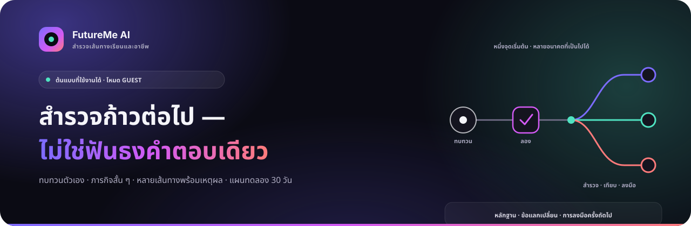
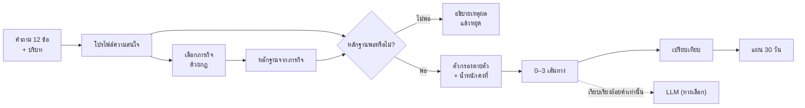
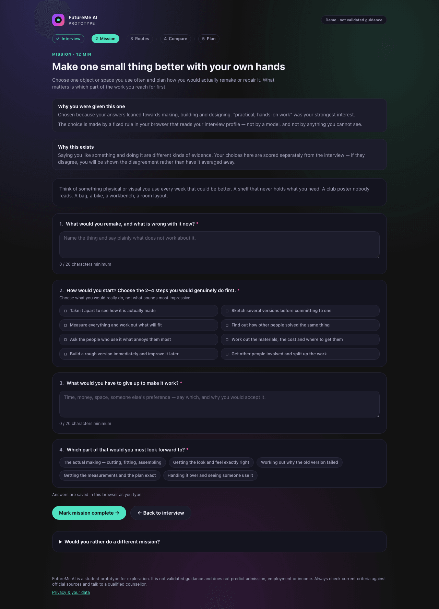

<a id="top"></a>

<p align="center">
  
</p>

# FutureMe AI

<p align="center">
  <strong>เครื่องมือช่วยนักเรียนไทยสำรวจเส้นทางเรียนและอาชีพ ผ่านการทบทวนตัวเอง ภารกิจสถานการณ์สั้น ๆ และหลายทางเลือกที่ตั้งคำถามและเปรียบเทียบได้</strong>
</p>

<p align="center">
  <a href="https://github.com/winxtxrgit/futureme-ai/actions/workflows/ci.yml"></a>
</p>

<p align="center">
  <strong><a href="#try">ทดลองใช้ต้นแบบ →</a></strong>
  &nbsp;·&nbsp;
  <a href="#how">ดูวิธีทำงาน</a>
  &nbsp;·&nbsp;
  <a href="#docs">อ่านเอกสาร</a>
  &nbsp;·&nbsp;
  <a href="READMEEN.md">English</a>
</p>

<p align="center">
  <sub>ต้นแบบที่ใช้งานได้ · อินเทอร์เฟซภาษาอังกฤษ · โหมด guest · ไม่ต้องใช้ API key</sub>
</p>

<p align="center">
  <a href="#what">คืออะไร</a> ·
  <a href="#why">ทำไม</a> ·
  <a href="#try">ทดลองใช้</a> ·
  <a href="#how">วิธีทำงาน</a> ·
  <a href="#difference">จุดต่าง</a> ·
  <a href="#prototype">ต้นแบบ</a> ·
  <a href="#trust">ความน่าเชื่อถือ</a> ·
  <a href="#evidence">หลักฐาน</a> ·
  <a href="#next">ขั้นต่อไป</a> ·
  <a href="#docs">เอกสาร</a>
</p>

---

<a id="what"></a>

## FutureMe AI คืออะไร

FutureMe AI ช่วยเปลี่ยนความรู้สึกว่า **“ไม่รู้จะเลือกอะไร”** ให้กลายเป็น
**“รู้แล้วว่าควรลองสำรวจอะไรต่อ”**

ระบบไม่ได้พยายามทายว่าอาชีพใด “ใช่ที่สุด” นักเรียนจะตอบคำถามสั้น ๆ ลองทำภารกิจหนึ่งชิ้น
แล้วสำรวจเส้นทางเรียนได้สูงสุดสามทาง โดยยังเห็นหลักฐาน ข้อแลกเปลี่ยน
และคำถามที่ระบบยังตอบไม่ได้

ออกแบบมาสำหรับ:

- **นักเรียนมัธยมต้น** ที่กำลังสำรวจสายการเรียนขั้นต่อไป
- **นักเรียนมัธยมปลาย** ที่กำลังเปรียบเทียบทิศทางการศึกษาต่อ
- **นักเรียนอาชีวศึกษา** ที่กำลังชั่งน้ำหนักระหว่างเรียนต่อกับเส้นทางที่เชื่อมกับการทำงาน

FutureMe เป็นเครื่องมือช่วยคิด ไม่ใช่สิ่งทดแทนครูแนะแนวหรือผู้เชี่ยวชาญ

<sub><a href="#top">↑ กลับขึ้นด้านบน</a></sub>

---

<a id="why"></a>

## ทำไมโครงการนี้จึงเกิดขึ้น

นักเรียนมักต้องเลือกทิศทางก่อนจะมีโอกาสลองทำสิ่งนั้นจริง แบบทดสอบครั้งเดียวอาจบอกได้ว่า
“สนใจอะไร” แต่ยังไม่บอกว่าเมื่อลงมือแล้วรู้สึกอย่างไร มีข้อจำกัดใดสำคัญ
หรือข้อมูลแบบไหนที่จะทำให้เปลี่ยนใจ

FutureMe จึงเปลี่ยนคำถามจาก:

> ไม่ใช่ **“ฉันควรเป็นอะไร?”**<br>
> แต่เป็น **“ฉันควรลองสำรวจอะไรต่อ และต้องมีหลักฐานอะไรเพิ่ม?”**

ความไม่แน่ใจจึงไม่ใช่ข้อผิดพลาด เส้นทางหนึ่งอาจมีหลักฐานเพียงเล็กน้อย สองเส้นทางอาจยังสูสีกัน
และถ้าคำตอบยังไม่พอ เอนจินสามารถไม่เสนอเส้นทางเลยแทนการเดา

<sub><a href="#top">↑ กลับขึ้นด้านบน</a></sub>

---

<a id="try"></a>

## ทดลองใช้ต้นแบบ

เส้นทางผู้ใช้แบบ guest ทำงานครบวงจรในเครื่อง โดยใช้ Node.js 20 ขึ้นไป:

```bash
git clone https://github.com/winxtxrgit/futureme-ai.git
cd futureme-ai
npm ci
npm run dev
```

เปิด [http://localhost:3000](http://localhost:3000) กด **Start as guest** แล้วทดลองตามลำดับ:

**Interview → Mission → Routes → Compare → แผน 30 วัน**

ขณะนี้ repository ยังไม่มี public deployment จึงไม่ใส่ลิงก์ “Live Demo” ที่ไม่มีอยู่จริง
ต้นแบบในเครื่องคือหลักฐานของงานส่ง และใช้งานได้โดยไม่ต้องมีบัญชีหรือ API key

<p align="center">
  <a href="assets/screenshots/app/routes-desktop.png"></a>
</p>

<p align="center">
  <sub>หน้าจอจากแอปปัจจุบัน — หลายทิศทางมีน้ำหนักภาพเท่ากัน และผู้ใช้เลือกเปิดหลักฐานเชิงลึกได้เอง</sub>
</p>

<sub><a href="#top">↑ กลับขึ้นด้านบน</a></sub>

---

<a id="how"></a>

## FutureMe ทำงานอย่างไร

1. **ทบทวน** — เก็บความสนใจเบื้องต้น ข้อจำกัดที่มีผลจริง และคำถาม ผ่าน interview แบบคงที่
2. **ลอง** — ทำภารกิจสั้น ๆ ที่เลือกด้วยกฎซึ่งอธิบายได้ และนักเรียนเปลี่ยนภารกิจเองได้
3. **สำรวจ** — แสดงศูนย์ถึงสามทิศทาง โดยไม่สร้าง “ผู้ชนะ” ขึ้นมาเอง
4. **เทียบ** — ดูเกณฑ์เดียวกัน คุณภาพแหล่งข้อมูล ความไม่แน่นอน และข้อแลกเปลี่ยนของแต่ละทาง
5. **ลงมือ** — เปลี่ยนหนึ่งทิศทางให้เป็นแผนทดลอง 30 วันที่เล็กและย้อนกลับได้

### สถาปัตยกรรมของต้นแบบปัจจุบัน



เส้นทางคำแนะนำเป็น TypeScript แบบ deterministic ที่ทำงานในเบราว์เซอร์
หากขอให้ AI เรียบเรียงใหม่ เบราว์เซอร์จะส่งเพียง route id ในแคตตาล็อก
และรหัสเหตุผลตายตัวหลังจากเลือกเส้นทางแล้ว server จะตรวจทั้งสองค่าและแปลงเป็นข้อความตายตัวเอง
โดยไม่รับคำตอบของนักเรียน โมเดลจึงเพิ่ม ลบ หรือสลับลำดับเส้นทางไม่ได้

<details>
<summary><strong>เอนจินเลือกเส้นทางอย่างไร</strong></summary>

<br>

คำตอบช่วง interview สร้างโปรไฟล์ความสนใจที่อิงโครงสร้าง RIASEC เพื่อการสำรวจ
ตัวเลือกในภารกิจสร้างเวกเตอร์หลักฐานชุดที่สอง จากนั้นเอนจินตรวจว่ามีสัญญาณพอหรือไม่
ใช้ข้อจำกัดตายตัวเรื่องระดับการศึกษา ค่าใช้จ่าย และพื้นที่
แล้วให้คะแนนเส้นทางที่ผ่านเกณฑ์จากความสนใจ ความเป็นไปได้จริง จุดแข็งจากภารกิจ
รูปแบบการเรียนรู้ และความยืดหยุ่น

คะแนนที่ใกล้กันจะถูกระบุว่าสูสี หากตอบคำถามความสนใจไม่ถึงแปดข้อ
โปรไฟล์ราบจนไม่มีมิติใดเด่น หรือทุกเส้นทางที่เหลือมีหลักฐานไม่พอ ระบบจะไม่ให้คำแนะนำ

น้ำหนักและเกณฑ์ต่าง ๆ เป็นวิจารณญาณของทีมออกแบบ
ไม่ได้ปรับจากผลลัพธ์จริงของนักเรียน
[อ่านตรรกะการตัดสินใจฉบับเต็ม →](docs/04-ai-system.md)

</details>

<sub><a href="#top">↑ กลับขึ้นด้านบน</a></sub>

---

<a id="difference"></a>

## ทำไม FutureMe จึงต่างออกไป

FutureMe ตั้งใจทำงานเสริมครูแนะแนวและเครื่องมือสำรวจความสนใจที่มีอยู่
สิ่งที่เพิ่มเข้ามาคือช่วงระหว่าง “คิดทบทวน” กับ “ตัดสินใจเรื่องใหญ่”:
**ลองทำสิ่งเล็ก ๆ ก่อน แล้วดูว่าการลงมือนั้นเพิ่มหลักฐานอะไร**

| การประเมินตนเองแบบครั้งเดียว | ต้นแบบ FutureMe |
|---|---|
| ใช้สัญญาณจากการประเมินตนเองหนึ่งชุด | เพิ่มภารกิจสถานการณ์สั้น ๆ เป็นสัญญาณอีกชุด |
| อาจให้ผลลัพธ์หนึ่งชิ้นเพื่อพิจารณา | ให้หลายทางเลือกเพื่อตั้งคำถามและเปรียบเทียบ |
| ระดับคำอธิบายขึ้นอยู่กับเครื่องมือ | แสดงเหตุผล สิ่งที่ยังไม่รู้ แหล่งที่มา และอายุข้อมูลเสมอ |
| อาจหยุดที่ผลลัพธ์ | พาต่อไปสู่การทดลองเล็ก ๆ ที่ย้อนกลับได้ใน 30 วัน |

**ทายให้น้อยลง สำรวจให้มากขึ้น**<br>
**จัดอันดับให้น้อยลง เปิดทางเลือกให้มากขึ้น**<br>
**รับคำแนะนำเฉย ๆ ให้น้อยลง เก็บหลักฐานจากการทำให้มากขึ้น**

<sub><a href="#top">↑ กลับขึ้นด้านบน</a></sub>

---

<a id="prototype"></a>

## ภายในต้นแบบ

### สิ่งที่ทดลองได้วันนี้

- เริ่มแบบ guest และกลับมาทำต่อได้หลัง refresh
- ทำ interview ภาษาอังกฤษแบบคงที่ และเลือกหรือเปลี่ยนภารกิจที่ระบบเสนอ
- ดูเอนจินปฏิเสธการเดาเมื่อหลักฐานยังน้อยเกินไป
- สำรวจศูนย์ถึงสามเส้นทางพร้อมเหตุผล สิ่งที่ยังไม่รู้ สถานะแหล่งข้อมูล และความใหม่ของข้อมูล
- เปรียบเทียบเส้นทางด้วยเกณฑ์เดียวกัน แล้วสร้างแผนสำรวจสี่สัปดาห์
- ลบ guest session ทั้งหมดออกจากเบราว์เซอร์

### สิ่งที่ตั้งใจสร้างต่อ

- เครื่องมือวัดความสนใจและ rubric ของภารกิจที่ผ่านการตรวจสอบ
- บทสนทนาที่ปรับตามผู้ใช้และเขียนขึ้นสำหรับภาษาไทยโดยตรง
- ข้อมูลหลักสูตรและตลาดแรงงานที่มีสิทธิ์ใช้ เป็นปัจจุบัน และตรวจสอบได้
- ภารกิจเพิ่มขึ้นและชุดประเมินอิสระ
- การตรวจอคติและ accessibility ก่อนทดลองกับนักเรียน
- บัญชีและเครื่องมือสำหรับครูแนะแนวที่มี consent หลังผ่านการทบทวนด้านความเป็นส่วนตัว

<table>
<tr>
<td width="33%" valign="top">
<a href="assets/screenshots/app/mission-desktop.png"></a><br>
<strong>ลอง</strong><br><sub>ภารกิจสั้น ๆ ที่เลือกด้วยกฎซึ่งอธิบายได้</sub>
</td>
<td width="33%" valign="top">
<a href="assets/screenshots/app/compare-desktop.png"></a><br>
<strong>เทียบ</strong><br><sub>ใช้เกณฑ์และคำเตือนชุดเดียวกันกับทุกเส้นทาง</sub>
</td>
<td width="33%" valign="top">
<a href="assets/screenshots/app/plan-desktop.png"></a><br>
<strong>ลงมือ</strong><br><sub>แผนสี่สัปดาห์ที่ประกอบด้วยก้าวเล็ก ๆ และย้อนกลับได้</sub>
</td>
</tr>
</table>

ภาพทั้งหมดด้านบนจับจากแอปปัจจุบัน ส่วน concept design ถูกแยกไว้และติดป้ายชัดเจนใน
[User Experience](docs/03-user-experience.md)

<sub><a href="#top">↑ กลับขึ้นด้านบน</a></sub>

---

<a id="trust"></a>

## ความน่าเชื่อถือ ความเป็นส่วนตัว และ Responsible AI

**สิ่งที่ต้นแบบทำเป็นค่าเริ่มต้น**

- คำตอบจาก interview และ mission เก็บในเบราว์เซอร์นี้ภายใต้ key `futureme.guest.v1`
- เอนจินคำแนะนำทำงานฝั่ง client และไม่ส่งคำตอบของนักเรียนผ่านเส้นทางการตัดสินใจ
- ยังไม่มีระบบบัญชี ไม่มี analytics library หรือ advertising tracker และยังไม่มีการแชร์หรือที่เก็บคำตอบฝั่ง server
- หน้าความเป็นส่วนตัวลบ guest session ทั้งหมดได้ทันที
- การ์ดเส้นทางแสดงสถานะแหล่งข้อมูล วันที่ของแคตตาล็อก และฟิลด์ที่ยังไม่มีแหล่งอ้างอิง

**ชั้นเรียบเรียงคำอธิบายด้วย AI ซึ่งเป็นทางเลือก**

แอปจะตรวจว่า `/api/explain` ถูกตั้งค่าไว้หรือไม่ หากผู้เรียนกดขอให้เรียบเรียงใหม่
และผู้ดูแลระบบใส่ API key ไว้ เบราว์เซอร์จะส่ง route id ในแคตตาล็อกและรหัสเหตุผลตายตัว
ไปยัง application server จากนั้น server จะตรวจค่าและส่งชื่อเส้นทางกับข้อความเหตุผลที่ระบบเป็นเจ้าของ
ไปยังผู้ให้บริการโมเดล โดยไม่ส่งคำตอบจาก interview, mission, free text, คะแนน หรือ guest id

อย่างไรก็ตาม การใช้งานเว็บตามปกติยังทำให้ผู้ให้บริการ hosting ประมวลผล request metadata เช่น IP address
ข้อความด้านความเป็นส่วนตัวจึงหมายถึง “คำตอบของนักเรียนไม่ถูกส่ง”
ไม่ใช่การกล่าวว่าเว็บทำงานโดยไม่มีเครือข่าย

<details>
<summary><strong>ข้อจำกัดสำคัญของต้นแบบปัจจุบัน</strong></summary>

<br>

- คำถามความสนใจ 12 ข้ออิงโครงสร้าง RIASEC แต่ **ไม่ใช่** O*NET Interest Profiler และยังไม่ผ่านการตรวจสอบเชิงจิตมิติ
- rubric ของภารกิจสามชิ้นและน้ำหนักตายตัวเป็นวิจารณญาณของทีม
- แคตตาล็อกหกเส้นทางเป็นข้อมูลตัวอย่าง ค่าใช้จ่าย การย้ายที่อยู่ ระยะเวลาก่อนเริ่มมีรายได้ และความยืดหยุ่นยังเป็นค่าประมาณที่ไม่มีแหล่งอ้างอิง ทั้งที่มีผลต่อการกรองและเปรียบเทียบ
- อินเทอร์เฟซยังเป็นภาษาอังกฤษ ยังไม่เคยทดลองกับนักเรียนจริงหรือทำ bias audit จึงยังอ้างประสิทธิผลไม่ได้
- safety pause เป็นเพียงกฎจับคำภาษาไทยและอังกฤษ ไม่ใช่การประเมินความเสี่ยง อาจพลาดได้ และไม่มีการแจ้งบุคคลใด
- endpoint สำหรับผู้ให้บริการ AI ยังไม่มี rate limit หรือการยืนยันผู้ใช้ระดับ production จึงไม่ควรเปิดพร้อม API key ที่มีค่าใช้จ่ายจนกว่าจะเพิ่ม deployment controls

[อ่าน data flow แบบละเอียด →](docs/08-privacy-and-data.md)

</details>

<sub><a href="#top">↑ กลับขึ้นด้านบน</a></sub>

---

<a id="evidence"></a>

## หลักฐานที่รองรับแนวคิด

README เลือกไว้เพียงสามประเด็น เพราะงานวิจัยควรช่วยให้เข้าใจผลิตภัณฑ์
ไม่ใช่ทำให้หน้าแรกกลายเป็น literature review

- **ปัญหาการเรียนไม่ตรงกับงานมีขนาดใหญ่ แต่ตัวเลขสาธารณะต้องอ่านพร้อมบริบท** TDRI รายงานว่า 56% ของแรงงานไทยที่บทความเรียกว่า “คนที่เรียนจบสูง” ทำงานไม่ตรงสาขา และราว 27% ทำงานต่ำกว่าวุฒิ แต่หน้าบทความไม่ได้เปิดเผยฐานคำนวณหรือวิธีเก็บข้อมูล repository นี้จึงใช้ตัวเลขเป็นบริบทของปัญหา ไม่ใช่หลักฐานว่า FutureMe มีประสิทธิผล [TDRI, 2025](https://tdri.or.th/2025/09/thailand-human-capital-development/)
- **RIASEC เป็นโครงสร้างความสนใจที่มีงานรองรับ** O*NET Interest Profiler อย่างเป็นทางการสร้างบนความสนใจหกมิติของ Holland และมีหลักฐานเรื่องความเที่ยงและความตรงของเครื่องมือนั้นเอง FutureMe ยืมเพียงโครงสร้าง ไม่ได้ยืมความน่าเชื่อถือของเครื่องมือมาโดยอัตโนมัติ [O*NET Interest Profiler Manual](https://www.onetcenter.org/reports/IP_Manual.html)
- **การทำงานนอกสาขาที่เรียนไม่ใช่ความล้มเหลวเสมอไป** งานวิเคราะห์ของ OECD ชี้ว่าความกังวลด้านรายได้ชัดที่สุดเมื่อ field mismatch เกิดร่วมกับ qualification mismatch แนวคิดของ FutureMe จึงเน้นการสำรวจและทักษะที่ถ่ายโอนได้ ไม่สัญญาว่าจะหา “คู่ที่ถูกต้องตลอดไป” [OECD, 2015](https://www.oecd.org/en/publications/the-causes-and-consequences-of-field-of-study-mismatch_5jrxm4dhv9r2-en.html)

ทะเบียนแหล่งอ้างอิง รายการข้อกล่าวอ้างที่ถอน วันที่ และคำอธิบายการตีความฉบับเต็มอยู่ใน
[Research and Evidence](docs/02-research-and-evidence.md) และ
[Source Review](docs/09-source-review.md)

<sub><a href="#top">↑ กลับขึ้นด้านบน</a></sub>

---

<a id="next"></a>

## ขั้นต่อไป

เป้าหมายถัดไปไม่ใช่ “ใส่ AI เพิ่ม” แต่คือการสร้างหลักฐานให้เพียงพอก่อนนำระบบไปทดลองกับนักเรียน:

1. ให้ผู้เชี่ยวชาญด้านการวัดประเมินตรวจคำถามและ rubric ของภารกิจ
2. สัมภาษณ์นักเรียนไทย ครอบครัว และครูแนะแนวจากบริบทโรงเรียนที่หลากหลาย
3. แทนแคตตาล็อกตัวอย่างด้วยข้อมูลที่มีสิทธิ์ใช้ มีช่วงเวลาที่ชัดเจน และตรวจสอบได้
4. สร้างชุดประเมินอิสระ แล้วตรวจอคติ ความปลอดภัย และ accessibility
5. เพิ่มประสบการณ์ภาษาไทยที่ออกแบบมาโดยตรง ก่อนเตรียมทดลองกับนักเรียนด้วยกระบวนการ consent ที่เหมาะสม

Retrieval, บัญชีผู้ใช้, มุมมองครูแนะแนว และ cloud infrastructure
ยังคงเป็นงานออกแบบจนกว่ารากฐานด้านหลักฐานและความเป็นส่วนตัวจะพร้อม
[ดู roadmap ฉบับเต็ม →](docs/07-roadmap.md)

<sub><a href="#top">↑ กลับขึ้นด้านบน</a></sub>

---

<a id="docs"></a>

## เอกสารและการรันในเครื่อง

### อ่านรายละเอียด

- **ผลิตภัณฑ์:** [Project overview](docs/01-project-overview.md) · [User experience](docs/03-user-experience.md)
- **ระบบตัดสินใจ:** [AI and decision logic](docs/04-ai-system.md) · [System architecture](docs/05-system-architecture.md)
- **ความน่าเชื่อถือ:** [Privacy and data flow](docs/08-privacy-and-data.md) · [Research and evidence](docs/02-research-and-evidence.md) · [Source review](docs/09-source-review.md)
- **การพัฒนา:** [Development plan](docs/06-development-plan.md) · [Roadmap](docs/07-roadmap.md) · [Contributing](CONTRIBUTING.md)

หากพบปัญหาในผลิตภัณฑ์ โค้ด หรือแหล่งอ้างอิง
[เปิด issue ได้ที่นี่ →](https://github.com/winxtxrgit/futureme-ai/issues)

### รันและตรวจสอบ

```bash
npm ci
npm run dev          # http://localhost:3000
npm run typecheck
npm run lint
npm test
npm run build
npm run test:e2e
```

ต้นแบบทำงานได้โดยไม่ต้องมี environment variable
หากต้องการเปิดชั้นเรียบเรียงคำอธิบายด้วย AI ให้ดูตัวแปรใน
 [`.env.example`](.env.example) ซึ่งไม่มีส่วนในการเลือกเส้นทาง

สร้างขึ้นสำหรับ [JUMP THAILAND Hackathon 2026](https://www.jumpthailand.com/)
ภายใต้หัวข้อ *AI for the Future of Thai Education* ใช้สัญญาอนุญาต MIT

---

<p align="center">
  <strong>FutureMe ช่วยให้นักเรียนเลือกการทดลองครั้งถัดไป ไม่ได้ฟันธงตัวตนสุดท้าย</strong>
  <br><br>
  <a href="#top">กลับขึ้นด้านบน</a>
  &nbsp;·&nbsp;
  <a href="READMEEN.md">Read in English</a>
</p>
