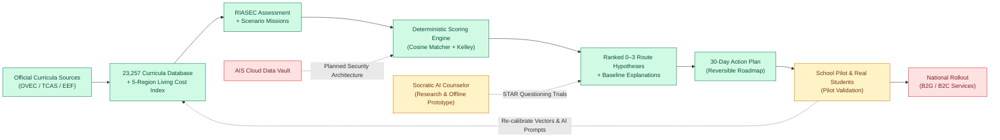
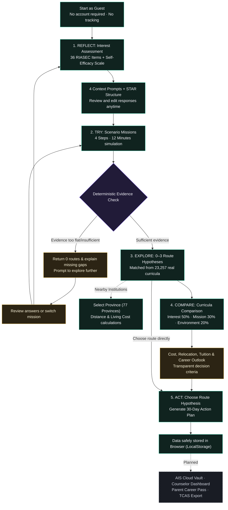
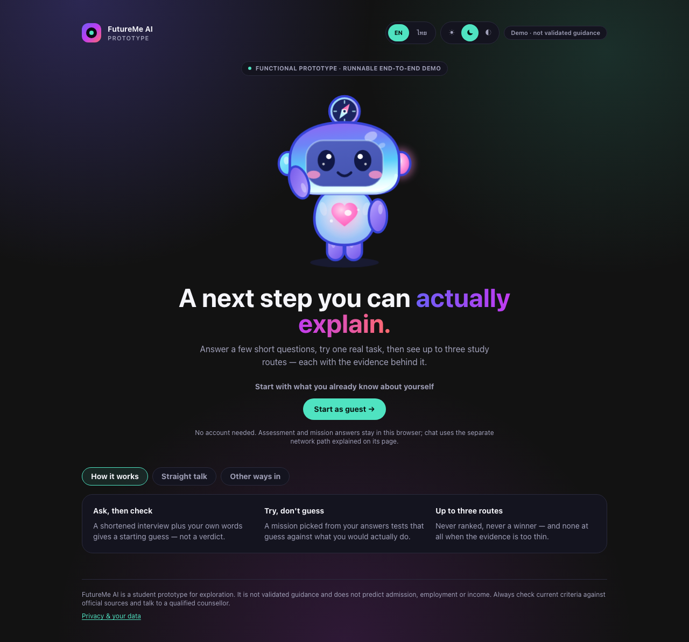
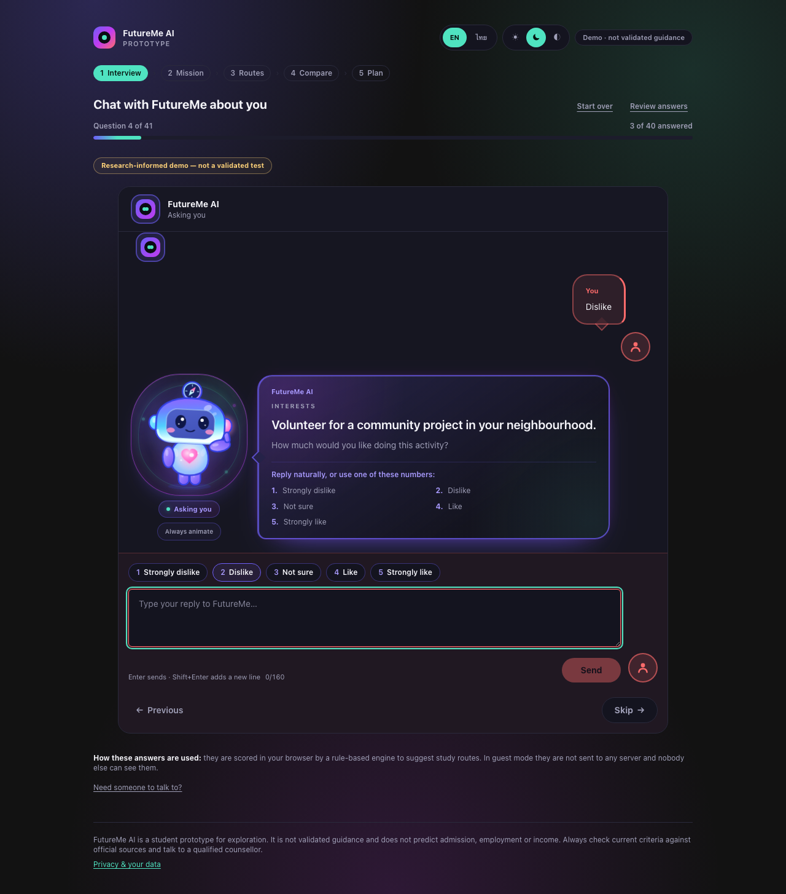
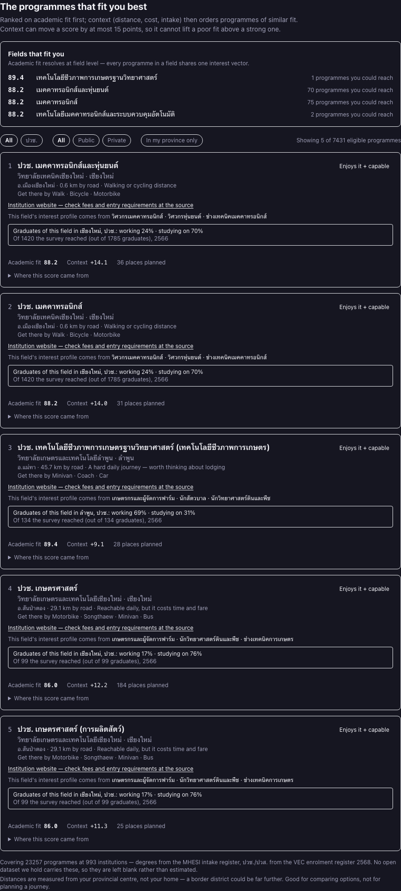
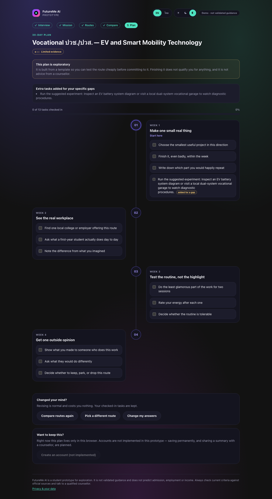
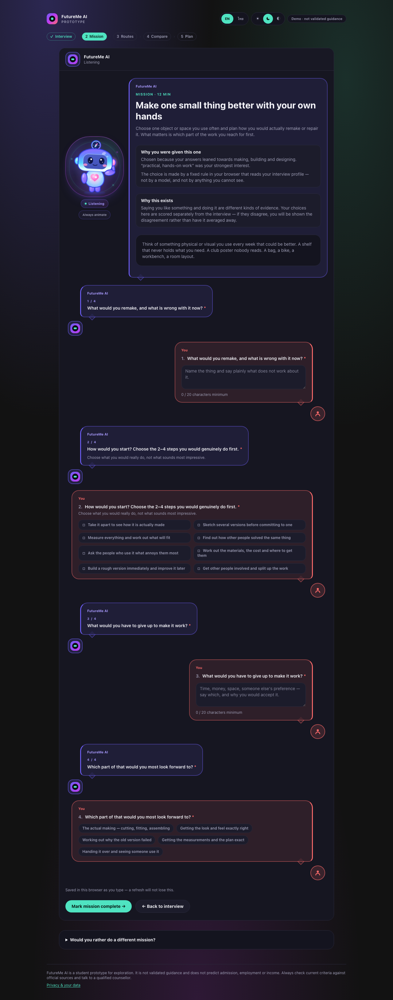

<a id="top"></a>

<p align="center">
  <strong>README:</strong> <a href="README.md">ภาษาไทย (TH)</a> · <strong>[English (EN)](README_EN.md)</strong>
</p>

<p align="center">
  
</p>

# FutureMe AI — Career & Educational Exploration Platform for Thai Students

> **Competition:** JUMP THAILAND Innovation Hackathon 2026 (AIS Academy x NIA)  
> **Core Concept:** *“Explore the next step before making irreversible decisions”* — Evidence-Based Career & Education Guidance  
> **Core Philosophy:** **“Rules decide. AI explains.”** — Transparent deterministic scoring coupled with Socratic AI explainability

---

## 🌟 Submission Quick Links

| Document / Artifact | Description | Link |
|---|---|:---:|
| **Official Pitch Deck (PDF)** | Official 7-slide Master Deck (16:9 Widescreen) | [📄 `FutureMe_Presentation.pdf`](FutureMe_Presentation.pdf) |
| **Team Portfolio & Evidence** | 8-Page Master Document (Prototype Proof + Developer Profile) | [📄 `FutureMe_Team_Portfolio.pdf`](FutureMe_Team_Portfolio.pdf) |
| **Interactive Web App** | Next.js 15.5 Application with 11 live UI screens | [🚀 See Quick Start Below](#-quick-start--run-locally) |
| **Evidence & Theory Catalog** | Academic papers, psychometric frameworks, and verified statistics | [`01_Research/`](01_Research/) |

---

## 🧭 Problem Statement (WHAT)

Thailand's educational system faces a severe gap between classroom curriculum and real labour market demands:
* **56% Work Outside Their Field:** Survey data from TDRI (2025)
* **27% Work Below Qualification Level:** Severe underemployment and missing specialised skills
* **39% Core Skills Shift in 5 Years:** World Economic Forum Future of Jobs Report (2025)

### 📍 Consequential Choice Points
1. **Grade 9 Choice Point (ม.3):** General Academic Track (ม.ปลาย) VS Vocational Track (ปวช.) VS Local Community Options — Students decide based on hearsay without practical hands-on experience.
2. **Grade 12 / Vocational Choice Point (ม.6 / ปวช.):** University (TCAS) VS Higher Vocational (ปวส.) VS Direct Labour Market — High risk of dropouts, transfers, and sunken tuition costs.

---

## 💡 Core Innovation (HOW)

> ### ⚙️ Core Principle: **“Rules decide. AI explains.”**
> FutureMe AI eliminates AI hallucination by utilizing a **Deterministic Scoring Engine** to calculate mathematical fit across **23,257 Real Thai Curricula**, while AI serves as a **Socratic Interviewer** to elicit reflections and explain recommendations.

```
[1. ANSWER]
  • 36-Item Holland RIASEC Assessment + 6-Dimension Self-Efficacy Scale
  • Socratic Interview probing real aptitude using STAR Framework
  • Geolocation, 5-Region Living Cost Index & Family Budget Constraints
        ⬇️
[2. TRY]
  • Scenario Missions simulating real workplace challenges (12-minute interactive tasks)
  • Measuring behaviour and persistence rather than self-reported feelings
        ⬇️
[3. REFLECT]
  • Exact matching across 23,257 real curricula (16,908 Vocational + 6,349 Bachelor's from 993 institutions)
  • Explainable recommendation rationale + Reversible 30-Day Action Roadmap
```

---

## 🔄 5-Step Continuous Evidence Loop (WHO)

FutureMe is not a one-time test, but a **Continuous Evidence Ecosystem** across school years:

| 1. REFLECT | ➔ | 2. TRY | ➔ | 3. UPDATE | ➔ | 4. COMPARE | ➔ | 5. ACT |
|:---:|:---:|:---:|:---:|:---:|:---:|:---:|:---:|:---:|
| **Provisional Vector**<br><sub>(RIASEC + Self-Efficacy)</sub> | | **Scenario Mission**<br><sub>(Real Simulation)</sub> | | **Post-Mission**<br><sub>(Dynamic Re-calibration)</sub> | | **Living Cost Index**<br><sub>(5-Region Feasibility)</sub> | | **30-Day Action Plan**<br><sub>(Reversible Roadmap)</sub> |

```
🔄 Continuous Loop: [1. Reflect] ➔ [2. Try Mission] ➔ [3. Update Evidence] ➔ [4. Compare Cost/Relocation] ➔ [5. 30-Day Action]
```

* **Post-Mission Reflection:** AI checks in immediately after simulated missions to dynamically re-calibrate preference vectors.
* **Weekly Micro Check-in:** Brief weekly dialogue to capture emerging interests.
* **Data Ownership & PDPA:** Students own 100% of their data with selective sharing to counselors/parents.

---

## 🏗️ Architecture & Workflows

### 1. Complete System Workflow



### 2. Student Journey Flowchart



---

## 📱 Live Web Application Showcase

| 1. Landing Page | 2. Socratic Interview |
|:---:|:---:|
|  |  |

| 3. Ranked Routes | 4. Compare Curricula |
|:---:|:---:|
|  |  |

| 5. 30-Day Action Plan | 6. Scenario Mission |
|:---:|:---:|
|  |  |

---

## 🚦 System Readiness Matrix

| Status | Component | Actual Technical Implementation |
|:---:|---|---|
| **✅ Working in Demo** | **Interactive Web App** | Next.js 15.5 application with 11 live routes in Guest Mode |
| **✅ Working in Demo** | **Deterministic Rule Engine** | Cosine Similarity + Kelley Shrinkage across 23,257 real curricula (16,908 vocational + 6,349 bachelor's from 993 institutions) & 5-Region Living Cost Index |
| **✅ Working in Demo** | **Client-Side Privacy** | Full browser storage (LocalStorage) with zero central PII tracking |
| **✅ Working in Demo** | **Mascot & Socratic UI Flow** | Simulated chat interface with STAR Framework response templates |
| **🟡 In Validation & Research** | **Live AI Model Testing** | Real-time Thai LLM/SLM (Typhoon 2 / Qwen) evaluation and hallucination prevention testing with real students |
| **🟡 In Validation & Research** | **School Pilot Phase** | Planned deployment across 3–5 schools (OBEC & OVEC) with 1,500+ students to re-calibrate weights |
| **🔴 Planned for Production** | **AIS Infrastructure Integration** | Deployment on AIS Cloud Data Vault in Thailand and AIS Open API (Number Verification OTP) for Counselor Authentication |

---

## 🏗️ Repository Structure

```
winxtxrgit/futureme-ai
├── 01_Research/                 # Knowledge base, research papers, Evidence Catalog & 23,257 curricula data
│   ├── Theory_and_Standards/    # Holland RIASEC, Psychometric Review & Scoring Engine
│   ├── Geography_and_Access/    # Institution coordinates, travel cost & 5-region Living Cost Index
│   └── Thai_AI_System_Research/ # Thai NLP, SLM, Vector Embedding & Security research
├── 02_Backend/                  # FastAPI Backend, Deterministic Engine & RAG Pipelines
├── 03_WebApp/                   # Next.js 15.5 Interactive Web Application (Pre_Present)
│   ├── app/                     # 11 Page Routes & API Endpoints
│   ├── components/              # UI Components in GenZ Aurora direction
│   ├── data/                    # Curricula & Assessment datasets
│   └── lib/                     # Matching Engine, Cosine Similarity & Utilities
├── 04_Design/                   # Design Systems, Wireframes, UI Concepts & Mascot Lab
├── 05_Assets/                   # Brand Assets, Media & Audio guidance
├── Presentation/                # Master Presentation Deck (FutureMe_Presentation.pdf + HTML)
├── Archive/                     # Historical logs, process notes, and legacy models
├── FutureMe_Presentation.pdf    # Master Pitch Deck (7-Slide Widescreen 16:9 PDF)
├── FutureMe_Presentation.html   # Master Pitch Deck (HTML Source)
├── FutureMe_Team_Portfolio.pdf  # Master Team Portfolio & Prototype Proof (8-Page PDF)
├── FutureMe_Team_Portfolio.html # Master Team Portfolio (HTML Source)
├── README.md                    # Project Overview in Thai (TH)
├── README_EN.md                 # Project Overview in English (EN)
└── .gitignore                   # Standard Git Ignore
```

---

## 💻 Quick Start — Run Locally

### Prerequisites
* **Node.js:** Version 20 or newer
* **Package Manager:** npm

### Running the App
```bash
# 1. Navigate to the Web Application directory
cd 03_WebApp/Pre_Present

# 2. Install dependencies
npm install

# 3. Start local development server
npm run dev
```
Open browser at: **`http://localhost:3000`**

---

## ❓ Quick FAQ

<details>
<summary><strong>1. Can I use the demo without AI or backend servers?</strong></summary>

Yes. The entire student journey runs locally in the client's browser without requiring backend servers or API keys.
</details>

<details>
<summary><strong>2. What evidence motivates this project?</strong></summary>

TDRI statistics show that **56% of Thai graduates work outside their field** and **27% work below qualification level**, while WEF reports that **39% of core skills will shift in 5 years**. These figures motivate FutureMe as an evidence-accumulating guidance platform.
</details>

<details>
<summary><strong>3. Does FutureMe guarantee admission or job placement?</strong></summary>

No. Route recommendations are **exploration hypotheses**, not guarantees or admission predictions.
</details>

<details>
<summary><strong>4. Does AI make the decisions for students?</strong></summary>

**No.** The platform follows **“Rules decide. AI explains.”** A transparent deterministic engine calculates mathematical fit across **23,257 real curricula**. In the demo, decisions are rule-based, while live AI integration for real-time Socratic dialogue is in research and awaiting validation with real students during the pilot phase.
</details>

<details>
<summary><strong>5. How does the system recommend institutions?</strong></summary>

The system matches student vectors against **23,257 real curricula** (16,908 vocational + 6,349 bachelor's from 993 institutions) alongside 5-region Living Cost indices and province-level distances.
</details>

<details>
<summary><strong>6. Is RIASEC psychologically validated in this system?</strong></summary>

FutureMe uses Holland's RIASEC 6 dimensions coupled with a Self-Efficacy scale for structured reflection. Weightings will be continuously refined during real-school pilot trials.
</details>

<details>
<summary><strong>7. Where is learner data stored and how is PDPA handled?</strong></summary>

* **Client-Side:** Stored safely in the browser's `LocalStorage` with zero tracking.
* **Production Infrastructure:** Designed for **AIS Cloud Data Vault** (Data Residency in Thailand) with **AIS Open API (Number Verification OTP)** for Counselor Authentication. We adhere strictly to Privacy-by-Design and **do not track granular GPS location**.
</details>

<details>
<summary><strong>8. What is the business and sustainability model?</strong></summary>

* **B2C Freemium:** Free for all students / Optional Parent Career Pass (99 THB/mo or 999 THB/yr) for 5-year living cost budgets & TCAS export.
* **B2G District License (Starting 300,000 THB/yr):** Multi-school licensing with National Interest Dashboard for educational authorities (OVEC, MOE, EEF).
* **B2B Institutional (Starting 30,000 THB/yr):** University / Private Vocational Matching Portal.
* **🌱 Sustainability Vision:** Generate revenue from users and institutions based on ability to pay, subsidizing operational costs for budget-constrained schools and ensuring 100% free platform access for underprivileged students nationwide.
</details>

<details>
<summary><strong>9. Can recommendations be audited?</strong></summary>

Yes. Deterministic TypeScript ensures that identical inputs always yield identical, reproducible recommendations with clear provenance indicators.
</details>

<details>
<summary><strong>10. How is data freshness maintained?</strong></summary>

Datasets include timestamp metadata and trigger stale-data warnings if records exceed predefined freshness thresholds.
</details>

<details>
<summary><strong>11. What is needed before national deployment?</strong></summary>

A 3–5 school pilot trial with 1,500+ students, ethical clearance, counselor interviews, and empirical score re-calibration.
</details>

<details>
<summary><strong>12. How is product success measured?</strong></summary>

Measured by decision quality (e.g. 30-day mission completion rate, post-reflection confidence, and reduced university dropout rates).
</details>

<details>
<summary><strong>13. Where can I find official presentation decks?</strong></summary>

* **Master Pitch Deck (7 Slides):** [`FutureMe_Presentation.pdf`](FutureMe_Presentation.pdf)
* **Team Portfolio & Prototype Proof (8 Pages):** [`FutureMe_Team_Portfolio.pdf`](FutureMe_Team_Portfolio.pdf)
* **Research Base:** [`01_Research/`](01_Research/)
</details>

---

## 👥 Team & Vision

* **Developer:** Thanut Jongteerathanachote — 3rd Year Computer Engineering Student, Chitralada Technology Institute (CDTI)
* **Faculty Advisor:** Asst. Prof. Damrongrit Sethasirishoke
* **Vision:** Bridging the educational mismatch and empowering Thai students to *“Explore the next step before making irreversible decisions.”*
* **License:** MIT License (2026)

<p align="center"><a href="#top">⬆️ Back to top</a></p>
