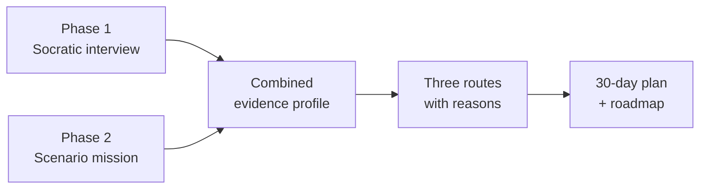

# 01 · Project Overview

[← Back to README](../READMEEN.md) · [Next: Research →](02-research-and-evidence.md)

---

## What FutureMe AI is

FutureMe AI is a career and study guidance assistant for Thai students. It replaces the
one-shot multiple-choice aptitude test with a short conversation, a hands-on mini task, and
three concrete routes the student can compare — each one showing the evidence behind it.

The product is being built for the **JUMP Thailand Hackathon 2026** (AIS Academy × NIA), under
the theme *AI for the Future of Thai Education*.

> **Naming note.** Research documents and the product UI use **FutureMe**. The backend engine,
> API tag and schema layer use **FuturePath**. This repository treats *FutureMe AI* as the
> product name and *FuturePath* as the internal decision engine.

---

## The problem in one line

Thai students choose a study track years before anyone helps them understand what that track
leads to — and the cost of that gap shows up after graduation.

Per TDRI's 2025 analysis, **56% of Thai people with education above upper-secondary level work
outside their field of study** and **27% work below their skill or qualification level**.

The important detail is what is *not* wrong. Thai graduate unemployment is **2.0%** — close to the
national rate of 1.0% (NESDC, 2024). Graduates are not mostly out of work; they are working in the
wrong place. This product is therefore about direction, not employability.

Internationally the picture is more specific than "mismatch is bad". OECD analysis finds that
field-of-study mismatch **on its own** carries little or no wage penalty in most countries. The
penalty — around 25% lower hourly earnings — appears when field mismatch is combined with
**overqualification**, which affects roughly 40% of field-mismatched workers.

The full evidence base, with sources and the claims we deliberately excluded, is in
[02 · Research and Evidence](02-research-and-evidence.md).

---

## Why existing tools do not close the gap

| What students have today | What is missing |
|---|---|
| Static interest questionnaires | No follow-up, no probing, no adaptation to the answer |
| Multiple-choice interest tests | Students answer with what sounds acceptable, not what is true |
| University open days and marketing | Shows the destination, never the steps between here and there |
| A counsellor shared across hundreds of students | No time for individual depth; rural and small schools have less access still |

The recurring failure is the same: a student is asked to *state* a preference they have never
had a chance to *test*.

---

## The approach

FutureMe AI collects two independent kinds of evidence before it recommends anything.

**Phase 1 — what the student says.** *In the running prototype:* a twelve-item interest
questionnaire plus four context questions, producing a RIASEC profile. *Planned:* an adaptive
Thai-language Socratic conversation using Motivational Interviewing to lower defensiveness,
Laddering to reach underlying values, and STAR to anchor claims in things the student has
actually done.

**Phase 2 — what the student does.** A short scenario mission chosen from the interview profile by
a transparent rule. Doing beats declaring, and the mission is scored as separate evidence — so it
can contradict the interview, and when it does, the learner is shown the contradiction.

**Then: up to three routes, not one answer.** Every recommendation ships with the reasons it was
made, the evidence supporting it, where its information came from, and an explicit statement of
what the system still does not know. When the evidence is too thin, it returns nothing.

---

## Who it is for

| Tier | Grades | What the product is trying to help with |
|---|---|---|
| Primary | ป.4 – ป.6 | Early, playful exposure to what jobs exist at all |
| Lower secondary | ม.1 – ม.3 | The ม.4 fork: general track vs. vocational vs. dual education |
| Upper secondary | ม.4 – ม.6 | Faculty choice, TCAS strategy, TPAT preparation, portfolio |
| Vocational | ปวช. – ปวส. | Continuing to ปวส./bachelor's, or entering work directly |

Two secondary audiences read the output, under student consent: **parents** see an interest
summary and the 30-day plan; **counsellors** additionally see class-level patterns and
suggested coaching questions. Neither ever sees the raw chat transcript.

---

## What makes it different

**Up to three routes, never a winner.** The engine returns between zero and three routes, shown
with equal weight and no ranking. A single ranked answer would imply a confidence the system does
not have — and when the evidence does not support even one route, it says so instead of padding
the list.

**Evidence you can inspect.** Each route lists what supports it, what would change it, and what
is still unverified — including a reversible "small step you can take first."

**Vocational routes treated as first class.** ปวช. programmes and the ทวิภาคี dual system are
scored by the same criteria as university paths, not offered as a fallback.

**Privacy that a school can actually accept.** Role-based access, consent-gated sharing, and
chat transcripts that stay with the student by default.

---

## Honest scope

This is hackathon-stage work with a real research base and a runnable prototype, not a deployed
product. Specifically:

- The interest instrument and mission rubrics **have not been validated** by qualified assessment experts.
- The interview is a **static English questionnaire**, not the adaptive Thai conversation described above.
- The route catalogue is **illustrative**. Cost, location and timing carry no source, and they drive the eligibility filters.
- **No student pilot has run.** Every effectiveness claim in this repository is a design goal, not a measured result.
- NDLP/DEEP integration is a **future possibility**, dependent on documentation and partnership approval that do not exist. The July 2026 source audit could not verify the technical claims previously made about either platform.
- AIS Cloud is the **intended deployment target**, described from published specifications. Nothing is deployed there yet.

A capability-by-capability breakdown of what is implemented, what is a reduced prototype and what
is only designed, is in [06 · Development Plan](06-development-plan.md#component-status). See
[07 · Roadmap](07-roadmap.md) for how each gap is meant to be closed.

---

[← Back to README](../READMEEN.md) · [Next: Research →](02-research-and-evidence.md)
