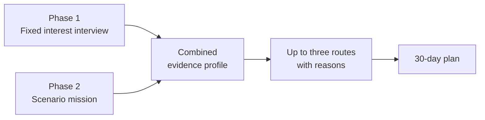

# 01 · Project Overview

[← Back to README](../READMEEN.md) · [Next: Research →](02-research-and-evidence.md)

---

## What FutureMe AI is

FutureMe AI is a career and study exploration assistant for Thai students. It complements
existing guidance with a short reflection, a hands-on mini task, and up to three concrete routes
the student can compare — each one showing the evidence behind it.

The product is being built for the **JUMP Thailand Hackathon 2026** (AIS Academy × NIA), under
the theme *AI for the Future of Thai Education*.

> **Naming note.** Research documents and the product UI use **FutureMe**. The backend engine,
> API tag and schema layer use **FuturePath**. This repository treats *FutureMe AI* as the
> product name and *FuturePath* as the internal decision engine.

---

## The problem in one line

Thai students make consequential study choices before many have had a practical way to test what
those directions feel like. FutureMe is designed to make that exploration happen earlier.

TDRI's 2025 public article reports that **56% of Thai workers it describes as highly educated work
outside their field of study** and **around 27% work below their qualification level**. The
article page does not publish the denominator or method, so these figures are problem context, not
a product-performance baseline.

The important detail is that "outside the field" is not automatically a poor outcome. OECD
analysis finds that the clearest earnings concern appears when field-of-study mismatch is combined
with **qualification mismatch**. This product is therefore about informed exploration and
transferable options, not about forcing every learner into one permanent field match.

The full evidence base, with sources and the claims we deliberately excluded, is in
[02 · Research and Evidence](02-research-and-evidence.md).

---

## Why existing tools do not close the gap

| What students have today | What is missing |
|---|---|
| Static interest questionnaires | Limited opportunity to test an answer through action |
| Multiple-choice interest tests | A self-report signal, without independent behavioural evidence |
| University open days and marketing | Shows the destination, never the steps between here and there |
| Time-limited guidance conversations | Useful professional support, but not always enough time for repeated low-stakes experiments |

The design opportunity is specific: let a student *state* a preference, then give them a small,
reversible way to *test* it.

---

## The approach

FutureMe AI collects two independent kinds of evidence before it recommends anything.

**Phase 1 — what the student says.** *In the running prototype:* a twelve-item interest
questionnaire plus four context questions, producing a RIASEC-shaped profile. *Planned:* an
adaptive Thai-language conversation. Socratic questioning, Motivational Interviewing, Laddering,
and STAR are candidate design influences that require expert review; none validates the current
instrument.

**Phase 2 — what the student does.** A short scenario mission chosen from the interview profile by
a transparent rule. The mission is scored as separate evidence, so it can contradict the
interview; when it does, the learner is shown the contradiction rather than having it hidden in an
average.

**Then: up to three routes, not one answer.** Every recommendation ships with the reasons it was
made, the evidence supporting it, where its information came from, and an explicit statement of
what the system still does not know. When the evidence is too thin, it returns nothing.

---

## Who it is for

| Tier | Grades | What the product is trying to help with |
|---|---|---|
| Lower secondary | ม.1 – ม.3 | The ม.4 fork: general track vs. vocational vs. dual education |
| Upper secondary | ม.4 – ม.6 | Faculty choice, TCAS strategy, TPAT preparation, portfolio |
| Vocational | ปวช. – ปวส. | Continuing to ปวส./bachelor's, or entering work directly |

The implemented prototype supports only the student guest journey. **Parent** and
**counsellor** summaries are planned concepts that would require accounts, verified relationships,
per-recipient consent, and privacy review; none is built.

---

## What makes it different

**Up to three routes, never a winner.** The engine returns between zero and three routes, shown
without a declared winner or displayed precision score. The deterministic engine still uses
scores to select and order candidates, but the interface makes comparison and trade-offs more
important than the order. When the evidence does not support even one route, it says so instead
of padding the list.

**Evidence you can inspect.** Each route lists what supports it, what would change it, and what
is still unverified — including a reversible "small step you can take first."

**Vocational routes treated as first class.** ปวช. programmes and the ทวิภาคี dual system are
scored by the same criteria as university paths, not offered as a fallback.

**Privacy that can be inspected.** In the prototype, learner answers stay in browser local
storage and can be deleted immediately. Role-based access and consent-gated sharing are future
design requirements, not current capabilities.

---

## Honest scope

This is hackathon-stage work with a real research base and a runnable prototype, not a deployed
product. Specifically:

- The interest instrument and mission rubrics **have not been validated** by qualified assessment experts.
- The interview is a **static English questionnaire**, not the adaptive Thai conversation described above.
- The route catalogue is **illustrative**. Cost, location and timing carry no source, and they drive the eligibility filters.
- **No student pilot has run.** Every effectiveness claim in this repository is a design goal, not a measured result.
- NDLP/DEEP integration is a **future possibility**, dependent on documentation and partnership approval that do not exist. The July 2026 source audit could not verify the technical claims previously made about either platform.
- AIS Cloud is the **intended deployment target**, described from published specifications. Nothing is deployed there yet.

A capability-by-capability breakdown of what is implemented, what is a reduced prototype and what
is only designed, is in [06 · Development Plan](06-development-plan.md#component-status). See
[07 · Roadmap](07-roadmap.md) for how each gap is meant to be closed.

---

[← Back to README](../READMEEN.md) · [Next: Research →](02-research-and-evidence.md)
