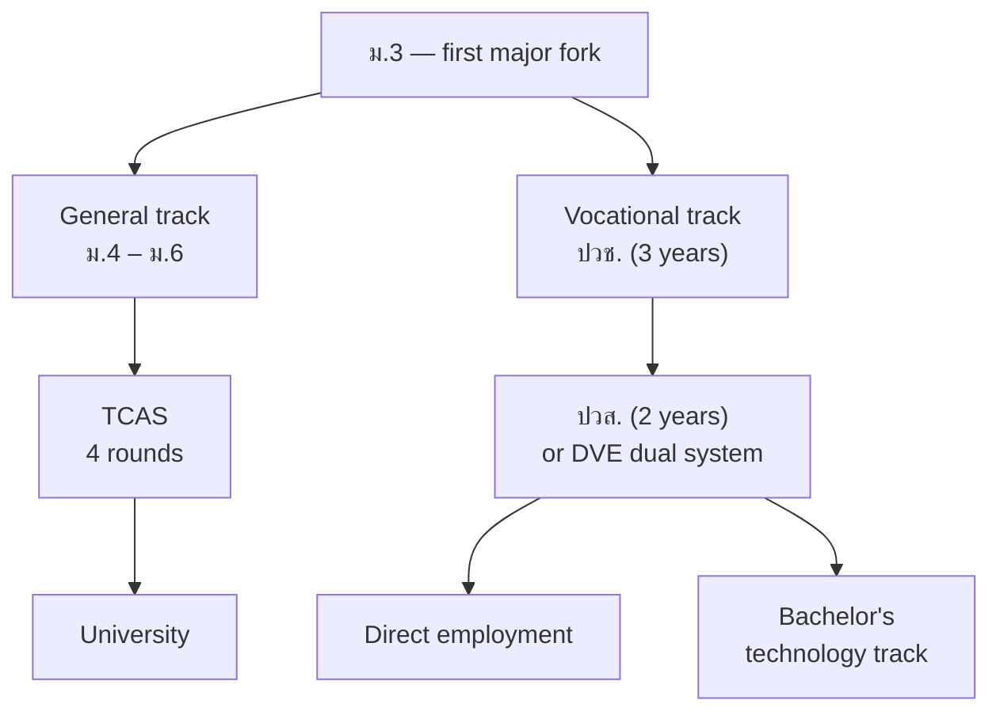

# 02 · Research and Evidence

[← Project Overview](01-project-overview.md) · [Back to README](../READMEEN.md) · [Next: User Experience →](03-user-experience.md)

---

The project rests on a seven-category research base assembled before any design work started.
This document summarises the findings that shaped the product, names their sources, and — just
as importantly — records the claims we removed.

---

## 1 · The mismatch problem

### Thailand

| Measure | Figure | Source |
|---|---|---|
| Graduates working outside their field of study | **56%** | TDRI, 2025 |
| Graduates working below their qualification level | **27%** | TDRI, 2025 |
| Highest-unemployment group | Bachelor's degree holders, new graduates | NSO / NESDC |
| Employer experience requirements | A significant barrier in several STEM fields, varying by occupation | TDRI analysis of 304,378 job postings, Q2/2025 |

### Global

> **Correction (2026-07).** An earlier version of this document stated a
> "15–20% wage penalty for mismatched work". That figure was unsourced and it
> conflated three separate things. It has been replaced with what the OECD
> source actually reports. See §1.1.

| Measure | Figure | Source |
|---|---|---|
| Field-mismatched workers who are **also overqualified** | ~40% of all field-mismatched workers | OECD / Montt 2015 |
| Wage penalty for workers who are field-mismatched **and** overqualified | ~25% lower hourly earnings than well-matched peers with the same field and education level | OECD / Montt 2015 |
| Wage penalty for workers who are field-mismatched but **well-qualified** | **No penalty in the majority of countries** | OECD / Montt 2015 |
| Skill sets expected to change or become outdated, 2025–2030 | **39%** | WEF *Future of Jobs Report 2025* |

### 1.1 · Three things that are not the same

This distinction matters because collapsing them produces a scarier number than
the evidence supports:

| Concept | What it means |
|---|---|
| **Field-of-study mismatch** | Working outside the field you studied |
| **Overqualification** | Holding a higher qualification than the job requires |
| **Skills mismatch** | Your actual skills do not match what the job uses |

The OECD finding is that **field-of-study mismatch on its own carries little or
no wage penalty in most countries.** The penalty appears when field mismatch is
combined with overqualification — and that combination affects roughly 40% of
field-mismatched workers, not all of them.

For this project the implication is specific: "working outside your field" is
not automatically a bad outcome, and the product must not imply that it is. The
outcome worth avoiding is ending up *overqualified and mismatched* — which is an
argument for testing a direction early, not for picking the "right" field first
time.

**The reading.** This is a structural problem, not a series of individual bad choices. The
education system produces one thing and the labour market asks for another, and the decision
that locks a student into that divergence is made at ม.3 and ม.5 — with almost no support.

### Claims we deliberately removed

An earlier draft of this research carried figures that could not be traced to a primary source.
They were audited out and must not reappear in any pitch:

| Removed claim | Why |
|---|---|
| "52% mismatch rate" | Superseded by the traceable TDRI 2025 figure of 56% / 27% |
| "65% of employers require experience" (as a blanket claim) | Real requirement varies sharply by occupation; blanket figure unsupported |
| "85% work a second job" | No primary source found |
| "WEF: 44% of skills will change" | The WEF 2025 figure is **39%** |

---

## 2 · Thai curriculum structure

Thai education branches at ม.3 and again at ม.6, into paths that are hard to reverse.

**What is modelled in the engine**

- **5 ม.4 learning tracks** — Science–Maths, Arts–Maths, Arts–Language, Arts–Social/Arts/Sport, and Gifted/EP/AI & Robotics.
- **12 ปวช. 2567 vocational subject areas** — Industry, Business, Home Economics, Tourism, Health & Beauty, Logistics, Food, Art & Creative Economy, Agriculture & Fisheries, Fashion & Textiles, Digital & IT, Entertainment.
- **TPAT1–TPAT5** mapped to target faculties per the official MyTCAS blueprint.

> The grouping of university faculties into six clusters is a **FuturePath internal framework**,
> not an official Ministry classification. It is labelled as such everywhere it appears.

**The finding that mattered most:** the gap is not a shortage of options — Thailand has more
than 50 — it is that no one explains which option leads where. Students in small and provincial
schools are least likely to have that explained to them.

---

## 3 · Career, degree and skill mapping

Five career clusters were mapped from study track through faculty to the actual skills employers ask for.

| Cluster | Track | Faculty | Top hard skills | Key soft skills |
|---|---|---|---|---|
| Digital & Software | Sci–Maths / Vocational IT | Computer Engineering, Computer Science | Python/JS, SQL, Git & cloud | Problem solving, logical thinking |
| Business & Marketing | Arts–Maths / Vocational Business | Business Admin, Accounting, Communication Arts | Digital ads, SEO/SEM, GA4 | Data-driven mindset, communication |
| Healthcare & Wellness | Sci–Maths *(verify per programme / กสพท)* | Medicine, Nursing, Allied Health | Clinical procedures, medical science | Empathy, resilience |
| Creative & Design | Arts–Language / Vocational Arts | Fine & Applied Arts, Communication Arts, Architecture | Figma, Adobe Suite, video editing | Creativity, trend awareness |
| Advanced Engineering | Sci–Maths / Vocational Industry | Electrical, Mechanical, Mechatronics Engineering | PLC, EV systems, CAD/CAM | Complex problem solving, safety |

Sources: TPQI (Thai professional qualification framework), O\*NET (US DOL), ESCO (EU).

This taxonomy does double duty: it is the retrieval corpus for the RAG pipeline, and it is what
turns an abstract recommendation into a concrete 30-day action plan — *learn Figma* rather than
*consider design*.

---

## 4 · Why conversation beats a questionnaire

The central methodological finding: **multiple-choice interest tests measure what a student
believes is an acceptable answer.** Adolescents answer to meet perceived expectations. Five
qualitative techniques were studied and combined to get past that.

| Technique | Origin | Role in the system |
|---|---|---|
| **Socratic questioning** | Foundation for Critical Thinking | Open questions that make the student reason rather than pick |
| **Motivational Interviewing** | Miller & Rollnick (MINT) | Lowers defensiveness; builds internal rather than imposed motivation |
| **RIASEC** | Holland / O\*NET Interest Profiler | Six-dimension structure for interests and personality |
| **Laddering** | Reynolds & Gutman, 1988 | Climbs from stated behaviour to underlying values |
| **STAR** | Behavioural interviewing | Forces claims to be grounded in Situation → Task → Action → Result |

**The design consequence.** Interview answers alone remain self-report. That is why Phase 2
exists: the scenario mission produces behavioural evidence that can confirm or contradict what
the student said. Two independent evidence streams, weighted separately.

---

## 5 · Ministry platform landscape

| Platform | What it does | The gap |
|---|---|---|
| **NDLP** — National Digital Learning Platform | National learning-resource repository, includes guidance content | Its career-guidance component is a **static RIASEC test**: no dialogue, no adaptation, no follow-through |
| **DEEP** — Digital Education Excellence Platform | Ministry SSO identity and digital classroom | Identity infrastructure that a guidance product would want to build on |

**Strategic position:** complement, not replace. The Ministry has reach and identity
infrastructure; what its guidance layer lacks is interaction. That is precisely the gap
FutureMe AI fills.

> **Status: not agreed.** NDLP/DEEP integration is a future possibility contingent on official
> API documentation, technical access approval, and a formal partnership. No agreement exists.
> It appears in this repository as a roadmap item only.

---

## 6 · Infrastructure research

AIS Cloud was studied as the deployment target, on published specifications:

- **In-country data residency** — Thai data centres, relevant security certifications (ISO 27001 / ISO 27018).
- **AIS Cloud powered by OCI** — Kubernetes (OKE) for containers; AIS Enterprise Cloud with VMware NSX micro-segmentation.
- **AIS Open APIs (CAMARA / GSMA standards)** — Number Verification for passwordless login, OTP, SIM Swap for account-takeover defence, SMS for plan reminders.

> **PDPA caveat, stated plainly.** In-country residency and certifications are necessary but not
> sufficient. PDPA compliance additionally requires consent management, access control, data
> minimisation, retention policy and processor governance **at the application layer** — which
> is our responsibility, not the cloud provider's. See [05 · System Architecture](05-system-architecture.md).

---

## 7 · Data quality findings

The research audit produced two findings worth publishing:

1. **The QLoRA train and test sets are identical** and contain only ten examples each. They
   cannot be used to evaluate a fine-tune. They must be separated and substantially expanded
   before any model evaluation is reported. This is tracked in [07 · Roadmap](07-roadmap.md).
2. **Statistical claims required an audit pass.** Four unsupported figures were removed (see §1).
   A programmatic verification script now checks that they do not return.

---

## Reference table

Every load-bearing claim, with its verification status. **Nothing marked
"Unverified" may be used in a pitch or a slide until it has been checked against
the primary source.**

| Claim | Source | Date | Where | What it actually supports | Status |
|---|---|---|---|---|---|
| ~40% of field-mismatched workers are also overqualified | Montt, G., *The causes and consequences of field-of-study mismatch*, OECD Social, Employment and Migration Working Papers No. 167 | 2015 | Summarised in the OECD Skills and Work post, 20 July 2015 | The overlap between the two conditions | ✅ Verified |
| ~25% lower hourly earnings for field-mismatched **and** overqualified workers | Montt 2015 (as above) | 2015 | Same | The wage penalty attaches to the *combination*, measured against same-field, same-education matched peers | ✅ Verified |
| No wage penalty in most countries for field-mismatched but well-qualified workers | Montt 2015 (as above) | 2015 | Same | Field mismatch alone is not the driver | ✅ Verified |
| 39% of skill sets change or become outdated 2025–2030 | WEF, *Future of Jobs Report 2025* | 2025 | Headline skills-disruption finding | Skill churn, **not** unemployment or mismatch | ⚠️ Not re-verified against the report PDF |
| 56% of Thai higher-education graduates work outside their field | TDRI | 2025 | Not recorded | Thai field-of-study mismatch rate | ⚠️ **Unverified** — no direct URL, page or table recorded |
| 27% of Thai graduates work below their qualification level | TDRI | 2025 | Not recorded | Thai overqualification rate | ⚠️ **Unverified** — same gap |
| Experience requirements are a barrier in several STEM fields | TDRI analysis of 304,378 job postings, Q2/2025 | 2025 | Not recorded | Employer demand for experience, varying by occupation | ⚠️ **Unverified** — same gap |
| NDLP's guidance component is a static RIASEC test | NDLP platform | — | Direct observation of the platform | The gap this product addresses | ⚠️ Observation, not a citation |

**Known weakness, stated plainly.** The Thai figures are the ones the pitch
leans on hardest and they are the ones with the weakest traceability. They came
from a research summary that did not record page numbers or direct URLs. Until
someone re-traces them to a TDRI publication with a citable location, they
should be presented as "reported by TDRI" rather than as established fact.

### Sources verified for this document

- Montt, G. (2015). *The causes and consequences of field-of-study mismatch: Evidence from PIAAC.* OECD Social, Employment and Migration Working Papers No. 167. https://www.oecd.org/content/dam/oecd/en/publications/reports/2015/07/the-causes-and-consequences-of-field-of-study-mismatch_g17a26a5/5jrxm4dhv9r2-en.pdf
- OECD Skills and Work (2015). *The psychologist at the call centre and the mathematician on the trading floor: the many facets of field of study mismatch.* https://oecdskillsandwork.wordpress.com/2015/07/20/the-psychologist-at-the-call-centre-and-the-mathematician-on-the-trading-floor-the-many-facets-of-field-of-study-mismatch/

---

## Source index

**Thailand** — NSO · NESDC · TDRI · MHESI · OBEC (สพฐ.) · OVEC (สอศ.) · CUPT / myTCAS · TPQI
**Global** — OECD (PIAAC, Education at a Glance) · ILO (ILOSTAT) · WEF (Future of Jobs 2025) · O\*NET · ESCO
**Methodology** — Holland RIASEC · Miller & Rollnick (MI) · Foundation for Critical Thinking (Socratic) · Reynolds & Gutman 1988 (Laddering)
**Ministry** — NDLP · DEEP · Ministry of Education Thailand

Full annotated link index is maintained in the private research repository.

---

[← Project Overview](01-project-overview.md) · [Back to README](../READMEEN.md) · [Next: User Experience →](03-user-experience.md)
