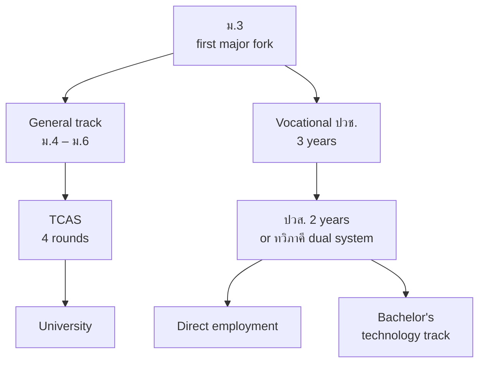

# 02 · Research and Evidence

[← Project Overview](01-project-overview.md) · [Back to README](../READMEEN.md) · [Next: User Experience →](03-user-experience.md)

---

> **Last source audit: 26 July 2026.** Every external link below was opened and followed, and
> every figure was compared against the page it comes from. What changed in that audit, and what
> this repository got wrong before it, is recorded in [09 · Source Review](09-source-review.md).

This document states the evidence the product is built on, names the source for each figure, and
records the claims that were withdrawn. A figure with no citable location is not softened here —
it is removed.

---

## 1 · The mismatch problem

### 1.1 · Thailand

| Measure | Figure | Scope | Source |
|---|--:|---|---|
| Work outside their field of study | **56%** | Workers TDRI describes broadly as highly educated; the public article does not publish the denominator or method | TDRI, 2025 |
| Work below their skill or qualification level | **27%** | Same scope and caveat | TDRI, 2025 |
| STEM graduates working outside science | **38.1%** | Thailand, 2024 | NSO, *Social Indicators 2025*, p. 185 |
| Unemployment — higher-education graduates | **2.0%** | Thailand, 2024 | NESDC, Q2/2568 |
| Unemployment — Gen Z | **3.8%** | Thailand, 2024 | NESDC, Q2/2568 |
| Unemployment — national | **1.0%** | Thailand, 2024 | NESDC, Q2/2568 |
| STEM share of online job postings | **5.6%** (42,374 of 756,300) | 23 job sites, July 2024 – June 2025 | TDRI Big Data, Q2/2025 |

**The careful reading.** NESDC reports a 1.0% national unemployment rate, 2.0% for people with
higher education and 3.8% for Gen Z in 2024. Those figures describe different populations from
the TDRI field-mismatch figures and should not be combined into a single causal claim. Working
outside a field of study is also not automatically a failure. FutureMe therefore focuses on
*exploration before commitment*: helping a student test whether a direction fits, while there is
still time to learn and adjust.

ม.3 and ม.6 are visible choice points in the Thai education journey. Changing direction remains
possible, but it can carry practical costs in time, prerequisites and admissions preparation.

### 1.2 · International

| Measure | Figure | Scope | Source |
|---|--:|---|---|
| Qualification mismatch | ~**35%** | OECD average, participating countries | OECD PIAAC 2023 |
| Field-of-study mismatch | >**35%** | Same. Overlaps with the row above | OECD PIAAC 2023 |
| Both at once | ~**11%** | Same | OECD PIAAC 2023 |
| Workers whose education does not match their job | **935 million** across 114 countries — 72% under-educated, 28% over-educated | Those 114 countries cover 56% of global employment | ILO |
| Core skills expected to change | **44%** by 2027 | WEF *Future of Jobs 2023* | WEF, 2023 |
| Core skills expected to change | **39%** by 2030 | WEF *Future of Jobs 2025* | WEF, 2025 |
| Employers naming skills gaps as a barrier | **63%** | WEF *Future of Jobs 2025* | WEF, 2025 |

> The 44% and 39% figures are **not** a contradiction and neither is a misquote. They come from
> different reports measuring different windows. An earlier version of this repository listed 44%
> as an error; that was itself the error.

### 1.3 · Three things that are not the same

Collapsing these produces a scarier number than the evidence supports.

| Concept | What it means |
|---|---|
| **Field-of-study mismatch** | Working outside the field you studied |
| **Overqualification** | Holding a higher qualification than the job requires |
| **Skills mismatch** | Your actual skills do not match what the job uses |

The OECD finding is that **field-of-study mismatch on its own carries little or no wage penalty in
most countries.** The negative consequences are concentrated where field mismatch is also
associated with qualification mismatch, rather than applying to everyone who changes field.

For this product the implication is specific and it constrains the interface: "working outside
your field" is not automatically a bad outcome, and nothing in the app may imply that it is. The
outcome worth avoiding is ending up *overqualified and mismatched*, which is an argument for
testing a direction early — not for picking the right field first time.

---

## 2 · Thai curriculum structure

Thai education presents visible decisions after ม.3 and again after ม.6. Routes can change, but
prerequisites, admission calendars, time and cost can make later changes harder.

### Where the forks are

### What the routes catalogue models

- **General upper-secondary tracks**, of which Science–Maths and the arts-leaning tracks appear in
  the demo catalogue.
- **ปวช. 2567 vocational programmes.** The VEC Data Catalog publishes ประเภทวิชา, สาขาวิชา and
  สาขางาน per curriculum revision. **No subject-area count is hard-coded** anywhere in this
  repository: those counts change with each revision and must be read from the current dataset.
  A unit test fails if one reappears in the seed data.
- **ทวิภาคี (dual vocational education)** as a first-class option rather than a fallback.
- **TCAS** as the admission route. myTCAS is currently on **TCAS70** for academic year 2570.

> The grouping of university faculties into six clusters is a **project-internal framework**, not
> an official Ministry or TCAS classification, and is labelled as such wherever it appears.

Per-programme entry criteria, TPAT subject mappings and fees are **not modelled**. They change by
programme and by admission year, and no dataset with a clear licence has been ingested.

---

## 3 · Career, degree and skill mapping

Five career clusters were mapped from study track through faculty to the skills employers ask for.

| Cluster | Track | Faculty | Hard skills | Soft skills |
|---|---|---|---|---|
| Digital & Software | Sci–Maths / Vocational IT | Computer Engineering, Computer Science | Python/JS, SQL, Git & cloud | Problem solving, logical thinking |
| Business & Marketing | Arts–Maths / Vocational Business | Business Admin, Accounting, Communication Arts | Digital ads, SEO/SEM, analytics | Data-driven mindset, communication |
| Healthcare & Wellness | Sci–Maths *(verify per programme / กสพท)* | Medicine, Nursing, Allied Health | Clinical procedures, medical science | Empathy, resilience |
| Creative & Design | Arts–Language / Vocational Arts | Fine & Applied Arts, Communication Arts, Architecture | Figma, Adobe Suite, video editing | Creativity, trend awareness |
| Advanced Engineering | Sci–Maths / Vocational Industry | Electrical, Mechanical, Mechatronics | PLC, EV systems, CAD/CAM | Complex problem solving, safety |

**Reference frameworks:** O\*NET Database 30.3 (CC BY 4.0) for the occupation → task → skill
structure; ESCO v1.2.1 for occupation URIs and occupation–skill relationships; TPQI as the entry
point for Thai professional standards.

> **Status: seed examples, not a database.** This table is the team's mapping, not an ingested
> taxonomy. Building the real thing means recording, per occupation, which qualifications are
> *legally required* versus *commonly asked for* — a distinction that matters enormously to a
> fifteen-year-old and is absent from this table. TPQI standards must be cited per occupation,
> never from the organisation's home page.

---

## 4 · Why FutureMe adds action to self-report

FutureMe combines a short self-report with a small scenario mission. This is a **product design
hypothesis**, not evidence that this prototype is more valid than a professionally administered
assessment. The mission gives the student another kind of signal to inspect and disagree with.
The current interview is a fixed English questionnaire; adaptive conversation is planned.

| Technique | Origin | Role in the design | Evidence status |
|---|---|---|---|
| **RIASEC** | Holland / O\*NET Interest Profiler | Six-dimension interest structure | O\*NET's instrument has a research manual; FutureMe's twelve items have not been validated |
| **Socratic questioning** | Foundation for Critical Thinking | Open questions that make the student reason rather than pick | Source page was not reachable in the audit; not used as sole support for any claim |
| **Motivational Interviewing** | Miller & Rollnick (MINT) | Lowers defensiveness | A professional training body, **not** psychometric evidence for a recommender |
| **Laddering** | Reynolds & Gutman, 1988 | Climbs from stated behaviour to underlying values | Access-restricted; held as a bibliographic reference only |
| **STAR** | Behavioural interviewing | Grounds claims in Situation → Task → Action → Result | **Design assumption** — no verified primary source for this usage |
| **Ikigai** | Popular framework | Reflection prompt | **Design assumption** — no verified primary source |

**What the result is not.** The output is a hypothesis the student can confirm or reject, not a
statement about who they are. That is why Phase 2 exists: the scenario mission produces
behavioural evidence that can contradict what the student said, and the contradiction is shown
rather than averaged away.

---

## 5 · Ministry platform landscape

| Platform | What is supported | What is **not** supported |
|---|---|---|
| **NDLP** — National Digital Learning Platform | The Ministry is expanding NDLP under its *Anywhere Anytime* programme, from self-directed learning towards two-way learning | That its guidance layer is a static RIASEC test. The audit could not read the platform's pages and found nothing describing a RIASEC module |
| **DEEP** | The Ministry has published DEEP's aim of consolidating learning content and skills development | That SSO, an API, or any particular user base is available to integrate with |

**Strategic position, stated at the strength the evidence supports:** FutureMe AI is *aligned with
the direction of national policy*. It is **not** connected to government systems, and this
repository must not claim otherwise. Integration would require API documentation, technical
access, a data-sharing agreement and a formal partnership — none of which exist.

> An earlier version of this repository used "NDLP's guidance component is a static RIASEC test"
> as the product's central justification. It is now an unverified observation and the argument
> does not rest on it. The case for this product stands on the mismatch evidence in §1.

---

## 6 · Infrastructure research

AIS Cloud was studied as a deployment target, from published specifications only.

- **In-country data residency** — Thai data centres, 100+ services, ISO 27001 / 27017 / 27018,
  CSA-STAR, dSURE Cloud 3-star.
- **AIS Cloud powered by OCI** — Kubernetes (OKE) for containers.
- **AIS Open APIs (CAMARA / GSMA)** — Number Verification, OTP, SIM Swap, Device Location and
  related anti-fraud services are published as commercial offerings.
- **AIS Playground** — sandbox availability, pricing and access terms could **not** be read in the
  audit. Nothing here may assume free or ready access.

> **PDPA caveat, stated plainly.** Residency and certifications are necessary and not sufficient.
> PDPA compliance additionally requires consent management, access control, data minimisation,
> retention policy and processor governance **at the application layer** — our responsibility, not
> the provider's. Conflating the two is the most common way a project like this gets compliance
> wrong. See [05 · System Architecture](05-system-architecture.md).

Kubernetes, Qdrant, FastAPI and PostgreSQL are the team's design choices, not requirements
imposed by the platform, and none of them is deployed.

---

## 7 · Claims withdrawn

Figures that could not be traced to a primary source. They must not reappear in a pitch, a slide
or a README.

| Withdrawn claim | Why |
|---|---|
| Thai overall mismatch 68.6% (overeducation 35.16%, undereducation 33.45%) | Not in the cited source; 68.6 traced to a model-accuracy figure in an older TDRI PDF |
| 63–65% of job postings require experience; entry-level 22% | No direct source |
| 15–20% wage penalty for mismatched work | No direct source. OECD supports a narrower conclusion: negative effects are concentrated when field and qualification mismatch occur together |
| OECD: 6–8% annual GDP loss | Cited pages do not support it |
| Burnout 2.5× among mismatched workers | No direct source |
| DVE graduates 85% employed in field | Not in the cited VEC curriculum data |
| "56% of global workers are mismatched" | Misreads ILO — 56% is the share of *global employment covered by the 114 countries studied* |
| สพฐ. mandates 1 guidance hour per week; counsellors carry 300–500 students | Not in the cited curriculum documents |
| "85% work a second job" | No primary source |
| "52% mismatch rate" | Superseded by the TDRI 56% / 27% figures, which now carry a direct URL |

Removed from this list since the last audit: **"WEF 44%"**, which was wrongly recorded as a
misquote. See §1.2.

---

## Source registry

Every load-bearing claim with its status. **Nothing marked `unverified` may be used in a pitch.**

| Claim | Publisher | Link | Status |
|---|---|---|---|
| 56% work outside their field; 27% below qualification level | TDRI, 2025 | [tdri.or.th](https://tdri.or.th/2025/09/thailand-human-capital-development/) | ⚠️ qualified — figures appear in the public article; denominator and method do not |
| 756,300 postings from 23 sites, Jul 2024 – Jun 2025; STEM 42,374 (5.6%) | TDRI, 2025 | [tdri.or.th](https://tdri.or.th/2025/08/bigdata-report-labourmarket-q2-2025/) | ✅ verified |
| STEM graduates: 38.1% work outside science, 2024 | NSO | [nso.go.th](https://www.nso.go.th/public/e-book/Indicators-Social/Social-Indicators-2025/) | ✅ verified — p. 185 |
| Unemployment 2024: higher education 2.0%, Gen Z 3.8%, national 1.0% | NESDC | [nesdc.go.th](https://www.nesdc.go.th/wordpress/wp-content/uploads/2025/08/3.2-Press-Q2_2568-TH-27.08.pdf) | ✅ verified — Q2/2568 press report |
| ~35% qualification mismatch, >35% field mismatch, ~11% both | OECD PIAAC 2023 | [oecd.org](https://www.oecd.org/content/dam/oecd/en/publications/reports/2024/12/adult-skills-and-productivity-new-evidence-from-piaac-2023_805a88b8/8bc2c556-en.pdf) | ✅ verified |
| 935m workers mismatched across 114 countries (72% under-, 28% over-educated) | ILO | [ilostat.ilo.org](https://ilostat.ilo.org/blog/258-million-workers-in-the-world-are-over-educated-for-their-jobs/) | ✅ verified |
| 44% of core skills change by 2027 | WEF 2023 | [weforum.org](https://www.weforum.org/publications/the-future-of-jobs-report-2023/in-full/4-skills-outlook/) | ✅ verified |
| 39% of core skills change by 2030; 63% of employers name skills gaps | WEF 2025 | [weforum.org](https://www.weforum.org/publications/the-future-of-jobs-report-2025/in-full/3-skills-outlook/) | ✅ verified |
| Field mismatch alone has little or no wage penalty in most countries; negative effects are concentrated when it is associated with qualification mismatch | OECD / Montt 2015 | [oecd.org](https://www.oecd.org/en/publications/the-causes-and-consequences-of-field-of-study-mismatch_5jrxm4dhv9r2-en.html) | ✅ verified |
| ปวช. 2567 curriculum structure (ประเภทวิชา / สาขาวิชา / สาขางาน) | VEC Data Catalog | [ckan.vec.go.th](https://ckan.vec.go.th/th/dataset/voc_curriculum) | ⚠️ conditional — read the current revision; do not hard-code counts |
| TCAS structure and calendar | myTCAS | [school.mytcas.com](https://school.mytcas.com/) | ⚠️ conditional — TCAS70 / academic year 2570; changes annually |
| GED pass mark: 145 per subject across 4 subjects | GED Testing Service | [ged.com](https://www.ged.com/about-test/scores.html) | ⚠️ conditional — admission still depends on the institution |
| Occupation → task → skill structure | O\*NET Database 30.3 | [onetcenter.org](https://www.onetcenter.org/database.html) | ✅ verified — CC BY 4.0 |
| Occupation URIs and occupation–skill relations | ESCO v1.2.1 | [esco.ec.europa.eu](https://esco.ec.europa.eu/en/about-esco/what-esco) | ✅ verified — 10 Dec 2025 |
| RIASEC structure and its measurement limits | O\*NET Interest Profiler Manual | [onetcenter.org](https://www.onetcenter.org/dl_files/IP_Manual.pdf) | ✅ verified |
| AIS Cloud residency and certifications | AIS | [ais.th](https://www.ais.th/business/enterprise/technology-and-solution/cloud-and-data-center/ais-cloud/about) | ✅ verified |
| AIS Open API service list | AIS | [ais.th](https://www.ais.th/business/enterprise/technology-and-solution/communication/ais-open-api) | ✅ verified |
| Ministry expanding NDLP under *Anywhere Anytime* | Ministry of Education | [moe.go.th](https://www.moe.go.th/anywhere-anytime/) | ✅ verified |
| NDLP contains a static RIASEC guidance test | — | — | ❌ **unverified** — not used as an argument |
| DEEP offers SSO / an API / a given user base | — | — | ❌ **unverified** |
| AIS Playground sandbox access, pricing or eligibility | — | — | ❌ **unverified** |
| Ikigai and STAR as validated assessment frameworks | — | — | ⚙️ **design assumption** |
| The route catalogue's cost, location, timing and flexibility values | — | — | ❌ **unverified** — the team's estimates; see `data/routes.json` |

**Status vocabulary.** `verified` — a direct source supports the wording. `conditional` — true
within a stated year, programme or region, and the condition must be shown every time.
`design assumption` — a design idea, not an external fact. `unverified` — cannot be checked; must
not reach a user.

---

[← Project Overview](01-project-overview.md) · [Back to README](../READMEEN.md) · [Next: User Experience →](03-user-experience.md)
