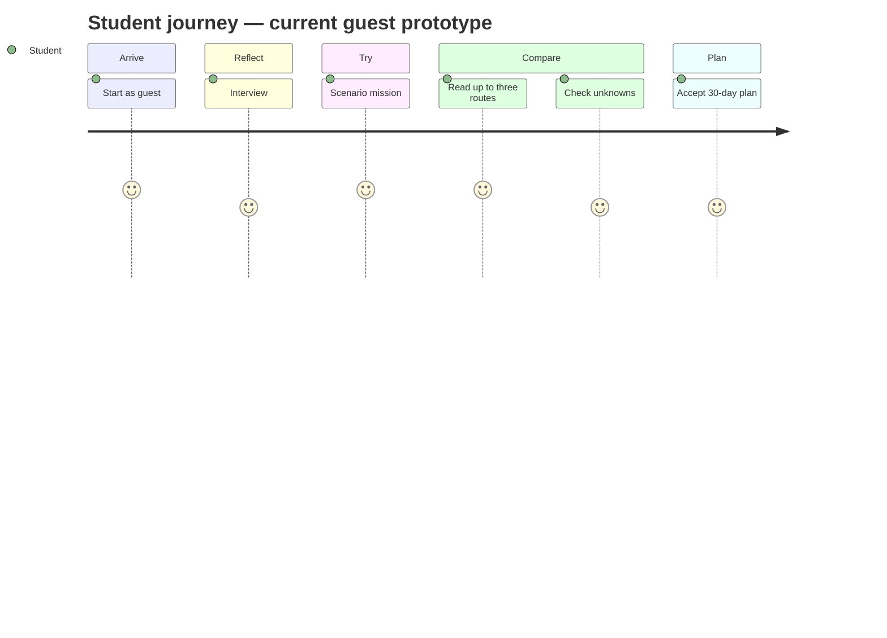
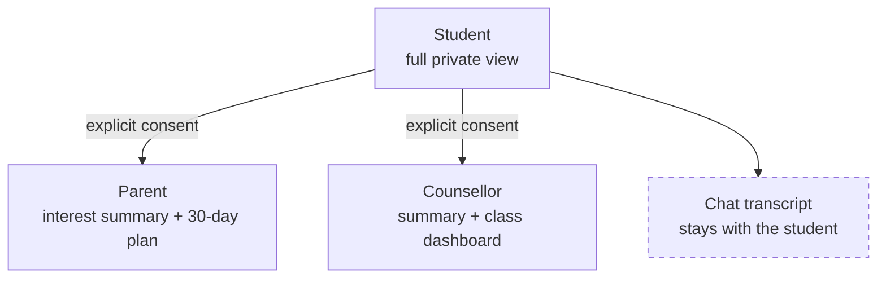

# 03 · User Experience

[← Research](02-research-and-evidence.md) · [Back to README](../READMEEN.md) · [Next: AI System →](04-ai-system.md)

---

## Design direction: Aurora

Eleven web concepts were designed and compared against four criteria: Gen-Z appeal,
shareability, buildability, and credibility with teachers, parents and judges. The chosen
direction, **Aurora**, is a hybrid rather than a single winner.

| Concept | Gen-Z | Wow | Buildable | Credible | Distinct | Total |
|---|:--:|:--:|:--:|:--:|:--:|:--:|
| Pulse | 10 | 9 | 6 | 6 | 8 | **8.2** |
| Timefold | 8 | 9 | 4 | 7 | 8 | 7.6 |
| Tomorrow Stories | 8 | 9 | 3 | 8 | 9 | 7.5 |
| QuestMap | 7 | 9 | 4 | 7 | 8 | 7.3 |
| Skill Constellation | 8 | 9 | 2 | 8 | 9 | 7.2 |
| Nara | 7 | 7 | 7 | 9 | 6 | 6.9 |
| Compass Coach | 6 | 6 | 8 | 9 | 5 | 6.8 |
| Clarity | 5 | 5 | 10 | 10 | 4 | 6.4 |

Pulse scored highest on Gen-Z appeal but read as a social app — comparison, ranking, exposure —
which is exactly wrong for a product handling adolescent self-doubt. Aurora keeps its visual
language and discards its social mechanics:

> **Compass Coach's** trustworthy conversation shell · **QuestMap's** short evidence missions ·
> **PathLab's** source transparency · **Timefold's** shareable future-self moment ·
> **Clarity's** accessibility and institutional reporting — skinned in Pulse's visual energy.

**Explicitly not included:** no likes, no leaderboards, no rankings, no peer comparison.

---

## Design principles

1. **Energy around clarity.** Aurora light frames content; it never competes with it.
2. **Evidence before confidence.** Show why a conclusion appeared, what is missing, how to challenge it.
3. **One useful action.** Every view has exactly one visually dominant next step.
4. **Private by default.** Consent and sharing status are visible, understandable, reversible.
5. **Thai-first is the target.** Components should accommodate Thai line height, long labels and mixed Thai/English study terms; the current app copy is English.
6. **Motion with an exit.** Animation is subtle, non-essential, and disabled under `prefers-reduced-motion`.

---

## Visual system

| Token | Dark (implemented) | Light (planned) | Use |
|---|---|---|---|
| Canvas | `#0B0B14` | `#F7F6FB` | Page background |
| Surface | `#14141F` | `#FFFFFF` | Cards, header |
| Text | `#F5F5FA` | `#161522` | Primary text |
| Muted | `#A0A0B8` | `#5E5B72` | Secondary text, 16px minimum |
| Indigo | `#6D5EF6` | `#5142D6` | Primary accent |
| Mint | `#4FE3C1` | `#087F69` | Primary action, active and completed states |
| Magenta / Coral | `#C13BF0` / `#FF6B6B` | — | Gradient only, decorative |
| Warning | `#FFD37A` | — | Source freshness and uncertainty |

**Rules that keep it readable**

- The aurora gradient (`115deg, #6D5EF6 → #C13BF0 → #FF6B6B`) is for light fields, borders and at most one hero word. Never paragraphs.
- Readable content sits on an opaque or 94%-opaque surface.
- Mint CTAs use `#07130F` text. Never white on mint.
- **Status never relies on hue alone** — always an icon, a label and a shape as well.
- Line length capped at ~58–72 Latin characters or ~34–46 Thai glyphs.
- Body text minimum 16px. The palette was selected with WCAG AA contrast targets, but the
  interface has not yet completed a formal accessibility audit.

---

## The user journey



**Guest-first is deliberate, and it is implemented.** A student completes the entire interview,
mission, route comparison and 30-day plan without an account. Identity is requested only when there
is something worth saving — and in the prototype, accounts do not exist at all, so nothing is asked
for.

This ordering is now consistent across the UX flow, the architecture diagram and the running app.
[05 · System Architecture](05-system-architecture.md) previously placed login before the assessment;
that was a documentation error and has been corrected.

```text
Landing → Start as guest → Interview → Mission → Up to three routes
        → Compare → 30-day plan → (optional account, not implemented)
```

---

## Screen by screen

| Screen | Purpose | The one dominant action | Status |
|---|---|---|:--:|
| Landing | Set the promise: routes to compare, not one answer | *Start as guest* | 🟢 |
| Interview | Visible progress, editable answers, validation | Answer the current item | 🟡 static, English |
| Scenario mission | A short realistic task, chosen from the interview profile | Submit the attempt | 🟢 |
| Routes | Evidence, limitations, unknowns and provenance for up to three routes | *Build a plan* on one route | 🟢 |
| Comparison | The same criteria across every route | Select a route | 🟢 |
| 30-day plan | Concrete weekly actions; check-ins persist | Mark an action done | 🟡 linear template |
| Privacy | What is stored, and delete it | *Delete everything* | 🟢 |
| Interactive roadmap | Step-by-step nodes from now to career entry | Check in on a milestone | 📐 planned |
| Counsellor dashboard | Class-level patterns and coaching prompts | Open a student summary | 📐 planned |

### Up to three routes, never a winner

The engine returns **between zero and three** routes. It is not padded to three, and when the
evidence is too thin it returns none and explains why.

> An earlier version of this document described three fixed archetypes — *Balanced Next Step*,
> *Interest Growth* and *Practical Access*. **The implemented engine does not work that way.** It
> scores every route in the catalogue on the same five criteria and returns the highest-scoring
> survivors, marking any that are too close to separate as tied. The archetype names were removed
> rather than reverse-engineered into the code, because a route's character should come from what
> it is, not from a slot it was assigned to fill.

Each route card carries: why this appeared · the evidence behind it · what is still unknown ·
where its information came from and how old that is · and a **reversible first step** that can be
taken this week.

---

## Planned access model — not implemented

The current prototype has guest mode only. It has no accounts, parent access, counsellor access or
sharing controls. The following diagram records a future permission model for design review; it is
not evidence of a working feature.



| | Student | Parent | Counsellor |
|---|:--:|:--:|:--:|
| Full profile and roadmap | ● | — | — |
| Interest summary and 30-day plan | ● | ● *(consented)* | ● *(consented)* |
| Class-level statistics | — | — | ● |
| Suggested coaching questions | — | — | ● |
| **Raw chat transcript** | ● | **never** | **never** |

In that future design, consent would be per recipient, visible and revocable. It requires user
research, security review and legal review before implementation.

---

## Accessibility and safety

- The implemented dark theme uses visible focus states, text alongside status colour, and reduced
  motion under `prefers-reduced-motion`.
- The primary flow uses native controls and visible focus states, but it has not had a formal
  keyboard, WCAG or assistive-technology audit.
- A light theme and Thai-native typography are planned. The current interface is English, so Thai
  wrapping and font behaviour remain untested.
- Every recommendation screen carries a standing disclaimer: this is information to explore, not
  a prediction or a guarantee of admission, employment or income. Verify current criteria with
  official sources and talk to a counsellor.
- A keyword-based safety pause is implemented for a small set of high-risk phrases. It offers
  immediate support guidance and stops the normal flow, but it is not a clinical detector or an
  emergency-response service — see [08 · Privacy and Data](08-privacy-and-data.md).

---

## Interface previews

Two sets, kept separate on purpose.

### Implemented prototype screens

Captured from the running application with Playwright. These are the screens a reviewer sees.

| | |
|---|---|
|  |  |
| **Landing** — *implemented* | **Interview** — *implemented*, with progress and editable answers |
|  |  |
| **Three routes** — *implemented*, equal weight, no winner | **Comparison** — *implemented*, consistent criteria |
|  |  |
| **30-day plan** — *implemented*, with check-ins | **No-route state** — *implemented*, refuses to guess |

Mobile: [interview](../assets/screenshots/app/interview-mobile.png) ·
[mission](../assets/screenshots/app/mission-mobile.png) ·
[routes](../assets/screenshots/app/routes-mobile.png) ·
[compare](../assets/screenshots/app/compare-mobile.png) ·
[plan](../assets/screenshots/app/plan-mobile.png) ·
[privacy](../assets/screenshots/app/privacy-mobile.png)

Additional current states: [mobile landing](../assets/screenshots/app/landing-mobile.png) ·
[desktop privacy](../assets/screenshots/app/privacy-desktop.png) ·
[safety pause](../assets/screenshots/app/safety-desktop.png)

### Concept designs — not implemented

Aurora high-fidelity mockups. Design artefacts showing the intended full product, including Thai
copy and screens that do not exist in code.

| | |
|---|---|
|  |  |
| **Landing** — *concept design* | **Socratic interview** — *concept design* |
|  |  |
| **Three routes** — *concept design*. Note this mockup gives one card a filled button, implying a winner; the implemented screen corrects that. | **Student private dashboard** — *concept design*. The student's own space, **not** a counsellor view. |

---

[← Research](02-research-and-evidence.md) · [Back to README](../READMEEN.md) · [Next: AI System →](04-ai-system.md)
