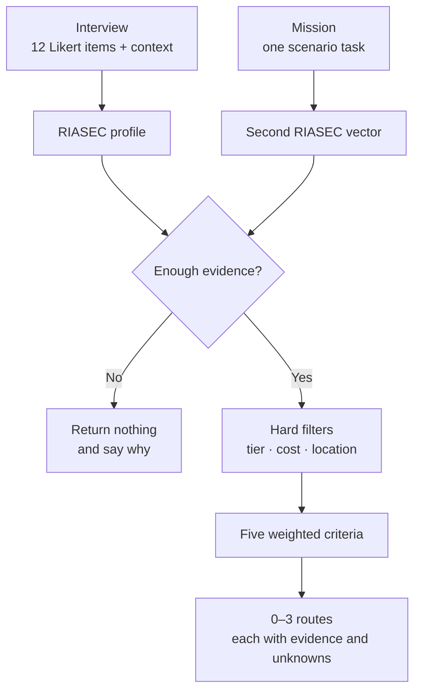
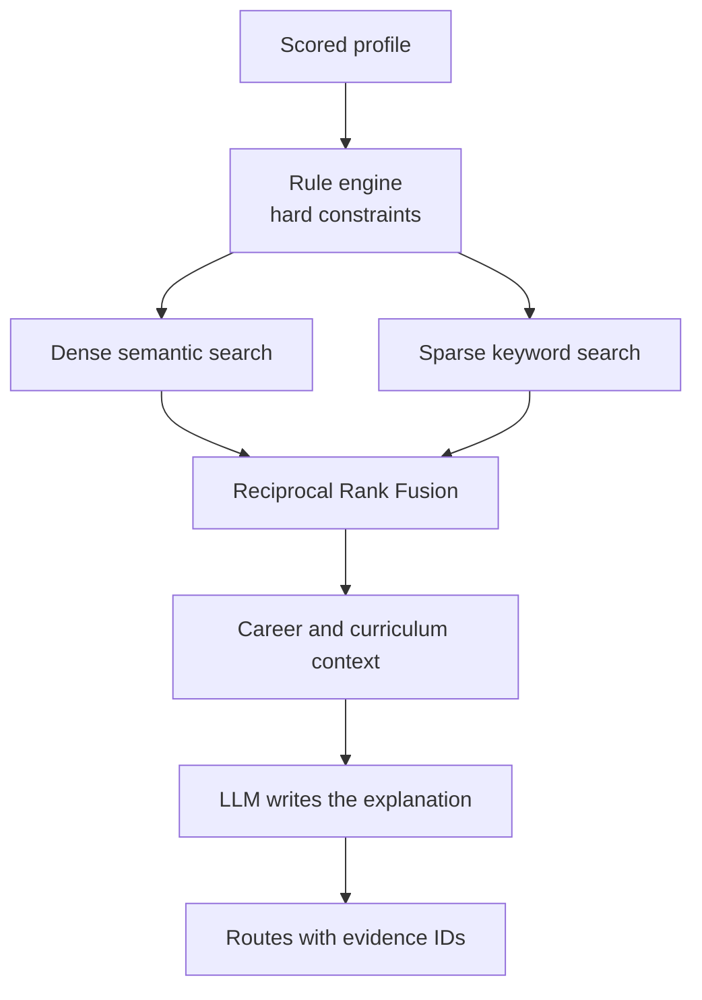

# 04 · AI System

[← User Experience](03-user-experience.md) · [Back to README](../READMEEN.md) · [Next: Architecture →](05-system-architecture.md)

---

> **Read this first.** This document is in two halves and they are not the same kind of thing.
>
> **Part A — Current prototype** is what runs when you clone this repository and type `npm run
> dev`. Every claim in it is backed by a file you can open and a test you can run.
>
> **Part B — Planned architecture** is design work. None of it is running. It is here because the
> reasoning is worth showing, not because it exists.

---

# Part A — Current prototype

## A1 · What actually decides

Everything that affects which routes a learner sees is deterministic TypeScript running in the
browser. There is no model in the decision path, and there is no network call in it either.

| Step | Where | Model involved? |
|---|---|:--:|
| Interest scoring (Likert → RIASEC) | `lib/decision-engine/scoring.ts` | No |
| Mission evidence scoring | `lib/decision-engine/scoring.ts` | No |
| Mission selection | `lib/mission/index.ts` | No |
| Eligibility and hard constraints | `lib/decision-engine/eligibility.ts` | No |
| Decision-matrix weighting | `lib/decision-engine/scoring.ts` | No |
| Route selection, ranking and tie handling | `lib/decision-engine/index.ts` | No |
| Refusal gates | `lib/decision-engine/index.ts` | No |
| 30-day plan generation | `lib/plan/index.ts` | No |
| **Rewording an explanation already produced** | `app/api/explain/route.ts` | Optional |

The same answers always produce the same routes. That is the property that makes the output
defensible to a student, a parent or a counsellor — and it is why the model is kept out.

### The implemented pipeline



## A2 · Phase 1 — the interview

**What it is:** twelve Likert items, two per RIASEC dimension, plus four context questions and one
optional free-text prompt. Static, in English, presented in a fixed order.

**What it is not:** it is not adaptive, not conversational, and not in Thai. It is labelled
*"Demo assessment — shortened for prototype evaluation"* on screen for exactly that reason.

Unanswered items are excluded from the average rather than scored as zero, so a partial interview
does not silently look like a low score.

→ `data/questions.json`, `lib/decision-engine/scoring.ts`, `app/interview/page.tsx`

## A3 · Phase 2 — the scenario mission

Three missions, each a short planning task with text, multi-select and single-select steps. Each
option carries a fixed evidence map from option to RIASEC dimensions; free text is scored by
keyword spotting. **No model reads the answers.**

**Which mission a learner gets** is decided by a rule that walks their RIASEC dimensions
strongest-first and takes the first mission listing that dimension in its `bestFor`. Catalogue
order breaks ties. The rule states its reason on screen, and it declines to choose — falling back
to the default and saying so — when the interview is too short or too flat to justify a choice.
The learner can always pick a different mission.

Every mission offers options spanning all six dimensions, not only the ones it is chosen for. That
is deliberate and it is enforced by a test: if a mission could only produce evidence in the
dimensions it was chosen for, it could never contradict the interview, and the contradiction
signal is the whole point of running a second phase.

**A contradiction is not discarded — it is shown to the learner** as something worth investigating
rather than averaged away.

→ `data/missions.json`, `lib/mission/index.ts`, `app/mission/page.tsx`

## A4 · The decision matrix


| Criterion | Weight | Fed by |
|---|--:|---|
| Interests | 30% | RIASEC profile from the interview |
| Feasibility | 25% | Cost, location and timing answers |
| Strengths | 20% | Mission evidence — neutral 50 when no mission is complete |
| Learning style | 15% | Route learning style against the profile |
| Future flexibility | 10% | The route's own flexibility value |

**Feasibility at 25% is a deliberate choice.** A route a student cannot afford or cannot reach is
not a recommendation. Weighting it second-highest keeps the output honest about the constraints
that guidance advice usually ignores.

> These weights are **design judgement, not fitted to outcome data.** No student outcome data
> exists. The constant lives in one place, `WEIGHTS` in `lib/decision-engine/scoring.ts`, so the
> code and this table cannot drift apart.

## A5 · Refusing to answer

Three gates make the engine return **nothing** rather than guess. This is the feature the team is
most confident about, because it is the one a demo is least likely to show.

| Gate | Condition | Why |
|---|---|---|
| 1 | Fewer than 8 of 12 interest items answered | Too little was said to say anything back |
| 2 | Profile spread below 0.15 | Every answer was the same; a "match" would be an invented preference |
| 3 | Every surviving route rated `insufficient` | Routes passed the filters but nothing supports them |

Evidence strength is about **how much is known**, not how high the score is. A high score from a
half-finished interview is still weak evidence, and no route can reach "strong" without a
completed mission.

## A6 · The optional explanation layer

```text
deterministic engine → structured result → [optional rewording] → wording on screen
```

`/api/explain` receives a route name and a set of reason codes and returns warmer wording. It is
reachable from each route card when an API key is configured, and absent when one is not.

Four properties make it safe to ship:

- **It never sees the route list**, so it cannot add, remove or reorder a route.
- **Reason codes are filtered against the engine's own vocabulary** before anything is forwarded,
  so the endpoint cannot relay arbitrary strings to a third party.
- **The learner's free text is never sent** — not the interview's "something you were proud of"
  answer, not the mission writing.
- **Every failure path returns HTTP 200 with the deterministic text**, so a provider outage
  changes nothing on screen.

Reworded text is labelled as reworded, says what it did not change, and the original is one click
away.

→ `app/api/explain/route.ts`, `app/routes/page.tsx`

## A7 · What is wrong with the current prototype

Stated plainly, because a working demo hides all of this.

| Gap | Consequence |
|---|---|
| The instrument is not validated | 12 items written from the structure of Holland's RIASEC model, never reviewed by a qualified assessment professional. It is not a RIASEC test |
| Mission rubrics are not validated | Same standard. The option→dimension maps are the team's judgement |
| The weights are not fitted | Design judgement against no outcome data |
| No evaluation set exists | Recommendation quality cannot be measured, so no accuracy figure may be stated in any form |
| No bias audit | Unknown whether the engine steers students by gender, region, school size or income |
| No pilot | Every effectiveness statement in this repository is a design goal |
| Route data is illustrative | Cost, location, timing and flexibility carry no source. See [02 · Research](02-research-and-evidence.md#source-registry) |
| The safeguarding rule is a keyword match | It will miss cases and produce false positives, and nobody is alerted |
| English only | The target users are Thai students |

---

# Part B — Planned architecture

**None of this is implemented.** It is recorded because the design reasoning is part of the
submission, not because any of it runs.

## B1 · What the planned system would add

| Capability | Status | What the prototype does instead |
|---|---|---|
| Adaptive Thai-language Socratic interview | 📐 Planned | Static English Likert questionnaire |
| STAR extraction from free text | 📐 Planned | Keyword spotting against a fixed dimension map |
| Qdrant hybrid retrieval (dense + sparse, RRF-fused) | 📐 Planned | A seeded JSON catalogue of six routes |
| BGE-M3 embeddings, 1024-dim | 📐 Planned | No embeddings at all |
| LLM synthesis into structured JSON | 📐 Planned | Deterministic template text, optionally reworded |
| FastAPI orchestrator, PostgreSQL, RBAC | 📐 Planned | Everything runs in the browser; nothing is stored server-side |
| DAG roadmap with topological sort | 📐 Planned | A linear four-week plan from a template |
| QLoRA adapter for Thai tone | 🔴 Blocked | Not attempted |

### The planned retrieval pipeline



**Why hybrid retrieval would be needed.** Thai guidance queries mix semantic intent with exact
terms — faculty names, TPAT codes, TPQI qualification numbers. Pure vector search retrieves those
poorly, so dense and sparse results would be fused rather than chosen between.

**Why the split survives into the planned design.** Even with retrieval and generation in place,
the rule engine still decides. The model's job grows — conducting the interview, extracting
structure, writing the explanation — but it never gains the decision. A recommendation that
changes between runs cannot be defended to a child.

**Why not a large model.** A small Thai-capable model plus retrieval is cheaper and faster, and
the domain knowledge belongs in a corpus that can be corrected in an afternoon, not in weights
that have to be retrained.

## B2 · Why LoRA is not the answer to the data problem

Fine-tuning is the wrong tool for teaching a model which programmes exist and what they require.
That information changes every admission cycle and is far easier to update through retrieval.

A LoRA adapter would be justified for *style and format* — safe non-leading Thai conversation,
consistent extraction into one schema, explanations that follow a rubric — and only once there is
an expert-reviewed example set, a test split that does not overlap the training split, and a
prompting baseline to beat.

**The current dataset does not meet that bar.** The train and test files are byte-identical and
contain ten examples each. Evaluating a fine-tune on data it trained on measures nothing. No
fine-tuning metric exists for this project and none should be claimed.

## B3 · How the planned system would be evaluated

No evaluation has been run. This is what would have to exist before a pilot.

| Layer | Measure |
|---|---|
| Retrieval | Source recall, citation precision, freshness of what was retrieved |
| Mapping | Correctness of occupation ↔ skill ↔ programme edges |
| Recommendation | Counsellor agreement, student-reported usefulness, diversity of options offered |
| Safety | Rate of advice exceeding the evidence; stereotyping; bias by gender, income and region |
| Product | Can the student explain why they were shown this, and did they act on it? |

The test set has to include the cases the system is most likely to get wrong: students with no
idea what they want, vocational learners, GED / สกร. / homeschool routes, students outside
Bangkok, students with a hard budget limit, and cases where the honest answer is that there is not
enough evidence yet.

---

[← User Experience](03-user-experience.md) · [Back to README](../READMEEN.md) · [Next: Architecture →](05-system-architecture.md)
