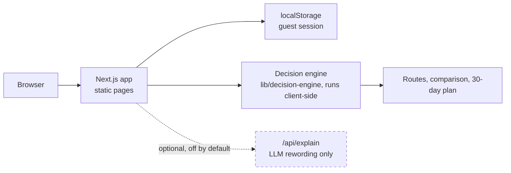
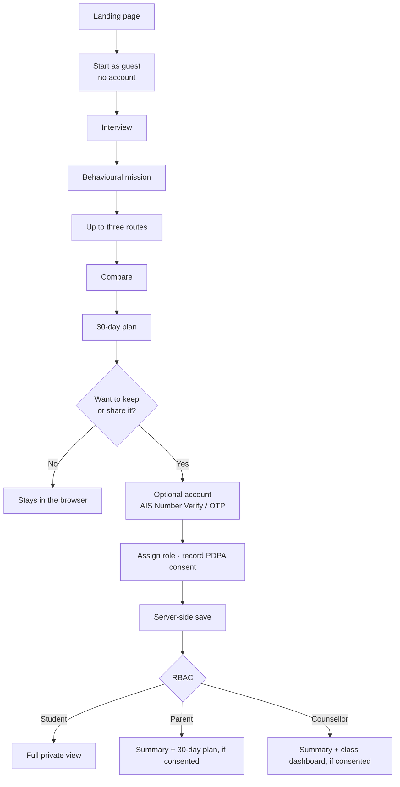
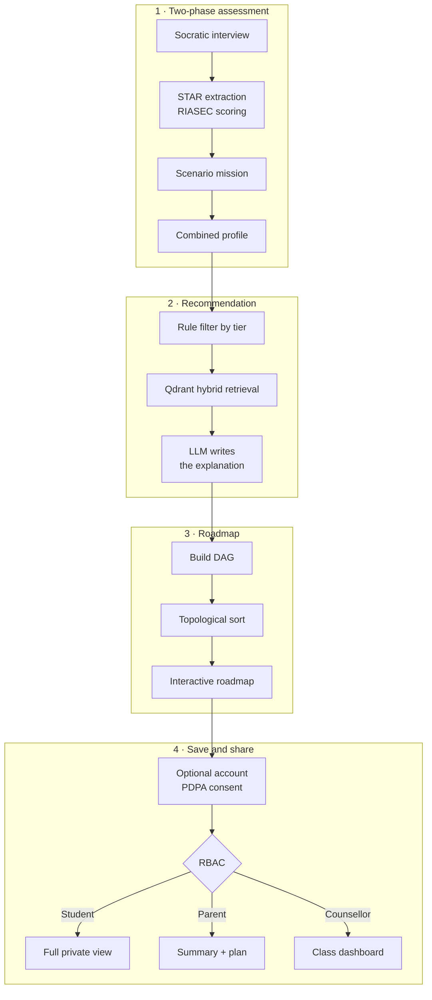
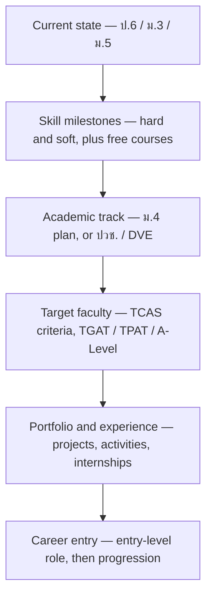
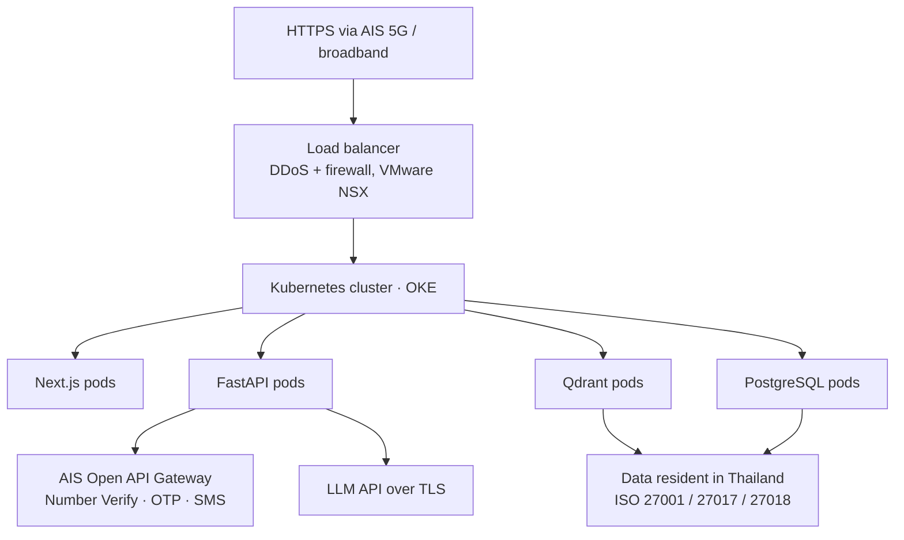
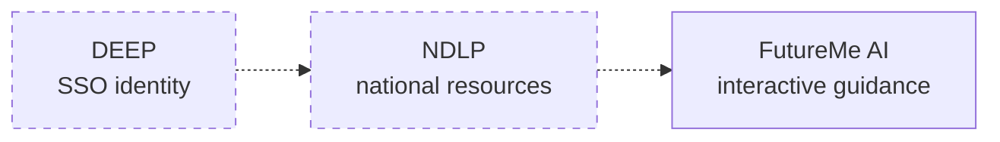

# 05 · System Architecture

[← AI System](04-ai-system.md) · [Back to README](../READMEEN.md) · [Next: Development Plan →](06-development-plan.md)

---

> **Read this first.** This document describes two things. The **implemented prototype** is a
> Next.js/TypeScript app whose engine runs in the browser — that is what you can clone and run.
> The **planned production architecture** (FastAPI, Qdrant, PostgreSQL, AIS Cloud) is a design, not
> code in this repository. Every section says which one it is describing.

---

## Implemented: the prototype architecture

| Concern | How the prototype handles it |
|---|---|
| Identity | None. Guest session only, random id in `localStorage`. |
| Persistence | `localStorage`, rebuilt field by field on read against the seed data. Valid fields are kept, unrecognised ones dropped, and an unusable container resets to a clean session. v1 sessions are migrated. |
| Mission selection | A rule over the interview profile in `lib/mission/`. Deterministic, explained on screen, overridable by the learner. |
| Recommendation | Deterministic TypeScript, executed in the browser. No network call. |
| Explanation | Deterministic templates. Optional LLM rewording via `/api/explain`, absent without an API key, labelled when used. |
| Data provenance | Every route carries its source, status and last-checked date; the page reports the catalogue's age and names the unsourced fields. |
| Storage | No server-side storage of any kind. |

Source: `app/`, `components/`, `lib/`, `data/`. Tests: `tests/`, `e2e/`.

---

## Planned: the production flow

**Everything below this line is design, not implemented code.**

### Guest-first, and why the earlier diagram was wrong

An earlier version of this document placed authentication *before* the assessment, while
[03 · User Experience](03-user-experience.md) said identity is requested only when there is
something worth saving. Those contradicted each other. The UX document was right, and the
architecture is corrected here: **the assessment runs before any identity step, for guests.**

Authentication exists to *save and share* results, not to gate them. Requiring a phone number
before a 15-year-old can find out anything would lose most of them at the first screen, and it is
also the least privacy-preserving ordering available.

### Planned backend stages

Top to bottom, so the stages stay readable on a phone.

---

## Technology stack

The **Implemented** column is what runs in this repository today.

| Layer | Prototype (implemented) | Production (planned) |
|---|---|---|
| Frontend | Next.js 15 + React 19 + TypeScript + Tailwind | Same |
| Recommendation | Deterministic TypeScript, client-side | Same rules, served by FastAPI |
| Persistence | `localStorage` | PostgreSQL |
| Retrieval | None — routes are a seeded JSON catalogue | Qdrant hybrid search + BGE-M3 |
| LLM | Optional, wording only, off by default | Same, plus QLoRA-adapted Thai model |
| Identity | None (guest only) | AIS Open APIs — Number Verify, OTP, SIM Swap |
| Hosting | Any Node host or Vercel | AIS Cloud on OCI, Kubernetes (OKE) |

### Original production design rationale

| Layer | Choice | Why |
|---|---|---|
| Frontend | Next.js | SSR for first-load speed on mobile networks; strong interactive-graph ecosystem |
| Backend | FastAPI (Python) | Pydantic validation end to end; same language as the ML tooling |
| Vector DB | Qdrant | Native hybrid dense + sparse search |
| Relational DB | PostgreSQL | Profiles, roadmaps, consent records, audit trail |
| Embeddings | BAAI/BGE-M3, 1024-dim | Multilingual, strong on Thai |
| LLM | Thai-capable API (Claude / Typhoon class) | Conversation and explanation only |
| Fine-tuning | QLoRA adapter | Low-cost Thai tone adaptation *(dataset not yet usable)* |
| Containers | Docker → Kubernetes (OKE) | Auto-scaling for classroom bursts |
| Cloud | AIS Cloud powered by OCI | Thai data residency *(target, not deployed)* |
| Identity | AIS Open APIs — Number Verify, OTP, SIM Swap | Passwordless, age-appropriate, takeover-resistant |

---

## Planned: the roadmap generator

**Not implemented.** The prototype renders a linear four-week plan from a template in
`lib/plan/`. The design below is what would replace it.

Recommendations would become a **Directed Acyclic Graph**, then a topological sort would order the
nodes so that nothing appears before its prerequisites.

The DAG would be built, prerequisite edges added, an acyclic check run, the sort producing a valid
ordering, and the graph serialised to JSON for the frontend. Students would expand any node for
detail and check in to record progress.

Each node would carry its own evidence reference and data year, rather than a hard-coded score
threshold — TCAS criteria change annually, and a roadmap that states last year's requirement with
this year's confidence is worse than one that admits it does not know.

**Why a DAG rather than a list:** prerequisites are genuinely partial, not linear. A student can
build a portfolio while preparing for TPAT. A DAG expresses that; a checklist forces a false
sequence.

→ Modelled on the roadmap.sh interaction pattern, adapted to Thai education milestones.

---

## Privacy and PDPA

Full detail, including a correction to an earlier overstated claim, is in
[08 · Privacy and Data Flow](08-privacy-and-data.md).

Privacy is an architectural constraint here, not a policy page. The users are minors.

**What is enforced in the design**

- **Chat transcripts are never shared with parents or counsellors.** They see derived summaries only, with no override. This is a *permission* guarantee, not a claim that data never leaves the device — the two are different, and [08 · Privacy](08-privacy-and-data.md) separates them.
- **Consent is per-recipient**, visible in the UI, and revocable.
- **Parent access requires a verified relationship**; counsellor access requires the student to be on that counsellor's roster.
- **Guest mode** allows a full session with no account and no persistent identity.
- **Data minimisation** — collect what the recommendation needs, nothing more.
- **Retention limits and an audit trail** on every access to a student record.

**What the cloud provides, and what it does not**

AIS Cloud's published specifications list Thai data centres, ISO 27001 / 27017 / 27018, CSA-STAR
and dSURE Cloud 3-star. That covers where data lives and how the facility is run. It does **not**
deliver PDPA compliance on its own:
consent management, access control, minimisation, retention and processor governance are
application-layer responsibilities. This distinction is stated in the research and repeated here
because conflating the two is the most common way a project like this gets compliance wrong.

**Additional protections planned but not implemented:** field-level encryption of sensitive
attributes, automated retention enforcement, and a documented data-subject-request process.

---

## Deployment target

**Scaling assumption:** load is bursty and predictable — a counsellor runs a session with a whole
class at once. Container auto-scaling suits that pattern better than fixed provisioning.

> **Status.** This is a designed target derived from published AIS Cloud specifications. Nothing
> is currently deployed to AIS Cloud, and no capacity or latency figures have been measured.

---

## API surface

### Implemented

| Method | Endpoint | Purpose |
|---|---|---|
| `GET` | `/api/explain` | Availability probe. Returns `{ available: boolean }` so the UI can offer the rewording control only when it is configured, rather than showing a button that always falls back. |
| `POST` | `/api/explain` | Optional LLM rewording of an explanation the engine already produced. Accepts a route name and reason codes, which are filtered against the engine's own vocabulary before anything is forwarded. Returns `{ source: "fallback" }` with the deterministic text when no API key is set, on timeout, on a provider error, or on a malformed response — always HTTP 200, so the caller never breaks. |

There is no recommendation endpoint, by design: the engine runs in the browser, which is what
makes the guest-mode privacy claim true. `/api/explain` is never given the list of routes, so it
cannot add, remove or reorder one.

### Planned

| Method | Endpoint | Purpose |
|---|---|---|
| `POST` | `/v1/missions/recommend` | Education level and interests → recommended exploration missions |
| `POST` | `/v1/missions/{id}/submissions` | Mission answers → evaluation and adaptive follow-up questions |
| `POST` | `/v1/future-paths` | Full student profile → three route alternatives with matrix breakdown |
| `GET` | `/v1/future-paths/{id}` | Retrieve a stored evaluation and route detail |

These are specified with Pydantic schemas in the team's separate backend workspace. They are not
part of this repository.

---

## Ministry ecosystem integration

Dashed lines are deliberate. Integrating with DEEP and NDLP would give the product national reach
and remove a separate login.

**Almost nothing about that is confirmed.** The July 2026 source audit could not read either
platform's technical pages. It therefore does not support DEEP offering SSO or an API, and it does
not support the claim — which this repository previously made — that NDLP's guidance layer is a
static RIASEC test. What *is* supported is that the Ministry is expanding NDLP under its
*Anywhere Anytime* programme towards two-way learning.

So the honest position is **aligned with the direction of national policy**, not connected to it.
Integration would need API documentation, technical access, a data-sharing agreement and a formal
partnership, none of which exist. See [02 · Research §5](02-research-and-evidence.md).

---

[← AI System](04-ai-system.md) · [Back to README](../READMEEN.md) · [Next: Development Plan →](06-development-plan.md)
