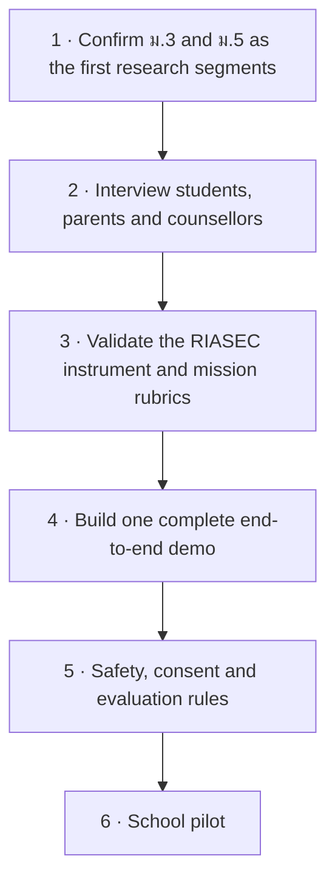

# 06 · Development Plan

[← Architecture](05-system-architecture.md) · [Back to README](../README.md) · [Next: Roadmap →](07-roadmap.md)

---

## Milestones delivered

Four milestones were completed before this repository was assembled.

| # | Milestone | Scope | Status |
|:--:|---|---|:--:|
| **M1** | Data and claim refactor | Audit of all research categories, blueprints, summaries and flowcharts; removal of unsupported statistical claims; repair of broken links | ✅ Done |
| **M2** | Product design and decision engine | Multi-tier engine across four education tiers, 30-item RIASEC, 5–8 STAR questions, five-weighted decision matrix, three route alternatives | ✅ Done |
| **M3** | Schemas, APIs and RAG pipeline | Pydantic schemas, FastAPI endpoints, Qdrant hybrid search with BGE-M3, QLoRA dataset generator | ✅ Done |
| **M4** | Verification agent and audit suite | Programmatic script validating statistical claims, the 12 ปวช. areas, TPAT mappings, API contracts and RAG metrics | ✅ Done |

### Acceptance criteria met

- [x] No unverified 52% mismatch, 65% blanket experience, 85% dual-job or WEF 44% claims remain
- [x] All 12 ปวช. 2567 vocational subject areas correctly represented
- [x] TPAT1–5 mappings match the official MyTCAS blueprint
- [x] Zero broken local file links across documentation and data
- [x] Engine outputs three distinct routes — Balanced, Interest Growth, Practical Access
- [x] ม.3 transition supported alongside ป.4–ป.6 exploration and ม.ปลาย/ปวช. TCAS context
- [x] Mission, submission and future-path endpoints functional against valid JSON schemas
- [x] Verification script passes all programmatic content and contract checks

---

## Component status

Progress percentages below are **team estimates of scope completed**, not measured coverage.
They are included to show relative maturity, and should be read as approximate.

| Component | Status | Est. | What remains |
|---|---|--:|---|
| Research base — 7 categories | 🟢 Completed | 100% | — |
| Data and claim audit | 🟢 Completed | 100% | — |
| Decision engine — RIASEC, STAR, matrix, routing | 🟢 Completed | 100% | Calibration against real outcomes |
| Pydantic schemas and API contracts | 🟢 Completed | 100% | — |
| Design system and 11 concepts | 🟢 Completed | 100% | — |
| Aurora mockups — 6 key views | 🟢 Completed | 100% | Remaining screens |
| FastAPI endpoints | 🟡 In progress | ~70% | Persistence layer; in-memory storage today |
| RAG pipeline — Qdrant + BGE-M3 | 🟡 In progress | ~65% | Corpus ingestion at full scale; real embeddings in place of the fallback |
| Next.js frontend | 🟡 In progress | ~35% | Built from Aurora mockups |
| Interactive roadmap UI | 🟠 Planned | ~20% | DAG logic designed; renderer not built |
| AIS Open API integration | 🟠 Planned | ~15% | Specified; requires developer credentials |
| Counsellor dashboard | 🟠 Planned | ~15% | Designed; not implemented |
| QLoRA fine-tuning | 🔴 Blocked | ~10% | Dataset unusable — see below |
| Instrument validation | 🔴 Not started | 0% | Requires qualified assessment experts |
| School pilot | 🔴 Not started | 0% | Requires everything above |

**Legend** 🟢 Completed · 🟡 In progress · 🟠 Planned · 🔴 Blocked or not started

---

## Known blockers

**1 · The QLoRA dataset is not usable.**
`qwen_qlora_dataset.jsonl` and `test_qwen_qlora.jsonl` are byte-identical and contain ten
examples each. Evaluating a fine-tune on data it trained on measures nothing. The sets must be
separated and expanded by roughly two orders of magnitude before any evaluation figure is
reported. Until then, no fine-tuning metric exists and none should be claimed.

**2 · No validated instruments.**
The 30-item RIASEC instrument and the scenario-mission rubrics were written from published
frameworks but have not been reviewed by qualified assessment professionals. They are
defensible as a prototype and not defensible as an assessment.

**3 · No pilot data.**
Every effectiveness statement in this project is a design intention. Nothing has been measured
with real students, so the decision-matrix weights remain design judgement rather than fitted
parameters.

**4 · AIS Open API credentials.**
Number Verify, OTP and SMS integration is specified against CAMARA standards but needs developer
access to implement and test.

---

## Immediate next steps

1. **Confirm ม.3 and ม.5 as the first research segments.** These sit immediately before the two irreversible decisions.
2. **Interview students, parents and counsellors** across different Thai school contexts — urban and rural, large and small.
3. **Validate the 30-item RIASEC instrument and mission rubrics** with qualified experts.
4. **Build one complete end-to-end demo:** guest interview → one mission → three explainable routes → 30-day roadmap → consented counsellor summary. One path working entirely beats six paths working partially.
5. **Establish source-freshness rules, PDPA and child-consent handling, safety escalation, and an independent AI evaluation set** before any pilot.
6. **Run a school pilot** and use the results to calibrate the matrix weights.

---

## Team

This is student hackathon work. Roles are functional rather than formal, and the same people
cover several of them.

| Function | Responsibility |
|---|---|
| Research and data | Seven-category research base, claim auditing, source verification |
| Product and UX | Concept exploration, Aurora design system, user journey, accessibility |
| AI and backend | Decision engine, RAG pipeline, FastAPI services, schemas |
| Infrastructure | Cloud architecture, container deployment, PDPA and security design |
| Verification | Programmatic audit of claims, contracts and content |

Contributions are welcome — see [CONTRIBUTING.md](../CONTRIBUTING.md).

---

## Priorities under time pressure

If the deadline compresses, the design rules are already agreed:

> **Simplify Aurora's visual effects before reducing recommendation transparency, consent,
> safety, or accessibility.**

Concretely: cut animation, cut screens, cut features. Do not cut the "why this was suggested"
panel, the "what we still don't know" field, the consent gate, or the disclaimer. The visual
polish is what makes the product attractive; those four are what make it defensible.

---

[← Architecture](05-system-architecture.md) · [Back to README](../README.md) · [Next: Roadmap →](07-roadmap.md)
