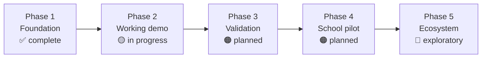

# 07 · Roadmap

[← Development Plan](06-development-plan.md) · [Back to README](../README.md)

---

## Phases

---

## Phase 1 · Foundation — ✅ Complete

Research base across seven categories, statistical claim audit, multi-tier decision engine,
Pydantic schemas and API contracts, RAG pipeline scaffolding, eleven design concepts and the
Aurora direction, verification suite.

→ Detail in [06 · Development Plan](06-development-plan.md).

---

## Phase 2 · Working demo — 🟡 In progress

One complete path, working end to end, in preference to many partial ones.

| Item | Status | Notes |
|---|---|---|
| Guest interview flow | 🟡 In progress | Engine complete; UI being built from Aurora mockups |
| One scenario mission, fully working | 🟡 In progress | Scoring implemented; interactive surface pending |
| Three explainable routes | 🟢 Engine ready | Frontend rendering pending |
| Interactive roadmap renderer | 🟠 Planned | DAG and topological sort designed |
| 30-day plan generation | 🟡 In progress | Action items drawn from the skill taxonomy |
| Consented counsellor summary | 🟠 Planned | RBAC designed, not implemented |
| Persistence layer | 🟠 Planned | Replaces in-memory storage |
| Real BGE-M3 embeddings | 🟠 Planned | Removes the hash fallback |

**Definition of done:** a student completes an interview, a mission, reads three routes with
evidence and unknowns, opens a roadmap, accepts a 30-day plan, and shares a summary with a
counsellor — without a developer touching anything.

---

## Phase 3 · Validation — 🟠 Planned

Nothing here is optional. This is what separates a demo from something that can be put in front
of children.

| Item | Priority | Why |
|---|---|---|
| Fix the QLoRA dataset | High | Train and test sets are identical, ten examples each — unusable |
| Validate the 30-item RIASEC instrument | High | Written from the Holland framework; not psychometrically reviewed |
| Validate mission rubrics | High | Same standard |
| Build an independent evaluation set | High | No held-out benchmark exists, so quality cannot be claimed |
| Bias audit | High | Across gender, region, school size, socioeconomic status |
| Safety escalation path | High | Distress signals in an interview need a defined route to a human |
| Source-freshness rules | Medium | TCAS criteria and curricula change annually |
| Qualitative field research | Medium | Students, parents, counsellors across varied school contexts |
| Accessibility audit | Medium | Verify WCAG AA in both themes with real assistive technology |

**Field research first.** ม.3 and ม.5 are the two segments sitting immediately before an
irreversible decision, and the sample must include rural and small schools — the students with
the least guidance access are the ones the product is most meant to help.

---

## Phase 4 · School pilot — 🟠 Planned

| Item | Notes |
|---|---|
| Partner schools | Mixed urban and rural, varying sizes |
| Child consent and PDPA process | Documented, reviewed, with parental consent handling |
| Counsellor training | The system supports counsellors; it does not replace them |
| Outcome measurement | Decision confidence, counsellor assessment, follow-through on 30-day plans |
| Matrix weight calibration | First opportunity to fit weights to real outcomes |
| AIS Cloud deployment | First actual deployment; capacity and latency measured for the first time |

**The honest measure.** The right question is not whether students like the product. It is
whether students who used it made decisions they could still explain and defend six months
later. That takes longitudinal follow-up, and it is the only evidence that would justify any
effectiveness claim.

---

## Phase 5 · Ecosystem — 🔵 Exploratory

Everything here depends on approvals and partnerships that do not exist.

| Item | Dependency |
|---|---|
| DEEP SSO integration | Official API documentation, technical access, partnership approval |
| NDLP content integration | The same, plus content licensing |
| AIS Open APIs in production | Developer credentials, production agreement |
| Multi-school counsellor tooling | Pilot results |
| Alumni outcome loop | Years of longitudinal data |

> The Ministry's NDLP guidance component is a static RIASEC test — the exact gap this product
> fills. That makes the fit compelling and does not make it agreed. It stays labelled
> exploratory until something is signed.

---

## Longer-term ideas

Recorded so they are not lost, explicitly not committed:

- **Regional labour-market data** so recommendations reflect what is hiring in a student's province, not only nationally
- **Parent-facing explainers** for unfamiliar careers, addressing a real source of family friction over vocational routes
- **Counsellor content authoring** so schools can add local pathways and employers
- **Offline-tolerant mode** for schools with unreliable connectivity
- **Longitudinal follow-up** — the only route to genuine outcome evidence
- **Open-sourcing the Thai career and curriculum taxonomy** as a public good independent of this product

---

## What would make us stop

Also worth recording. The project should not proceed to a pilot if:

- Instrument validation shows the RIASEC implementation does not measure what it claims to
- A bias audit finds the engine systematically steers students by gender, region or school size
- Counsellors report the output displaces rather than supports their judgement
- Consent and privacy handling cannot satisfy PDPA requirements for minors

Building a guidance tool that quietly narrows a child's options would be worse than building
nothing.

---

[← Development Plan](06-development-plan.md) · [Back to README](../README.md)
