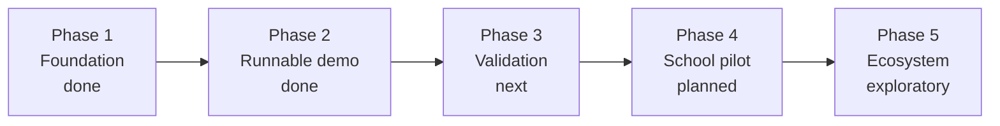

# 07 · Roadmap

[← Development Plan](06-development-plan.md) · [Back to README](../READMEEN.md) · [Next: Privacy →](08-privacy-and-data.md)

> **Status as of 26 July 2026.** Phase 2 closed when the guest journey became runnable end to
> end. What is still missing from it moved into Phase 3, rather than being left marked
> "in progress" against a phase that is finished.

---

## Phases

Left to right, in order. Each gate has to pass before the next phase starts.

| Phase | Belongs to | Gate to the next phase |
|---|---|---|
| 1 · Foundation | Current prototype | ✅ Passed |
| 2 · Runnable demo | Current prototype | ✅ Passed — a reviewer completes the journey unaided |
| 3 · Validation | Next submission improvement | Independent review of the instrument |
| 4 · School pilot | Post-hackathon development | Evidence students made decisions they can still defend |
| 5 · Ecosystem | Long-term product vision | Signed partnerships |

---

## Phase 1 · Foundation — ✅ Complete

Research base across seven categories, a statistical claim audit, the decision-matrix design,
eleven design concepts and the Aurora direction.

→ Detail in [06 · Development Plan](06-development-plan.md).

---

## Phase 2 · Runnable demo — ✅ Complete *(July 2026)*

One complete path, working end to end, in preference to many partial ones.

| Item | Status | Notes |
|---|:--:|---|
| Guest interview flow | 🟢 | 12 items plus context, input-validated, editable, survives a refresh |
| Scenario mission | 🟢 | Three missions, rule-selected from the interview, drafts autosave |
| Up to three explainable routes | 🟢 | Evidence, limitations, unknowns and provenance on every card |
| Side-by-side comparison | 🟢 | Consistent criteria, coarse bands rather than false precision |
| 30-day plan | 🟢 | Four-week template plus gap-specific tasks; check-ins persist |
| Refusal behaviour | 🟢 | Three gates return nothing rather than guess |
| Safeguarding pause | 🟢 | Keyword rule; stops recommendations and offers support |
| Optional LLM explanation | 🟢 | Connected, labelled, cannot affect ranking |
| Data provenance and freshness | 🟢 | Per-route source and status; catalogue age on screen |
| Continuous integration | 🟢 | Typecheck, lint, tests, build and e2e on every PR |
| Interactive roadmap renderer | 📐 | Moved to Phase 3 — the plan is linear today |
| Consented counsellor summary | 📐 | Moved to Phase 3 — needs accounts first |
| Server-side persistence | 📐 | Moved to Phase 3 — guest mode only today |

**Definition of done, as met:** a reviewer clones the repository, runs `npm install && npm run
dev`, and completes interview → mission → routes → compare → 30-day plan with no account, no API
key and no developer intervention.

---

## Phase 3 · Validation — next

Nothing here is optional. This is what separates a demo from something that can be put in front
of children.

| Item | Priority | Why |
|---|---|---|
| Validate the interest instrument | High | 12 items written from the Holland framework; never psychometrically reviewed |
| Validate mission rubrics | High | Same standard |
| Replace the route catalogue with licensed data | High | Cost, location and timing drive the filters and carry no source at all |
| Build an independent evaluation set | High | No held-out benchmark exists, so quality cannot be claimed |
| Bias audit | High | Across gender, region, school size, socioeconomic status |
| Safety escalation path | High | Distress signals in an interview need a defined route to a human |
| Thai language | High | The target users are Thai students; the prototype is English |
| Fix the QLoRA dataset | Medium | Train and test sets are identical, ten examples each — unusable. Only matters once §Phase 3 conversation work starts |
| Adaptive interview and STAR extraction | Medium | The static questionnaire is the largest gap between the prototype and the product |
| Interactive DAG roadmap | Medium | The linear plan understates how partial prerequisites really are |
| Accounts, consent and counsellor summary | Medium | Guest mode covers the demo, not the product |
| Qualitative field research | Medium | Students, parents, counsellors across varied school contexts |
| Accessibility audit | Medium | Audit the current dark interface; repeat for any future theme and Thai localisation |

**Field research first.** ม.3 and ม.5 are the two segments sitting immediately before an
consequential education decision. The sample should include urban, rural, large and small school
contexts rather than assuming that one setting represents every student.

---

## Phase 4 · School pilot — 🟠 Planned

| Item | Notes |
|---|---|
| Partner schools | Mixed urban and rural, varying sizes |
| Child consent and PDPA process | Documented, reviewed, with parental consent handling |
| Counsellor training | The system supports counsellors; it does not replace them |
| Outcome measurement | Decision confidence, counsellor assessment, follow-through on 30-day plans |
| Matrix weight calibration | First opportunity to fit weights to real outcomes |
| AIS Cloud deployment | First actual deployment; capacity and latency measured for the first time. Requires credentials and an agreement that do not exist today |

**The honest measure.** The right question is not whether students like the product. It is
whether students who used it made decisions they could still explain and defend six months
later. That takes longitudinal follow-up, and it is the only evidence that would justify any
effectiveness claim.

---

## Phase 5 · Ecosystem — 🔵 Exploratory

Everything here depends on approvals and partnerships that do not exist.

| Item | Dependency |
|---|---|
| DEEP SSO integration | Official API documentation, technical access, partnership approval |
| NDLP content integration | The same, plus content licensing |
| AIS Open APIs in production | Developer credentials, production agreement |
| Multi-school counsellor tooling | Pilot results |
| Alumni outcome loop | Years of longitudinal data |

> The Ministry is expanding NDLP under its *Anywhere Anytime* programme, which makes the
> direction compatible. This repository previously went further and described NDLP's guidance
> layer as a static RIASEC test; the July 2026 source audit could not verify that, so the claim
> has been withdrawn and the argument for this product no longer depends on it. Everything here
> stays exploratory until something is signed.

---

## Longer-term ideas

Recorded so they are not lost, explicitly not committed:

- **Regional labour-market data** so recommendations reflect what is hiring in a student's province, not only nationally
- **Parent-facing explainers** for unfamiliar careers, addressing a real source of family friction over vocational routes
- **Counsellor content authoring** so schools can add local pathways and employers
- **Offline-tolerant mode** for schools with unreliable connectivity
- **Longitudinal follow-up** — the only route to genuine outcome evidence
- **Open-sourcing the Thai career and curriculum taxonomy** as a public good independent of this product

---

## What would make us stop

Also worth recording. The project should not proceed to a pilot if:

- Instrument validation shows the interest items do not measure what they claim to
- A bias audit finds the engine systematically steers students by gender, region or school size
- Counsellors report the output displaces rather than supports their judgement
- Consent and privacy handling cannot satisfy PDPA requirements for minors

Building a guidance tool that quietly narrows a child's options would be worse than building
nothing.

---

[← Development Plan](06-development-plan.md) · [Back to README](../READMEEN.md) · [Next: Privacy →](08-privacy-and-data.md)
