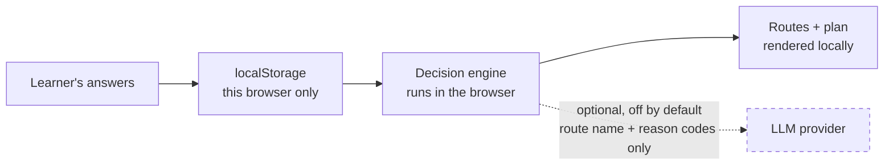

# 08 · Privacy and Data Flow

[← Roadmap](07-roadmap.md) · [Back to README](../READMEEN.md) · [Next: Source Review →](09-source-review.md)

---

This document describes what the **implemented prototype** does, then separately what the
**planned production design** intends. Where an earlier version of this project's documentation
overstated a privacy property, the correction is recorded here.

---

## Correction to an earlier claim

Earlier documentation stated:

> ~~"Chat transcripts never leave the student."~~

That sentence was imprecise, and it sat next to an architecture diagram showing a FastAPI backend
and a PostgreSQL database. Two different claims were being blurred:

| Claim | What it means | Where it is true |
|---|---|---|
| **"Not shared with parents or counsellors"** | A *permission* rule. It constrains who may read data. It says nothing about where the data physically travels. | This is the production design intent. Nothing enforces it yet, because the sharing features do not exist. |
| **"Never transmitted outside the device"** | A *physical* claim. Far stronger. | True of the implemented prototype's guest mode today, because the engine runs in the browser and there is no server-side storage at all. |

The first does not imply the second. A system can faithfully hide a transcript from a parent while
still transmitting it to a server, logging it, and retaining it indefinitely. The corrected wording
appears in the README, in the running app at `/privacy`, and below.

---

## What the prototype actually does

**Everything in guest mode stays in the browser.** The recommendation engine
(`lib/decision-engine/`) is plain TypeScript that executes on the client. There is no network
request in the recommendation path, so there is nothing to intercept, log or retain.

| Data | Collected? | Where it goes | Retention |
|---|---|---|---|
| Interview Likert answers | Yes | `localStorage` in this browser | Until the user deletes it |
| Interview free text ("something you were proud of") | Yes, optional | `localStorage` only | Until the user deletes it |
| Mission answers, including free text | Yes | `localStorage` only | Until the user deletes it |
| Generated routes and scores | Yes | Recomputed on demand; not stored separately | n/a |
| Selected route and plan check-ins | Yes | `localStorage` only | Until the user deletes it |
| Guest session id | Yes | `localStorage` only — random, not derived from anything about the user | Until the user deletes it |
| Name, email, phone, school | **No** | — | — |
| IP address, analytics, cookies, trackers | **No** — none are used | — | — |
| Server-side logs of answers | **No** — there is no server in this path | — | — |

Storage key: `futureme.guest.v1`. It is inspectable in browser developer tools, which is
deliberate — a privacy claim a user can verify themselves is worth more than one they must trust.

**Writes happen as you type.** Mission answers are autosaved on a short debounce so a refresh does
not discard unfinished writing. This is a usability decision with a privacy consequence worth
stating: a half-written answer is on disk in this browser from the moment it is typed, not only
once it is submitted. It is covered by the same delete control.

**Reads are treated as untrusted.** localStorage is writable by the user, by extensions, and by
anything that has run on this origin. The session is therefore not parsed and used — it is rebuilt
field by field against the seed data on every read. Question ids, Likert values, context options,
mission steps, option values and route ids are all checked against what the app actually offers;
anything unrecognised is dropped rather than passed to the scorer, collections are capped, and a
container that cannot be trusted at all resets to a clean session. The learner is told once when
something was discarded.

This is a correctness property before it is a security one: an out-of-range Likert value silently
reaching the scorer would produce a recommendation nobody could explain.

**Deletion.** `/privacy` has a *Delete my data* control that removes the key immediately. Because
no copy exists anywhere else, deletion is complete rather than a request queued for processing.

**Consent.** Guest mode collects nothing that identifies the user, so there is nothing to consent
to sharing. The account and counsellor-sharing flows that *would* require consent are not built.

---

## The one path where data could leave the device

There is an optional LLM explanation layer at `app/api/explain/route.ts`.

- It is **disabled unless the operator sets `ANTHROPIC_API_KEY`**. The public demo does not set one.
- When disabled it returns `{ source: "fallback" }` and the app uses deterministic template text. Behaviour is identical apart from wording.
- If enabled, the request contains **only the route name and reason codes** — never the learner's free text, and never the interview answers.
- It cannot change which routes were selected. The engine has already decided by the time this is called.
- Nothing is used for model training. Data handling would then be governed by the model provider's terms, which is precisely why it is off by default.

---

## Safeguarding

A keyword rule (`lib/safety/`) scans free-text answers. If it matches, the app stops generating
career output from that answer and shows a support screen with the Thai Department of Mental Health
hotline (1323).

**Its limits, stated plainly:**

- It is a regular-expression list, not a risk assessment. It will miss real distress and will fire on harmless phrasing.
- Matching happens **in the browser**. Nothing is transmitted and **nobody is alerted** — there is no monitoring behind this.
- It records only which rule index fired, never the text that triggered it.
- This is a prototype-level mechanism. It must not be described as a validated safeguarding system.

---

## Not implemented

None of the following exists in the prototype, so no data flows through any of it:

| Feature | Status |
|---|---|
| Accounts, login, permanent saving | Planned |
| Parent view and counsellor view | Planned |
| Consent grant and revocation flow | Planned |
| Server-side storage (PostgreSQL) | Planned |
| Retention enforcement and audit logging | Planned |
| Field-level encryption of sensitive attributes | Planned |
| Data-subject request process | Planned |
| PDPA compliance review | Not started |

The production design for these is in [05 · System Architecture](05-system-architecture.md), clearly
marked as planned.

---

## PDPA position

The users are minors, so this matters more than usual. The honest position:

- The prototype's guest mode is **privacy-preserving by construction** — it collects no identifying data and transmits nothing. That is a property of it doing less, not of a compliance programme.
- **No PDPA compliance review has been carried out.** None is needed yet at this scope, and one will be required before any pilot involving real students.
- In-country data residency and ISO certification from a cloud provider would cover *where* data lives. Consent management, access control, minimisation, retention and processor governance are application-layer duties that remain with this project. Conflating the two is the most common way a project like this gets compliance wrong.

---

[← Roadmap](07-roadmap.md) · [Back to README](../READMEEN.md) · [Next: Source Review →](09-source-review.md)
